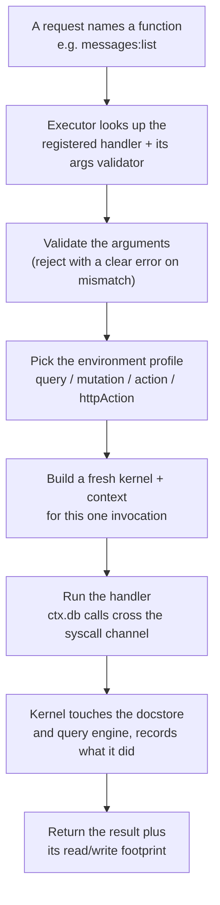
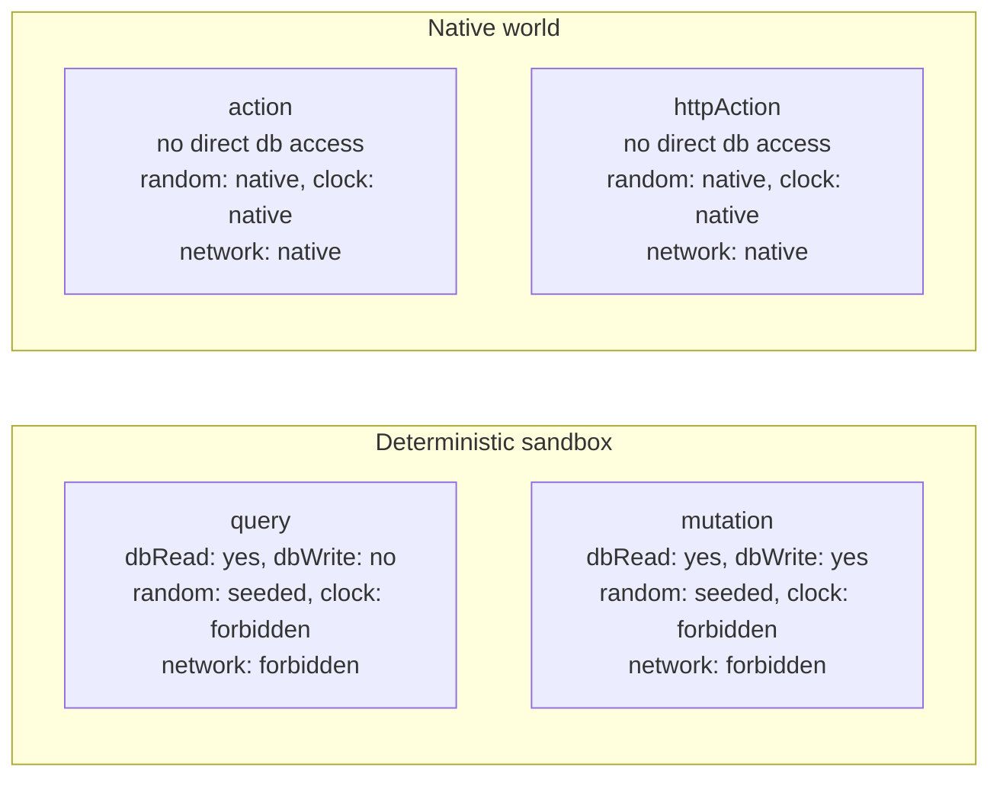
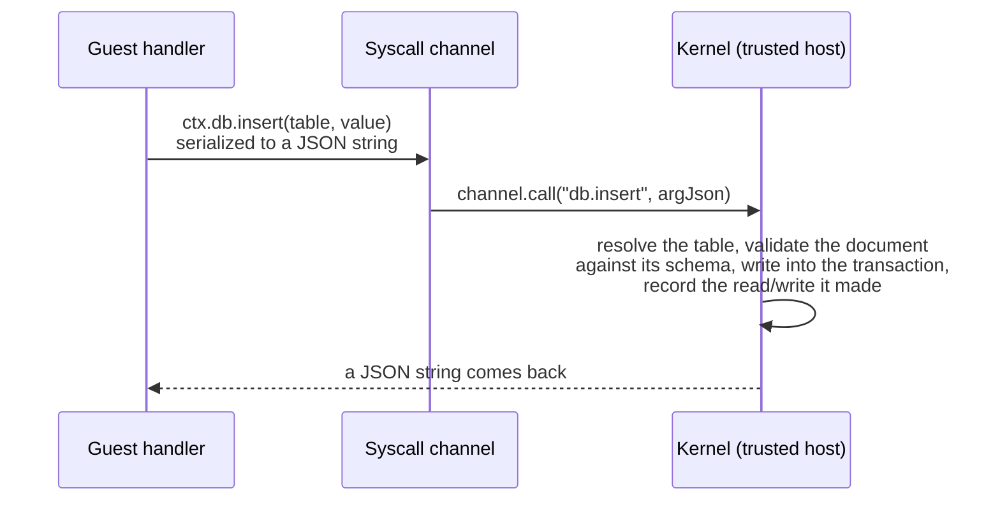

{/* diataxis: explanation */}

## In a nutshell

A **UDF** (user-defined function) is simply the query, mutation, action, or `httpAction` that you
write in TypeScript. It's the code hanging out in your `concile/` folder. The executor is like a
pipeline. It takes a request for one of your functions and spins it up into a running handler. This
handler can only talk to the database through a very specific, controlled doorway. When it's done,
it hands back your result along with a receipt of everything it read and wrote.

Everything on this page is about tracing that exact pipeline. If you're checking out the codebase
for the first time, you'll want to have the `packages/executor` folder open as you read along
(`src/executor.ts`, `src/kernel.ts`, `src/guest.ts`, and `src/profile.ts`).

## From request to result

Think of the executor as a tight, well-organized pipeline. Every single call goes through the exact
same steps, whether it comes in over a client WebSocket, an HTTP request, or even just one function
calling another:

Step E is the real magic here: we create a fresh, single-use kernel for every single call. Nothing
from function B's run is visible to function A's, even if they happen right after one another. That
strong isolation, combined with the fact that the handler only ever gets a narrow messaging channel
to the database instead of a direct reference, is what the rest of this page is all about.

This entire pipeline sits behind just one method: `InlineUdfExecutor.run(fn, args, options)` (you
can find it in `packages/executor/src/executor.ts`). The "Inline" part just means that right now,
the handler runs as plain JavaScript in the same process as the engine. We'll get into what that
actually means for you a bit later.

## Four profiles, one simple policy table

Every function falls into one of four types. The executor doesn't just use these types as labels; it
treats them as a **capability profile**. This profile dictates exactly what the function is allowed
to interact with:

If you prefer looking at tables, here is the exact same information straight from
`packages/executor/src/profile.ts`:

| | `dbRead` | `dbWrite` | `random` | `clock` | `network` |
|---|---|---|---|---|---|
| **query** | yes | no | seeded | forbidden | forbidden |
| **mutation** | yes | yes | seeded | forbidden | forbidden |
| **action** | no (only via `runQuery`/`runMutation`) | no | native | native | native |
| **httpAction** | no (only via `runQuery`/`runMutation`) | no | native | native | native |

This little table is your go-to guide. It answers questions like "Can my query call `fetch`?" (nope)
or "Can a mutation write to the database?" (yes, as long as it's inside a transaction). We have four
frozen profile objects (`QUERY_PROFILE`, `MUTATION_PROFILE`, `ACTION_PROFILE`, and
`HTTP_ACTION_PROFILE`) that act as the absolute source of truth. The `profileFor(type)` function
simply grabs the right one for each run.

**Why do we split things up like this?** Well, queries and mutations have to be *deterministic*.
That means you should be able to run them over and over and get the exact same answer every time.
The engine completely relies on this behavior. For example, a mutation will automatically retry if
it hits a write conflict (check out [Transactions &
consistency](/docs/contributing/architecture/transactions)), and a subscribed query quietly re-runs
whenever a write changes something it previously read (see
[Reactivity](/docs/contributing/architecture/reactivity)). If these functions could randomly call
`fetch()` or check the actual time, two runs might give you completely different answers, which
would break both of those systems.

On the flip side, actions and `httpAction`s don't need to be deterministic. They're built for
real-world side effects like sending an email or triggering a webhook. So, they get access to the
real world: true randomness, the actual clock, and the real network, but they don't get direct
access to the database. If an action needs data, it just calls `ctx.runQuery` or `ctx.runMutation`,
which spins up a brand new, independent run through the pipeline.

## Keeping things deterministic

Instead of just hoping your function's code avoids using true randomness and the real clock, the
executor steps in and provides deterministic functions with their own special versions of those
tools:

- `ctx.random()` gives you a number from a seeded pseudo-random generator (specifically a
  `mulberry32` PRNG, which you can find in `packages/executor/src/seeded-random.ts`). It gets a new
  seed for every run. If you re-run the same call with the same seed, you'll get the exact same
  sequence of "random" numbers.
- `ctx.now()` hands you a wall-clock timestamp that is captured exactly once at the very start of
  the run. It stays frozen for the entire execution, even if a mutation has to retry a few times.

This is exactly why you should always use `ctx.random()` and `ctx.now()` in your query or mutation
handlers instead of the global `Math.random()` and `Date.now()`. These seeded helpers are the secret
sauce that makes replay and reactive re-execution totally safe.

<Callout type="warn" title="Isolate-ready, not completely isolated yet">

It's tempting to look at "forbidden" in that table and assume the platform actively blocks a query
from calling the real `Math.random()`, `Date.now()`, or `fetch()`. But right now, it actually
doesn't. The `InlineUdfExecutor` we ship today runs your function's handler as standard JavaScript
in the engine's own process. We aren't doing anything tricky to rebind or remove the global `Math`,
`Date`, or `fetch` objects.

So, determinism right now relies on following conventions and using our seeded helpers, rather than
strict sandboxing. `ctx.random()` and `ctx.now()` are seeded and completely safe, but if a handler
really wants to grab the raw globals directly, it still can.

We intentionally built the syscall boundary (which we'll talk about below) so that we can eventually
drop in a V8-isolate executor. When that happens, each run will get its own JavaScript globals and
won't have any ambient access to the host's `Math`, `Date`, or `fetch`. Best of all, we can do this
without you having to change how you write your code. That's what we mean when we say it's
"isolate-ready." We just haven't built that part yet, so it's best not to think of the current
engine as a perfect sandbox that protects untrusted code from non-determinism.

</Callout>

## The syscall boundary: how `ctx.db` really talks to the database

This is where the core idea of isolation comes in, and honestly, it's pretty simple. Your function's
handler never actually gets a live reference to the database, the transaction, or the query engine.
Instead, every time you call something like `ctx.db.get(id)` or `ctx.db.insert(table, value)`, we
serialize that call into a simple string message. We then send that string across a narrow channel
to a **kernel**. The kernel is a trusted, per-invocation object that runs inside the engine and
holds the real keys to the database.

The two sides of this conversation (`packages/executor/src/guest.ts` on the guest side and
`packages/executor/src/kernel.ts` on the host side) only ever talk to each other using plain
strings, like this: `channel.call(op, argJson): Promise<string>`. Absolutely nothing but JSON
crosses that line. We designed it this way on purpose. Since the rule is simply "a string goes in
and a string comes back," it really doesn't matter if the guest is plain JavaScript running in the
same process (which is how it works today) or if it's code running inside a completely separate V8
isolate in the future. The agreement stays exactly the same.

**So, what actually crosses this boundary right now?** The router (`createKernelRouter()`) registers
a very small, specific set of operations:

| Op | What it does |
|---|---|
| `db.get` | Fetch one document by id |
| `db.insert` | Insert a new document (validated against the table's schema) |
| `db.replace` | Replace an existing document (validated against the schema) |
| `db.delete` | Delete a document |
| `db.query` | Run an index-range scan and collect the matching documents (backs `ctx.db.query(...).collect()`) |
| `db.paginate` | Same scan, but one page at a time with a cursor (backs `ctx.db.query(...).paginate()`) |
| `console.log` | Buffer a log line so it can be returned with the result |

Every single one of these operations is carefully guarded before it's allowed to run:

- We instantly reject any write if the current profile's `dbWrite` capability is set to `false`. So,
  if a query handler somehow tries to insert a document, it gets a loud, clear error instead of a
  confusing, silent failure.
- We block any read or write that tries to touch something outside the calling function's own table
  namespace.
- If you're using composed components, we also double-check row-level read and write policies from
  the authorization system before any data is allowed to leave the kernel.

**How this also powers our reactivity ledger.** As the kernel processes each `db.*` call, it
carefully jots down exactly which index ranges were read and which ones were written into the
current transaction. This ledger isn't just a nice-to-have feature; it's the engine that drives our
entire reactive system. The read ranges pile up to form the query's subscription footprint
(basically, the list of things that need to change before we re-run the query, which you can read
about in [Reactivity](/docs/contributing/architecture/reactivity)). Meanwhile, the write ranges are
used by the mutation's optimistic-concurrency check during the commit phase (check out [Transactions
& consistency](/docs/contributing/architecture/transactions)). Since the kernel is the one holding
the clipboard and not the guest, a function couldn't lie about what it touched even if it wanted to.

When you schedule a job, call another function, or talk to a composed component's facade (like
`ctx.scheduler` or `ctx.auth`), you aren't actually creating a brand new, dedicated operation in the
`db.*` table. Instead, we build these as standard JavaScript closures that the executor freshly
prepares for every run (we'll dive into that more in the next section). However, they all follow the
exact same golden rule: the handler only ever gets narrow, single-purpose functions and absolutely
never gets a live handle to the engine's internal workings.

In fact, most of these still end up using the same old `db.*` operations under the hood. A great
example of this is `ctx.scheduler.runAfter`, `runAt`, or `cancel` (which you can find in
`components/scheduler/src/facade.ts`). There isn't a special `scheduler.enqueue` syscall. When a
mutation calls `ctx.scheduler.runAfter(...)`, it simply runs a `db.insert` on a `jobs` row (along
with a `job_args` row) using the exact same `GuestDatabaseWriter` that your handler's `ctx.db` uses.
Similarly, calling `cancel(id)` is really just a `db.get` followed immediately by a `db.replace`.

This clever setup is why scheduling doesn't need its own special syscall. Adding or canceling a job
is literally just writing a row to a table. Because of that, it commits or rolls back perfectly in
sync with the rest of your mutation's transaction, and it naturally triggers reactive updates just
like any other write would. We don't have a hidden, separate job system running in the background;
it's all just rows that the kernel already knows exactly how to manage.

## Validation: catching mistakes early

We run two different validation checks during every call. They both use the exact same validator
system (`@concile/values`, which gives you the handy `v.string()`, `v.object()`, and other helpers
you use in `schema.ts`):

1. **Checking arguments on the way in.** If you declare a function with an `args` validator (like
   `query({ args: { ... }, handler })`), we check the incoming arguments against that validator *before*
   your handler even gets to run. If things don't match up, we throw an `ArgumentValidationError`
   that points out exactly which field messed up and why. The only exception here is `httpAction`s,
   which skip this step because they take a raw `Request` instead of structured arguments.
2. **Checking documents when writing.** Whenever you use `ctx.db.insert` or `ctx.db.replace`, we
   validate the data you're trying to write against the target table's schema (assuming you declared
   one in `schema.ts`). If the data doesn't match the schema, we throw a `DocumentValidationError`
   and tell you which field is causing the trouble.

You can also declare a `returns` validator for your function. Right now, we mostly use this just to
help with typing. It feeds into our code generation so that your typed client `api` object knows
exactly what to expect back from a call. We don't actually enforce the return value against this
validator at runtime yet, so just keep in mind that only argument and document validation are
strictly enforced.

## Assembling the `ctx` object for each function type

The object your handler gets as its very first argument (which we usually just call `ctx`) isn't set
in stone. The executor actually builds a custom version of it right before calling your handler,
completely based on the function's type:

- **Query.** Here, `ctx.db` is a read-only `GuestDatabaseReader` (giving you `get`,
  `query(...).collect()`, and `.paginate()`). You also get `ctx.random()`, `ctx.now()`, and a
  read-only facade for every composed component in your setup (like `ctx.auth` or `ctx.scheduler`,
  depending on what you've wired up in `concile.config.ts`).
- **Mutation.** This gives you everything a query has, but `ctx.db` upgrades to a
  `GuestDatabaseWriter` (which adds `insert`, `replace`, and `delete`). Any composed component that
  needs to write gets a writable facade, too. For instance, the scheduler has to write a job row as
  part of your mutation's transaction, ensuring that if your mutation fails, the scheduler's write
  rolls back gracefully with everything else.
- **Action / httpAction.** In this case, there is absolutely **no `ctx.db`**. It isn't just empty;
  it's structurally missing because actions run completely outside of any transaction and don't have
  a read or write set for us to track. Instead, `ctx` hooks you up with `ctx.runQuery`,
  `ctx.runMutation`, and `ctx.runAction`. Each of these kicks off a brand-new, totally independent
  trip through our pipeline (and gets its own transaction, if it's a query or mutation).

  Behind the scenes, each of these methods calls `resolveRef` on the function reference and passes
  it to a runtime `invoke(path, args, opts)` function. This drops you right back into the *same*
  executor pipeline we've been talking about: a fresh kernel, a new syscall channel, and the correct
  profile for that specific target function. So, if your action orchestrates three `runMutation`
  calls, it's actually making three completely separate trips across the syscall boundary, not
  sharing one big transaction.

  Any composed components that you can call from an action provide a facade built the exact same
  way. Take `ctx.scheduler.runAfter` as an example: when you call it from inside an action, it
  smartly delegates to `runMutation("scheduler:_enqueue", ...)` instead of trying to write a `jobs`
  row directly, because the action simply doesn't have a `db` to write to. You can check out
  [Actions](/docs/core-concepts/actions) if you want to see what this looks like from an app
  developer's perspective.

Each one of these `ctx.<component>` facades is put together by the component's own `ContextProvider`
(`build` for queries and mutations, and `buildAction` for actions). Take a look at [Building a
custom component](/docs/contributing/extending/custom-component) if you're curious about how
component authors write these. The facade doesn't automatically get a fully resolved caller
identity. It just receives the same ambient bearer token that the run started with as
`options.identity` (which is just a plain string, or sometimes `null`). We thread this through as
`cctx.identity` or `identity` on whatever `ComponentContext` or `ActionApi` the provider gets.

Figuring out who the actual user is is completely up to the component, and it does this using
standard reads. For example, `@concile/auth`'s `ctx.auth.getUserId()` (found in
`components/auth/src/context.ts`) looks up the session row for the token using a normal `db.get`
query right inside your transaction. This means an expired or revoked session is nothing more than a
missing or stale row, and checking for it is recorded in the read set just like anything else. If a
session is revoked, it naturally invalidates every query that called `getUserId()`, exactly like any
other write that hits a read range. We don't use a special "identity" syscall operation, and we
definitely don't track it separately. Resolving identities is just regular `db.*` traffic that
happens to be looking at a table full of sessions.

## The executor as a swappable piece of the puzzle

Everything we've covered so far (the profiles, the syscall channel, the validators, and how we build
`ctx`) is built around one simple agreement: you hand the executor a function, its arguments, and
some options, and it hands you back a result along with its footprint. Right now,
`InlineUdfExecutor` is the only implementation we ship. It runs your handler as plain JavaScript in
the same process as the rest of the engine. This is super fast and makes perfect sense for a trusted
single-tenant setup, which is exactly what Concile is today.

If you're thinking about contributing, here is why all of this really matters. Since the boundary
your handler talks through is always strictly "strings in, strings out," we don't have to change a
single thing about how `ctx.db` is used inside a handler if we decide to run that handler somewhere
more isolated in the future. We could easily move it to a real V8 isolate that has zero ambient
access to the host's globals, and your code wouldn't even notice.

We're definitely heading in that direction (you can peek at the internal design notes this page is
based on), but we haven't shipped it yet. Today, you won't find an isolate executor in the
repository, just our trusty inline implementation. So, if you're writing code for the executor, the
main rule of thumb to remember is this: never let a handler touch the engine's internals except
through approved channels like `ctx.db`, `ctx.<component>`, or `ctx.runQuery`. Sticking to this
discipline now means we'll be in great shape if we ever swap in a much stricter executor down the
road.

## Where to go next

- [Transactions & consistency](/docs/contributing/architecture/transactions): what happens after a
  mutation's handler returns (the commit, conflict detection, and retry).
- [Reactivity](/docs/contributing/architecture/reactivity): how the read ranges this page describes
  turn into "this subscribed query needs to re-run."
- [Query engine](/docs/contributing/architecture/query-engine): what actually powers
  `db.query`/`db.paginate` under the hood.
- [Building a custom component](/docs/contributing/extending/custom-component): how a component
  supplies its own `ctx.<name>` facade.
- [Queries](/docs/core-concepts/queries), [Mutations](/docs/core-concepts/mutations),
  [Actions](/docs/core-concepts/actions): the app-developer-facing docs for writing these functions.
