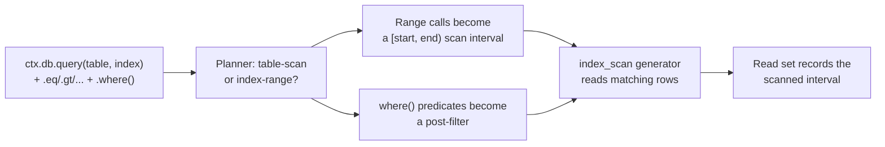
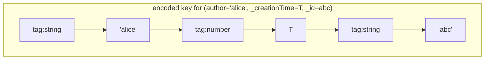
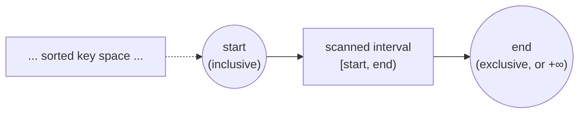
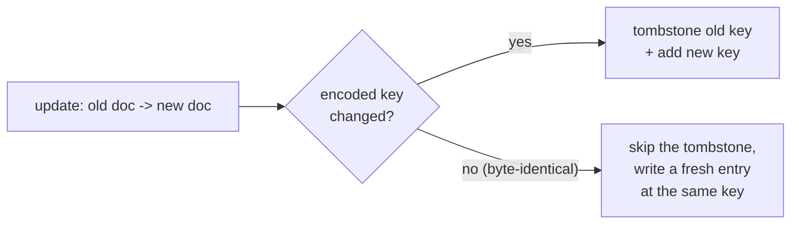

{/* diataxis: explanation */}

## The one-sentence version

When you write a declarative query, like `ctx.db.query("messages", "by_author").eq("author",
"alice").order("desc").paginate(...)`, the query engine swoops in and takes care of two things for
you at the exact same time. It performs the actual storage scan and figures out the specific key
ranges that the scan relied on.

That second part is the real secret behind our precise
[reactivity](/docs/contributing/architecture/reactivity). If a later write happens to fall inside a
range you were depending on, your subscription will run again. If it lands outside that range, your
subscription happily ignores it.

Everything we chat about on this page is all about getting that read-set precision absolutely
perfect. When we nail this, a chat app with ten rows and one with ten billion rows will follow the
exact same code path, and neither one will waste time re-running subscriptions unnecessarily.

We will walk through everything in order here. First, we will look at how an index encodes rows into
sortable bytes. Then, we will see how a query turns into a scan interval, how the runtime executes
that scan while keeping track of what it touched, how writes keep your indexes in sync, and finally,
how cursors keep your pagination nice and stable. If you are looking for the *user-facing*
documentation on writing queries, you should check out [Queries](/docs/core-concepts/queries) and
[Reading data](/docs/core-concepts/queries). This page focuses entirely on how the engine under the
hood actually works.

## What a query actually goes through

Let's take a quick look at the whole pipeline before we dive into each stage:



You will notice two things happening in parallel here. Keeping these straight is super helpful for
understanding how the whole component ticks.

- The **range calls** on the builder (like `.eq(field, value)`, along with one
  `.gt`/`.gte`/`.lt`/`.lte` bound per direction on the next indexed field) are compiled into a **scan
  interval**. This is basically a contiguous slice of the index that the storage layer can jump
  directly to, which means rows outside this slice are totally ignored.
- Anything else, like a `.where(op, field, value)` call, becomes a **post-filter**. This includes
  fields the index doesn't even cover. The post-filter is simply a check that runs on each row *after*
  it has been read from the scan interval.

This distinction is really important. Only the scan interval dictates what actually gets recorded as
"read." If a post-filter rejects 999 out of 1000 rows in the interval, it does not shrink your
recorded read set. The engine still had to touch all 1000 rows to figure that out, so if a write
happens to any of them, it will invalidate the query. We will circle back to this idea in ["What
actually gets recorded"](#what-actually-gets-recorded).

## The foundation: an order-preserving key encoding

Before we dive into scan intervals, it helps to know what an index actually looks like on disk. At
its core, an index is just a sorted list of keys, and each key is built from the field values of a
single document. The neat trick that makes this whole system work is how those keys are encoded into
bytes. They are encoded in a way that **preserves the logical sort order**. This means if you
compare two keys as raw bytes, you get the exact same result as if you compared the original values.

You can find this logic in the `@concile/index-key-codec` package
(`packages/index-key-codec/src/encode.ts`), and it is probably the most critical piece of code in
the entire query engine. Every other feature we discuss here from accurate scan ranges and stable
cursors to precise reactivity and conflict checks relies entirely on this one property being
absolutely perfect.

Let's look at an example. Imagine we have an index defined on `(author, _creationTime, _id)`. We
will get to why `_creationTime` and `_id` are tagged on the end in the next section. First, each
value in that tuple gets a one-byte **type tag**. This ensures that different data types sort in a
reliable and predictable order:

```
null  <  false  <  true  <  number  <  bigint  <  string  <  bytes
```

After the tag, we add a payload that also preserves the order. For instance, numbers get a sign-bit
flip so that negative and positive floats compare correctly as raw bytes. Bigints get a similar
big-endian transformation. Strings and bytes are mostly just their raw content, with a tiny escape
mechanism to make them self-delimiting. When you string all these tagged segments together for every
field in the tuple, you end up with one composite key:



Since each segment is self-delimiting (meaning strings have a clear end and numbers are a fixed
width), comparing two of these composite keys byte-by-byte gives you the exact same answer as
comparing the original tuples field-by-field. This simple fact that **byte order equals value
order** is what allows the storage layer to treat indexes as basic sorted byte lists while magically
getting correct range scans, sort orders, and pagination for free.

When a query constrains a *prefix* of the fields in an index (for example, looking for "author
equals alice, and creationTime is greater than some timestamp"), it simply translates into one
contiguous `[start, end)` byte range on that number line:



From that point on, everything else like the planner, the scan, the read set, and the cursor just
does basic arithmetic on these byte ranges.

<Callout type="warn" title="Never compare decoded values with native operators">

You will notice that the query engine never compares decoded values using JavaScript's native `<` or
`>` operators. Native comparisons can disagree with our codec on tricky edge cases like `-0` versus
`+0`, `NaN`, and bigint-vs-number. To keep things consistent, every ordering decision (whether it is
sorting, figuring out a cursor position, or checking range membership) always goes through the
codec's built-in `compareKeyBytes` or `compareValues` methods.

</Callout>

## Every index has a hidden tiebreaker

Under the hood, an `IndexSpec` (found in `packages/query-engine/src/index-manager.ts`) is just a
table, a name, and an ordered list of field paths. For example, it might look like `{ table:
"messages", index: "by_author", fields: ["author"] }`. However, when the engine builds a key for a
document, it quietly adds two extra fields to whatever you defined:

```
your fields  +  _creationTime  +  _id
```

You might wonder why we add both of these. Well, two different documents can easily share the same
value for an `author` field if Alice sends multiple messages. Without a tiebreaker, the engine would
have a hard time telling them apart in the index, making it impossible to confidently answer a
request like "give me the row right after this one." By appending `_id` (which is totally unique to
each document), we guarantee that every encoded key is globally unique. Adding `_creationTime` right
before the ID gives us a stable and meaningful default ordering, like sorting newest or oldest
first, before we have to fall back on the ID.

This is actually the secret sauce that keeps pagination cursors perfectly stable. Feel free to jump
down to ["Cursors: pagination that survives concurrent
writes"](#cursors-pagination-that-survives-concurrent-writes) to read more about that.

## Turning a query into a scan interval

The planner (located in `packages/query-engine/src/plan.ts` under the `buildIndexInterval` function)
has a pretty straightforward job. It takes the builder's range calls and folds them into a single
`[start, end)` interval. Let's look at some concrete examples using a `messages` table with a
`by_conversation` index on `(conversationId, _creationTime, _id)`:

| You wrote | Scan interval |
|---|---|
| `ctx.db.query("messages", "by_conversation").eq("conversationId", c1)` | everything with that conversation id |
| `...eq("conversationId", c1).gt("_creationTime", T)` | starts just after `(c1, T)`, ends at the end of `c1`'s range |
| `...eq("conversationId", c1).gte("_creationTime", A).lt("_creationTime", B)` | `[key(c1,A), key(c1,B))` (a time window within one conversation) |
| `ctx.db.query("messages", "by_creation")` with no range calls | the whole table, in creation order (a **table scan**, via the default `by_creation` index every table gets) |

To produce those intervals, the planner simply walks down the index's field list in order:

1. It processes leading **equality** constraints (`.eq`) one field at a time. Each equality fixes
   that specific position in the key, which naturally narrows the range.
2. When it hits the first field that isn't pinned by an equality, it allows **one bound in each
   direction**. This means you can have a lower bound (like `.gt` or `.gte`) and an upper bound
   (like `.lt` or `.lte`) on that exact field.
3. Then, it stops. Any fields after that point are not used to narrow the scan at all. If your query
   still needs to check them, those constraints simply turn into a `.where(...)` post-filter.

There is a really important asymmetry to keep in mind here. The `gt` and `lt` operators are *exclusive*,
so the engine calculates a bound that is the very next possible key after or before your given
value. It does this using the handy `indexKeyRangeEnd` and `indexKeyRangeStart` helpers that built
the prefix range to begin with. On the flip side, `gte` and `lte` are *inclusive*, so they just use
the value's own encoded key directly. This perfectly matches the `[start, end)` number line we
talked about earlier. Here, `start` is always inclusive, `end` is always exclusive, and an `end:
null` simply means "no upper bound, just scan all the way to the end of the index."

Just a quick heads up, we don't currently ship a full search or vector-index planner. This page
focuses entirely on the ordered index-range and table-scan path that is available today. If you are
curious about how the underlying document log is put together, definitely check out [Storage & the
MVCC log](/docs/contributing/architecture/storage).

## Executing the plan and recording what was read

The `QueryRuntime` (located in `packages/query-engine/src/query-runtime.ts`) is the piece that
actually executes a plan. Conceptually, it will do one of two things:

- **`collect(query, ...)`**: It will scan the entire computed interval and hand back every matching
  row.
- **`paginate(query, ..., { cursor, pageSize })`**: It will scan just enough of the interval to fill
  a single page, picking up right where the cursor left off.

Both of these methods power the storage layer's `index_scan` generator. This generator strolls
through the index in sorted-key order, yielding `[key, document]` pairs one by one. As each row pops
out, the post-filter from `filter.ts` kicks in. This is where anything that couldn't be squeezed
into the scan interval is checked against the actual document.

### What actually gets recorded

It is really easy to mix this part up, so let's state it clearly: **the read set records the
interval that was scanned, not the rows that survived the filter.**

To break that down:

- If the scan runs all the way to completion (meaning it hit the end of the interval without running
  into a page-size or scan limit), we record the *entire* interval. This includes going all the way
  to "no upper bound" (`end: null`) if the query was unbounded above. We do this on purpose. If a
  query asks for "everything," it is truly depending on nothing new ever showing up at the end. So,
  a later insert there absolutely needs to invalidate it.
- On the other hand, if the scan stops early because a page filled up or a scan cap kicked in, we
  only record the span that was actually consumed. This goes from the interval's start up to and
  including the very last key the scan peeked at.

Imagine you have a query with a post-filter that rejects 900 out of the 1,000 rows in its interval,
giving you back just 100 rows. The read set is still going to cover the keyspace for all 1,000 rows.
If a write comes along and updates row #501 (which was initially rejected and never returned), that
change might cause it to pass the filter the next time around. The query has to know to re-run and
check that. If we only recorded the 100 rows that survived, we would totally miss that update.

This simple "did a write land inside a recorded range" test also plays a huge role as the
transaction layer's conflict check. Check out [Transactions &
OCC](/docs/contributing/architecture/transactions) to see how a mutation validates its own reads
against anything that committed in the meantime.

## Keeping indexes in sync on every write

Whenever you write a document (whether that is an insert, update, or delete), the system needs to
make sure every index on that table stays consistent. The `computeIndexUpdates` function in
`packages/query-engine/src/index-manager.ts` takes care of this by comparing the document's *old*
encoded key with its *new* one for every single index:

- **Insert** (no old document): We just add the new key.
- **Delete** (no new document): We tombstone the old key.
- **Update**, when the key **changed**: We tombstone the old key and add the new one.
- **Update**, when the key is **byte-identical** to before: We skip the tombstone entirely, but we
  still write a fresh entry at that exact same key.



That last case is worth explaining a bit more, because you might easily mistake it for "no index
write at all." Our indexes are versioned exactly like our documents (take a look at [Storage & the
MVCC log](/docs/contributing/architecture/storage) for more on that). Because of this, every new
document revision demands an index entry stamped with the new commit timestamp no matter what. The
`computeIndexUpdates` function will always emit a fresh `NonClustered` entry pointing to the
document as long as the new document exists. The byte-identical check is really there to save us
from writing a *tombstone*. When the key hasn't moved, we get to skip the tedious
delete-then-recreate churn at the old key location. If you update a message's `text` field but your
index is on `author`, the author-index key doesn't budge. In this case, the write is simply one
superseding entry at the same key instead of a tombstone and a brand new add.

## Cursors: pagination that survives concurrent writes

A pagination cursor is basically just an encoded position in the index. It is literally the last key
where the previous page left off. When you resume a scan, you are essentially asking the storage
layer to give you "everything strictly after this key" (or before it, if you are sorting in
descending order).

Since every index key naturally ends with the document's unique `_id`, this position is always
flawlessly exact. This holds true even if dozens of documents share the exact same leading field
values, like having the same `author` or matching `_creationTime` down to the very last millisecond.
Ties are a part of life, but this approach gives us two amazing benefits for free:

- **Pagination stays totally stable during concurrent inserts.** If someone sneaks in a new row
  while you are casually scrolling through pages, it will land at a very specific position relative
  to your cursor. It will either be strictly before or strictly after it. This means you will never
  accidentally see a duplicate row or skip one entirely just because of a race condition.
- **A page's recorded read range is bounded by the cursor, not the entire index.** For instance,
  page 3 of a paginated feed only relies on the tiny slice of keyspace it actually scanned to build
  that page. Any new data popping up elsewhere in the index won't bother it at all.

This clever little mechanism is also what allows our pagination to scale effortlessly from a tiny
hundred-row development table up to a massive production one without requiring any changes to your
application code. If you are curious about how the sync tier turns these recorded ranges into
precise subscription invalidation, have a look at ["Reactivity &
sync"](/docs/contributing/architecture/reactivity). You can also find the developer-facing API
details over in [Pagination](/docs/core-concepts/queries).

## Filters and ordering, briefly

Any logic that doesn't fit neatly into the scan interval is handled as a small expression tree. This
includes things like `.where(op, field, value)` calls and comparisons like `neq` that an index range
just can't express. You can see this in `FilterExpr` within `filter.ts`, which manages comparisons,
logical operators like `and`, `or`, and `not`, as well as dotted field paths like `"author.name"`.
These are evaluated on a per-document basis right after the row comes back from the scan.

There is one important rule that ties this back to everything we have talked about. Filter
comparisons always rely on the exact same canonical value comparison that the codec's ordering is
built on (specifically `compareValues` from `@concile/values`), completely ignoring JavaScript's
native operators. This ensures that your sort order, your cursor position, and a filter's `gt` check
will always perfectly agree on which of two values is "bigger."

## Summary

- Our index-key codec beautifully transforms tuples of values into order-preserving bytes.
  Everything else downstream relies entirely on this being spot on.
- Every single index secretly tags `(_creationTime, _id)` onto the end, ensuring that every key is
  entirely unique and perfectly ordered.
- Your query's `.eq`, `.gt`, `.gte`, `.lt`, and `.lte` range calls are combined into one tidy
  `[start, end)` scan interval, while `.where(...)` calls become a post-filter applied to each row.
- Keep in mind that the read set records the scanned interval, not just the rows that survive the
  filter. This is the secret to keeping reactive invalidation both correct and remarkably precise.
- Writes effortlessly keep your indexes in sync. They even skip the tombstone phase when a
  document's key in that index hasn't actually moved, though they always write a fresh entry.
- Cursors lock in an exact `(key, _id)` position. This ensures your pagination remains gapless and
  incredibly stable, even when other writes are happening concurrently.
