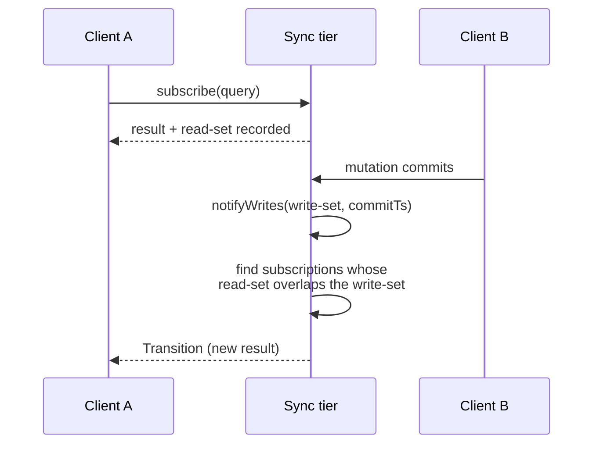
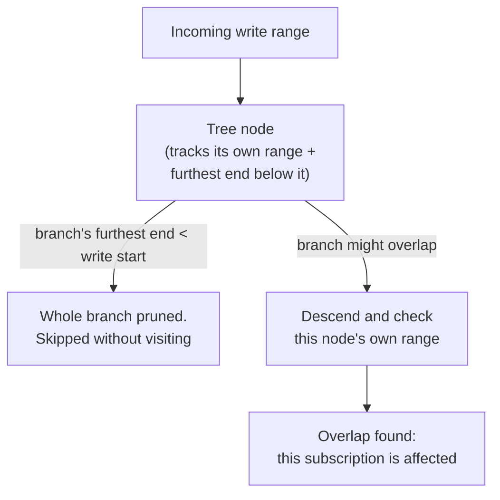
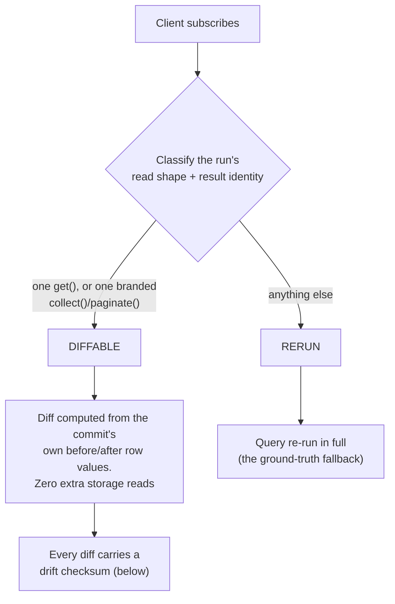
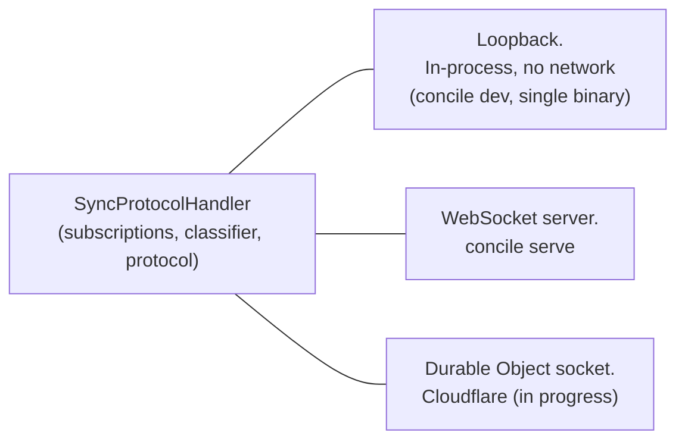

{/* diataxis: explanation */}

## The one-sentence version

Think of a **subscription** as just a query paired up with a receipt that shows exactly what data it
touched. Whenever a mutation commits, the sync tier checks what it just wrote against every single
subscription's receipt. If they overlap, the query gets re-run (or diffed) and the fresh result is
pushed right to the client watching it. Absolutely nothing else moves.

That is pretty much the entire reactivity model in a nutshell. Everything else we cover on this page
(like the interval-indexed matcher, the row-diffing fast path, the resume registry, and the wire
protocol) just exists to make that one simple idea fast and accurate as you scale up. You can find
most of this code hanging out over in `packages/sync/src`.

If you just want to find out how to write a live query for your app, you might want to jump over to
[Reactivity](/docs/core-concepts/reactivity) instead. This page is really all about the machinery
running under the hood.

## Start here: a subscription is a query plus a read-set

When a client calls a query function, our engine doesn't just run it and hand back a value. It also
takes note of the **read set**, which includes the exact index ranges and point reads the query
touched while it was running. (If you're curious about how that recording works, check out [The
query engine](/docs/contributing/architecture/query-engine). This page picks up right where that
leaves off.)

The sync tier holds onto that read set for as long as the client stays subscribed. Later on, when a
mutation commits, it generates a **write set** that lists the ranges it actually changed. At that
point, the sync tier has one main job on every single commit:

> It asks: does this write set overlap with that read set? If it does, we re-run (or diff) the query and push out the new result. If not, we just do nothing.



Client A never has to poll for updates. Client B's commit is the only thing that kicks off any work,
and it only happens for the subscriptions it actually impacts. This means a million idle
subscriptions to completely unrelated data won't cost you a thing when this write lands.

## The `SubscriptionManager`: who holds the receipts

The `SubscriptionManager` (found in `packages/sync/src/subscription-manager.ts`) acts as the
registry for live subscriptions. We key each entry by **`(sessionId, queryId)`**, meaning there is
one entry per subscription per session. So, if you have ten tabs running the exact same query, they
will hold ten separate entries, and an affected query is re-run for each subscription individually.
(There is one exception where identical queries share state, which is the resume registry we'll talk
about later. That one keys on `(identity, path, args)` for reconnect bookkeeping rather than for
shared re-runs.)

Each `Subscription` keeps track of the tables its read set touched, its serialized read ranges, and
a diffable read descriptor (if the classifier says it needs one). We deserialize the read ranges
exactly **once** at `add()` time, so we never have to re-parse them for every write.

Whenever a commit happens, the manager's job is to figure out exactly which `(session, query)` pairs
need our attention:

```ts title="packages/sync/src/subscription-manager.ts (shape)"
findAffectedByRanges(
  writeRanges: readonly SerializedKeyRange[],
  writeTables: readonly string[],
): Subscription[]
```

That specific answer is the part really worth understanding, much more than the WebSocket plumbing
itself.

## Finding affected subscriptions without scanning everything

It would technically be correct to compare the write set against every subscription one by one, but
that definitely doesn't scale well. That linear scan was actually the behavior we shipped in v0. The
`fanout-selective-10000` benchmark quickly made the cost of that approach clear: with 10,000 live
subscriptions and exactly one matching each write, the propagation p50 was **6.72 ms**, even though
only one single subscriber ever actually needed recomputing.

To fix this (which we call DLR Stage 1, and what the rest of our docs mean by "range-precise
invalidation"), we introduced a per-keyspace **augmented interval tree** (`IntervalIndex`, located
in `packages/index-key-codec/src/interval-index.ts`). This is a search structure purpose-built to
answer the question, "which of these stored ranges overlap this incoming range?" It gives us an
answer in roughly `O(log n + k)` time instead of `O(n)`, where `k` is the number of actual matches
we find.

Try picturing each subscription's read range as a horizontal bar on a number line. (In this case,
the "number line" is a keyspace's byte-encoded key space.) The tree itself is a treap keyed by each
range's `start` byte-key, and we augment every node with the furthest-right `end` found anywhere in
its subtree. When a new write range arrives, the search can just prune an entire branch the exact
moment it sees that the branch's furthest endpoint doesn't even reach the write's start. We know no
bar in that branch could possibly overlap, so we skip visiting them entirely.

There are two implementation details you might find interesting:

- **Node priorities are entirely deterministic.** We use an FNV-1a hash over the entry's own
  `(start, end, value)` identity, and we never rely on `Math.random()`. Because of this, the tree's
  shape is a pure, perfectly reproducible function of its contents. It still manages to stay
  balanced in expectation, completely regardless of the order items are inserted.
- **We bucket ranges by keyspace first.** A write to one table's index could never possibly overlap
  a read range in a totally different table. Because of this, each lookup only bothers searching the
  specific tree that could potentially contain a match.



One fallback rides alongside the tree. A subscription that recorded **zero** read ranges goes into a
plain `byTable` fallback set instead, and matches on any write to a table it read. This is
deliberately narrow: a subscription with even one recorded range is matched purely through the
interval index, never double-matched at the table level. (An unbounded scan doesn't land here, by
the way: the query engine records a full-interval *range* for it, so it's still range-matched. The
fallback exists so a read that genuinely produced no ranges can never under-report and silently miss
a write.)

Measured, same machine, before and after the indexed matcher: `fanout-selective-10000` propagation
p50 went from **6.72 ms to 0.24 ms** (`CHANGELOG.md` 0.0.1).

## The subscribe/notify race: one serial tail

There's an awkward gap hiding in the sequence diagram above: subscribing and reacting to commits are
concurrent code paths operating over shared per-session state. Handled naively, a concurrent
invalidation could push a *newer* value to a session, and then an in-flight subscribe response could
deliver an *older* one under version brackets that still look contiguous. This would be a silent
regression with no protocol signal. With optimistic updates in play, it would even be user visible:
your own confirmed write would appear to vanish for a frame.

The fix (which we internally call **G1**) is serialization instead of a handshake. The handler keeps
one serial promise chain called `notifyTail`, and *both* operations run on it. Every commit's
fan-out (`notifyWrites`) and every `ModifyQuerySet` (subscribe/unsubscribe) are enqueued onto this
exact same tail (in `packages/sync/src/handler.ts`). Because of this, a subscribe executes strictly
after whatever notify was in flight, reads the session's version at execution time, and brackets
contiguously off it. Subscribing simply waits behind any pending notifies, and we accept that
latency as a worthwhile cost.

There is no per-table "latest write timestamp" check, and there's no complex register-then-recheck
dance. Ordering the two paths on one queue is the entire mechanism.

## The classifier: reuse the write instead of re-reading it

Finding *which* subscriptions are affected is only half the battle. The other half is what happens
next. By default, an affected query is **re-run from scratch** and its whole result is re-sent. If
you have a query watching one document, or a list of a hundred rows, that is a lot of repeated work
just to communicate a change to maybe one row.

Here's our trick: when a mutation commits, the engine already has each changed row's
before-and-after value sitting in memory from when it built the commit in the first place. For any
provably safe shape of subscription, the sync tier computes exactly what changed in the *result*
directly from those in-hand values. There's no storage re-read, and we don't re-run the query
handler at all.

That safe shape is decided at subscribe time (in `packages/sync/src/classify.ts`) based on the run's
own recorded read set and returned value:

- **`DIFFABLE_BYID`**: the read set is exactly one point range and the result was a single document
  (or `null`). This is the shape of `ctx.db.get(id)`.
- **`DIFFABLE_RANGE`**: exactly one `.collect()` over one index range ran, there was no
  `.take()`/limit, no row-level read policy was merged into the scan, and the handler returned **the
  exact array the collect returned**, which we prove by object *identity*. The executor brands the
  array with a non-enumerable token, and any `.slice()`/`.filter()`/`.map()`/spread produces a
  fresh, unbranded array. We deliberately rejected content equality. If a post-op happened to be a
  no-op on today's data (like `docs.filter(d => d.big)` when every row currently happens to be big),
  it would classify as diffable and then silently exclude a future row forever. That would be a
  wrong answer no checksum could ever catch.
- **`DIFFABLE_PAGE`**: the same rules apply for one `.paginate()` call, with the brand extended to
  the whole `PaginationResult` object. We add one extra guard: a page whose scan hit its `maxScan`
  cap (`scanCapped`) is never diffable, because its cursor could resume from beyond the page's own
  diffable bounds.
- **`RERUN`**: this covers everything else, like multiple reads, post-processing, joins, unbounded
  shapes with filters, and policies. It uses the ordinary full re-run path, which is always correct,
  just not the fast path.

The differ itself lives in `packages/sync/src/commit-differ.ts`. The `byIdChangesFor` function
derives a 0-or-1-row change directly from the commit's own written document. The `rangeChangesFor`
function diffs the commit's written docs against the subscription's membership map. If it wasn't
previously in the map but is now in-bounds and filter-passing, that's an `add`. If it still
qualifies, that's an `edit`. If it no longer qualifies, that's a `remove`. If it was never in and
still isn't in, there is no change at all.



When we measured this, `diffbytes-scan` went from **2,647 to 482 bytes/update** (an 82% cut), and
`diffbytes-paginate` landed at **475 bytes/update**. In both cases, the per-update cost is
proportional to the actual change, not the collection size, so the savings grow with the list size
(see `CHANGELOG.md` 0.0.2 and 0.0.3).

## The `Change` vocabulary and the drift checksum

Every diffable shape emits the exact same row-change vocabulary (`packages/sync/src/change.ts`). It
is applied identically on both the server and client by one shared `applyChanges` function. This is
what keeps the two sides from drifting on what a diff actually means:

```ts title="packages/sync/src/change.ts"
export type Change =
  | { t: "add"; key: string; row: JSONValue; ts: number; orderKey?: string }
  | { t: "remove"; key: string }
  | { t: "edit"; key: string; row: JSONValue; ts: number; orderKey?: string };
```

The `key` is the document's `_id`. There is **no separate `"move"` wire type**. A reorder (which is
a write that changes the fields a range is sorted by, without changing membership) is just an `edit`
whose `orderKey` differs from the previous one. The `orderKey` is the row's index-entry key,
produced by the same `extractIndexKey` the query engine uses to build real index entries. That means
it already includes the `_creationTime`/`_id` tiebreak. The client sorts its materialized map by
this key, so a changed `orderKey` is what actually moves the row.

Every `QueryDiff` also carries a **drift checksum**, which is an order-independent FNV-1a XOR fold
over `(key, ts, orderKey)` for every row currently sitting in the subscription's materialized map:

```ts title="packages/sync/src/change.ts"
export function driftChecksum(rows: Map<string, RowVersion>): string
```

The client recomputes this exact same fold after applying a diff. Folding the `orderKey` in means a *missed
reorder* gets caught too, not just a missed add/edit/remove. If there is a mismatch, the response is
never to guess or crash. Instead, that one query just throws away its diffed state and resyncs from
a full re-run.

Just to be honest about one caveat: the checksum catches bugs in the differ or the apply path. It
structurally *cannot* catch a misclassified handler, since a checksum over an already-wrong value
would be internally self-consistent on both sides. The classifier's identity-based conservatism we
talked about above is the real defense here, and the checksum just acts as the safety net behind it.

## Pagination: the pinned page

A reactive `.paginate()` subscription needs its page to stay completely stable while data shifts
around it. There's no cursor journal on the wire to make that happen (if you look at `QueryRequest`
below, you'll see it has no such field). Instead, the mechanism lives entirely on the server side.

Diffing a *count*-bounded page comes with a pull-in problem: if a row is deleted, we'd need to pull
in whatever the next unseen row past the boundary is. That means we'd have to do a storage read,
which the diff path explicitly forbids. So instead, at load time, the page is pinned to the fixed **`[startBound,
endBound)` key interval** it actually covered. This is held as server-side page metadata directly on
the subscription. From that point on, it's diffed as an ordinary two-sided-bound range, and we just
reuse `rangeChangesFor` without any changes.

The fields `nextCursor`, `hasMore`, and `scanCapped` are captured at that load time and carried
through every incremental diff untouched. They only move on the next real reset. A page's row count
can drift from its original page size under live edits, but that's actually correct reactive
behavior. An insert inside the pinned bounds grows the page, a delete shrinks it, and the boundary
never moves underneath page N+1.

## The client side, briefly

The client mirrors each diffable subscription as a keyed `Map<docId, RowVersion>` (in
`packages/client/src/layered-store.ts`) and renders it into the specific value that `useQuery` sees.
That might be the sole row (or `undefined`) for a by-id query, a sorted array for a range, or the
sorted array wrapped back into `{ page, nextCursor, hasMore, scanCapped }` for a page.

For ranges, we sort by `orderKey` through a byte comparator called `compareKeyBytes`, so the client
order perfectly reproduces the engine's exact index order. The `orderKey` travels as base64 and is
decoded with the exact decoder-half of the codec the server encodes through. Every render mints a
fresh array or object, fulfilling the reference-inequality contract that the optimistic-update layer
relies on.

## Reconnecting: both halves of resume

When a client goes offline and comes back, it doesn't re-download (and mostly doesn't even
re-compute) results that didn't change. We compose two separate mechanisms to handle this, and both
are currently shipped.

**The bandwidth half.** Every pushed result carries a server-minted content fingerprint, which is
`"sha256:" +` hex computed over the JSON-serialized value (minted in
`packages/sync/src/handler.ts`). The client stores this and echoes it back as `resultHash` on the
matching resubscribe. If the server's fresh run hashes identically, it just answers with a tiny
`QueryUnchanged` marker instead of sending the full value. This only fires from `ModifyQuerySet`
handling (a resubscribe) and never from a live push. When measured at the all-unchanged ceiling, it
gives us roughly 99% less reconnect bandwidth (see `CHANGELOG.md` 0.0.1). If you connect to an older
server that predates this field, it simply never sees an echoed hash and sends full results.

**The compute half (DLR Stage 3).** The bandwidth half still forces us to pay for the re-run before
it can hash. The compute half skips the re-run itself. On reconnect, the client also stamps each
resubscribe with `sinceTs`, which is its own maximum observed commit timestamp. On the server side,
a `ResumeRegistry` (`packages/sync/src/resume-registry.ts`) tracks the following per
`regKey(identity, path, args)`:

```ts title="packages/sync/src/resume-registry.ts (shape)"
interface ResumeEntry {
  readRanges: readonly SerializedKeyRange[];
  tables: readonly string[];
  globalTables: readonly string[];
  lastInvalidatedTs: number;
  wasDiffable: boolean;
  refCount: number;
  expiresAtMs?: number;
}
```

The `advanceOnCommit` function runs on **every single commit**, working over the same interval-index
and table-fallback matcher shape that the `SubscriptionManager` uses. It advances
`lastInvalidatedTs` for a matching entry **even when it currently has zero live subscribers**. We
retain these entries for a `TTL_MS` of 60 seconds after their last subscriber releases them, and
they stay indexed the whole time. If we didn't do this, a write landing during the disconnect gap
would go unrecorded, and a resuming client would end up trusting a stale result.

On a resubscribe carrying `sinceTs`, if the registry has an entry and:

- the query is **not** diffable (`wasDiffable === false`), because diffable subs keep their own
  fingerprint/`QueryDiff` resume path and mixing the two would bypass their reset-seeding
  invariants; and
- it read no global (D1-backed) tables, since those live in a different timestamp domain the
  registry can't vouch for; and
- `entry.lastInvalidatedTs <= sinceTs`,

then the server registers the subscription straight from the **retained read-set** and answers
`QueryUnchanged` with no call into the query executor at all. If there is a missing entry, a newer
`lastInvalidatedTs`, or a diffable sub, it just falls straight through to a normal re-run. It is
conservative by construction.

There is one subtlety that earned its own fix: the registry has to track the *live* read-set, not
the subscribe-time one. A query like `get(user)` followed by a range keyed on `user.currentRoom`
actually shifts its read-set across re-runs. A registry frozen at subscribe time would never see a
gap write to the new range, and then it would wrongly answer `QueryUnchanged` for stale data (and
there is no drift checksum to catch it, since RERUN subs don't have one). Because of this, every
live re-run re-upserts the registry entry, and `SetAuth` re-keys it to the new identity.

When measured: 50 unchanged RERUN subscriptions re-execute **0** handlers on reconnect with the skip
turned on, versus 50 with it off. A partial-change variant re-executes exactly 1 (see `CHANGELOG.md` 0.0.4).

## The wire protocol: versions, not just messages

Messages between client and server are small, typed JSON packets (`packages/sync/src/protocol.ts`).
A few are worth knowing by name because you'll see them in logs and tests:

**Client to server:**

- `Connect`: opens or resumes a session.
- `ModifyQuerySet`: adds or removes subscriptions. Critically, this is a **diff**, not a full
  resend: a client with a thousand active subscriptions that adds one more sends one small message.
  Each added query is a `QueryRequest`:

  ```ts title="packages/sync/src/protocol.ts"
  export interface QueryRequest {
    queryId: number;
    udfPath: string;
    args: JSONValue;
    resultHash?: string; // bandwidth-half resume echo
    sinceTs?: number;    // compute-half resume checkpoint
  }
  ```

- `Mutation` / `Action`: a write request, or a side-effecting action call.
- `SetAuth`: updates the session's identity.

**Server to client:**

- `Transition`: the actual reactive push. Carries one or more of `QueryUpdated` (full new value),
  `QueryDiff` (an incremental row diff), `QueryUnchanged` (the resume cases above), or
  `QueryRemoved`.
- `MutationResponse` / `ActionResponse`: the direct reply to a write, correlated by a request id.

What makes this more than just convenient is that every `Transition` is **version-bracketed**. It
effectively says, "you're currently at version X, and this moves you to version Y." A client tracks
its own current version, and if a `Transition` doesn't start exactly where the client currently is,
that means a frame was missed (for example, if it dropped under backpressure, which we'll cover
below). The fix is never to try patching around a gap. Instead, the client just resyncs from
scratch. This means a slow or flaky connection gracefully degrades to an occasional full refresh,
but it never leads to silently wrong data.

## Your own commit is never stale

We have two invariants (informally known as G1 and G4 in the engine's design history) that keep a
session's view of *its own* mutation from ever appearing to lag behind what it just did:

- **G1** is the serial-tail serialization we described earlier. Subscribe handling and commit
  fan-out are strictly ordered on one single queue, so an in-flight subscribe can never accidentally
  deliver an older value after a newer push.
- **G4 (origin-frontier).** After a session's own mutation commits, that session's observed version
  must advance to at least the commit's timestamp. Most importantly, it can never advance before it
  has been sent every modification that commit implies for its own subscriptions. If the commit
  touched some of the session's subscriptions, the ordinary push already takes care of this. If it
  touched **none** of them, the engine still emits a standalone, empty, ts-advancing `Transition`.
  This ensures a client's own commit is never invisible to its own optimistic-update gate just
  because nothing it subscribes to actually changed. If a fleet-forwarded mutation has an origin tag
  that can't ride the local fan-out, we handle it using a pending-frontier fallback that provides
  the exact same guarantee.

On top of those two invariants, the diffable path adds **response-before-Transition** ordering. A
session's own reactive `Transition` for a commit it just made is held behind that commit's
`MutationResponse` on the wire using a per-commit microtask gate (we never use a timer for this,
since a tight mutation loop can starve a timer). Together, these mechanisms are what make the
[optimistic updates](/docs/client/optimistic-updates) no-flicker guarantee hold up under all the
diff and resume machinery above.

## Session guardrails: one bad client can't take down the rest

A live connection is state that the server has to hold open, and we use two per-session controllers
(found in `packages/sync/src/session-controllers.ts`) to keep any single client from becoming
everyone else's problem:

- **Heartbeat** (`SessionHeartbeatController`): this is a periodic transport ping (set to every 30
  seconds by default). If two consecutive pings go unanswered, the session is declared dead and we
  clean it up, which ensures a silently vanished TCP connection can't leak memory forever. (A socket
  without a ping capability, like the in-process loopback, is exempt from this.)
- **Backpressure** (`SessionBackpressureController`): every outbound frame goes through one single
  chokepoint. When a client can't keep up, the frames queue up to a specific limit. Past that limit,
  the newest frame is *dropped* rather than exhausting the server's memory. If the episode is
  sustained, we abandon the whole queue. This is completely safe precisely because of the version
  brackets we talked about above: a drop becomes a detected gap, and the client simply resyncs from
  it. Note that `MutationResponse`/`ActionResponse` frames are exempt from dropping because a
  write's outcome must always reach its caller, so they have their own separate overflow budget.

That is the entire set of guardrails. There is no per-session rate limiter and no subscription-count
cap in the sync tier today.

## The transport seam: the same brain, three sockets

Everything we've covered so far (the subscription manager, the classifier, the protocol) never
actually talks to a real network socket directly. Instead, it talks to a small abstract interface
(which looks roughly like `send`, `close`, `readyState`), and something else adapts that interface
to an actual transport layer. That separation is what lets the identical reactive logic run in more
than one place:



- **Loopback** is a same-process, no-network transport where `send` is literally just a function
  call. This is what powers `concile dev` and the single-binary build, giving us full reactivity
  with zero actual sockets. It's also why local development feels incredibly instant.
- **A real WebSocket server** is what `concile serve` runs when you do a standalone deployment.
- **A Cloudflare Durable Object** socket is the newest of the three, and it's part of the ongoing
  Cloudflare-native hosting work. It uses the exact same handler, just wired into a DO's own
  WebSocket handling instead.

Because the reactive brain only ever sees the abstract interface, none of the complex logic above
had to change at all to add that third transport.

## Where the design is still moving

<Callout type="warn" title="Honest boundaries">

- The `ResumeRegistry` is per-node and in-memory. If a reconnect lands on a *different* fleet node,
  it just finds no entry and safely falls through to a normal re-run. Cross-node resume is correct
  by falling back rather than by resuming. Fleet per-shard resume fragments are an explicitly
  deferred future stage.
- Fleet-forwarded mutations fall back to `RERUN` for the diff path. A commit's written docs only
  ride the in-process fan-out on the specific node that owns the write, so a receiving node has
  nothing to diff against. This only impacts wire savings; correctness is completely unaffected.
- Durable Object sync hosting (the third transport mentioned above) is active, in-progress work, and
  is not a finished production path the way the loopback and WebSocket-server transports currently
  are.

</Callout>

## Related pages

- [Reactivity](/docs/core-concepts/reactivity): the user-facing guide to writing live queries.
- [The query engine](/docs/contributing/architecture/query-engine): how read sets get recorded in
  the first place.
- [Transactions & consistency](/docs/contributing/architecture/transactions): where write sets and
  commit timestamps come from.
- [Optimistic updates](/docs/client/optimistic-updates) and [Offline
  sync](/docs/client/offline-sync): client-side features built on top of the protocol described
  here.
