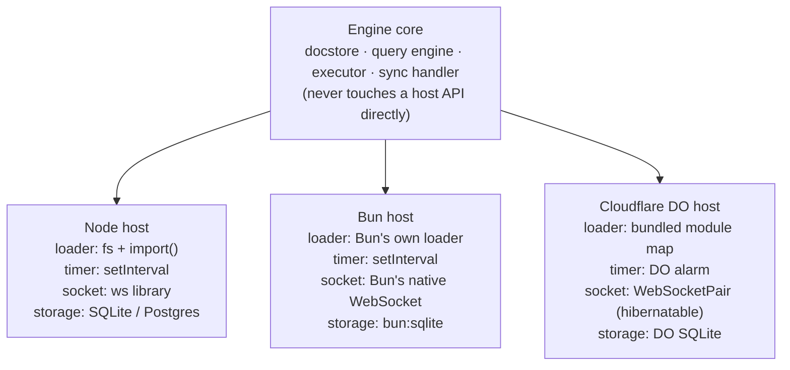
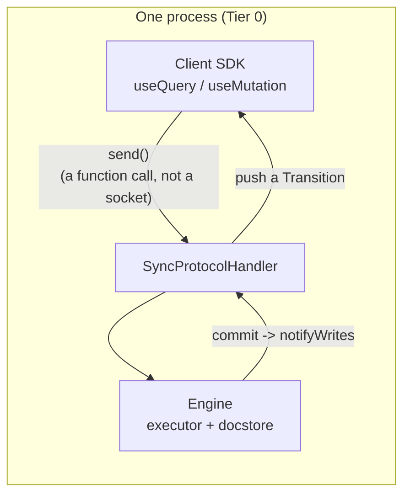
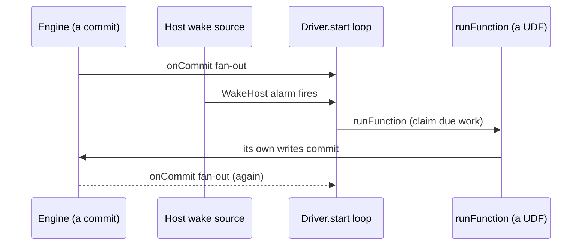
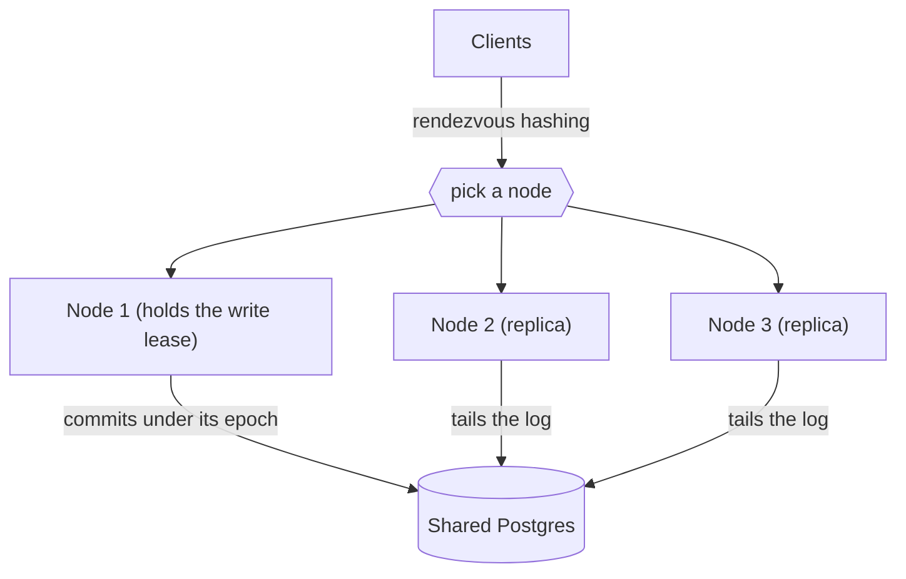

{/* diataxis: explanation */}

Here's the cool part: we only write Concile's engine (the docstore, query engine, executor, and sync handler) once. It runs exactly the same, byte-for-byte, whether you're running it in a single binary on your laptop, across a fleet of nodes sharing one Postgres database, or right inside a Cloudflare Durable Object.

On this page, we're going to dive into how we actually pull that off. We'll also chat about what changes and what stays exactly the same when you move between these different environments.

If you haven't taken a look at [Reactivity & sync](/docs/contributing/architecture/reactivity) or [System design](/docs/contributing/architecture/system-design) yet, it might be a good idea to skim those first. We'll assume you're already pretty familiar with read sets, write sets, and commits.

## The core idea: a host is just four adapters

You can think of the engine as an appliance and a "host" as the wall socket you plug it into. The appliance never changes, but we swap out four small adapters:

1. **Module loader**: how the engine finds and loads your `concile/` functions and schema.
2. **Timer source**: how the engine gets woken up at a future time.
3. **Socket type**: how we represent a client's WebSocket connection.
4. **Storage binding**: which `DocStore` (SQLite, Postgres, Durable Object storage) it reads and writes.

The engine core never imports `node:fs`, never imports a WebSocket library, and never talks to a Cloudflare binding directly. It only interacts with these four adapters.

This means that if you want to add a new host, you just write a thin package that provides these four adapters. You never need to fork or rewrite the engine itself.

("Hibernatable" is Cloudflare's term for a WebSocket that stays open while the Durable Object holding it is unloaded from memory. The DO is then revived when the next message arrives. We will talk more about that in the Durable Object section below.)

<Callout type="warn" title="What's not built yet">

The executor currently runs in-process, rather than inside a real V8 isolate sandbox. The syscall boundary between a function and the engine is already designed so that moving to a true isolate host will just be an adapter swap, rather than a rewrite. However, we haven't built that yet.

Please keep that in mind whenever this page mentions "the same engine everywhere." It means the same *logic* running with today's in-process execution model on every host.

</Callout>

## Tier 0: everything in one process

The simplest host is also our default one. The `packages/runtime-embedded` package exports `EmbeddedRuntime`, which bundles the docstore, the transactional executor, the sync protocol handler, and the HTTP handler into a single process. There is no sidecar, no extra service, and no network hop between them.

This is the foundation that `concile dev`, `concile serve`, and a compiled `concile build` binary all run on. Check out [Deploy & build](/docs/deploy/deploy-and-build) to see how those three entrypoints differ operationally. Underneath it all, they share this exact same runtime core.

Since it is all one process, "the database" is just a function call away from "the code that answers your queries." You don't have to worry about any client-server round trips inside the box.

## The Tier-0 magic trick: a WebSocket that isn't a socket

Here is the really fun part. The Concile client library (the very same one your app imports) expects to talk to a server over a WebSocket and `fetch`.

When your app runs against the embedded runtime, it receives a `LoopbackConnection` (`packages/runtime-embedded/src/loopback.ts`) instead of a real socket. This is simply an object with the exact same `send()` / `onMessage()` shape, wired directly into the sync handler in memory.

There is no TCP connection, no port, and no serialization onto a wire. The "network" between your client code and the engine is just a plain old function call.

A few cool things come along with this loopback wiring:

- **Write fan-out to in-process subscribers.** When a mutation commits, the runtime's `notifyWrites` method checks every live subscription in the same process. It re-runs the ones whose read set overlaps the write and pushes updates straight back through the loopback connection. There is no polling and no queue.
- **Hot reload via `setModules(...)` / `setTableNumbers(...)`.** When you edit your functions or `schema.ts` in dev mode, the CLI resolves them again and calls these two `EmbeddedRuntime` methods (`packages/runtime-embedded/src/runtime.ts`). This swaps the function registry and the table-number map in place, **without** dropping any open WebSocket sessions. Your browser tab keeps its live subscriptions, and they simply re-run against the new code. This is what makes the `concile dev` edit-save-see-it loop so fast. A live `concile deploy` uses this exact same pair of calls.

Every other tier we discuss below essentially does this: it keeps the same sync handler and executor, but swaps in a *different* transport and a *different* storage binding.

## The driver adapter: how recurring work runs on every host

Some features are not triggered by a request at all. Examples include a scheduled job firing at 3am, a `@concile/triggers` handler watching a table, the storage orphan reaper, or a notifications retry sweep.

Concile calls this recurring pattern a **`Driver`** (`packages/component/src/define-component.ts`). It is the same abstraction on every host, it just gets woken up by a different clock.

A `Driver` starts once after boot and receives a `DriverContext` with a small set of capabilities:

- `onCommit(cb)`: gets called every time *anything* commits anywhere in the app. A driver can decide for itself which tables it actually cares about.
- `setTimer(atMs, cb)` / `clearTimer(handle)`: asks to be woken up at a specific wall-clock time.
- `runFunction(path, args)`: runs one of the app's registered functions in a privileged context, outside of any client request. This is how a driver actually gets its work done, whether that is enqueuing a job, delivering a batch, or reclaiming a lease.
- `readLog({ afterTs, tables, limit })`: reads committed changes out of the append-only MVCC log after a given timestamp. This is the durable, gap-free change feed that `@concile/triggers` is built on. A missed change is structurally impossible because the driver reads the log itself, rather than consuming an at-most-once queue.

The clever part is how we handle hosts that do not run continuously. For example, a Durable Object can go to sleep between requests, so it cannot just leave a `setInterval` running.

To solve this, every driver's timer requests are funneled down to **one single pending wake** (`WakeHost.armWake(atMs)`), and the host is the only component allowed to fire it. On Node or Bun, that is just a regular `setTimeout` under the hood, so nothing really changes.

On the Cloudflare Durable Object host, it uses the single alarm that a Durable Object receives (`ctx.storage.setAlarm`). The DO wakes up, runs whatever work is due, and then re-arms the next alarm.

`@concile/scheduler`, `@concile/triggers`, the file-storage reaper, and the `@concile/notifications` delivery driver are all built on this exact mechanism. They use the same functions and the same `Driver` interface. They just use a different timer source depending on where you deploy them.

## Tier 2: the distributed fleet

Everything we have discussed so far assumes one process and one storage engine. The `ee/packages/fleet` package changes that assumption. It allows many identical nodes to share one Postgres database and act as a single logical deployment.

<Callout type="info" title="This package lives in ee/">

This package lives in `ee/`. This is a reserved area under a separate commercial license, rather than the open FSL core. We placed it here because distributed write scale-out is where our paid entitlement gate will eventually live. Check out [Licensing](/docs/contributing/licensing) for more details on our "free now, gate scale later" model.

</Callout>

The fleet is **symmetric**, meaning every node runs the exact same binary. There is no separate coordinator process. Instead:

- A **lease**, stored in a `shard_leases` table in the shared Postgres database, elects exactly one node as the write owner for each shard. A node acquires the lease using a Postgres advisory lock and an `epoch` counter. If that node dies or hangs, its lease expires and a surviving node fences it out to take over. The store itself acts as the coordinator, so there is no extra service you need to keep alive.
- Every **other** node runs as a **replica**. It tails the shared commit log (`ReplicaTailer`) and applies each committed write into its own local embedded docstore exactly as it happened. This lets it serve reactive queries locally without having to hit the writer for every read.
- A **write forwarder** on a non-owning node sends mutations over to whichever node currently holds the lease for that shard. This ensures a client can talk to any node and still get correct, single-writer semantics.
- **Clients are routed to nodes by rendezvous hashing**, which is a consistent-hashing scheme. This means a given client id always lands on the same node, as long as that node is alive. This prevents a client's subscriptions from bouncing around as the fleet scales up or down.

<Callout type="warn" title="Where this stands today">

Multi-node **write** scale-out is working, but it is still maturing. We currently see a measured throughput of roughly 1.75x when 3 nodes share one Postgres instance, so it is not a linear win just yet. However, reads and cross-node reactivity scale very well. Commits are still bottlenecked by the number of shards you run and how fast Postgres itself can process commits.

You shouldn't reach for the fleet package expecting Tier-0-times-N write throughput. You should reach for it when you need more connections and read capacity than a single node can handle, or if you need failover support.

</Callout>

## The Cloudflare Durable Object host

The `packages/runtime-cloudflare` package puts the **same** engine inside a single Cloudflare Durable Object. There is no fork and no parallel implementation of the sync protocol. It simply swaps in:

- **`@concile/docstore-do-sqlite`** as the storage binding, which is backed by `ctx.storage.sql` (the DO's built-in SQLite).
- The **DO alarm** (`ctx.storage.setAlarm`) as the single timer source that every driver's wake event gets multiplexed down to, exactly as we described earlier.
- **`WebSocketPair` and hibernatable sockets** (`do-socket.ts`) as the socket type. A Durable Object can go to sleep while keeping its WebSocket connections technically "open." It can then wake up and reconstruct each session's subscriptions from a small serialized attachment before it processes the next message.

Since the DO is a single-threaded object, its own event loop naturally acts as the write mutex. You don't need any separate locking mechanism like the Postgres leases required by the multi-node fleet.

We have proven this end-to-end in a real `workerd` runtime (Cloudflare's actual Workers engine, rather than just a mock), and we aren't just relying on unit tests against fakes.

The main takeaway here is that this is a **different topology**, but not different application code. Your `schema.ts`, your query and mutation functions, and your components stay exactly the same whether you run on a Durable Object or a single binary.

## The through-line promise

Your exact same app code runs unmodified on Tier 0 (one binary), Tier 2 (a fleet), and the edge (a Durable Object). The only things that change are your configuration and which adapter package you load. Maintaining this invariant is the entire reason we factored the engine this way. It is the golden rule to remember if you are adding a new host yourself:

**You subclass the four adapters: module loader, timer, socket, and storage binding. You never need to edit the engine core to make a new host work.**

If you are building a new adapter, take a look at [Extending: storage adapters](/docs/contributing/extending/storage-adapter) and [Extending: custom components](/docs/contributing/extending/custom-component) to see how components and storage backends plug in. To understand how the transaction and reactivity machinery works, check out [Transactions & consistency](/docs/contributing/architecture/transactions) and [Reactivity & sync](/docs/contributing/architecture/reactivity). For the operational differences between Tier 0 and Tier 2 (what you actually run in production), see [Self-hosting](/docs/deploy/self-hosting) and [Scaling](/docs/deploy/scaling).
