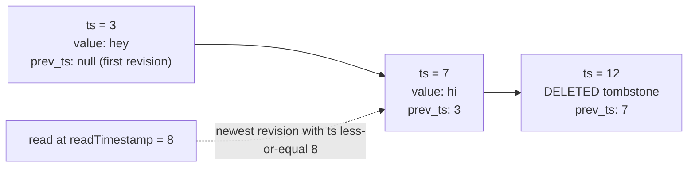
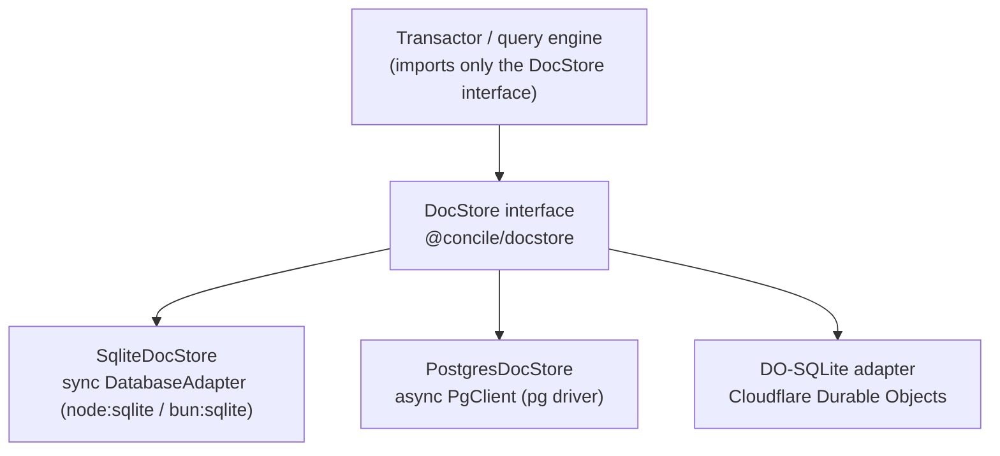
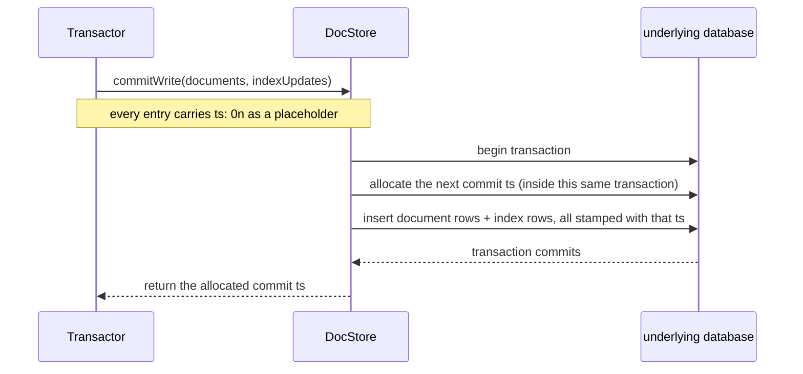
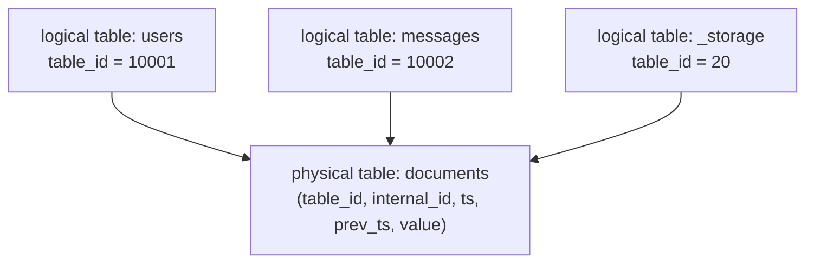

{/* diataxis: explanation */}

At the end of the day, everything in Concile boils down to a simple log of document revisions on
your disk. Whether you're running queries, writing mutations, or poking around the data browser, it
all comes back to this log. Grasping how it works will really help you understand the rest of the
engine. In this guide, we'll build that understanding together from scratch. No prior Concile
knowledge needed!

## The one thing to understand first: nothing is ever overwritten

Most databases just save the *current* value of a row, overwriting old data whenever there's a
change. Concile's storage layer, on the other hand, takes a different approach: it **never
overwrites**. Instead, every single write, insert, update, or delete just tacks a brand-new entry
onto the end of a log. So when you ask for the "current" value of a document, you're really just
getting the most recent entry for it.

Concretely, every write appends a `DocumentLogEntry`:

```ts
interface DocumentLogEntry {
  ts: bigint;                       // the logical commit time of this revision
  id: InternalDocumentId;           // which document
  value: ResolvedDocument | null;   // the new body, or null for a delete
  prev_ts: bigint | null;           // the ts of this document's PREVIOUS revision
}
```

We call a `null` value a **tombstone**. It basically marks the document as deleted as of that `ts`,
without erasing its history. The `prev_ts` field points back to the entry that came before it, which
means every document's history forms a **backward-linked chain through time**. The newest entry
points at the one before it, which points at the one before that, all the way back to its very first
revision (`prev_ts: null`).



That right there is one document's entire history: created at `ts=3`, edited at `ts=7`, and then
deleted at `ts=12`. Notice how nothing was ever mutated in place. Each step just quietly appended a
new row.

## Reading "as of" a moment in time

Since we never throw away old revisions, you can ask a pretty useful question: "what did this
document look like at some earlier point?" We call that a **snapshot read**, and the rule for
answering it is surprisingly simple:

> Take the newest revision whose `ts` is less than or equal to your `readTimestamp`. If that
> revision is a tombstone, the document doesn't exist at that snapshot.

In the diagram above, doing a read at `readTimestamp = 8` lands you right on the `ts = 7` revision.
The `ts = 12` delete hasn't happened yet as of time 8, so it's completely invisible to that read. If
you were to read at `readTimestamp = 20`, you'd land on the tombstone, making the document appear
deleted.

This single rule is the core of **snapshot isolation** in Concile. It means that the exact same
scan, if run again later at the same `readTimestamp`, will always return exactly the same answer, no
matter how many new writes have landed in the meantime. The past is set in stone, and nothing about
it ever changes. That stability is what makes two other massive features possible:

- **Deterministic replay.** If a query function ever needs to be re-run (like if we need to check
  whether a mutation's read set actually changed, which you can read about in [Transactions &
  consistency](/docs/contributing/architecture/transactions)), running it again at the same
  timestamp is absolutely guaranteed to produce the same result. You'll never run into a situation
  where the answer depends on when you ask.
- **Reactivity.** Our [reactivity](/docs/contributing/architecture/reactivity) engine can safely
  cache that "this query, at this snapshot, produced this result". It only ever has to worry about
  whether a new write's range overlaps what the query read, and never has to worry about the read
  silently going stale on its own.

## Indexes are versioned the same way

Of course, a document table needs indexes if we want to query it efficiently (whether that's by
field, by range, or something else). If you're curious about how those get built and used, you can
check out [the query engine](/docs/contributing/architecture/query-engine). But the most important
takeaway here is that **index entries follow the exact same append-only, timestamped discipline as
our documents**. For instance, a `DatabaseIndexUpdate` looks like this:

```ts
interface DatabaseIndexUpdate {
  indexId: string;
  key: Uint8Array;                                       // the encoded index key
  value: { type: "NonClustered"; docId: InternalDocumentId } | { type: "Deleted" };
}
```

Notice how each update is stamped with a `ts`, just like a document revision. Because of this,
asking "what did this index look like at `readTimestamp`" is answered using the exact same rule:
just grab the newest entry per key where `ts <= readTimestamp`, and skip it if you see a `Deleted`
marker. Since a document's row and its index entries are always written in the very same commit at
the exact same `ts`, an index scan and a direct document read taken at the same snapshot can never
disagree with one another.

## The DocStore seam: one interface, several backends

Everything we've talked about so far (the log, the tombstones, and the versioned indexes) is *implemented*
by something called a `DocStore` (which you can find defined in `packages/docstore/src/types.ts`).
This is the sole interface that the rest of the engine (like the transactor, the query engine, the
scheduler, and really everything else) is written against. This is a crucial detail: **the engine
only ever imports this interface, and never a specific database driver.** As long as a system can
satisfy `DocStore` (by performing an ordered, point-in-time range scan, and an atomic batch write),
it qualifies as a valid storage backend.



While `DocStore` has a fair number of methods, they generally group into a handful of core concerns.
Here's a look at the entire surface area, broken down one group at a time:

<Accordions type="single">

<Accordion title="Setup">

The `setupSchema(options?)` method creates the physical tables if they don't exist yet. It's fully
idempotent, meaning that calling it on a store that is already set up is a completely harmless
no-op, and it typically just runs once when the store opens.

</Accordion>

<Accordion title="Writing (three ways, and why)">

We actually have three different ways to write, mostly because they solve slightly different
problems.

The `write(documents, indexUpdates, conflictStrategy)` method is our low-level "insert these
already-stamped rows" primitive. We use it when the caller (like a replica applying someone else's
committed rows, for example) already knows the exact `ts` that each row belongs at. The
`conflictStrategy` argument (which can be `"Error"` or `"Overwrite"`) tells the system what to do if
a row at that exact `(table_id, internal_id, ts)` already exists. If it's `"Error"`, we refuse the
write, while `"Overwrite"` replaces it in place. That second mode comes in handy for tooling like
the migration importer, which re-inserts documents at their real, already-known `ts` and needs a
second pass over the same rows to be a safe no-op rather than throwing a duplicate-key failure.

The `commitWrite(documents, indexUpdates)` method is what an ordinary transaction commit will call.
The documents and index updates arrive with `ts: 0n` acting as a placeholder, and then **the store
itself allocates the real commit timestamp, right inside its own transaction**, before writing the
rows. That detail is actually pretty important. If the timestamp were handed out earlier by some
outside clock and *then* the write landed, we'd have a brief window where a timestamp had been
promised but nothing was actually written yet. A crash in that window would be a real headache to
deal with. By making the allocation and the writing one single atomic step, we completely eliminate
that window.



The `commitWriteBatch(units)` method follows the same idea, but it's for committing several
transactions' worth of rows in one go (often called a "group commit"). Each unit still gets its own
distinct, strictly increasing timestamp, but they all land together in a single underlying database
transaction. This is mostly a big deal for scaled-out deployments that are doing many small commits
per second. If you're on a single-node deployment, you can generally just ignore it.

The `addCommitGuard(guard)` method lets other parts of the system (like the offline mutation outbox
described in our product docs) hook a little bit of logic to run *inside* every commit's
transaction. It's super useful for things like "also write a receipt row, atomically with this
commit." That being said, most deployments will probably never need to register one.

</Accordion>

<Accordion title="Reading (the hot path)">

These methods run on every query.

- `get(id, readTimestamp?)`: This returns a document's newest visible revision, or `null` if it
  doesn't exist.
- `index_scan(indexId, tableId, readTimestamp, interval, order, limit?)`: This is our primary read
  primitive. It's actually an **async generator**, meaning it's a function you can loop over with
  `for await`. It produces results one at a time instead of building a giant array up front, walking
  an index's key range in order and yielding `[keyBytes, latestDocument]` pairs. It also applies
  that snapshot rule we talked about earlier as it goes.
- `scan(tableId, readTimestamp?)` and `count(tableId)`: These give you a whole table's live
  documents, and how many of them there are.
- `maxTimestamp()`: This fetches the highest commit timestamp the store has ever seen. We use it on
  startup to make sure a restarted engine never hands out a timestamp it has already used before
  (we'll talk more about this below).

</Accordion>

<Accordion title="The change feed">

The `load_documents(range, order, limit?)` method tails the raw log over a timestamp range. It
includes every single revision (tombstones included) and doesn't deduplicate down to "latest per
key" the way `index_scan` or `scan` do. This is the core primitive that our reactive subscriptions,
and really any future replication or change-stream features, are built on. It basically asks the
system to "give me everything that happened between these two timestamps."

</Accordion>

<Accordion title="OCC support">

The `previous_revisions(queries)` method answers the question: "what was this document's revision
immediately before a specific timestamp?" for a batch of documents at once. It's worth being precise
about who actually calls it, because **the transactor doesn't.** The transactor's OCC validation
actually intersects a transaction's read ranges against an in-memory ring of recent commits (found
in `packages/transactor/src/shard-writer.ts`) and never bothers to re-read the store. You can read
more about that in [Transactions & consistency](/docs/contributing/architecture/transactions).
Today, `previous_revisions` is mainly consumed by our scaled-out `ee/` storage substrates, which
pass it right through when they are composing stores. The `DocStore` itself doesn't validate
anything at all, it just honestly answers the question it was asked.

</Accordion>

<Accordion title="A small key-value store">

The `getGlobal`, `writeGlobal`, and `writeGlobalIfAbsent` methods make up a tiny string-to-JSON side
table for engine bookkeeping. We use them for things like schema metadata or one-time bootstrap
flags. The `writeGlobalIfAbsent` method acts as a compare-and-set operation: it only writes if the
key doesn't already exist, which is exactly the kind of check you need when you want to "run this
setup step exactly once".

</Accordion>

<Accordion title="Client mutation receipts">

Our `DocStore` also carries a handful of methods (like `getClientVerdict`, `recordClientVerdict`,
`pruneClientMutations`, and their friends) that back our durable offline mutation outbox. This
handles how a client's replayed mutation gets recognized as "already applied" instead of mistakenly
running twice after a reconnect. It's really a whole feature in its own right, but the short version
is just that these receipts live in the exact same store, right alongside our documents and indexes,
so they can commit atomically with the writes they are receipting. You can see [Offline
sync](/docs/client/offline-sync) for how the outbox itself uses these.

</Accordion>

</Accordions>

## The TimestampOracle: where commit timestamps come from

Every commit needs a `ts` that's guaranteed to be strictly greater than every `ts` that came before
it. This strict ordering is exactly what makes our rule of finding the "newest revision with `ts <=
readTimestamp`" such a well-defined and stable answer. The component responsible for making this
happen is the `TimestampOracle`. We have one of these per store (or one per shard if you're looking
at Tier 2's scaled-out deployments):

- `getCurrentTimestamp()`: This gets the latest timestamp allocated so far (which might still be an
  in-flight commit that hasn't officially landed yet).
- `getLastCommittedTimestamp()`: This grabs the latest timestamp that has actually, fully committed,
  serving as the safe snapshot that a new read can use right now.
- `observeTimestamp(ts)`: This nudges the oracle's clock forward to at least `ts`, and strictly
  ensures it never goes backward. This is the magic that makes restarts safe. When the store
  reopens, it reads back the highest `ts` it ever committed (using `maxTimestamp()`) and then calls
  `observeTimestamp` with it *before* it starts allocating anything new. This ensures a crash and
  restart can never accidentally reuse or rewind a timestamp that already has meaning in the system.

It's important to remember that `ts` is purely a logical counter, and not a wall-clock time. Its
only job is to increase and never repeat. If you're looking for wall-clock time, a document has a
separate `_creationTime` field that handles that, and it's what developers usually see. The two
concepts are completely unrelated.

## Why the seam is this narrow, on purpose

If you look back at the `DocStore` interface, you'll see it's really just "ordered point-in-time
range scans" combined with "atomic batch writes" and a tiny KV store. There's nothing in there about
SQL, and nothing tying it to a specific database product. That narrow focus is entirely deliberate.
It's what allows Concile to claim that you can **deploy anywhere** without the engine's transaction
logic, query planner, or reactivity code ever needing to change. Any backend that can successfully
answer "give me the newest row per key up to this timestamp, in order" and can also "write this
batch atomically" is considered a legal `DocStore`.

<Callout type="warn" title="A design invariant, not a suggestion">
  A leak of SQLite- or Postgres-specific behavior above this seam would be a design bug, not a
  shortcut. The engine is never supposed to know which database it's talking to.
</Callout>

## Two shipped adapters, one synchronous and one async

Right now, Concile ships with two database backends, plus a Cloudflare-native adapter. The two
databases intentionally look quite different under the hood, mainly because their underlying drivers
operate differently.

<Tabs items={['SqliteDocStore', 'PostgresDocStore', 'DO-SQLite']}>

<Tab value="SqliteDocStore">

The `SqliteDocStore` (found in `packages/docstore-sqlite`) sits on top of a small **synchronous**
`DatabaseAdapter` seam (using `exec`, `prepare`, and `transaction`), which perfectly matches
`node:sqlite` and `bun:sqlite` since they are themselves synchronous APIs. When it commits, it
allocates the next timestamp with a plain `MAX(ts) + 1` computed directly inside its own
transaction. Since Concile strictly enforces a single writer at a time, that read-then-increment
logic can never accidentally race with another writer.

</Tab>

<Tab value="PostgresDocStore">

On the other hand, the `PostgresDocStore` (`packages/docstore-postgres`) sits on an **async**
`PgClient` seam, simply because talking to Postgres always involves awaiting network round trips.
When it commits, it calls `nextval('concile_ts')` inside the exact same transaction as the row
inserts, meaning the timestamp becomes visible atomically along with the rows it stamps. It also
smartly takes a Postgres advisory lock on startup. This way, if a second engine instance points at
the same database, it fails fast instead of silently corrupting things by writing concurrently.
Since index scans can't rely on SQLite's per-row logic, they are rewritten as set-based `DISTINCT
ON` and `LATERAL` queries that perform the same "newest row per key" deduplication in just one round
trip.

</Tab>

<Tab value="DO-SQLite">

The `DO-SQLite` adapter (`packages/docstore-do-sqlite`) runs right inside a Cloudflare Durable
Object. Interestingly, it doesn't even try to reimplement the MVCC log logic. Instead, it reuses the
`SqliteDocStore` verbatim and just supplies a different `DatabaseAdapter` that talks directly to the
Durable Object's own embedded SQLite (`ctx.storage.sql`), rather than `node:sqlite` or `bun:sqlite`.
That kind of reuse is a perfect example of our seam paying off exactly as intended. It gave us a
brand-new deployment target for basically free, since we only had to change the narrow adapter
logic.

</Tab>

</Tabs>

Choosing between SQLite and Postgres is a simple deployment-time choice using the `--database-url`
or `CONCILE_DATABASE_URL` flags. It requires absolutely no code changes and no migrations, primarily
because the physical schema (which we'll cover in the next section) is identical either way. If you
want to see how that's configured in practice, check out our guides on
[self-hosting](/docs/deploy/self-hosting) and [Postgres](/docs/deploy/postgres). And if you're
feeling adventurous and want to add a new backend yourself, take a look at [Writing a storage
adapter](/docs/contributing/extending/storage-adapter).

## Physically schemaless: a fixed set of tables holds everything

Here's a detail that often surprises people who are used to typical SQL databases: adding a new app
table in your `schema.ts` file never actually runs any `CREATE TABLE` commands. Under the hood,
there is always exactly the same small set of physical tables (`documents`, `indexes`,
`persistence_globals`, and the client-receipt tables), regardless of how many logical tables or
indexes your app defines. In our system, a logical table is really just a `table_id` value that
happens to appear in the `documents` rows, and a logical index is just an `index_id` value in the
`indexes` rows. Defining a new table or index is purely a **metadata operation**. You just allocate
it a number and start writing rows tagged with that number. You never have to worry about running a
schema migration.



Every row you see above lives side by side in the very same physical table, and they are
distinguished only by their `table_id` column. There is no per-table SQL object for the engine to
create, alter, or migrate.

This is exactly why Concile never needs a migration step as your app's `schema.ts` evolves. There is
simply no DDL to run in the first place. Additive schema changes are still validated at deploy time
(which you can read about in [Deploy & build](/docs/deploy/deploy-and-build)), but that validation
is purely a code-level check, not a database one.

## Document identity: ids that validate themselves

There's one more piece that's definitely worth understanding, and that's what a document id actually *is*.
Internally, a document's identity is just a combination of `{ tableNumber, internalId }`. It's a
small number that identifies its table, plus 16 random bytes. The `k57x3n8j...` style string that
you see floating around in application code is produced by encoding that specific pair:

```
base32( varint(tableNumber)  ++  internalId (16 bytes)  ++  fletcher16-checksum (2 bytes) )
```

| Part | What it does |
|---|---|
| `varint(tableNumber)` | This packs the table number into as few bytes as possible (1 byte for small numbers, and more for larger ones). Since most apps have far fewer than 128 tables, this neatly keeps ids short in the common case. |
| `internalId` (16 bytes) | These are generated from a cryptographically secure random source, ensuring that ids are unguessable and effectively collision-free without needing any coordination between writers. |
| Trailing checksum (2 bytes) | This is a Fletcher-16 checksum over everything before it. It ensures that a mistyped or truncated id string is caught immediately by the codec alone, meaning no database round trip is ever needed to discover that it's invalid. |
| Base32 encoding | The entire byte string is then encoded in Crockford Base32. It's a text alphabet that deliberately skips the letters `i`, `l`, `o`, and `u` to carefully avoid confusion with `1`, `0`, and `v`. |

Table numbers are nicely partitioned by range. The numbers from **1 to 9999 are reserved for
Concile's own internal system tables** (for example, the file-storage table lives permanently at
table number 20), while **user-defined tables start at 10001**. Because the table *number*, rather
than its name, is what gets baked into every single id, renaming a table in your `schema.ts` file
will never invalidate any existing document id.

## Where this fits in the bigger picture

The storage layer deliberately knows absolutely nothing about transactions, query planning, or
reactive subscriptions. It simply offers ordered snapshots and atomic writes. Everything more
interesting and complex is built one layer up:

- [Transactions & consistency](/docs/contributing/architecture/transactions): This covers how a
  mutation becomes one serializable transaction on top of `commitWrite`, including OCC validation
  and conflict retry logic.
- [The query engine](/docs/contributing/architecture/query-engine): This explains how index
  selection and `.where()` post-filters are translated into calls to `index_scan`.
- [Reactivity](/docs/contributing/architecture/reactivity): This dives into how a write's range gets
  compared against a subscribed query's read set to intelligently decide whether to re-run it.
- [Writing a storage adapter](/docs/contributing/extending/storage-adapter): This is a practical
  guide you can use if you ever want to implement `DocStore` for a completely new backend.
