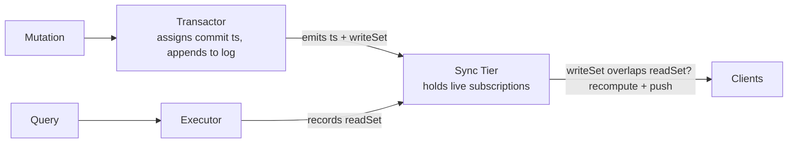
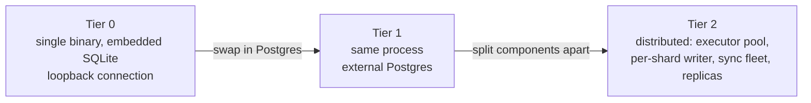

{/* diataxis: explanation */}

Think of this page as your map. It breaks down the single core idea that powers everything in
Concile's engine. We're going to show you how this one concept lets a tiny single-binary app and a
massive distributed system run on the exact same code.

If you want to dive deeper, the other pages in the **Architecture** section zoom into specific parts
of this picture: [reactivity & sync](/docs/contributing/architecture/reactivity),
[transactions](/docs/contributing/architecture/transactions),
[storage](/docs/contributing/architecture/storage), [query
engine](/docs/contributing/architecture/query-engine),
[execution](/docs/contributing/architecture/execution), and [runtimes &
topology](/docs/contributing/architecture/runtimes).

## The thesis, in plain terms

Picture a typical backend. You've got an app server, a database, a cache, a message queue, and maybe
a pub-sub broker. Each one is a separate process chatting with the others over the network. In
reality, most of the latency you experience and the complexity you have to manage lives right there
in those network hops, rather than in your actual business logic.

Concile takes a simple bet: **remove those hops.** We run your query and mutation functions *in the
same process* as the storage engine, tucked behind one clean interface instead of a clunky database
driver. You don't have to worry about invalidating a separate cache or wiring up a message broker.
When your data changes, the engine already knows exactly which clients care about it and pushes them
an update directly.

## Five goals that don't obviously fit together

We're trying to hit all these goals at the same time:

| Goal | What it means in practice |
|---|---|
| **Great developer experience** | Reactive `useQuery`, end-to-end TypeScript types, a fast `concile dev` loop |
| **Lightweight** | One binary, an embedded database, no sidecar services. Runs on a cheap VPS or a laptop |
| **Fastest realtime** | Updates are pushed the instant they happen, never polled for |
| **Deploy anywhere** | The same artifact runs on Docker, Bun, Node, or as a compiled standalone binary |
| **Scalable** | Reads and writes can grow horizontally when an app outgrows one machine |

If you look closely at that list, you'll probably spot some tension. Building "one lightweight
binary" that's also a "horizontally scalable distributed system" sounds like a contradiction. Most
backends force you to pick a lane. You either get a scrappy single-binary tool that eventually hits
a wall, or a highly scalable platform that's a nightmare to run on day one.

Our approach with Concile is to refuse to pick a lane. We've built both into **the same system at
two different operating points**, stitched together by a few stable internal interfaces. When you
need to scale up, it's just a deployment and configuration change. You never have to rewrite your
functions.

We back up each of those goals with a specific technical mechanism:

| Goal | The mechanism that delivers it |
|---|---|
| Great developer experience | In-process execution: your functions run right next to the engine, keeping the dev loop fast and types tight. |
| Lightweight | In-process execution plus the tiered split: Tier 0 is just one process and a single SQLite file. |
| Fastest realtime | Push plus differential updates: subscribed clients receive changes the second a commit lands, and we only send the rows that actually changed. |
| Deploy anywhere | The narrow storage seam: the engine literally doesn't know which database or host it's running on. |
| Scalable | The storage seam plus the tiered split: you can swap the adapter and split the components without ever touching your app code. |

Let's walk through how these mechanisms actually work.

## The core primitive: reactive transactions over an ordered log

If you take away just one concept, make it this one. Everything else we do is built right on top of
it.

- **We use exactly one logical writer, called the transactor.** Every time a write is committed, we
  stamp it with a timestamp that only ever goes up, and then we append it to an ordered log. Since
  writes are strictly ordered, a notoriously tough concurrency problem ("how do we make these
  transactions serializable?") turns into a very simple one ("just append them in order").
- **Queries are always read-only and completely deterministic.** If you give a query the same
  inputs, you'll always get the same output. No network calls, no random numbers, and no checking
  the time. While your query runs, our engine quietly keeps track of its **read set**, noting
  exactly which rows and index ranges it looked at. This determinism is crucial because it
  guarantees that the read set is trustworthy, meaning we can safely re-run the query behind the
  scenes later on.
- **Mutations handle read and write transactions using optimistic concurrency control (OCC).** A
  mutation runs against a snapshot of your data and will only commit if nothing it looked at has
  changed in the meantime. If something did change, the engine simply retries it for you. Once a
  mutation successfully commits, it generates a **write set**, logging the exact ranges it altered.
- **Reactivity boils down to simple set intersection.** Think of a live subscription as just a query
  combined with its recorded read set. When a transaction commits with a write set `W`, the engine
  quickly checks all open subscriptions to see if any of their read sets overlap with `W`. If they
  do, we recompute that query and push the fresh result straight to the client. If they don't
  overlap, we do absolutely nothing.

You don't need to poll for changes, write your own cache invalidation logic, or manually configure
pub/sub topics. This single mechanism hands you both correctness (via OCC) and live updates (via
invalidation) completely for free.

This whole diagram is **storage-independent**. It talks about timestamps and ranges, never about
SQLite or Postgres directly. That's on purpose, and it's the next section.

## Three kinds of functions, and why one of them can't touch the database directly

We offer three flavors of Concile functions, and the key difference between them all comes down to
determinism:

| Kind | Deterministic? | Can read/write the database? | Can call `fetch`, read the clock, use randomness? |
|---|---|---|---|
| **Query** | Yes | Read-only | No |
| **Mutation** | Yes | Read + write, via OCC | No |
| **Action** | No | Only indirectly, via `ctx.runQuery`/`ctx.runMutation` | Yes |

We made queries and mutations deterministic on purpose. It's the only way to ensure that a recorded
read set stays meaningful. It's also what allows us to safely replay a conflicting mutation instead
of just letting it fail.

<Callout type="warn" title="Why queries can't call fetch or Date.now()">

The second a query calls `fetch` or reads `Date.now()`, replaying it might give you a totally
different answer than what a subscribed client already received. That would completely break our
reactivity guarantee.

</Callout>

Actions serve as your deliberate escape hatch. We know you need to do real side effects somewhere,
whether that's calling a third-party API, sending out an email, or just checking the system clock.
Actions run entirely **outside** the transactor and don't have direct database access. This ensures
that unpredictable, non-deterministic behavior never sneaks into the reactive core. You can check
out [Actions](/docs/core-concepts/actions) to see how this looks in practice, or read up on
[Execution](/docs/contributing/architecture/execution) to learn how our executor enforces this
separation under the hood.

## The storage seam: one interface, more than one database

The engine never imports a database driver directly. All persistence goes through a small interface,
internally called `DocStore`, and that interface only needs to support one thing: an **ordered,
point-in-time range scan** ("give me everything in this range, as of this timestamp") plus a write
path that carries enough information to detect an OCC conflict.

That's a deliberately narrow contract. Anything that can satisfy it is a valid backend, and today
two things do: **embedded SQLite** (the zero-config default) and **Postgres** (the scale-up option).
Adding a third backend later means writing an adapter, not touching the transactor, the query
engine, or the sync tier. See [Storage & the MVCC log](/docs/contributing/architecture/storage) for
the actual data model behind it.

<Callout type="info" title="Design invariant">

If you ever find code in the engine that behaves differently depending on which database is
underneath it, that's not a quirk. It's a bug. The whole point of the seam is that the engine
genuinely does not know which database it's talking to.

</Callout>

## The tiers: how "one binary" and "scalable" coexist

The transactor, the executors (which run your query/mutation code), and the sync tier (which holds
subscriptions and pushes updates) are the same three components at every scale. What changes across
tiers is only how they're arranged.

- **Tier 0, the default.** One executable: the transactor, executors, sync tier, and dashboard all
  run in the same process, over embedded SQLite. A client on the same machine talks to the engine
  over an in-memory loopback connection instead of a real network socket, so there's no network hop
  at all. This is what makes `concile dev`, a self-contained Docker container, and a compiled
  single-file binary all possible.
- **Tier 1, same process, real database.** Identical to Tier 0 except the adapter underneath is
  Postgres instead of SQLite. Still one writer, still one process. This is usually the "we outgrew a
  single SQLite file" step, with no code changes.
- **Tier 2, split apart.** The executors become a stateless, horizontally-scaled pool. The
  transactor stays a single logical writer, but now *per shard* (a shard is just a slice of the data
  with its own single writer, so you add write capacity by adding slices instead of by weakening
  consistency). Write throughput scales by adding shards, not by weakening consistency. The sync
  tier becomes its own standalone service, so connection count and query-recompute load can scale
  independently of storage. Postgres gains read replicas (read-only copies that stay in sync with
  the writer, so read traffic can be spread across them instead of all hitting one database).

The promise across all three: moving up a tier changes deployment configuration and which adapters
are plugged in. It **never** touches your query/mutation/action functions. That promise, not any
single piece of tech, is the actual product.

## What's real today, and what's still maturing

Being straight about this matters more than making the diagram look complete:

- **Tier 0 and Tier 1 are real, shipped, and tested.** This is the single-binary/Docker path most
  self-hosted apps will actually run on.
- **Tier 2 exists and runs**, but it's a newer, still-maturing part of the system (parts of it live
  in the commercial `ee/` tree rather than the open-core engine). A log-fed fleet of writers
  coordinates through Postgres-backed leases, and replicas tail the commit log to stay current.
  Measured multi-node throughput on a shared Postgres backing store tops out around **1.75x at 3
  nodes** today. That's useful, but it means the practical path to real write scale is adding *shards*
  (each with its own single writer), not just adding more nodes against one shared store.
- **The wire protocol is JSON, not a custom binary format.** An early sketch of this design
  considered a compact binary delta protocol. What actually shipped instead is JSON carrying *differential*
  updates (only what changed, not the whole result set again). See [Reactivity &
  sync](/docs/contributing/architecture/reactivity) for how that differential path works. It gets
  most of the bandwidth win without the complexity of a bespoke wire format.

## What Concile deliberately does not do

- **No sprawl of a dozen containers.** One engine process with pluggable adapters, not a ring of
  microservices each needing its own deploy story.
- **No hidden single-node ceiling.** The in-process Tier 0 design is one configuration of a system
  built to scale, not a wall you hit later.
- **No durability shortcuts by default.** Writes go through a real, ordered, durable log. Speed
  comes from keeping the hot path in-process, not from skipping the parts that keep your data safe.
- **No database-specific behavior leaking out of an adapter.** Covered above: it's a design bug if
  it happens.
- **Nothing here implies full sandboxing, search/vector indexes, or edge-network termination.** The
  executor runs in-process today (it's designed to be portable to a stricter sandbox later, but that
  isolation isn't built yet), and search/vector and TLS termination aren't part of the engine. See
  the honest status notes in the project's build log if you want the full list of what's deferred.

## Where to go next

- [Reactivity & sync](/docs/contributing/architecture/reactivity): the read-set/write-set matcher
  and the WebSocket sync protocol in detail.
- [Transactions](/docs/contributing/architecture/transactions): the OCC commit pipeline and conflict
  retries.
- [Storage & the MVCC log](/docs/contributing/architecture/storage): the append-only log and the
  `DocStore` seam.
- [Query engine](/docs/contributing/architecture/query-engine): how index scans become read sets,
  and stable pagination.
- [Execution](/docs/contributing/architecture/execution): the query/mutation/action split enforced
  at runtime.
- [Runtimes & topology](/docs/contributing/architecture/runtimes): Tier 0 through Tier 2,
  concretely.
- [Scaling](/docs/deploy/scaling) and [Deploy & build](/docs/deploy/deploy-and-build): the
  user-facing side of moving up a tier.
- [Queries](/docs/core-concepts/queries), [Mutations](/docs/core-concepts/mutations), and
  [Actions](/docs/core-concepts/actions): the function types from an app author's point of view.
