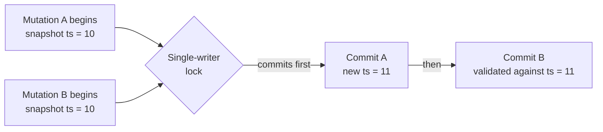
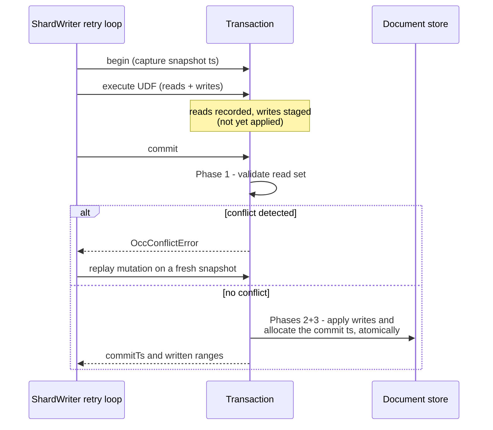
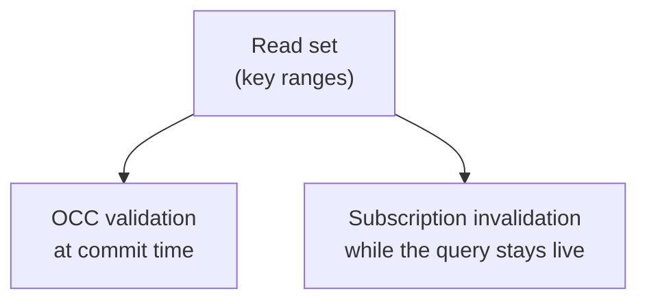
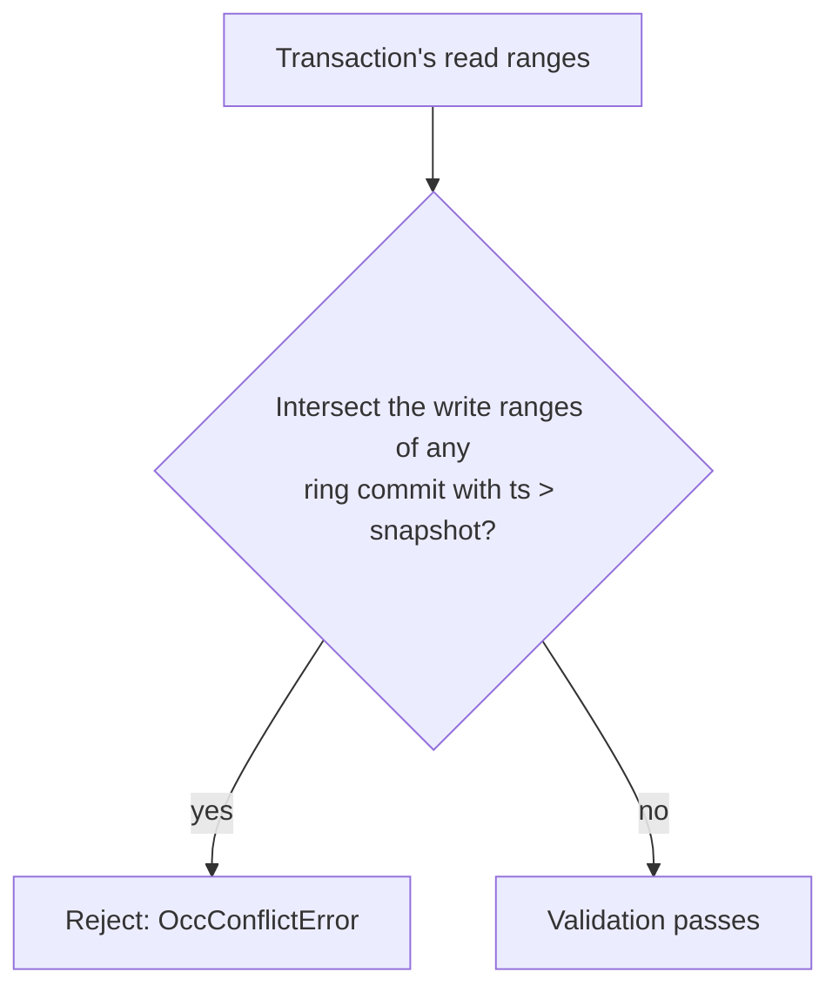

{/* diataxis: explanation */}

Imagine a cozy little shop with just one cash register. People can browse the aisles and fill their
carts together, but they check out one by one. This is exactly how Concile makes sure every data
change is safe while letting everyone read data without waiting.

Whenever you change data, like using `ctx.db.insert(...)` or `ctx.db.replace(...)`, it happens
inside a transaction. Here we'll break down how these transactions stay perfectly safe so no two
updates accidentally step on each other, and stay incredibly cheap by avoiding slow locks and
waiting lines. We'll also explore how the very same behind-the-scenes tracking that keeps things
safe also drives your live queries.

If you haven't checked out `/docs/core-concepts/mutations` yet, you might want to start there for
the developer's perspective. Think of this page as the backstage tour, perfect for when you're
digging into the engine source code, building a new component, or just feeling curious.

## The magic trick: one writer per shard

We organize Concile's engine into **shards**. If you are running the default setup with a single
binary, you just have one shard. You can simply think of it as the database for now. We use sharding
to scale things up in Tier 2, which you can read about in
`/docs/contributing/architecture/runtimes`, but everything we talk about here applies to each shard
individually.

The tool that spreads a commit across multiple shards is the `ShardedTransactor` found in
`packages/transactor/src/sharded-transactor.ts`. It manages multiple independent `ShardWriter`
instances behind the familiar `Transactor` interface that `SingleWriterTransactor` uses. This means
the code calling it does not even have to care if it is talking to one shard or fifty.

Inside a single shard, we made a straightforward choice: only one transaction can commit at any
given moment. We use a lock called `AsyncMutex` in `packages/transactor/src/shard-writer.ts` to
guarantee that commits queue up and never happen at the exact same time.

Right next to that lock is a monotonic clock. You can picture it as a trusty counter that only ever
hands out bigger and bigger numbers, which we call timestamps. When a transaction commits, it gets a
timestamp that is guaranteed to be larger than any commit that came before it on that shard.

Why is this setup so powerful? It takes a notoriously thorny problem like figuring out if someone
else messed with your data and makes it incredibly easy to solve. Because commits line up one by one
and timestamps always go up, a transaction only has to answer one simple question when it is time to
commit: did the data I looked at change while I was working?

You do not have to worry about coordinating locks with other writers, checking for deadlocks, or
managing complex distributed consensus. We call this approach **optimistic concurrency control
(OCC)**. You just assume everything is fine, get the work done, and only double check for conflicts
at the very end before saving.



In this scenario, both `A` and `B` can read data at the same time without any locks holding them
back. Reads literally never wait. Only that final, lightning-fast commit step happens one at a time.
We keep it intentionally brief by just validating, grabbing a timestamp, and writing. The system
does not do anything else while holding the lock.

## The life of a mutation

Every transaction follows the same four basic steps. It is helpful to keep this pattern in mind
because it forms the foundation for everything else we cover here. The `SingleWriterTransactor`
class in `packages/transactor/src/single-writer-transactor.ts` handles this process, passing the
heavy lifting down to a specific `ShardWriter`.



1. **Begin.** First, the transaction grabs a snapshot timestamp. This represents the most recent
   commit on the shard. Any data the transaction looks at is shown exactly as it existed at that
   moment, even if the transaction takes a while to finish.
2. **Execute.** Now your mutation code actually runs. When you read data, it pulls from the store
   using that snapshot timestamp. But it also double checks to see if this very same transaction
   already modified that data. We call this reading your own writes, and we will get into it more
   later. The system writes down every piece of data you look at. Any changes you make are just
   staged in memory for now, not saved to the main store yet.
3. **Commit.** We use a neat three step process here, which we will unpack in the next section. It
   either works perfectly and saves everything in one fell swoop, or it spots a conflict and stops.
4. **Rollback.** If a conflict pops up or something else goes sideways, we simply toss out those
   staged writes and the list of what we read. Since nobody else could see those changes anyway, it
   is like they never even happened.

If you have a transaction that is only reading data, like a query or a mutation that does not
actually change anything, it gets to skip the entire commit process. There is simply nothing to
check or save, so it never even looks at the single writer lock.

## Read sets and write sets do double duty

While your mutation is doing its thing, the transaction quietly keeps an eye on two lists:

- The **read set**: a log of every document, index range, or table scan the mutation peeked at.
- The **write set**: a list of every single document the mutation is preparing to update.

The cool part is that we record both of these lists using the exact same format, which we call a **key
range**. A key range is simply our way of saying "look at this table or index, starting from this
encoded key and ending at that one." If you read one specific document, that is a range where the
start and end keys are identical, often called a point range. When you run `.collect()` on an index,
it creates a range that covers a whole bunch of keys. A full table scan is just the biggest possible
range you can make for that table. Since the keys are encoded as bytes, it is incredibly fast and
easy to check if two ranges overlap without writing special code for different types of data.

Using the same format for both sets is way more than just a clever shortcut. It is actually the
beating heart of the whole setup. We take that one read set and use it for two totally different
tasks at different stages:



- **When it is time to commit**, we take the read set and its snapshot timestamp into Phase 1
  validation. We are basically asking, "did any of this data change since I took my snapshot?"
- **While someone is actively watching a query**, we pass that read set over to the sync tier.
  Whenever a new commit brings in a fresh write set, the sync tier checks if it overlaps with what
  any live subscriptions are looking at. If they cross paths, it means the query results might have
  changed, so it runs the query again and sends out the update. You can read all about that side of
  things in `/docs/contributing/architecture/reactivity`.

So we get two massive benefits from tracking just one read set. Once you nail down this format, you
get both airtight data safety and live reactivity practically as a bonus.

## The three step commit

The commit phase is where the real action happens. We keep it intentionally short and sweet so that
the single writer lock is not tied up for long.

**Phase 1: Validating.** We check if any commits that happened after our snapshot messed with data
we were looking at. We do this by seeing if our read set overlaps with the write sets from recent
commits.

- If we find an overlap, we stop the whole transaction right there and throw an `OccConflictError`.
  None of your changes get saved.
- We specifically ignore your transaction's own pending writes during this check. It is perfectly
  normal to read something you just updated in your own transaction, so that does not count as a
  conflict.

**Phases 2 and 3: Applying and allocating together.** If everything looks good, we hand all your
staged updates over to the document store's `commitWrite` function using a temporary timestamp. The
store then creates the actual official commit timestamp deep inside its own secure process, marks
every single row with it, and saves everything all at once. If we tried to make the timestamp
earlier, before talking to the store, we would create a risky gap where a timestamp exists but the
data is not actually saved yet. Doing it all in one swift motion completely avoids that trap. Check
out [Storage and the MVCC log](/docs/contributing/architecture/storage) if you want to see how the
store handles this.

Once that big save is successful, the transaction announces the new timestamp as the latest time for
the shard. It then hands back the commit timestamp along with the write set, which the system uses
to figure out what live queries need updating.

If your transaction was only reading and did not actually stage any writes, it smartly skips out
before Phase 1 even starts. Since there are no changes to check or save, it never bothers grabbing
the lock or using up a timestamp.

## Spotting conflicts in the wild

We use one simple, consistent check to spot trouble: **checking for overlapping ranges against
recent commits**. Every `ShardWriter` keeps a running memory of recent commits, jotting them down as
a timestamp and a set of write ranges. During validation, the system looks through this list and
asks a simple question for any commit newer than our snapshot: do these new writes step on any of
the data I was reading? If it finds even one overlap, it flags a conflict. You can see this in
action in `packages/transactor/src/shard-writer.ts`.



Since we cleverly record every type of read as a key range, this single check beautifully handles
scenarios that would normally require a bunch of custom code:

- **Reading a single document.** This is just a point range. If a newer commit touches that exact
  document, it causes an overlap.
- **Scanning a range or a whole table.** This covers a wide interval. If a newer commit updates any
  row in there, it overlaps. Even better, if someone sneaks a brand new "phantom" row into that
  space, its write range lands right in your scanned area. It is crucial to catch these phantoms so
  your scan does not accidentally give you the wrong answer by missing new data, and our range
  system catches them effortlessly.
- **Checking if something is missing.** If you ask if a document exists and find out it does not,
  the system still remembers that you checked that specific spot. If another commit comes along and
  creates that document, it writes right into the space you were looking at and triggers a conflict.

No matter what you are doing, the system always ignores your transaction's own writes. You are never
going to trip over your own feet.

It is also worth mentioning what validation completely skips. It never digs through a document's
history chain, and it absolutely never goes back to re-read the main store. The list of recent
commits lives entirely in memory, and the system figures everything out using simple math on the key
ranges. If group commit is running, it also checks against any batches that are queued up but not
saved yet, ensuring nothing slips through the cracks. The system only cleans up this list of recent
commits when they are older than the oldest snapshot still in use by any active transaction.

## How we bounce back from a conflict

<Callout type="info" title="The failed attempt is discarded, not patched">

When Phase 1 throws an `OccConflictError`, nothing from that attempt survives. The retry loop lives
right inside `ShardWriter.runInTransaction` (`packages/transactor/src/shard-writer.ts`): it catches
the conflict and loops, up to a default ceiling of 8 attempts. There's no outer "function runner"
doing the retrying.

</Callout>

Whenever we retry, the writer completely scraps everything from the failed attempt. It grabs a shiny
new snapshot and runs your entire mutation function again right from the beginning using the same
arguments but with fresh reads and writes.

This might sound like a lot of wasted effort, but it is actually totally safe and efficient for one
key reason: your mutations have to be completely predictable based only on the database and their
arguments. You can't use things like `Math.random()`, `Date.now()`, or make network calls. Because
your mutation always creates the exact same writes if given the same inputs and database state,
replaying it on a fresh snapshot is not just a hacky workaround. It is actually calculating the
perfect, correct answer based on the most up-to-date data available.

We do put a cap on how many times it will retry. If a mutation just keeps running into conflicts
because the database is super busy, it will eventually stop and let the caller know about the
problem instead of spinning its wheels forever. This is exactly why your queries and mutations
aren't allowed to play with the clock, random numbers, or network requests. If you need to do those
unpredictable things, you put them in [actions](/docs/core-concepts/actions) instead. Actions live
entirely outside of transactions and never have to deal with getting replayed like this.

## Seeing your own updates

When you are writing a mutation, a flow like this just needs to work naturally:

```ts
const user = await ctx.db.get(userId);
await ctx.db.replace(userId, { ...user, credits: 10 });
const updated = await ctx.db.get(userId);
// updated.credits is 10, even though nothing has been committed yet
```

At that exact moment, your update to `userId` is just hovering in the staging area. It has not
actually hit the document store yet. However, the very next line of code needs to see that update,
otherwise your mutation would be working with old data right in the middle of running. Concile takes
care of this by always checking your transaction's staged writes before it bothers asking the
document store. When you call `get()`, it first checks if you already tweaked that document, and
only heads to the store if you haven't.

This same magic works for scanning data too. When you run `.collect()` on an index, it smoothly
blends your pending writes right over the saved results. So if you just added a document, it pops up
perfectly sorted in your scan. If you just deleted one, it vanishes from the results. All of this
happens seamlessly before anything is officially saved. This guarantees that your mutation always
has a consistent, logical view of the database, even while its changes remain totally invisible to
everyone else.

## Turning writes into live updates

Once Phase 3 wraps up, the commit hands over exactly what the rest of the system is waiting for: the
official commit timestamp and the write set. Those are the key ranges that just got updated,
described in the exact same format we use for reading. Concile bundles these together into what we
call an "oplog delta" and passes it to the sync tier. The sync tier then takes that delta and checks
it against the read sets of everyone who is actively watching a query to figure out who needs fresh
data. That core logic of checking for overlaps is the true heart of the reactivity engine, rather
than the web sockets that carry the messages. You can explore how all that works in
`/docs/contributing/architecture/reactivity`.

The big takeaway here is that reactivity is not just some notification system slapped on top of the
database. It emerges completely naturally from the exact same tracking systems we built to keep our
optimistic concurrency control safe and accurate. We have one single, reliable source of truth
showing what changed and what data each query cares about, and we use it to power both rock-solid
correctness and instant live updates.

## Keeping your only writer safe

Since every mutation on a given shard has to pass through one single lock and retry loop, a poorly
behaved mutation could technically take over and ruin things for everyone by scanning millions of
rows, queuing up endless writes, or endlessly retrying. Concile prevents this by giving every
transaction a strict resource budget that we call headroom.

<Accordions type="single">

<Accordion title="How the HeadroomTracker works">

Every single transaction brings along a `HeadroomTracker`, which you can find in
`packages/transactor/src/headroom.ts`. It sets two hard limits: one for the maximum number of
documents you can read, and another for how many you can write. They both start with a default limit
of 4,096, known as `DEFAULT_HEADROOM`, though you can tweak either one for a specific run if you
need to.

If you blow past either limit, the mutation stops immediately and throws a `HeadroomExceededError`.
We specifically do not treat this like a normal conflict, so it does not get a retry. After all,
retrying a mutation that is just fundamentally too big would only end up failing the exact same way.

These limits pull double duty. First, they make sure no single greedy mutation can hog the single
writer shard and block everyone else. Second, they act as a safety net for the retry loop we talked
about earlier. If a transaction's read set just kept growing endlessly, it would become more and
more likely to clash with something else, forcing it to retry and grow even more until it completely
stalled out.

</Accordion>

</Accordions>

## What we left out

We intentionally skipped over two topics here because they have their own dedicated pages:

- **How we turn write sets into live updates for users.** The sync tier handles this magic, and you
  can read all about it in `/docs/contributing/architecture/reactivity`.
- **How scans, filters, and pagination figure out exactly which key ranges to watch.** That is up to
  the query engine, which you can dive into at `/docs/contributing/architecture/query-engine`.

Both of these systems rely heavily on the same read set and write set mechanics we covered on this
page, but neither of them changes the core way our commits actually work.
