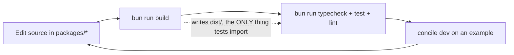
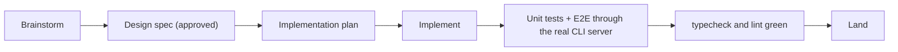

{/* diataxis: how-to */}

Welcome! We wrote this guide specifically for developers who are eager to contribute directly to the
Concile codebase. Just a quick heads up: if you are looking to build an awesome app using Concile
instead of working on the engine itself, you will want to head right over to the
[Quickstart](/docs/get-started/quickstart).

All the commands you see below are exactly the ones we rely on every single day. We pulled them
straight from our actual `package.json` and `turbo.json` files, so you can trust they are ready to
go!

## Prerequisites

- **Bun >= 1.2.** We use Bun as our package manager and our daily development runtime for things
  like `bun install`, `bun run build`, and `concile dev`. If you haven't installed it yet, you can
  grab it from [bun.sh](https://bun.sh).
- **Node >= 22** is fully supported as a deployment target for our published packages. While end
  users can absolutely run Concile on Node, contributors develop and run our internal tools using
  Bun.

<Callout title="Why Bun for development but Node as a target?">
  We designed Concile's engine to be runtime-agnostic by using small abstraction layers, like our
  storage adapter, so it truly runs on both. We chose Bun for development because it is simply
  faster and gives us a great all-in-one experience. It provides a single binary that handles
  installing packages, running scripts, and executing TypeScript directly without needing an extra
  transpile step.
</Callout>

## Bootstrap the repo

```bash
git clone <your-fork-url>
cd concile
bun install
```

Just remember that `<your-fork-url>` is a placeholder. Make sure to clone the actual fork or remote
repository you plan to work from.

When you run `bun install`, it reads our workspace configuration from the root `package.json`. It
will install and link together all the packages found in `packages/`, `components/`, `examples/`,
`apps/`, and `ee/packages/` in one quick pass.

## The core loop commands

Here are the main scripts you will use on a daily basis. You can run these right from the root of
the repository. We use [Turborepo](https://turbo.build) to orchestrate them via `turbo.json`.
Turborepo understands how all our packages depend on each other and ensures everything runs in the
correct order.

```bash
bun run build       # Turborepo, topological: builds every package's dist/
bun run test        # all unit tests (vitest, under Node, see the gotcha below)
bun run typecheck   # tsc --noEmit across every package
bun run lint        # lint checks
bun run dev         # watch-build every package (re-runs build on save)
```

If you are only working on a single package, you can easily scope any script to just that package by
using the `--filter` flag:

```bash
bun run --filter @concile/values test
bun run --filter @concile/values typecheck
```

We also have a separate command for end-to-end tests. We will cover this in more detail later since
it follows a slightly different set of rules:

```bash
bun run test:e2e    # cross-package E2E suites, run one at a time (concurrency 1)
bun run test:all    # test + test:e2e together
```

## The daily development loop

Your day-to-day workflow will usually look something like this:



The note about the build step in the diagram is incredibly important to keep in mind as you work on
this codebase. We explain this in detail in our first pitfall below.

## Common pitfalls to avoid

We learned these lessons the hard way during the project's history. Taking a moment to read them now
might save you a lot of time and confusion later on!

### 1. Tests across packages import from `dist/`, not `src/`

When one package depends on another, like when `@concile/cli` depends on `@concile/values`, the
tests resolve the dependency using the built files in the `dist/` folder. This is exactly how a
normal npm user would consume the package, rather than pulling directly from the `src/` folder.

This means if you make an edit to `packages/values/src/index.ts` and then immediately run `bun run --filter
@concile/cli test`, you won't see your changes. The test will silently keep running against the old
compiled code in `dist/`. To see your updates, you need to run `bun run build` or `bun run --filter
@concile/values build` to refresh the `dist/` folder first.

<Callout title="A warning about git checkout" type="warn">

  We ignore the `dist/` folder in git. If you are ever debugging an issue and it feels like your
  code magically reverted itself, keep in mind that doing a `git checkout` on your source code won't
  update the stale `dist/` files on your disk. Always remember to rebuild!

</Callout>

### 2. Our shared test suite runs on Node

Even though we use Bun as our primary tool, when you run `bun run test`, vitest actually runs under
Node. This means `globalThis.Bun` will be `undefined` during these tests. This leads to two
important points:

- Try to avoid writing tests in the shared suite that rely on Bun specific globals or APIs. They
  will likely fail or do nothing at all since they aren't running in a Bun environment.
- Because the shared suite doesn't test the Bun runtime path, we rely on separate smoke tests for
  that. For instance, `docstore-sqlite` includes a specific `bun run` smoke test designed to run
  exclusively on Bun.

If you find yourself working on code that behaves differently between Bun and Node, such as SQLite
bindings or file APIs, please check if a Bun specific smoke test exists in that package. If there
isn't one, it would be great if you could add it!

## Testing with a real example

The quickest way to verify that your changes are working as expected is to test them out inside one
of our example applications. This gives you a much better feel for things than just relying on the
typechecker.

```bash
cd examples/chat
bun run dev
```

Under the hood, that `dev` script is actually running:

```bash
bun ../../packages/cli/dist/bin.js dev --dir concile --web web --port 3210
```

When you start the server, a few exciting things happen:

1. It spins up the **embedded runtime**, which includes our storage, transaction manager, query
   engine, and WebSocket sync server. All of this runs in a single Bun process, so there is no need
   to set up a separate database.
2. It keeps an eye on the `concile/` folder by using the `--dir concile` flag, watching for any
   changes to your functions or schema.
3. Whenever you save a file, it automatically rebundles your functions and runs our code generator
   to update the typed `_generated/api` that your app uses. It then hot reloads this new code into
   the engine without dropping any of your active WebSocket connections. If you have a web page open
   with a live query, you will see it update instantly!
4. Finally, it serves the sync WebSocket, our HTTP API, and the dashboard all on a single port
   specified by `--port 3210`. It also serves the example's static frontend using the `--web web`
   flag.

If you are only editing functions inside the `concile/` folder, you are good to go! The watcher will
handle everything automatically. However, if you are making changes to a core package inside the
`packages/` folder that the example relies on, please keep our first pitfall in mind. You will need
to rebuild that package first, otherwise the example app will keep running the old version of the
code.

If you ever need to regenerate the typed API manually without starting the full development server,
you can do so easily:

```bash
bun run codegen   # from inside examples/chat
```

Feel free to check out our [CLI reference](/docs/core-concepts/cli) to see all the available flags.
You can also read about the [Local development](/docs/deploy/local-dev) process to see how end users
experience this workflow.

## The golden rule of end-to-end testing

The tests you find in `packages/cli/test/*-e2e.test.ts` are quite different from standard unit
tests. Each of these tests starts up a genuine `concile dev` or `concile serve` server. This is the
exact same command line interface that our users run, and the tests interact with it over a real
WebSocket or HTTP connection.

```bash
bun run test:e2e   # concurrency 1: E2E suites boot real servers/ports, so they don't run in parallel
```

Because of this, we have one golden rule when it comes to testing:

<Callout title="Always verify cross-package features using the real server">

  In the past, we have found that tests that only run in isolation can hide tricky bugs. If a unit
  test only exercises an internal class without ever routing through `concile dev` or `serve`, we
  might miss things. Sometimes a feature is built perfectly but forgets to wire itself into the main
  command. Other times, a security check might only trigger on one specific path. So, if your
  changes span across multiple packages, please make sure to include an end-to-end test along with
  your regular unit tests!

</Callout>

## Guidelines for contributing

We have a few guidelines that we ask all our contributors to follow. We do not see these as simple
style preferences, but rather as important practices that help us catch bugs early.

**Always start with a spec.** Before writing any code or even a detailed implementation plan for a
new feature slice, we write a design spec in the `docs/superpowers/specs/` folder. We wait to get
this reviewed and approved before moving forward. By doing this, we can catch architectural issues
early when they are easiest to fix. You can read more about feature slices in our [architecture
overview](/docs/contributing/architecture/system-design).

**Developer experience is a core feature.** We care deeply about things like the clarity of our CLI
error messages, the quality of our TypeScript types, and how fast the server starts up. If your
changes make an error message less helpful or slow down the startup time, please consider those
trade-offs carefully. We don't want to accept degraded developer experience as a side effect of
other fixes.

**Keep our documentation separate.** We maintain two distinct sets of documentation. The
`docs/enduser/` folder is for public documentation like this site, focusing on how people use
Concile. Our internal engineering docs, located in `docs/dev/` and `docs/superpowers/`, are all
about how Concile is built. We try really hard not to mix the two!

**Keep the storage layer clean.** The core engine should never know what specific database it is
using. If specific details about SQLite or Postgres leak out of their adapter packages and into the
main engine, we treat that as a serious design bug. If you are curious about why this matters, take
a look at our [storage architecture guide](/docs/contributing/architecture/storage).

## A visual guide to contributing



We value every single step in this process. Brainstorming and writing specs are essential because
they give us a chance to rethink an approach before we invest time in coding. The end-to-end testing
phase is our way of making sure that features actually work in the real world when a user runs the
server.

## Finding a home for your new code

If you are adding a new feature and aren't sure where it should live, here is a quick guide to help
you out:

| You're adding... | It goes in... |
|---|---|
| A new core engine subsystem (storage, transactions, query engine, sync) | A new package under `packages/` |
| A new opt-in feature (like scheduling, workflows, triggers) | A new **component** under `components/`, built on the component seam. See [Building components](/docs/contributing/extending/custom-component) |
| A new database backend | A new adapter package implementing the `DocStore` interface (the shared cross-backend contract from `packages/docstore`). Under that seam, adapters differ: `docstore-sqlite` sits on a small synchronous `DatabaseAdapter`, while `docstore-postgres` sits on an async `PgClient`. See [Writing a storage adapter](/docs/contributing/extending/storage-adapter) |
| A new object-storage backend | A new adapter package (implementing the `BlobStore` seam) |

As a general rule of thumb, we always strive to **keep our packages small and focused on a single
purpose**. We want every package to be easily understood on its own without needing to dig into the
CLI or other internal code. This helps keep our codebase friendly and easy to navigate!

## Where to go next

- [The monorepo](/docs/contributing/codebase/monorepo): Take a tour of our packages, our components,
  and how they all fit together.
- [Architecture overview](/docs/contributing/architecture/system-design): Dive into our reactive
  transaction core and learn about our tiered architecture.
- [Building components](/docs/contributing/extending/custom-component): Learn how to build new
  opt-in features using our component system.
- [Contributing guide](/docs/contributing/contributing-guide): Read up on the actual process for
  proposing changes, opening PRs, and signing our contributor agreements.
