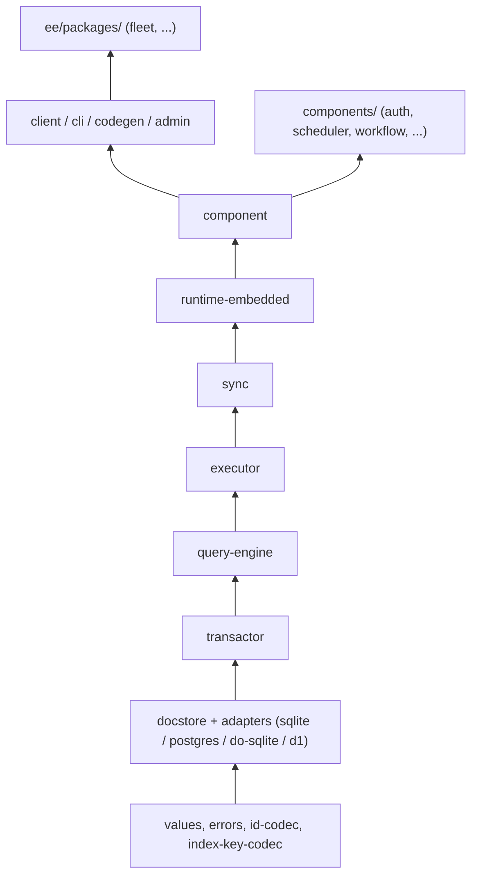
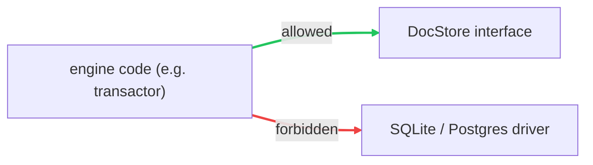

{/* diataxis: explanation */}

Concile happily lives in a single repository, and we set it up that way completely on purpose! It perfectly mirrors the core philosophy behind our reactive engine: we like to keep everything together in one place, but nicely broken down into manageable pieces.

You can think of this page as your very own personal map. It takes you on a tour of what is actually in the repo, explains exactly why things are organized the way they are, and introduces you to the one big rule that keeps our codebase from turning into a chaotic mess as it scales up.

If you are just about ready to open a pull request, please take a quick moment to read this over first. It will absolutely save you from accidentally importing the wrong thing and causing a headache later!

## The layout at a glance

You can think of the repository as four separate buckets, where each one has a specific job to do:

| Bucket | What lives there | How many | Opt-in? |
|---|---|---|---|
| `packages/` | The engine, the client SDK, and the CLI | 32 packages | No, this is the product |
| `components/` | Self-contained mini-backends (auth, scheduler, ...) | 6 packages | Yes, per project |
| `ee/packages/` | Paid, scale-out features under a separate license | 3 packages | Yes, and separately licensed |
| `apps/` + `examples/` | The dashboard app, and runnable sample apps | 1 app, 4 examples | n/a |

The `apps/dashboard` folder holds the live data browser, logs viewer, and function runner that you get out of the box whenever you run `concile dev` or `serve`. The `examples/` folder, which includes things like `chat`, `auth-demo`, `offline-demo`, and `optimistic-demo`, actually pulls double duty. These examples act as end-to-end integration tests that run against the real CLI. If there is ever a regression in how the different pieces are wired together, it will show up here, rather than just in the unit tests.

Here is the current rundown of the `packages/` list, neatly grouped by their role:

<Files>

<Folder name="packages" defaultOpen>

<Folder name="pure contracts" defaultOpen>

<File name="values" />

<File name="errors" />

<File name="id-codec" />

<File name="index-key-codec" />

</Folder>

<Folder name="storage seam + adapters" defaultOpen>

<File name="docstore" />

<File name="docstore-sqlite" />

<File name="docstore-postgres" />

<File name="docstore-do-sqlite" />

<File name="docstore-d1" />

<File name="objectstore" />

<File name="objectstore-fs" />

<File name="objectstore-s3" />

</Folder>

<Folder name="engine" defaultOpen>

<File name="transactor" />

<File name="query-engine" />

<File name="executor" />

<File name="sync" />

<File name="receipts" />

</Folder>

<Folder name="hosts + composition" defaultOpen>

<File name="runtime-embedded" />

<File name="runtime-cloudflare" />

<File name="component" />

</Folder>

<Folder name="file storage" defaultOpen>

<File name="storage" />

<File name="blobstore" />

<File name="blobstore-fs" />

<File name="blobstore-s3" />

<File name="blobstore-r2" />

</Folder>

<Folder name="the top" defaultOpen>

<File name="client" />

<File name="cli" />

<File name="codegen" />

<File name="admin" />

<File name="deploy" />

<File name="vite" />

<File name="test" />

</Folder>

</Folder>

</Files>

That brings us to 32 packages in total. We keep most of them intentionally small, usually just a few hundred lines each. This makes a package easy to read from start to finish, and it also simplifies our dependency rules, which we will cover in a bit.

<Callout title="A note if you've read the old design docs" type="warn">
You might come across an old internal design note (`docs/dev/architecture/foundation/monorepo-tooling-skeleton.md`) that mentions a single `@concile/contracts` package meant to hold all cross-package interfaces. **We actually never built that package.** The repository naturally evolved in a different direction as it grew. Here is what we shipped instead:

- The storage interface (`DocStore`) lives in **`packages/docstore`**, not `contracts`.
- The value, validator, and schema system (`Value`, `v`, `defineSchema`) lives in **`packages/values`**.
- The error hierarchy (`ConcileError`) lives in **`packages/errors`**.

So, if you are reading an older document that mentions `@concile/contracts`, just mentally swap it out for the actual names listed above. The core idea of having pure, dependency-free contracts at the bottom of the stack is still exactly what we shipped, they just live under different package names now.
</Callout>

## The mental model: layers, bottom to top

The most helpful thing to understand about this repository is that our packages are organized into **layers**. A layer is only allowed to depend on the layers below it, and never on the ones above it. Once you get the hang of these layers, you will often be able to guess exactly where a piece of code lives before you even open a file!

Starting from the bottom and working our way up:

1. **Pure contracts**: Things like `values`, `errors`, `id-codec`, and `index-key-codec`. These do not depend on anything else in the repo. They define the shared vocabulary that everyone else uses, such as what a `Value` is, what an `Id` looks like, and how errors are structured.
2. **The storage seam**: This includes `docstore` (the interface) along with its adapters like `docstore-sqlite`, `docstore-postgres`, `docstore-do-sqlite`, and `docstore-d1` (the actual implementations). This is the only place where we decide which database we are talking to. Keep an eye on `docstore-d1`, as it is a bit unique. It is our first *schema-ful* adapter, which means it lays documents out relationally with real columns per field and real `CREATE UNIQUE INDEX` statements on Cloudflare D1. The other three share a schemaless MVCC-log layout.
3. **`transactor`**: This is our single-writer transaction manager. It handles assigning commit order and running optimistic-concurrency retries.
4. **`query-engine`**: This handles executing queries, keeping track of what they read, and managing cursor pagination.
5. **`executor`**: This acts as the sandboxed runtime that actually calls your query, mutation, and action functions.
6. **`sync`**: This is our reactive tier. It holds onto live subscriptions, checks a commit's write set against them, and figures out who needs to receive an update.
7. **`runtime-embedded`** (and the newer **`runtime-cloudflare`**): This is a host that wires all the layers above it into a single running process, communicating over your choice of transport, whether that is loopback, WebSocket, or a Cloudflare Durable Object.
8. **`component`**: This composition layer allows optional features to easily plug into a running application.
9. **The top**: Finally, we have the `client` (our SDK and React hooks), `cli` (the `concile` command itself), `codegen` (which handles typed `Doc`, `Id`, and `api`), and `admin` (the API for our dashboard).

It is also worth noting that `components/` (like auth, scheduler, workflow) and `ee/packages/` (like fleet) both sit *above* this main stack. They are built using `component` and `executor`, but it never goes the other way around.



You definitely do not need to memorize this entire chain to be productive! However, whenever you catch yourself wondering where the code for a specific feature might live, simply asking yourself "what layer is this?" will usually lead you to the right answer.

## The golden rule: dependencies only point one way

The whole reason we have this layer system is to enforce one simple but powerful rule:

> **The engine imports interfaces. It never imports a specific database, host, or socket.**

In practical terms, this means that packages like `transactor`, `query-engine`, `executor`, and `sync` are perfectly fine to import the `docstore` interface. However, they are strictly forbidden from importing actual drivers like `docstore-sqlite` or `docstore-postgres` directly. Only a *leaf* package, like `runtime-embedded` that is actually responsible for wiring up a real app, gets to pick a concrete adapter.



*If an adapter somehow leaks, we treat that as a serious design bug. We rely on CI to catch it automatically, rather than just hoping it gets spotted during a code review.*

This matters a lot more than you might think. **Package boundaries are what define our tier-split points.** Do you want to run Concile on Postgres instead of SQLite? Great, that just means adding a new leaf package (`docstore-postgres`), not rewriting the `transactor`. Do you want to run on Cloudflare Durable Objects instead of an embedded process? That is another new leaf (`runtime-cloudflare`, `docstore-do-sqlite`), rather than a messy rewrite of the `query-engine`.

The beauty of this is that the engine never actually knows which database or host it is running on. Since it is structurally prevented from knowing this, the engine remains entirely portable. This core property holds true even if a contributor accidentally forgets the rule!

If you are curious about how this plays out across Tier 0 (our single binary approach) and beyond, check out [Architecture: runtimes](/docs/contributing/architecture/runtimes).

## A quick tour of our core packages

You definitely won't need to interact with all of these on your first day, but here is a handy cheat sheet for when you do need them:

| Package | What it's for |
|---|---|
| `values` | Our value system, including things like `Value`, `v` validators, and `defineSchema`/`defineTable` |
| `errors` | The `ConcileError` hierarchy, where every thrown error knows its own HTTP status |
| `id-codec` | Handles encoding and decoding document IDs, translating between `Id<"table">` and stored bytes |
| `index-key-codec` | Takes care of order-preserving key encoding, the interval-index matcher, and cursors |
| `docstore` | Our main storage seam, providing the `DocStore` interface that everything above relies on |
| `transactor` | The single-writer transaction manager that handles optimistic concurrency and commit order |
| `query-engine` | Manages query execution and cursor pagination |
| `executor` | The sandboxed runtime that actually calls your query, mutation, and action functions |
| `sync` | Our reactive tier, which also includes the WebSocket wire protocol |
| `runtime-embedded` | The Tier 0 host that wires the engine, adapter, and transport into one running process |
| `component` | Our composition layer, dealing with namespaced tables, the driver seam, and `concile.config.ts` wiring |
| `codegen` | Generates the typed `Doc`, `Id`, and `api` that your app code imports |
| `client` | The framework-agnostic client, which also includes our React hooks like `useQuery` and `useMutation` |
| `cli` | The `concile` command itself, handling `dev`, `serve`, `deploy`, `build`, and `codegen` |
| `deploy` | The pluggable `DeployTarget` seam, covering `serve`, `cloudflare`, and `docker`, which powers `concile deploy` |
| `blobstore` + `storage` | Our byte-storage seam and the always-on `ctx.storage` file API |
| `admin` | The API that our dashboard app uses to communicate |
| `receipts` | The server-side TTL reaper for our Receipted Outbox, which sweeps expired deduplication rows off the `DocStore` |

If you don't see a package name in this table, it is likely a leaf adapter like `docstore-postgres` or `blobstore-s3` whose job is pretty obvious from the name. Otherwise, it might be test-only scaffolding like `test`, or a tooling integration like our `@concile/vite` plugin that boots the concile dev backend right alongside a Vite dev server.

## Components: opt-in mini-backends

The `components/` directory is home to six packages: **auth**, **authz**, **scheduler**, **workflow**, **triggers**, and **notifications**. Each one of these is a completely self-contained feature, bringing its own tables, functions, and background tasks when needed. We don't turn any of them on by default. Instead, a project can opt into using one by composing it inside `concile.config.ts`. Behind the scenes, we build every single one of them the exact same way, sitting on top of the `component` package's composition seam and utilizing the `executor`'s function-calling machinery. We don't special-case anything about them in the engine.

If you are feeling adventurous and want to build your own, check out [Building a custom component](/docs/contributing/extending/custom-component). It walks you through all the different seams you get with `defineComponent`, such as `schema`, `context`, `modules`, `driver`, `boot`, and `httpRoutes`. These are the exact same tools that our built-in components use!

## The `ee/` directory: our reserved area for paid scaling

You will find three packages under `ee/packages/`: **fleet** (for distributed Tier 2 scale-out), **objectstore-substrate**, and **runtime-cloudflare-shard**. While the source code for these is available to look at, they fall under a **separate commercial license** that doesn't convert to Apache like the rest of the repository. We draw the line at gating scale rather than self-hosting. Single-node self-hosting is free and always will be, but the `ee/` code is what a paid license key unlocks to help you scale up. If you are curious, you can read the full story in [Licensing & the ee/ split](/docs/contributing/licensing).

## A quick look at our tooling

- **Bun workspaces**: We use Bun as both our package manager and our runtime. You will find the workspace globs for everything, including `packages/*`, `components/*`, `ee/packages/*`, `apps/*`, and `examples/*`, along with our benchmark folders, right in the root `package.json`. We also keep a shared dependency **catalog** there to pin versions for tools like `typescript` and `vitest`. This makes sure every package asks for the exact same version. For internal cross-package dependencies, we use `workspace:*` to guarantee they always resolve to your local source code rather than some published version.
- **Turborepo**: Our `turbo.json` file outlines our task graph, covering things like `build`, `test`, `typecheck`, `lint`, and `dev`. The `build` and `typecheck` tasks include a `"dependsOn": ["^build"]` declaration. The `^` symbol simply means "make sure to build my dependencies first." This neat little trick is what allows `bun run build` to automatically run every package in the correct order. On the other hand, tasks like `test` and `test:e2e` depend on `["build"]`, which refers to the package's *own* build. When combined with the `^build` rule on the build task itself, this guarantees that all of a package's dependencies are fully built before its tests ever run.
- **vitest, running under Node**: While Bun is our main runtime, we actually run our test suite under Node using vitest. This is an important detail to remember, because it means that if you write a test relying solely on a Bun-specific API, the standard `bun run test` won't catch it. Just keep that in mind if you are testing something specific to Bun!

<Callout title="Remember to rebuild after editing a dependency" type="warn">
Our cross-package tests import their dependencies from the built `dist/` output, rather than directly from `src/`. This means if you tweak something in `packages/values/src/...` and then immediately run tests for `packages/query-engine` without rebuilding, you will actually be testing against the *old* compiled version of `values`. Make sure to run `bun run build`, or `bun run --filter @concile/values build`, after making edits to a package that other tests rely on!
</Callout>

Here are some common commands you will likely use:

```bash
bun install                              # Bootstrap the entire workspace
bun run build                            # Build every package in the correct topological order
bun run test                             # Run all tests using vitest under Node
bun run typecheck                        # Run tsc --noEmit across all packages
bun run --filter @concile/values test  # Run tests for just one specific package
```

If you would like a complete walkthrough from cloning the repository to getting your tests running, head over to [Development setup](/docs/contributing/codebase/development). You can also dive into [System design](/docs/contributing/architecture/system-design) to learn more about why we shaped the engine this way to begin with.
