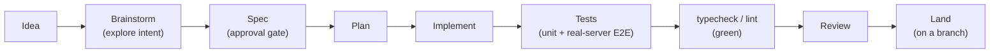
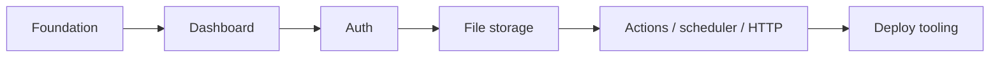
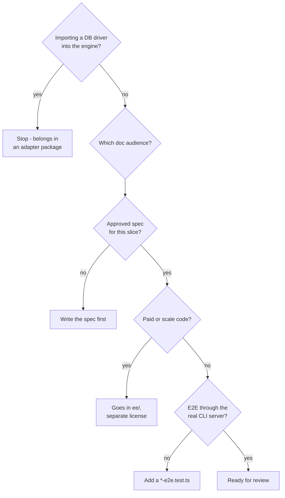

{/* diataxis: how-to */}

Welcome to our process guide! It covers how an idea goes from a simple thought to a shipped feature
in concile. If you're just curious about how our code is structured, you'll want to check out [The
codebase](/docs/contributing/codebase/monorepo) instead. Here, we're focusing on the workflow that
surrounds the code, rather than the code layout itself.

Here's the quick version. We care just as much about how we build things as we do about what we
actually build. Every major change follows a clear path: **brainstorm -> spec -> plan ->
implement**, in that exact order, before any code gets merged. This might feel a bit strict for an
open source project, but it's exactly what lets our small team maintain a system of this scale
(including things like session auth, durable workflows, a Postgres adapter, and a distributed fleet)
without the architecture turning into a mess. This guide walks you through our approach, the
conventions we use to review changes, and some essential legal details.

## The pipeline: from idea to landed change

Every major change travels through the same set of stages. The only rule you absolutely cannot break
is skipping straight from an idea to writing code.



Let us walk through each step:

<Steps>

<Step>

### Brainstorm

Before we design anything, it is best to talk through your goal and any constraints. You should
figure out what problem you are actually solving, who it is for, and what it deliberately does *not*
cover. This helps catch any misunderstandings before you spend time writing a design document.

</Step>

<Step>

### Spec: the approval gate

Every new slice of work gets a written design spec in the `docs/superpowers/specs/` folder **before
any code is written**. Your spec should lay out the problem, the design, and the trade-offs. It
needs to be **approved by a maintainer** (your human partner on the change) before you move forward.
You cannot just write it down and assume it is good to go. This is the one strict gate in our entire
pipeline. If there is no spec, there is no code.

</Step>

<Step>

### Plan

Once your spec is approved, it turns into a concrete implementation plan. These are the ordered
steps that a contributor (whether human or AI) will actually follow.

</Step>

<Step>

### Implement

Write your code based on the plan.

</Step>

<Step>

### Tests

Unit tests should cover the core mechanisms, and an end-to-end test must prove it works through the
real server. We will cover why that second part is strictly required a bit later.

</Step>

<Step>

### `typecheck` and `lint`, green

There are no exceptions here.

</Step>

<Step>

### Review

You will need a normal code review at the very least. For anything touching more than one package,
please add a **whole-branch review** before landing it. You can learn more in the [Review
discipline](#review-discipline) section.

</Step>

<Step>

### Land

For external contributions, the intended path is a pull request from your branch that gets merged
after review.

</Step>

</Steps>

If your change is just a small, obvious fix (like a typo or a one-line bug fix with an existing
test), you will not need a full spec. Just use your best judgment! But for anything that adds a
capability, changes a public API, or touches more than one package, you should definitely write a
spec first.

## Where does my change fit? The build-order rule

We do not build Concile feature by feature in a random order. Instead, we build it in **slices**.
Each slice is a complete, working vertical block. For example, we start with the foundation (the
reactive engine), followed by the dashboard, then auth, file storage, actions/scheduler/HTTP,
production deploy tooling, and so on. We deliberately save distributed multi-node scale-out for
last.



The golden rule that keeps this system honest is that **you do not start a later slice before the
earlier one runs end to end.** A half-working foundation with a half-working auth layer bolted on
top is much worse than a fully working foundation with no auth yet. If your contribution introduces
a genuinely new capability (rather than fixing or extending something that already ships), the first
question you should ask is: *which slice does this belong to, and has that slice's predecessor
actually shipped?* We recommend checking the project README's "What works today" status list before
proposing something that relies on a later-slice capability that does not exist yet (like building
on top of distributed Tier 2 scale-out, which is still on hold).

## Conventions your change is judged against

These are not just minor style nitpicks. They are the core things a reviewer will check before
anything else.

### DX is the feature

Things like the CLI's error messages, the quality of type inference in the client SDK, and how fast
`concile dev` starts up are not just extra polish on top of the "real" product. They actually are
the product. A change that adds a new capability but produces a confusing error message, worsens
type inference, or slows down the dev startup is not considered finished yet. Please weigh every
change against this standard before calling it done.

### The storage seam must stay pure

The reactive engine (which includes `packages/transactor`, `packages/query-engine`,
`packages/executor`, `packages/sync`, and friends) must never directly import a database driver, a
network socket, or any host-specific API. All of our persistence goes right through the narrow
`DocStore` interface in `packages/docstore`. The concrete databases live behind it in
`packages/docstore-sqlite` and `packages/docstore-postgres`. If you catch yourself importing `pg` or
`bun:sqlite` anywhere outside of an adapter package, consider it a design bug, not a shortcut. Check
out [Architecture: storage](/docs/contributing/architecture/storage) for the complete contract.

### Two doc audiences, never mixed

The `docs/enduser/` folder (along with this fumadocs site) holds our public, product-facing
documentation about how someone *uses* concile. On the other hand, `docs/dev/` and
`docs/superpowers/` are our internal engineering materials for architecture notes, specs, and plans.
When you are documenting a change, please write it for the specific audience it belongs to, and do
not mix them up.

### Canonical imports are `@concile/*`

Even though the concile runtime is Convex-shaped and there is a `concile migrate` on-ramp for Convex
users, `@concile/*` is our single documented, canonical import surface. The `convex/*` compatibility
is purely a migration convenience. You should never write new code or new docs against it.

Here is roughly what a reviewer checks, in order:



## Testing expectations before you land

Unit tests that check a mechanism in isolation are completely necessary, but they are **not
sufficient**. The absolute rule for anything that crosses package boundaries is that you must **prove
it end to end through the real `concile dev` or `concile serve` server**, not just with an isolated
mechanism test. These tests live in `packages/cli/test/*-e2e.test.ts`. We already have dozens of
them for things like auth flows, workflows, triggers, deploy, and storage. They are crucial because
they catch bugs that an isolated unit test structurally cannot see. For example, they will find if
two components wire together wrong, or if a feature works nicely against a mock but fails against
the real transport layer.

<Callout type="warn" title="Two easy-to-miss gotchas">

*   **Tests run under Node, via vitest**, even though our primary runtime is Bun. Please do not
    write a test that only works with Bun-specific globals. If you do, the suite will silently fail
    to catch what you think it catches.
*   **Cross-package tests resolve dependencies through each package's built `dist/`, not its
    `src/`.** If you edit a dependency's source code and forget to rebuild it, a test that imports
    that dependency will keep testing the old code. This is a very confusing way to fail! Always run
    `bun run build` (or the package's own build) before you trust a cross-package test result.

</Callout>

Before you consider your change ready to land, all of these should run green:

```bash
bun run test        # unit + mechanism tests (vitest, under Node)
bun run test:e2e     # end-to-end tests through the real CLI server
bun run typecheck    # tsc --noEmit across every package
bun run lint
```

## Review discipline

Beyond a normal code review, concile uses staged reviews at each pipeline step. You can expect a
plan review, an engineering review, a design review where relevant, and, most importantly, a **whole-branch
final review** before any multi-slice or multi-package change lands. This is not just ceremony.
Across many shipped slices, the whole-branch review has caught real blocker-class bugs that the
smaller, per-task reviews completely missed (like a security gap that only became visible once two
components were composed together). If your change touches more than one package, always run a
whole-branch review before asking for a merge. It has a proven track record of finding things that
are genuinely worth finding.

## Licensing: a CLA or DCO is required

The core of concile is licensed under **FSL-1.1-Apache-2.0**. This means it is free to use, modify,
and self-host, even commercially. However, you may not offer concile itself as a competing hosted
service. Each release converts to standard Apache 2.0 two years after it ships. You can find full
details on why we chose this, and on our free-forever guarantees, over on the [Licensing
page](/docs/contributing/licensing).

<Callout type="warn" title="A CLA or DCO will be required">

The project's policy is that a CLA or DCO is required on every contribution, right from the start.
This exists to preserve the project's ability to relicense or dual-license code later (for example,
to keep the `ee/` split perfectly clean). It is impossible to add retroactively, so it has to be in
place before a contribution lands, not requested afterward. The signing tooling itself is still
being set up in the repository, so until it lands, expect a maintainer to ask for a DCO-style
sign-off on your PR.

</Callout>

Related to this: any future paid, scale-tier code lives under a reserved `ee/` directory, under its
own **separate commercial license**. It is never put under the FSL core. The reverse direction
matters too, as existing FSL-licensed files are never retroactively relicensed. If you are not sure
whether something you are building belongs in the open core or in `ee/`, please ask before writing
code against the wrong license. The decision tree diagram above is a great reference for this!

## Practical hygiene

Here are a few basics that keep the project history clean and easy to pick back up:

*   **Branch off `main` and open a PR from your branch.** That is the intended process for external
    contributions. Please do not expect a direct push to `main` to be an option.
*   **Keep the spec (and any relevant internal notes) updated with what actually shipped.** A spec
    that describes a design that was later changed during implementation is worse than no spec at
    all. Please update it so it stays the reliable source of truth.
*   **Follow the project's commit and PR conventions.** This means writing a clear commit message,
    including a co-author trailer when a change was produced with AI assistance, and writing a PR
    body that states what changed and why, rather than just listing which files moved.

## Where to go next

*   [The codebase](/docs/contributing/codebase/monorepo): how the monorepo is laid out and how to
    build and run it locally.
*   [Architecture: system design](/docs/contributing/architecture/system-design): the reactive
    engine's design, for anyone about to touch it.
*   [Extending concile](/docs/contributing/extending/custom-component): building a new component,
    storage adapter, or provider.
*   [Licensing](/docs/contributing/licensing): the full story on FSL-1.1-Apache-2.0 and `ee/`.
