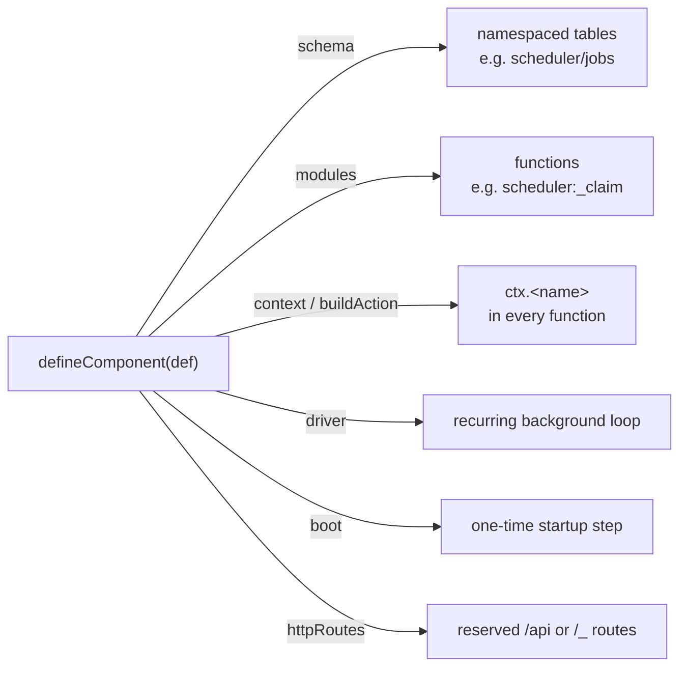
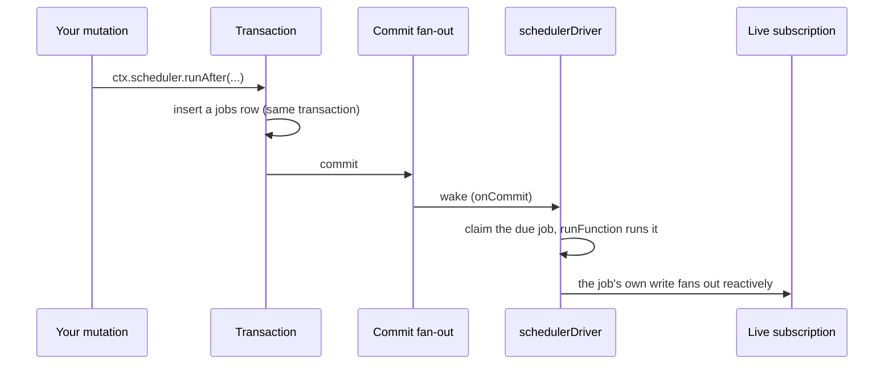
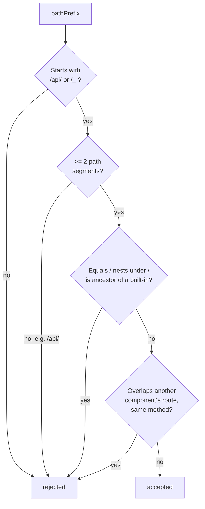
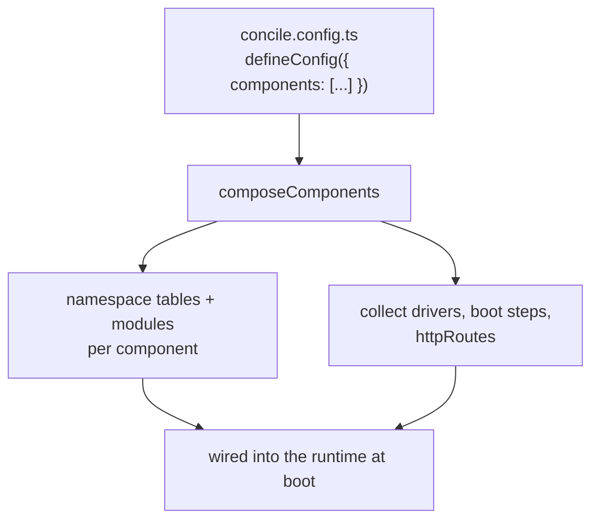

{/* diataxis: how-to */}

Hey there, and welcome to our guide on building your own component! Think of a component as a handy
reusable package, sort of like `@concile/scheduler` or `@concile/auth`, that you can easily plug
right into your project's `concile.config.ts` file. We will assume you already have a good grasp of
the basic concepts behind components, so we can focus straight on the hands-on steps of creating one
yourself.

<Callout type="info" title="New to components?">

If you are just getting started, it is probably a good idea to check out the
[Components](/docs/components/overview) overview first. Once you are comfortable with the basics,
come right back here!

</Callout>

## What exactly is a component?

You can think of a component as a self-contained mini-backend that seamlessly plugs directly into
the engine. It can include several useful pieces:

- It can have its own database tables. These are neatly namespaced so they will never accidentally
  collide with your app's tables or those from other components.
- It brings along its own queries, mutations, and action functions.
- You can provide an optional `ctx.<name>` object that any function in your project can call. We
  usually refer to this as a "facade".
- It can include a background loop that hums along even when no one is making requests.
- You can define an optional one-time startup step for initialization.
- It can even expose optional HTTP routes at specific reserved paths.

The great thing is that every piece is completely optional except for a name, a schema, and a set of
functions. Your component might be as simple as a couple of tables and a background loop like
`@concile/triggers`, or it could be a full-featured powerhouse with a facade, action-mode support,
HTTP routes, and a boot step like `@concile/auth`. The six components we ship today (scheduler,
triggers, auth, authz, workflow, and notifications) do not get any special treatment from the
engine. We built them using the exact same APIs described on this page, which makes them fantastic
reference material when you are building your own.

Keep in mind that components are strictly opt-in for each project. A component will not do anything
until a project explicitly lists it in its `concile.config.ts` file. We do not automatically install
anything, and you do not have to modify the core engine at all to introduce a new component to the
ecosystem.

## The entry point: `defineComponent`

To get started, your component package needs to export a single factory function. This could be
something like `defineScheduler()`, `defineAuth(opts)`, or perhaps `defineMyThing(opts)` for your
own creation. This function simply builds a plain object and passes it along to `defineComponent`:

```ts title="packages/component/src/define-component.ts (shape)"
function defineComponent(def: ComponentDefinition): ComponentDefinition
```

You might be surprised to hear that `defineComponent` does not actually do anything overly clever.
It just validates your definition object and returns it right back to you. At this stage, nothing is
running yet since the object is just plain data. However, the validation it performs is incredibly
helpful because it specifically targets common pitfalls that are notoriously frustrating to debug
later on:

- **Name rules.** Your `def.name` has to be non-empty and match `^[a-zA-Z][a-zA-Z0-9_]*$`. It must
  start with a letter, then it can use letters, digits, and underscores. We strictly forbid
  characters like slashes or colons because the system uses those as namespace separators during the
  compose step. Also, you cannot name your component `"app"` since we reserve that for your project
  code, and it cannot start with an underscore because that indicates internal paths.
- **`contextType` needs `context`.** If you declare a TypeScript type for your facade but forget to
  provide the actual function that builds it, the system will reject it. Having a typed facade that
  turns out to be undefined is definitely a recipe for a bad time.
- **HTTP route sanity.** We check every entry in your `def.httpRoutes` against a handy guard called
  `assertValidComponentRoutePrefix` which we will talk about more in the
  [`httpRoutes`](#seam-6-httproutes-reserved-endpoints) section below. Plus, we make sure that each
  route's handler points to a real `httpAction` in your modules.

As long as your factory function calls `defineComponent` without throwing any errors, you can rest
assured that your component is structurally sound! Now, let us explore exactly what you can put into
each of these fields.

### A quick look at the overall shape



Think of each arrow in that diagram as a separate and independent piece of the puzzle. Your
component might use just one, a combination of a few, or in rare cases, all of them. In the
following sections, we will walk through each of these pieces in the order you will most likely need
them.

## Seam 1: Creating your own namespaced tables with `schema`

**When to use this:** You will want to reach for this anytime your component needs to store data,
which happens in almost every case.

```ts
interface ComponentDefinition {
  schema: SchemaDefinition;
  // ...
}
```

What you see here is just a standard `SchemaDefinition`. You define it exactly like you would define
tables in your application's `schema.ts` file. If you need a refresher, feel free to check out our
[Schema & tables](/docs/core-concepts/schema-and-tables) guide. The cool part happens when
everything comes together at compose time. The system automatically namespaces every table you
declare using your component's name. So, if your component is called `"widget"` and you define a
table named `items`, the actual table created in the database will be named `widget/items`. This
completely eliminates the worry that your tables might accidentally clash with the app's own tables
or those from another component.

Behind the scenes, a helpful utility called `composeTables` carefully allocates table numbers just
once based on the order components are composed. If you ever accidentally declare the exact same
full table name twice, the system will catch it as a helpful error at compose time rather than
quietly overwriting your data.

## Seam 2: Adding functionality with `modules`

**When to use this:** Always! Every single component you build will include at least one function,
whether it gets called by the application code, your own background driver, or your facade.

```ts
interface ComponentDefinition {
  modules: Record<string, RegisteredFunction>;
  // ...
}
```

The `modules` field simply holds a collection of your query, mutation, action, and httpAction
functions, much like the functions you would register in your app. The neat trick here is that they
get namespaced using a colon instead of a slash. For instance, if you have a `tick` mutation inside
a component named `scheduler`, you can reach it at the path `scheduler:tick`.

We like to stick to a simple naming convention for our built-in components. If a function is
strictly an internal implementation detail that only your driver or facade should touch, just prefix
its name with an underscore. You do not want applications or clients calling those directly. For
example, the dispatch loop inside `@concile/scheduler` sequentially calls three internal mutations
named `_peekDue`, `_claim`, and `_complete`. Application code is never supposed to call them. They
exist solely to give the background driver something concrete to execute.

## Seam 3: Creating a friendly facade with `context` and `buildAction`

**When to use this:** You will want this when you want application code to interact with your
component in a smooth and ergonomic way. Calling something like `ctx.widget.doThing(...)` feels much
nicer than manually invoking raw module paths.

This specific feature is what magically places `ctx.scheduler`, `ctx.auth`, or your shiny new
`ctx.widget` right into the context of every single query, mutation, and action across the entire
project.

```ts
interface ComponentDefinition {
  context?: (cctx: ComponentContext) => object;
  contextType?: { import: string; type: string };
  contextWrite?: boolean;
  buildAction?: (api: ActionApi) => object;
  serverExports?: string[];
}
```

The `context` property expects a function that takes a `ComponentContext` object. This context
provides a special namespaced view of the current transaction, giving you access to your own tables,
a fixed `now()` timestamp, and a helpful `functionKind` resolver. Your function just needs to return
a plain object that will become available as `ctx.<name>`. Inside the methods of that object, you
can easily read data using `cctx.db`. It works exactly like the `ctx.db` you already know from
writing queries and mutations, but it is nicely scoped to only see your component's tables.

```ts title="packages/executor/src/executor.ts (shape)"
interface ComponentContext {
  readonly db: GuestDatabaseReader;
  readonly identity: string | null;
  readonly now: number; // fixed per OCC attempt, never wall-clock
  readonly components: Record<string, unknown>; // facades built before this one
}
```

By design, `cctx.db` is completely read-only by default, even if you are inside a mutation. This
makes a lot of sense because most facades, like the permission checks in `@concile/authz`, only ever
need to read data. However, if your facade actually needs to write data like inserting a new job or
recording a user session, you can easily enable this by setting `contextWrite: true` in your
component definition. Once you flip that switch, `cctx.db` becomes fully writable during any
mutation call. Of course, it remains safely read-only during queries since queries are never
supposed to write data anyway.

<Callout type="info" title="A facade write runs inside the calling transaction">

This is probably the single most crucial concept to understand if your facade is doing any real
heavy lifting. Whenever your facade performs a write operation, that write happens directly inside
the calling mutation's transaction. This means it will either successfully commit or completely roll
back right alongside everything else in that mutation. Once the transaction commits, your write
smoothly fans out to any active subscriptions just like any standard database write. You do not have
to jump through any extra hoops to make sure the side effects of `ctx.scheduler.runAfter(...)` show
up live in a user's subscribed query!

</Callout>

We also have `contextType` and `serverExports`, but keep in mind that these are purely for code
generation and do not affect how your component runs at runtime.

- The `contextType` field tells our code generator exactly which package and type name to import so
  it can correctly type `ctx.<name>` in your generated `_generated/server.ts` file. Remember that
  `defineComponent` will reject your setup if you provide a `contextType` without actually providing
  a `context` function. The two simply must travel together.
- The `serverExports` field is super handy! It lets you re-export a helper function right alongside
  your standard queries, mutations, and actions from `_generated/server.ts`. For instance, the
  scheduler component uses `serverExports: ["cronJobs"]` so that an app can easily write `import {
  cronJobs } from "./_generated/server"` without needing a separate import statement for the
  scheduler package.

### Actions need a second implementation: `buildAction`

Since actions run completely outside of any transaction, you will not have access to `ctx.db` inside
them. If you want your friendly `ctx.widget` to work smoothly from within an action, you will need
to provide a second builder function. This new builder must return an object with the exact same
method signatures as the one you created in your `context` function. However, instead of touching a
transaction directly, you will implement these methods by calling your component's internal
mutations using `api.runMutation` or `api.runQuery`.

```ts
buildAction?: (api: ActionApi) => object;
```

The `ActionApi` object closely mirrors an action's standard context. It provides `runQuery`,
`runMutation`, and `runAction` which each fire off a brand new, independent top-level call, along
with the ambient user identity. As you might expect, it intentionally leaves out the database object
entirely.

```ts title="packages/executor/src/executor.ts (shape)"
interface ActionApi {
  runQuery<T>(ref: FunctionReference | string, args?: Record<string, unknown>): Promise<T>;
  runMutation<T>(ref: FunctionReference | string, args?: Record<string, unknown>): Promise<T>;
  runAction<T>(ref: FunctionReference | string, args?: Record<string, unknown>): Promise<T>;
  identity: string | null;
}
```

This is the precise pattern that we use for the action contexts in both the scheduler and workflow
components. The action-mode facade simply delegates the hard work to an internal mutation that runs
safely inside its own fresh transaction. The payoff for doing this is huge! Your users can write
`ctx.scheduler.runAfter(...)` and it will look and work identically whether they are calling it from
a mutation or an action, even though there are actually two completely different objects sitting
behind the scenes.

## Seam 4: Running background tasks with `driver`

**When to use this:** Reach for a driver when your component needs to handle tasks that are not
triggered by a specific user request. Good examples include processing due jobs, retrying failed
operations, or sweeping the database for stuck items.

You will find that most of the really interesting components need to perform some kind of background
work. Whether it is running a scheduled job, retrying a failed delivery, or cleaning up messy data,
the `driver` is your best friend for these scenarios.

```ts
interface Driver {
  name: string;
  start(ctx: DriverContext): void | Promise<void>;
  stop?(): void | Promise<void>;
}
```

The `start` method is called exactly once right after the project boots up. The `DriverContext` it
receives is essentially a toolbox filled with everything your driver needs to get work done outside
of standard requests. Let us unpack what is inside:

- **`onCommit(cb)`**: This wonderful callback fires every single time a commit happens anywhere in
  your running project. It even hands you a list of the tables and ranges that were touched. This is
  the secret sauce that allows your driver to react to new writes instantly without ever needing to
  poll the database. Typically, a driver will filter this list just to see if the commit touched any
  of its own tables.
- **`setTimer(atMs, cb)` and `clearTimer(handle)`**: Use these to schedule a wake up call at an
  exact, absolute wall-clock time rather than a relative delay. Using absolute times helps avoid
  nasty clock-skew bugs if the system restarts. Under the hood, all of your driver's timers cleverly
  collapse down to a single pending alarm, which makes things incredibly efficient for the host
  system.
- **`runFunction(path, args)`**: This lets you run any of your registered functions with full
  privileges and entirely outside of a client request. This is the primary way your driver will
  actually dispatch real work.
- **`readLog({ afterTs, tables?, limit? })`**: This handy function reads committed changes straight
  from the underlying change log after a specific timestamp. If you want to build a component that
  reacts to every insert, update, or delete on a table, this is exactly what you need. It returns a
  batch of changes, and each change looks a bit like this:

  ```ts title="packages/component/src/define-component.ts (shape)"
  interface LogChange {
    table: string;                            // e.g. "messages"
    id: string;
    op: "insert" | "update" | "delete";
    newDoc: JSONValue | null;                  // null for a delete
    oldDoc: JSONValue | null;                  // null for an insert
    ts: number;                                // commit timestamp of this revision
    changeId: string;                          // "<table>:<id>:<ts>", stable across redelivery
  }
  ```
- **`now()` and `backstopMs(defaultMs)`**: These provide access to the driver's clock and a special
  hook. You can use the hook to tell the system that a particular timer is just a fallback polling
  mechanism rather than actual critical work. A long-running server will usually leave this
  unchanged, but a serverless host might stretch the interval out to save on expensive cold starts.

### Let us walk through the scheduler end to end

The absolute best way to see why the driver seam is so powerful is to follow a simple
`ctx.scheduler.runAfter(...)` call all the way through its lifecycle. Check out this sequence:



As you can see, the initial insert that `ctx.scheduler.runAfter` performs happens entirely inside
your mutation's transaction. This is the magic of the `contextWrite: true` setting we discussed
earlier! Once that transaction successfully commits, the commit fan-out instantly wakes up the
scheduler's driver because the driver is carefully watching for any writes to its `scheduler/*`
tables. The driver quickly claims the job that is now due and uses `runFunction` to execute
whichever function you scheduled. That scheduled function runs as an ordinary mutation, meaning its
own writes commit in a fresh transaction and fan out to update live subscriptions just like normal.

Notice how there is absolutely no polling loop constantly scanning a `jobs` table in the background.
The entire process is wonderfully event-driven. The driver either wakes up immediately because of a
new commit, or it sleeps peacefully until a precise wall-clock timer fires for the next due job.

### Keeping it simple with `@concile/triggers`

It is worth noting that not every driver needs a complex writable facade. For example,
`@concile/triggers` does not expose a `context` object at all! You simply configure it declaratively
in your `concile.config.ts` file. Its driver acts as a simple cursor that walks forward through the
database change log using `readLog`. It grabs batches of changes and passes them to your handler
function, and once your handler succeeds, it just advances the cursor. It serves as a fantastic
secondary reference alongside the scheduler. It uses the same driver seam, but skips the facade and
HTTP routes entirely, proving that you certainly do not need to use every feature to build an
incredibly useful component.

## Seam 5: Running one-time startup work with `boot`

**When to use this:** You will love this feature when you need to take configuration declared in
code and reconcile it into your database tables. This runs exactly once every time the process
starts, before the system serves any user requests.

```ts
boot?: (ctx: BootContext) => Promise<void>;
```

The `boot` function executes just once per process start. It runs before your driver gets started
and before the project begins handling user requests. The `BootContext` hands you a scoped database
writer and a clock, allowing you to perform a special boot-time transaction. This is the perfect
place to sync up your configuration with your database tables. For instance, the scheduler component
uses `boot` to read an application's declared cron jobs and safely write matching rows into its own
`crons` table. This clever trick gives the background driver concrete database rows to work with,
which is vastly more efficient than repeatedly parsing a configuration file on every single tick.

## Seam 6: Exposing reserved endpoints with `httpRoutes`

**When to use this:** This is exactly what you need when the outside world has to communicate with
your component directly. Common use cases include handling OAuth callbacks or receiving webhooks
from an external delivery provider.

```ts
interface ComponentHttpRoute {
  method: string;
  pathPrefix: string;
  handler: string; // a bare httpAction name in this component's own `modules`
}
```

When your component requires a raw HTTP endpoint, you can declare it right here instead of forcing
app authors to manually wire it up in their own `http.ts` files. You just need to provide a
`handler` that names a specific `httpAction` located inside your component's modules. If you need a
quick refresher on how HTTP actions work, check out our [Actions](/docs/core-concepts/actions)
guide.

We enforce three simple rules to prevent things from getting messy. We check these rules when
`defineComponent` builds your definition, and we double-check them again at compose time just to be
safe!

1. **Must live under a reserved namespace.** Your `pathPrefix` absolutely must start with either
   `/api/` or `/_`. We do this because your users' own HTTP routes take up everything else, so this
   rule guarantees your component will never accidentally hijack an app route.
2. **Must have at least two path segments.** Something like `/api/widget/` is perfect. However, just
   `/api/` or `/_` alone will be rejected outright. We do not want a careless component accidentally
   taking over an entire reserved namespace!
3. **Must not collide with built-in routes.** We carefully check that your prefix does not collide
   with our core engine routes like `/api/run`, `/api/health`, `/api/sync`, `/api/storage/`,
   `/_admin/`, `/_fleet/`, or `/_dashboard`. Your prefix cannot equal, sit under, or be a parent of
   any of these reserved paths.

Furthermore, during the compose step, the system will loudly complain if two different components
try to register routes for the same HTTP method with overlapping prefixes. This ensures that the
winning route is never left to a silent and confusing declaration-order accident.



Just to give you a concrete example, a path like `/api/widget/` works perfectly because it has two
segments and avoids all built-in paths. On the other hand, trying to use just `/api/` fails the
second rule, and trying to use `/api/storage/extra` fails the third rule because it tries to nest
under the reserved `/api/storage/` prefix.

## The lighter, optional seams

There are a few more small fields that round out the `ComponentDefinition` object. While they are
smaller than the six main seams we just covered, they are still quite useful:

<TypeTable
  type={{
    requires: {
      type: 'string[]',
      description: 'Names other components yours needs composed alongside it. @concile/workflow declares requires: ["scheduler"] because it dispatches its steps through the scheduler\'s job queue. The composing project gets a clear compose-time error (component "widget" requires "scheduler", which is not enabled) instead of a confusing runtime failure the first time your facade is touched.',
    },
    config: {
      type: 'Validator<unknown>',
      description: 'A validator for whatever options your defineWidget(opts) factory accepts, if you want them validated the same way document fields are.',
    },
    grants: {
      type: 'Record<string, { read?: string[]; write?: string[] }>',
      description: 'Declares what your component touches on other tables, for tooling and introspection purposes.',
    },
    policies: {
      type: '(paired with policyContext)',
      description: 'How a component like @concile/authz attaches row-level read/write rules to an app\'s own tables, and contributes fields (like the caller\'s identity) into every policy\'s evaluation context. Most components never touch this pair at all.',
    },
  }} />

## Let us look at a full example: `@concile/scheduler`

To tie everything together, here is a look at every seam wired up at once. We pulled this directly
from `defineScheduler()` inside `components/scheduler/src/index.ts`:

```ts title="components/scheduler/src/index.ts (trimmed)"
export function defineScheduler(opts?: { crons?: CronJobs }): ComponentDefinition {
  return defineComponent({
    name: "scheduler",
    schema: schedulerSchema,                              // seam 1
    modules: { _peekDue, _claim, _complete, _reclaim, _cronTick, _enqueue, _cancel }, // seam 2
    context: (cctx) => schedulerContext(cctx),             // seam 3
    contextType: { import: "@concile/scheduler", type: "SchedulerContext" },
    serverExports: ["cronJobs"],
    contextWrite: true,                                    // seam 3, writable
    driver: schedulerDriver(),                              // seam 4
    boot: (ctx) => reconcileCrons(ctx, opts?.crons),        // seam 5
    buildAction: (api) => schedulerActionContext(api),      // seam 3, action-mode twin
  });
}
```

If you read straight down that object, you can see the entire component coming to life! It defines
tables that will automatically get namespaced under `scheduler/`, a handful of internal mutations
that only the background driver will touch, and a super friendly writable `ctx.scheduler` facade. It
also includes a driver that instantly reacts to database commits and wall-clock timers, a helpful
boot step to reconcile cron schedules, and an action-mode twin to ensure the facade behaves
perfectly whether you are inside a mutation or an action.

If you ever need a great template for the transactional write pattern we discussed in seam 3, the
scheduler's facade file is an excellent place to look. You will see that the `runAfter` method
elegantly boils down to a single database insert:

```ts title="components/scheduler/src/facade.ts (shape)"
async runAfter(delayMs, fnRef, args) {
  return enqueueInternal(db, now, FACADE_TABLES, fnRef, args, {
    runAt: now() + Math.max(0, delayMs),
  }, kindOf);
}
```

You can see that `enqueueInternal` simply executes a `db.insert` into the namespaced tables. It
really is that straightforward! Everything that happens after the row is inserted, like the driver
waking up, claiming the job, running the function, and fanning out the results, is handled perfectly
by the sequence we mapped out in the driver section above.

## Composing your shiny new component into a project

Once you have written your `defineWidget(opts)` factory function, a project can use it exactly the
same way it would use a built-in component. All you have to do is list it in your
`concile.config.ts` file:

```ts title="concile.config.ts"
import { defineConfig } from "@concile/component";
import { defineScheduler } from "@concile/scheduler";
import { defineWidget } from "@my-org/concile-widget";

export default defineConfig({
  components: [defineScheduler(), defineWidget({ /* your options */ })],
});
```

This mirrors how we do things in our own demo projects, where we seamlessly compose multiple
components together to build a powerful backend.



When the system boots up, the CLI steps in and runs `composeComponents` just once. It diligently
namespaces every component's tables and modules, sorts the components based on their requirements,
and gathers every driver, boot step, and HTTP route into flat lists for the runtime to wire up.

It is important to remember that this composed set is completely locked in at boot time. If you add
or remove a component in your configuration file, you will need to restart the server or run a fresh
build. We do not support live activation for components. We intentionally designed it this way to
create a stricter boundary, which is quite different from how you can instantly hot-swap your
application's own functions during a deployment. Feel free to check out our [Deploy &
build](/docs/deploy/deploy-and-build) guide to learn more about how we draw those boundaries.

## Checklist for building your own

<Steps>

<Step>

### Pick a name

Letters, digits, and underscores only. Not `"app"`, not `_`-prefixed.

</Step>

<Step>

### Declare your schema

Your tables will be namespaced under `<name>/` automatically.

</Step>

<Step>

### Write your modules

Prefix anything internal-only with `_`.

</Step>

<Step>

### Add a facade, if you need one

If you want `ctx.<name>`, write `context` (and `contextType` for codegen). Set `contextWrite: true`
if it needs to write. Add `buildAction` if it should also work from actions.

</Step>

<Step>

### Add background work, if you need it

Write a `driver`: react to `onCommit`, arm `setTimer` for time-based work, or walk `readLog` for a
change-feed style component.

</Step>

<Step>

### Add startup reconciliation, if you need it

Write `boot`.

</Step>

<Step>

### Add a raw endpoint, if you need one

Add an entry to `httpRoutes` under a `/api/<name>/` prefix.

</Step>

<Step>

### Wrap it and export it

Wrap it all in `defineComponent({...})` inside your own `defineWidget(opts)` factory, and export
that factory as your package's public API.

</Step>

</Steps>

## Where should you go from here?

- [Components](/docs/components/overview): Revisit the conceptual overview, dive into the
  composition rules, and browse the full list of components we ship today.
- [Reactivity & sync](/docs/contributing/architecture/reactivity): Discover the magic of how a
  committed write actually finds and updates a live subscription, which is exactly what makes a
  facade's write seamlessly responsive.
- [Custom storage adapter](/docs/contributing/extending/storage-adapter): Explore the other major
  extension point to learn how you can back the engine with an entirely different database.
- [Scheduling](/docs/components/scheduling) and [Triggers](/docs/components/triggers): Take a deep
  dive into the two components we frequently referenced on this page by checking out their dedicated
  product documentation.
