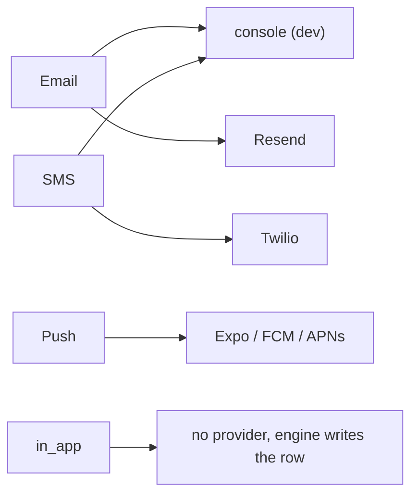
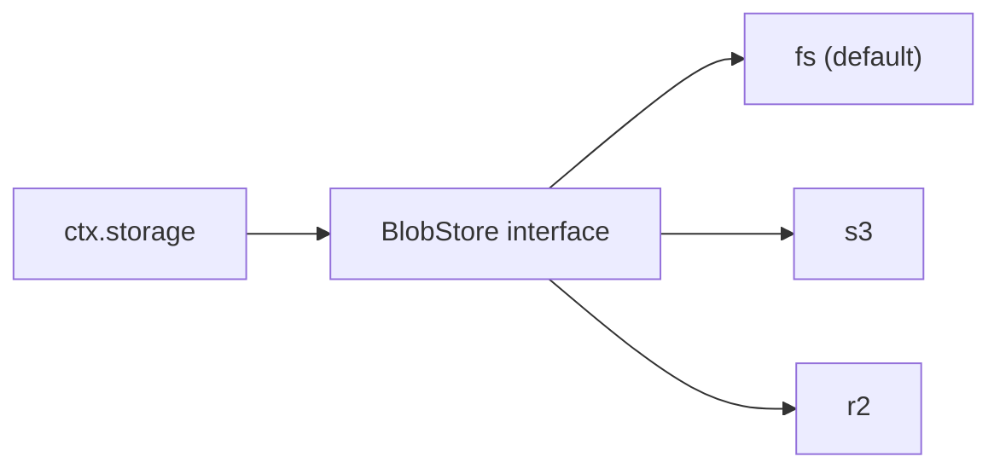
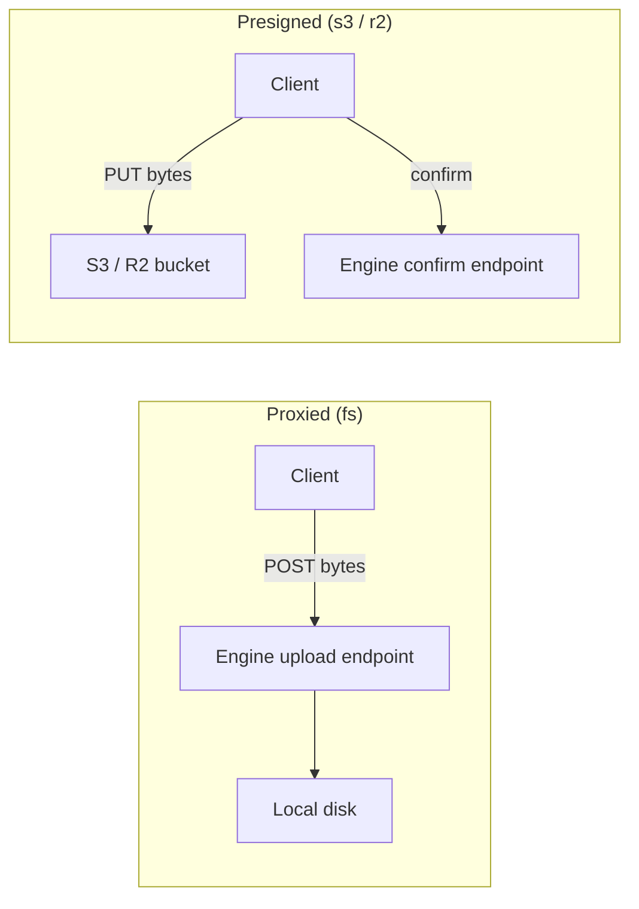

{/* diataxis: how-to */}

## The core idea

Sometimes your components need to talk to the outside world. This could mean sending an email, texting a phone, verifying a Google login, or storing a user's uploaded file. Instead of hard-coding a specific vendor's SDK right into the engine, we use something we call a **provider interface**. This setup lets you plug in whichever implementation you like best. The vendor's SDK stays completely separate from our core code, living happily in a small "leaf" module that you can either write yourself or just grab off the shelf.

You might actually recognize this concept if you've read the [Custom storage adapter](/docs/contributing/extending/storage-adapter) guide for databases. It's the exact same principle, just applied to emails, SMS, push notifications, OAuth logins, and file bytes instead of database rows. Once you grasp the basics here, you'll see how this pattern works everywhere: **you get a strongly typed interface, you use standard errors for failures, and you just pick your vendor in the configuration files.** The engine itself never actually imports the vendor code.

By the end of this page you'll be able to:

- Write a custom email/SMS/push provider for `@concile/notifications`
- Add a new OAuth provider to `@concile/auth`
- Write a custom `BlobStore` for file storage

## Notifications: one interface per channel

The `@concile/notifications` package organizes message delivery into **channels** like `email`, `sms`, `push`, and `in_app`. Think of a channel as the *type of message* you are sending, while a **provider** is the service that *actually delivers it*. For instance, Resend and a simple `console.log` both act as email providers. Twilio handles SMS, while Expo, FCM, and APNs take care of push notifications. The `in_app` channel is a bit unique because it doesn't need an external vendor. The engine simply adds a new row directly into the user's inbox table.



Source: `components/notifications/src/provider.ts`.

Every provider is just a simple object. There are no complicated base classes to inherit from, and you won't see any vendor specific types leaking into the signatures:

```ts
export interface EmailProvider {
  channel: "email";
  send(m: EmailMessage): Promise<SendResult>;
  webhook?: ProviderWebhook; // optional: handle delivery-status callbacks
  name?: string;
}

export interface SmsProvider {
  channel: "sms";
  send(m: SmsMessage): Promise<SendResult>;
  webhook?: ProviderWebhook;
  name?: string;
}

export interface PushProvider {
  channel: "push";
  send(m: PushMessage): Promise<PushSendResult>; // no webhook: invalid tokens come back synchronously
}

export interface PushSendResult extends SendResult {
  invalidTokens?: string[]; // dead device tokens to stop sending to, gathered before any throw
}
```

As you can see, `SendResult` is just `{ providerMessageId?: string }`. It gives you an optional ID that comes in handy later if you need to match up delivery status webhooks. `PushSendResult` includes an extra `invalidTokens` array. This allows the provider to let the system know about dead device tokens so we can stop sending messages to them, all in a single response.

### How a provider handles success and failure

You won't need to check any tricky status codes here. We use standard error throwing to signal what happened:

- The `send` function **returns** a `SendResult` when everything goes smoothly.
- The `send` function **throws** an error if something goes wrong. If it throws a standard `Error` (or a `NotificationSendError` without extra options), we treat it as **retryable**. Our built-in retry system will wait a bit and try sending it again.
- If you throw `new NotificationSendError(message, { retryable: false })`, we consider the failure to be **permanent**. A common example is a "bad recipient" response from an API. When this happens, the system immediately dead-letters the message so it doesn't waste time retrying a request that is doomed to fail.

```ts
// permanent failure: the vendor returned a 4xx "bad recipient" response
throw new NotificationSendError("recipient rejected", { retryable: false });
```

That covers the entire process for signaling failures. You don't have to manage retry queues, calculate backoff schedules, or interact with the dead-letter table directly. Just throwing the right type of error takes care of all that. The adapters we include, like `resendEmail` and `twilioSms`, both agree on how to categorize errors. They treat `5xx` server errors and `429` rate limit errors as retryable, while treating everything else as a permanent failure.

If your provider supports delivery status webhooks for tracking things like bounces, opens, or clicks, you can easily implement the optional `webhook` field:

```ts
export interface ProviderWebhook {
  // MUST return false on a missing/invalid signature: the HTTP route 401s before any write happens.
  verify(args: WebhookVerifyArgs): boolean | Promise<boolean>;
  // Maps the vendor's payload to normalized events. Throw on a malformed body → the route answers 400.
  parse(rawBody: string): WebhookEvent[];
}
```

<Callout type="warn" title="Verify is a crucial security boundary">

Please treat the `verify` function as a strict security requirement. For example, our `resendEmail` adapter validates a Svix HMAC signature using a constant-time comparison and checks for a 5-minute timestamp skew before allowing any webhook event to trigger a write operation. We highly recommend copying this approach to keep your application secure.

</Callout>

### Writing a minimal custom email provider

Creating a provider is as easy as writing a function that returns an object matching our interface. You don't need to register it anywhere else. The object itself acts as your plugin.

```ts
import type { EmailProvider } from "@concile/notifications";

export function myEmailProvider(apiKey: string): EmailProvider {
  return {
    channel: "email",
    async send(m) {
      const res = await fetch("https://my-email-vendor.example/send", {
        method: "POST",
        headers: { authorization: `Bearer ${apiKey}` },
        body: JSON.stringify({ to: m.to, from: m.from, subject: m.subject, text: m.text }),
      });
      if (!res.ok) throw new Error(`send failed: ${res.status}`); // retryable by default
      const json = await res.json();
      return { providerMessageId: json.id };
    },
  };
}
```

### Using a provider in your components

We set up providers during configuration rather than importing them deeply within the engine code:

```ts title="concile.config.ts"
import { defineNotifications, twilioSms } from "@concile/notifications";
import { myEmailProvider } from "./my-email-provider";

defineNotifications({
  channels: {
    email: { provider: myEmailProvider(process.env.MY_VENDOR_KEY!), from: "no-reply@app.test" },
    sms: { provider: twilioSms({ accountSid: "...", authToken: "..." }), from: "+15551234567" },
  },
});
```

After that, the component calls `provider.send(...)` when it needs to deliver a message. The retry driver then looks at what your function returned or threw to figure out the next steps. You never have to modify the core notifications component to add a new vendor. Take a look at our reference adapters to see the full pattern in action. They include helpful examples for handling things like chunking, caching authentication tokens, and passing along idempotency keys if your vendor supports them:

- `provider-console.ts`: zero-config dev default, logs to stdout
- `provider-resend.ts`: email, plus a signed webhook
- `provider-twilio.ts`: SMS/WhatsApp, plus a signed webhook
- `provider-expo.ts` / `provider-fcm.ts` / `provider-apns.ts`: push, one adapter per platform

You can find all of these inside the `components/notifications/src/` folder. If you want to dive deeper into how channels, user preferences, topics, and the reactive inbox work, check out the [Notifications](/docs/components/notifications) documentation.

## Authentication: using the email interface, OAuth, and third-party JWTs

The `@concile/auth` package also relies on external systems. It needs to send out emails for one-time passwords, magic links, and account verifications. It also has to verify identities with outside providers, like confirming a Google account really belongs to a user. Both of these tasks use the provider pattern we discussed, and you can find their implementations in `components/auth/src`.

### Email: a familiar shape

The authentication module has its own `EmailProvider` located at `components/auth/src/email/provider.ts`. It uses the same `send(msg): Promise<void>` signature as the notification adapters we saw earlier. We keep this copy independent on purpose. If your project uses `@concile/notifications`, the authentication emails automatically route through your main notification provider, meaning you only have to configure your email vendor once. If you are not using the notifications package, the auth module just falls back to its own built-in provider. In either case, creating a custom email provider for authentication follows the exact same steps we covered in the notifications section.

### OAuth: defining login providers

When a user signs in with Google or GitHub, the system redirects them to the provider, receives a code, exchanges that code for tokens, and maps the resulting data to a standard user identity. An `OAuthProvider` is simply a configuration object that tells the system how to handle this process for a specific vendor. Inside `components/auth/src/oauth.ts`, we provide ready-to-use options like `googleProvider`, `githubProvider`, `microsoftProvider`, `discordProvider`, `facebookProvider`, and `appleProvider`. We also include the flexible `oauthProvider()` builder that powers all of them.

```ts
export interface OAuthProvider {
  // "oidc" = discover endpoints + verify a signed id_token; "oauth2" = explicit endpoints + a userinfo call
  kind: "oidc" | "oauth2";
  issuer?: string;                    // oidc: the discovery issuer
  authorizationEndpoint?: string;     // oauth2: explicit endpoints (no discovery document)
  tokenEndpoint?: string;
  userinfoEndpoint?: string;
  clientId: string;
  clientSecret: string | (() => string | Promise<string>); // a function, for a vendor like Apple that needs a freshly-minted secret
  scopes: string[];
  mapClaims: (claims: Record<string, unknown>) => ExternalIdentity; // vendor claims → { accountId, email, emailVerified, name }
}
```

Before you write a custom OAuth provider, keep these two details in mind:

- **`mapClaims` is typically the only vendor-specific logic you will need to write.** All the other tricky parts, like building the authorization URL, exchanging codes, and verifying token signatures, are handled by shared tools that every provider relies on.

<Callout type="warn" title="Endpoints must use HTTPS">

To keep things secure, the system will reject any plain `http://` endpoints during configuration unless they point to `localhost` or `127.0.0.1` for local testing. This is a built-in safety check called `assertProviderEndpointsSecure` that applies to all providers. It ensures your production deployments never accidentally send login data over an unencrypted connection.

</Callout>

Here is a quick sketch of how you might add a new OIDC-based provider. This is perfect for identity providers that already support standard OpenID Connect discovery, like a corporate SSO system:

```ts
import { oauthProvider } from "@concile/auth";

export function myCompanySsoProvider(opts: { clientId: string; clientSecret: string }) {
  return oauthProvider({
    kind: "oidc",
    issuer: "https://sso.mycompany.example",
    clientId: opts.clientId,
    clientSecret: opts.clientSecret,
    scopes: ["openid", "email", "profile"],
    // Optional: the default mapClaims already covers a standard OIDC claim set.
    mapClaims: (c) => ({
      accountId: String(c.sub ?? ""),
      email: typeof c.email === "string" ? c.email : undefined,
      emailVerified: c.email_verified === true,
      name: typeof c.name === "string" ? c.name : undefined,
    }),
  });
}
```

If you are working with a vendor that does not support OIDC discovery, meaning they lack a `.well-known` document and signed `id_token`, you can use `kind: "oauth2"` instead. You will just need to provide the explicit endpoints and write a `mapClaims` function to parse whatever data their user profile endpoint returns. Services like GitHub, Discord, and Facebook fall into this category, and you can look at their providers for inspiration.

### Third-party JWT and OIDC issuers

Sometimes your client might already have a signed JWT from another identity provider like Clerk, Auth0, or your own custom service. In these cases, you can use the `jwt` configuration block instead of `oauth`. You just list your trusted issuers, and the system takes care of the rest. Our `verifyIdToken` function fetches the issuer's public keys and validates the token's signature, issuer, audience, and expiration date when the user signs in. Once verified, we exchange the token for a standard session, following the same path as a regular OAuth login. Just remember that the same strict HTTPS requirements apply to the key URLs here as well.

If you are curious about the full sign-in flows, session models, or device management, be sure to check out the [Auth](/docs/components/auth) and [Authorization](/docs/components/authorization) documentation.

## File storage and the BlobStore interface

While the other components we have looked at handle communicating with external services, file storage applies the same principles to raw data bytes. In your queries, mutations, or actions, you will interact with `ctx.storage`. Under the hood, this relies on a streamlined `BlobStore` interface that you can connect to any storage backend.



Your configuration decides which adapter is active. If you set the `CONCILE_STORAGE_BUCKET` environment variable or use the `--storage-bucket` flag, the system uses the S3 or R2 compatible adapter. If you leave it blank, you get our zero-config local filesystem adapter. The best part is that your application code never needs to worry about which one is currently running.

```ts
export interface BlobStore {
  createUploadTarget(key: string, opts: CreateUploadTargetOpts): Promise<UploadTarget>;
  store(key: string, bytes: ReadableStream<Uint8Array> | Uint8Array, opts?: { contentType?: string }): Promise<StoredBlob>;
  finalizeUpload(key: string): Promise<StoredBlob | null>;
  read(key: string, range?: ByteRange): Promise<ReadableStream<Uint8Array> | null>;
  delete(key: string): Promise<void>;
  signGetUrl(key: string, opts: SignUrlOpts): Promise<string | null>;
  publicUrl(key: string): string | null;
}
```

### Why file uploads take two different shapes

The `createUploadTarget` function does a bit more than just return a simple URL. It actually provides one of two different upload *strategies*. The strategy determines exactly how the file data travels across the network:



- **Proxied** (used by the filesystem adapter): Since there is no external storage bucket for the browser to reach out to directly, the client sends the file data straight to our engine using a `POST` request. We store the file and finalize the database record all in one quick step.
- **Presigned** (used for S3 and R2): The client sends the file data straight to the storage bucket, bypassing our engine completely. This approach is fantastic for large files and helps keep server load low. Because the engine is out of the loop during the upload, the client just needs to make one final `POST` request to a `confirmUrl` to let us know the file is ready to go.

You don't need to worry about which strategy the system chose in your application code. The `UploadTarget` type gracefully handles both scenarios, and our client SDK takes care of the heavy lifting.

### How `ctx.storage` works behind the scenes

The `ctx.storage` object, found in `packages/storage/src/context.ts`, is a built-in feature available to every project. Unlike the other components we discussed, you don't need to opt into it. It wraps the core `BlobStore` to handle things a raw file store shouldn't need to care about. This includes creating `_storage` database rows, signing HMAC capability tokens to ensure private file URLs remain secure, and cleaning up abandoned uploads using a background reaper. This setup provides two different ways to interact with files: you can use `generateUploadUrl`, `getUrl`, `getMetadata`, and `delete` inside standard queries and mutations to keep things deterministic and safe for replays. Alternatively, you can use `store`, `get`, `getUrl`, and `getMetadata` inside actions when you actually need to read or write file bytes directly.

If you ever want to write your own custom `BlobStore` for a service like Google Cloud Storage, all you have to do is implement the interface and tell the storage component to use it. The process is remarkably similar to creating a custom `DatabaseAdapter`. Feel free to review our [Custom storage adapter](/docs/contributing/extending/storage-adapter) guide for more details. To learn more about upload flows, capability tokens, and how the background reaper works, check out the [File storage](/docs/core-concepts/file-storage) concepts page.

## Wrapping up the pattern

Every integration point we have discussed today boils down to three simple ingredients:

1. **A clear typed interface** like `EmailProvider`, `OAuthProvider`, or `BlobStore`. These define exactly what operations are required without cluttering things up with vendor specific details.
2. **A throw-to-signal approach** for error handling. This means the system intuitively knows what went wrong and whether it should try again based purely on standard error throws.
3. **Keeping vendor SDKs completely separate.** You only import them inside the specific leaf functions you write, such as `resendEmail`, `googleProvider`, or `blobstore-s3`. The core engine code stays clean and decoupled.

Once you get comfortable with this pattern, integrating a new vendor into concile simply becomes a matter of writing a new leaf module instead of modifying the core engine. If you are interested in seeing this approach applied on a larger scale, check out our guide on how to [Build a custom component](/docs/contributing/extending/custom-component) next.
