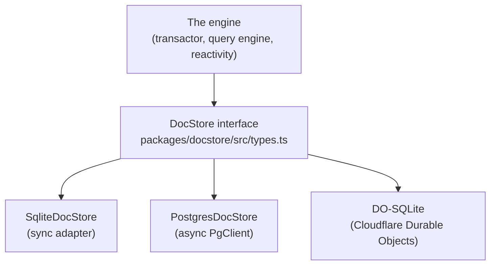
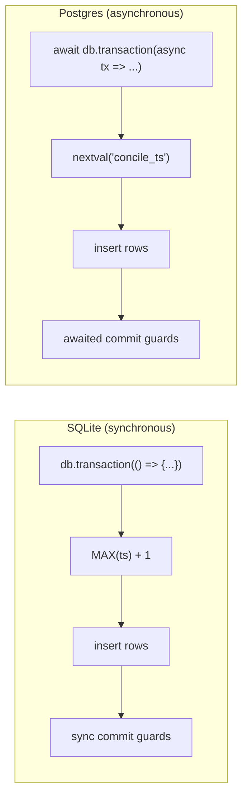

{/* diataxis: how-to */}

## Why this seam exists

Every backend Concile currently ships (like SQLite and Postgres) talks to the engine through the
exact same doorway. Concile's engine, which includes the transactor, query engine, and reactivity,
never talks to a database directly. Instead, it relies on a single, focused TypeScript interface
called `DocStore`. Whatever sits behind that interface, whether it's SQLite, Postgres, a Durable
Object's embedded SQLite, or something you whip up yourself, stays completely invisible to
everything above it.

That's the main takeaway for this page. **If you want to back Concile with a completely different
database, you just need to implement this one interface, and nothing else in the engine needs to
change.**



The engine only ever imports `DocStore`. It has no idea whether reads are coming from a local file
or a Postgres cluster three availability zones away, and that's exactly the point! If you're new to
the codebase, you might want to read this alongside `docs/dev/architecture/internals/01-storage.md`,
which goes deeper into the historical reasoning. This page sticks to what is actually shipped and
how you can build against it.

The three implementations we ship today all reuse the same MVCC (multi-version concurrency control)
data model described below. They only differ in *how* they talk to their underlying storage. For
example, `SqliteDocStore` and the DO-SQLite backend actually share the exact same class, with only
the low-level driver underneath being different.

## The data model in one paragraph

Every write is always an **append**, never an in-place update. When a document changes, the store
simply adds a new dated revision. It never edits the old one.

A delete is also just an append. We use a special "tombstone" revision that means "as of this
moment, this document doesn't exist." Reading a document as of time T just means finding the newest
revision with a timestamp `<= T`.

This pattern is called MVCC (multi-version concurrency control). It is what lets many readers see a
consistent snapshot of the world while writes keep happening. As a result, nobody's read ever gets
torn or half-updated.

Because nothing is overwritten, a document's history forms a backward linked list through time,
where each revision points at `prev_ts`, the timestamp of the revision before it. This is what makes
it cheap to answer the question, "what changed since I last looked?"

## The DocStore contract, grouped by job

The full interface lives in `packages/docstore/src/types.ts`. It is a bit long, but it naturally
breaks into a handful of jobs. If you are implementing a new backend, we recommend tackling them in
this order.

<Steps>

<Step>

### Set up the physical schema

```
setupSchema(options?: SchemaSetupOptions): Promise<void>
```

Here, you'll create whatever fixed physical tables your backend needs. This must be **idempotent**,
meaning it should be safe to call every time the engine boots, whether the tables already exist or
not. Note that it is not called once per app table. You can check out the "physically schemaless"
section below to understand why.

</Step>

<Step>

### The write path

This is the part worth spending the most design time on, because it is where correctness lives.

- **`write(documents, indexUpdates, conflictStrategy, shardId?)`**: This appends revisions with a
  timestamp the *caller* already picked. This is typically used for replaying already-committed
  data, like applying a replica's log, rather than for normal application writes.
- **`commitWrite(documents, indexUpdates, shardId?, opts?)`**: This is the normal path a mutation
  takes. The documents and index rows arrive with a placeholder timestamp (`0n`). Your store
  allocates the *real* commit timestamp itself inside its own transaction and returns it. This
  detail really matters! Allocating the timestamp and writing the rows happen as one atomic step, so
  there is never a moment where a timestamp has been claimed but its rows haven't landed yet.
- **`commitWriteBatch(units, shardId?)`**: This follows the same idea, but it is for committing
  several independent "units" of work in one go, also known as a group commit. Each unit gets its
  own strictly increasing timestamp, all inside one transaction. The `commitWrite` method is
  actually implemented as a one-unit call to this, so there is really only one code path you need to
  get right.
- **`addCommitGuard(guard)`**: This lets other parts of the system, such as a feature tracking
  exactly-once delivery, hook a function into the commit transaction itself. A guard runs inside the
  same atomic commit as the row inserts. If it throws an error, the whole commit is rolled back.
  Calling `addCommitGuard` returns an "unregister" function so you can remove that guard later.

</Step>

<Step>

### The read path

- **`get(id, readTimestamp?)`**: This fetches one document as it looked at a given timestamp, or the
  latest version if omitted.
- **`index_scan(indexId, tableId, readTimestamp, interval, order, limit?)`**: This is the hot path!
  It performs an ordered, point-in-time walk over an index's key range, yielding `[key, document]`
  pairs. Every query the engine runs eventually bottoms out here.
- **`scan(tableId, readTimestamp?)`** and **`count(tableId)`**: These read or count every live
  document in a table.
- **`maxTimestamp()`**: This returns the highest commit timestamp your store has ever seen. It is
  used as a restart high-water mark, ensuring the engine's internal clock never goes backwards after
  a crash and restart.

</Step>

<Step>

### Log tailing (the change feed)

- **`load_documents(range, order, limit?)`**: This is an async generator over every raw revision,
  including tombstones, whose timestamp falls in a range. This is how the reactivity system and
  other log-consumers "tail" the log forward to learn what changed, rather than polling.

</Step>

<Step>

### Optimistic concurrency control (OCC) support

- **`previous_revisions(queries)`**: Given a set of `{id, timestamp}` pairs, this returns what was
  visible at each one. The transactor uses this to check whether anything it read has since changed
  before it commits, which is the "optimistic" half of optimistic concurrency control.

</Step>

<Step>

### A tiny key-value store

- **`getGlobal`/`writeGlobal`/`writeGlobalIfAbsent`**: These provide a small string-to-JSON side
  table for engine bookkeeping, independent of any application table.

</Step>

<Step>

### Client mutation receipts

- **`getClientVerdict`, `getClientFloor`, `recordClientVerdict`, `updateClientVerdictValue`,
  `pruneClientMutations`, `sweepExpiredClientMutations`**: Together, these provide a dedicated,
  durable record to track whether a client's specific mutation has already run, and what happened
  when it did. This backs the offline mutation outbox (which you can read about in
  `/docs/client/offline-sync`) so a resent mutation is recognized and not re-executed. If you are
  implementing a new backend primarily to try out the storage model, you can treat this group as the
  last thing you wire up, but it does need to exist for the outbox feature to work fully.

</Step>

<Step>

### Cleanup

- **`close()`**: This releases whatever resources the backend is holding, such as a file handle or a
  connection.

</Step>

</Steps>

### Its companion: the TimestampOracle

`DocStore` is paired with a `TimestampOracle` interface, which is the thing that hands out the
ever-increasing commit timestamps the whole log is ordered by. In practice, the store itself now
allocates timestamps directly inside `commitWrite` and `commitWriteBatch` (as mentioned above).
Because of this, the oracle mostly just tracks "what is the newest timestamp we have allocated or
fully applied" for the rest of the engine to read.

## The invariants you must not break

<Callout type="warn" title="These aren't suggestions">

A backend that gets these wrong will not throw an obvious error. It will corrupt data silently,
sometimes only under concurrent load. Treat this list as non-negotiable.

</Callout>

1. **Append-only.** Never `UPDATE` or `DELETE` a row in place. A change is always a new row with a
   new timestamp; a deletion is a new row whose value is `null` (a tombstone).
2. **Snapshot semantics.** A read at `readTimestamp` must return the newest revision of each key
   with `ts <= readTimestamp`. Nothing newer, nothing skipped.
3. **Strictly increasing commit timestamps, allocated inside your own transaction.** Two commits
   must never get the same timestamp, and a timestamp must never become visible before its own rows
   do. This is only safe because Concile is single-writer: at most one writer is ever committing to
   a given store at a time (see the `pg_advisory_lock` discussion below for how Postgres enforces
   this).
4. **`index_scan` must yield keys in encoded byte order**, and only the revision that was actually
   visible at the requested timestamp. Never a newer one that happens to exist.
5. **Documents and their index rows commit together, atomically.** A crash (or a concurrent reader)
   must never see a document without its index entry, or vice versa.

## The two shipped reference implementations

Both implementations model the same three logical concerns: `documents` (the revision log),
`indexes` (the MVCC index entries), and `persistence_globals` (the KV side table), along with the
client-receipt tables from job 7 above. Where they differ is *how* they talk to their underlying SQL
engine. This difference is the most important thing to internalize before you write a third one.

### docstore-sqlite: synchronous

`@concile/docstore-sqlite`'s `SqliteDocStore` sits on a small synchronous `DatabaseAdapter` seam
(`exec`, `prepare`, `transaction`). You can see this in `packages/docstore-sqlite/src/adapter.ts`.
Two concrete adapters exist today: a Node one (`node-adapter.ts`, built on `node:sqlite`) and a Bun
one. They both share the same base `SqliteDocStore` logic.

Because the underlying driver is synchronous, a commit guard registered here **must also be
synchronous**. There is no `await` inside a single-transaction SQLite commit, and returning a
promise from a guard is actually treated as a caller bug.

The commit timestamp is allocated as `MAX(ts) + 1`, which is computed inside the same transaction as
the writes. Since Concile enforces a single-writer setup, no other writer can race in a higher
timestamp between the `MAX(ts)` read and the insert. The whole thing is race-free by construction,
not by locking.

### docstore-postgres: asynchronous

`@concile/docstore-postgres`'s `PostgresDocStore` sits on a narrow *async* seam called `PgClient`
(`query`, `transaction`, `acquireWriterLock`, `close`). See
`packages/docstore-postgres/src/pg-client.ts`, implemented concretely by `node-pg-client.ts` on top
of the `pg` driver. Commit guards here are always awaited. Async is the native mode.

Two things make single-writer safety hold on a database that, unlike SQLite, could physically accept
multiple concurrent writers:

- **A `pg_advisory_lock`**, taken once at boot (`acquireWriterLock`). If a second engine process
  tries to start against the same database, it fails fast instead of silently corrupting state.
- **A Postgres sequence** (`nextval('concile_ts')`), drawn from inside the same commit transaction
  as the row inserts. This is the async equivalent of SQLite's `MAX(ts) + 1`, using Postgres's own
  atomic counter instead of a table scan.

Reads lean on set-based SQL (`DISTINCT ON`, `LATERAL` joins) to resolve "the newest visible revision
per key" in one query, rather than one round trip per row. Worth knowing if you're tuning a
Postgres-shaped backend for latency.



Both sides land on the same guarantee: one strictly increasing timestamp per commit, allocated where
the rows are written, never before. They just get there with the primitives their own database gives
them.

### DO-SQLite: the same class, a different driver

Cloudflare Durable Objects ship their own embedded SQLite (`ctx.storage.sql`). Rather than
reimplement the MVCC logic a third time, `@concile/docstore-do-sqlite` reuses `SqliteDocStore`
**verbatim** and only supplies a new `DatabaseAdapter` (`DoSqliteAdapter`) that talks to the Durable
Object's SQL surface instead of `node:sqlite`. This is the cleanest illustration of why the adapter
seam is drawn where it is: SQLite-shaped logic (schema, query building, transaction semantics) lives
once in `docstore-sqlite`; only the thin driver differs per platform.

## Physically schemaless: the pattern to copy

If you build a new backend, copy this shape. A Concile app can define any number of tables and
indexes in its `schema.ts`, but the physical database underneath never grows new tables or columns
to match. Instead:

- **One `documents` table** holds every logical table's rows, discriminated by a `table_id` column.
- **One `indexes` table** holds every logical index's entries, discriminated by an `index_id`
  column.

Both are versioned by `ts`, exactly as described above. Adding an application table or field is a
**data** change (a new value of `table_id` starts appearing), never a schema migration. This is
precisely why the Postgres adapter needs no per-app migration step as `schema.ts` evolves. There is
nothing to migrate: the physical schema was already general enough to hold it.

## How a new adapter gets accepted: the conformance suite

`packages/docstore/test-support/conformance.ts` exports a single shared test suite: every behavioral
rule from "the invariants" section above, expressed as runnable tests. Both shipped backends run it.
SQLite runs it directly, and Postgres runs it against both a real driver and PGlite (an embedded,
in-process Postgres used so the tests don't need a real Postgres server to run).

A new backend is considered "done" when:

1. It passes the shared conformance suite unmodified.
2. If it's meant to be a real deployment target (not just a local experiment), it also has an
   end-to-end test through the real `concile serve` entrypoint, ideally against a real instance of
   the backing database, not just an in-process fake.

This is the acceptance bar, not a suggestion: passing your own hand-written tests is not the same
claim as passing the same suite every other backend passes.

## How the runtime picks an adapter

The `concile` CLI doesn't ask you to choose an adapter in code. It selects one by configuration, at
startup:

- No flag set → SQLite (the zero-config default for local dev and single-node deploys).
- `--database-url postgres://...` or the `CONCILE_DATABASE_URL` environment variable set → Postgres.
  The flag wins if both are present.

This is the same "select by config, not by code" pattern Concile uses for its file-storage backend
seam (see `/docs/contributing/extending/providers`). The engine and your application code never need
to know or care which one is active. For the Postgres flag details and a worked example, see
`/docs/deploy/postgres`; for the general self-hosting story, see `/docs/deploy/self-hosting`.

## What's deliberately out of scope

- **Search and vector indexes are not part of this contract.** `SchemaSetupOptions` reserves
  `searchIndexes`/`vectorIndexes` fields for a future capability interface, but no shipped backend
  implements full-text or vector search today. Don't build against them; they're placeholders, not a
  real seam yet.
- **True per-tenant sandboxing** (running untreated application code in a fully isolated V8 isolate)
  is a separate concern from storage entirely, and isn't part of `DocStore`.

If you're building a new adapter and get stuck on the shape of a specific method, the two shipped
implementations (`packages/docstore-sqlite/src/sqlite-docstore.ts` and
`packages/docstore-postgres/src/postgres-docstore.ts`) are meant to be read side by side. They solve
the same problem twice, which is often the fastest way to see what's essential versus what's
driver-specific.

## See also

- `/docs/contributing/extending/providers`: the same select-by-config pattern applied to file
  storage backends.
- `/docs/contributing/architecture/storage` and `/docs/contributing/architecture/transactions`: how
  the transactor and query engine sit above this seam.
- `/docs/deploy/postgres`: using the shipped Postgres adapter in a real deployment.
- `/docs/deploy/self-hosting`: the general self-hosting story, including the SQLite default.
- `/docs/client/offline-sync`: the feature that depends on the client mutation receipt methods.
