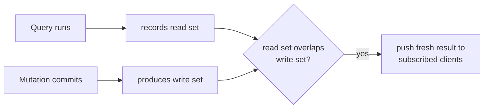
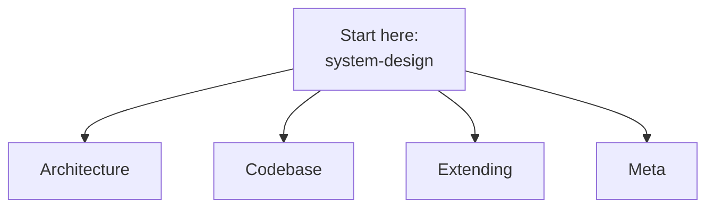

{/* diataxis: explanation */}

This section is meant for a different audience than the rest of the docs. It's for anyone who wants
to dive into the inner workings of concile: reading the engine source, squashing bugs, adding new
storage adapters, or building fresh components. If you're just looking to use concile in your own
app, you'll probably want to head over to [Get Started](/docs/get-started/what-is-concile) or [Core
Concepts](/docs/core-concepts/schema-and-tables) instead.

## concile in a nutshell

At its core, concile is an open-source, self-hosted, reactive backend. You just write standard
TypeScript functions like queries, mutations, and actions, and they run on the server within a
transaction.

Whenever the data those functions touch gets updated, every subscribed client instantly gets the
fresh results over a WebSocket. This means you won't ever have to write polling code, manual refetch
calls, or messy cache-invalidation logic again.

We're aiming for an amazing developer experience without any vendor lock-in. You can run it on your
laptop, your own server, or directly in your cloud account.

## The core idea behind it all

Before getting into the weeds, there's one fundamental concept you should understand:

- A **query** is a read-only function. As it runs, the engine quietly keeps track of exactly what it
  reads, including tables, rows, and ranges. We call this the **read set**.
- A **mutation** is the only function that can write data. When it commits a change, the engine
  records exactly what was written. This is the **write set**.
- Every active subscription is essentially just a query and its read set hanging out and waiting.
  Whenever a mutation commits, the engine checks if its write set overlaps with any subscription's
  read set. If it does, the query runs again, and the updated result is pushed to all subscribed
  clients. If there is no overlap, the subscription stays as is, costing absolutely nothing.

And that's really all there is to it. You don't have to worry about polling loops, manually
declaring cache keys, or wiring up pub/sub topics by hand. The entire reactivity model boils down to
one question: "Did the data I just wrote touch the data you are currently watching?"

Almost every architecture page in this section tries to answer one main question: how do we make
this single idea both accurate and blazingly fast? If you're curious about how read and write sets
are recorded, check out the [query engine](/docs/contributing/architecture/query-engine). To
understand how commits remain safe during concurrent operations, read about the
[transactor](/docs/contributing/architecture/transactions). The details of how the overlap check is
implemented and pushed out to clients are covered in the
[reactivity](/docs/contributing/architecture/reactivity) page, which is probably the most important
page in this section to read closely. Finally, if you want to know where the bytes are physically
stored, head over to the [storage](/docs/contributing/architecture/storage) page.

If you'd prefer to see the user-facing side of this concept first, check out [Core Concepts:
Reactivity](/docs/core-concepts/reactivity).

## System overview in three points

1. **It's one language, end to end.** The CLI, server engine, and client SDK are all written in
   TypeScript. You won't find a hidden Rust core or have to context-switch into another language
   when moving from writing a query to debugging the engine.
2. **Storage is kept neatly tucked away.** The engine never directly imports a database driver.
   Instead, it communicates with an abstract `DocStore`/`DatabaseAdapter` interface. This means the
   exact same engine logic runs without any changes on embedded SQLite (our zero-config default) or
   Postgres (for when you need durable, networked self-hosting).
3. **Your app code scales up without needing a rewrite.** Right now, that looks like a single
   self-contained binary or container (which we call Tier 0/1) that can happily run on a cheap $5
   VPS. We're also designing and partially building a distributed, multi-node fleet (Tier 2) in the
   `ee/` tree, though it's not quite ready as a general-purpose product yet. You can read more about
   that in the status note below.

## The roots of our architecture

concile takes loose inspiration from [Convex](https://github.com/get-convex/convex-backend) and
another project called concave. If you're contributing, here's what that actually means: the
internal architecture notes in `docs/dev/` were put together by studying how Convex and concave
publicly document their behavior. We never copy their source code. Both projects are
source-available under a non-compete license (FSL), so we treat them much like a specification. We
read them for ideas and then build our own version entirely from scratch.

There are two practical things to keep in mind before you jump into the more complex architecture
pages:

- The internal notes are dense and written by experts. Sometimes they describe what we *intended* to
  build rather than what actually shipped. You might find designs that were proposed but later built
  differently, put on hold, or replaced entirely.
- While the authoring style might look familiar when you write a query or schema, we aren't
  promising a drop-in replacement for any other tool. concile uses its own canonical imports
  (`@concile/*`) and has already added features that earlier projects don't have, like durable
  workflows with saga/compensation, a Postgres adapter, and a single-binary build. If you need
  compatibility with an existing project, you'll find that in our migration tools (`concile
  migrate`), rather than as the core focus of the product.

<Callout type="info">
  This Contributing section gives you the real, shipped view of things. If you ever notice a
  disagreement between the internal `docs/dev/` notes and the shipped code, the shipped code is
  always the source of truth.
</Callout>

## Navigating this section

The Contributing tab is broken down into four main groups of pages. It's a good idea to skim this
before searching for something specific.

- **[Architecture](/docs/contributing/architecture/system-design)**: This covers how the engine
  actually operates, from a high-level overview all the way down to individual subsystems.
  - [System design](/docs/contributing/architecture/system-design): This is our north star. Start by
    reading this first.
  - [Storage](/docs/contributing/architecture/storage): Details on the append-only log and the
    storage interface.
  - [Transactions](/docs/contributing/architecture/transactions): A look at the single-writer commit
    protocol.
  - [Reactivity](/docs/contributing/architecture/reactivity): Everything about read-set and
    write-set overlap. This is the concept you'll want to understand most clearly.
  - [Query engine](/docs/contributing/architecture/query-engine): How a query transforms into an
    index scan and records a read set.
  - [Execution](/docs/contributing/architecture/execution): How your function code truly runs,
    including the determinism boundary.
  - [Runtimes](/docs/contributing/architecture/runtimes): Information on embedded, fleet, and edge
    hosts that run the same engine.
- **[Codebase](/docs/contributing/codebase/monorepo)**: Your practical tour of the code.
  - [The monorepo](/docs/contributing/codebase/monorepo): An overview of what lives where and the
    reasoning behind it.
  - [Development setup](/docs/contributing/codebase/development): Instructions for cloning,
    installing, building, testing, and understanding the dev loop.
- **[Extending](/docs/contributing/extending/custom-component)**: The specific areas you can build
  upon without needing to alter the core engine.
  - [A custom component](/docs/contributing/extending/custom-component): Examples like
    `@concile/auth` or `@concile/scheduler`.
  - [A custom storage adapter](/docs/contributing/extending/storage-adapter): How to create a new
    database backend.
  - [Custom providers](/docs/contributing/extending/providers): Setting up email, OAuth, or
    blob-store backends for the components you already have.
- **Meta**: You'll find our [contributing guide](/docs/contributing/contributing-guide) here, which
  explains how to propose and land changes, along with details on
  [licensing](/docs/contributing/licensing), including the FSL license and the `ee/` directory
  split.

## Where you should start reading

If you're new around here, we suggest reading in this order:

1. **[System design](/docs/contributing/architecture/system-design)** first. It provides a helpful
   one-page summary of the entire architecture, and the rest of the documentation assumes you've
   seen it.
2. **[Reactivity](/docs/contributing/architecture/reactivity)** next. Out of everything in the
   system, this is the piece that gets misunderstood most often, but it's also the core idea our
   entire product is built around.
3. From there, feel free to dive into whichever subsystem page makes sense for the parts of the code
   you're actually working on. You definitely don't have to read the whole Architecture section from
   beginning to end.
4. Try getting the repo up and running using the [development
   setup](/docs/contributing/codebase/development) so you can experiment with the code as you read.
5. Before you start writing code for anything major, please check out our [contributing
   guide](/docs/contributing/contributing-guide). We like to work spec-first on this project, which
   means we brainstorm and write out a plan before we start implementing. Jumping straight into
   coding a big feature usually ends up costing a lot of time in the long run.

## Just how mature is this project

Here is what has officially shipped and is fully covered by end-to-end tests running against a real
server, not just isolated unit tests:

- The core reactive engine.
- Production tools for a single node or single binary, including `concile serve`, self-hosted Docker
  images, live hot-deployments, and a standalone compiled binary.
- The Postgres adapter and file storage system.
- All six built-in components: auth, authz, scheduler, workflow, triggers, and notifications.

Here is what we haven't quite finished yet, so you know exactly what to expect before you rely on
it:

- We've designed and started building a distributed Tier 2 multi-node write scale-out in the
  source-available `ee/` directory, but it's not a finished, general-purpose feature yet.
- We haven't built out full-text or vector search capabilities at this point.
- When we built the function executor's internal syscall interface, we designed it to safely cross a
  real V8 isolate boundary. However, that isolation isn't fully connected just yet. Right now, the
  executor runs your functions directly in-process and trusts them, rather than placing them in a
  sandbox.

It is worth noting that none of these missing pieces impact the reliability or correctness of the
features we have already shipped. They are simply things we haven't gotten around to building yet.
