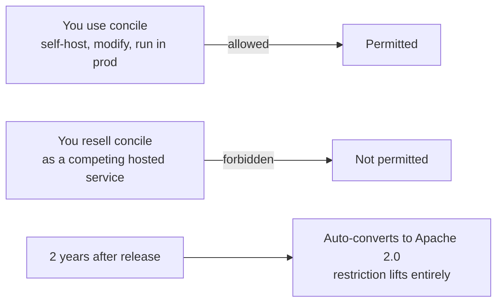
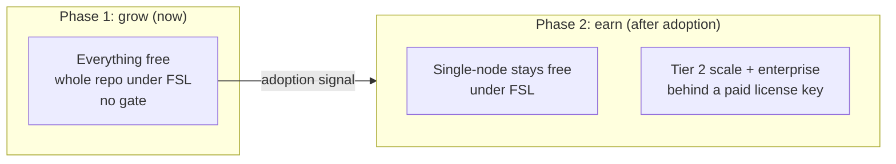
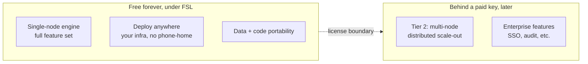

{/* diataxis: explanation */}

When you're checking out concile for a real project, you probably want to know what you're actually
allowed to do with it and whether those rules might change down the road. This page gives you clear
answers to both of those questions.

The short version is that everything you need to build and run a real application is free forever.
That includes self-hosting at scale on your own infrastructure. The only thing you can't do is take
concile and resell it as your own competing hosted service. That really is it.

## The license in plain language

Concile uses the **Functional Source License (FSL-1.1-Apache-2.0)**. You can find the full text in
the repository's `LICENSE` file, but here is what it means in plain English.

You can run concile in your product, your company, or your side project for free, and you don't need
any approval. Feel free to deploy it on your own server, your cloud account, or even an air-gapped
machine with no internet access. Because it's open source, you can fork it, patch it, and read every
single line of code.

<Callout type="info" title="The one restriction">

You just can't take concile and offer it as a competing hosted product or service. So, building
something like "Concile Cloud, run by someone who isn't us" is out of bounds. That is the only thing
the FSL forbids.

</Callout>

This restriction actually expires in your favor. Two years after each release, the restriction lifts
automatically, and the code converts to the fully permissive Apache 2.0 license. So, nothing you use
today stays restricted under the FSL forever.

If this sounds familiar, it probably should. It is the same license that
[Convex](https://convex.dev) uses. It acts as a well-understood and developer-friendly middle ground
rather than an exotic legal experiment.

## Why FSL, and not plain MIT or Apache

Just because something is "free" doesn't mean it's entirely "permissive." They're actually two
different things. Concile is totally free for you to use, but it isn't free for others to
strip-mine.

In our case, the engine itself is the product. Think about a project like Supabase. Their real moat
is Postgres, which they don't actually own. Concile is different because all of its value comes
directly from the reactive engine. If we went with a permissive license like MIT or Apache, any
well-funded cloud provider could just take the engine, host it, and compete directly with us without
giving a single thing back. The FSL neatly closes that loophole while keeping things exactly the
same for everyday users and self-hosters.

Changing a license later down the road is a trap, not a safety net. Sure, it's tempting to start
with a fully permissive license to grab as many users as possible, and then lock things down once
you need to protect the business. But history shows that this doesn't just buy you time; it
completely torches trust:

- Redis relicensed from permissive to restrictive, and the community forked it into **Valkey**.
- Elastic did the same and got forked into **OpenSearch**, by AWS.
- HashiCorp's Terraform license change produced **OpenTofu**.

In all of these cases, people weren't upset about adding paid features. Companies like n8n and
GitLab add paid features all the time and nobody really minds. The backlash happened because they
changed the rules on code that people were already running in production. Once you promise
permissive terms, you really can't walk them back and keep your credibility.

Concile avoids this whole trap by setting a protective license right from the very first commit,
well before there's a community that could feel betrayed. Any paid features we add in the future
will just be normal new releases under terms that were already public, rather than a sudden
reversal.

## What's free forever

This part is worth being very precise about, as it forms the core of our trust proposition. Under
the FSL, the following will be permanent with no future gate planned:

- The full single-node engine: functions, the reactive query and subscription system, durable
  workflows and saga compensation, file storage, the scheduler, actions and webhooks, the Postgres
  adapter, the single-binary build, and the dashboard. This gives you a complete, production-ready
  backend for most real applications, and it is definitely not just a trial.
- Deploy anywhere: your laptop, your own VPS, any cloud, or an air-gapped facility with no outbound
  network at all. You will never have to worry about a phone-home requirement.
- Your data and your code stay completely portable. We use plain HTTP APIs and open formats, and you
  can use `concile migrate` to bring your data in. There is absolutely nothing stopping you from
  taking it back out, so you are never locked in.

None of this requires a license key today, and we don't expect it to require one later. Check out
[What is concile?](/docs/get-started/what-is-concile) for what the full engine actually includes,
and [Self-hosting](/docs/deploy/self-hosting) for how deploying anywhere works in practice.

## The business model: free now, gate scale later

Concile isn't a charity, and it needs a way to fund ongoing development. Our plan is carefully
sequenced to win adoption first with a genuinely complete free product. Only later, once we see real
popularity instead of just hitting a fixed date, will we introduce a paid unlock for one specific
thing. That unlock will be for running concile's distributed, multi-node scale-out tier, along with
a bundle of enterprise features like SSO and audit logging.

You might know this as the n8n or GitLab-EE model, where we sell license keys instead of compute
power. We don't have any plans for a managed cloud hosting business. You will still deploy the paid
tier on your own infrastructure, just like everything else. The key simply unlocks a capability
rather than providing a place to run it. The rough idea is to use a signed key that gets verified
offline at startup without making any network calls back to concile. This way, your self-hosted or
air-gapped deployment will never depend on a phone-home check to keep running. Keep in mind that we
have designed these mechanics, but they aren't built yet. We will touch on this more in the caveats
below.

The trigger for Phase 2 isn't tied to a specific calendar date. Instead, it relies on meaningful
adoption and real demand for multi-node scale. Until we see that signal, everything we build,
including any distributed features, will ship for free.

## Free forever vs. what a paid key unlocks

Laid out side by side, here is the whole boundary:

The `ee/` directory in the repository stands for "enterprise edition," which is a convention that
GitLab helped popularize. This is where our paid-tier code lives, and it is definitely not just a
placeholder. The `ee/packages/` folder already holds three shipped packages: **fleet** for the
distributed multi-node Tier 2 coordination layer, **objectstore-substrate** for the
object-storage-backed storage and compute-separation substrate, and **runtime-cloudflare-shard** for
the sharded Cloudflare Durable Object host. That said, the paid gate itself isn't built or active
yet, so nothing in `ee/` currently requires a license key to use.

Code under `ee/` is **not** covered by the FSL. It has been under a separate commercial license
right from the start. This is important because the FSL's two-year conversion to Apache only applies
to the core code licensed under the FSL. If the paid tier used the FSL, it would automatically
become free after two years as well, which would defeat the entire purpose. By keeping `ee/` on its
own non-converting license from day one, we avoid that issue completely.

## Why the sequencing matters more than the mechanism

The single most important decision we made isn't necessarily using the FSL itself. It is all about
the order of operations. We wanted to set the protective license now and write the paywall code
later, and we never wanted to do it the other way around.

Changing the license on code that people are already running feels like a betrayal, even if the new
terms are completely reasonable. On the other hand, shipping a new paid feature under terms that
were already public just feels like a normal product release. Using the FSL and requiring a CLA
(Contributor License Agreement) or DCO (Developer Certificate of Origin) from every contributor from
day one serve the same purpose. They keep concile's future licensing options fully open, ensuring
that Phase 2 never has to touch a license that anyone is already relying on. You can check out the
[contributing guide](/docs/contributing/contributing-guide) to see what the CLA and DCO mean in
practice when you submit a change.

## Honest caveats

There are a few things we want to be upfront about, rather than just glossing over them.

This isn't a recurring-revenue model. While a managed cloud earns continuously as customers grow, a
license key earns revenue just once at purchase, or perhaps once a year depending on the pricing
structure we choose later. The revenue ceiling is definitely lower than a hosting business, but that
is a tradeoff we happily accept as a small team that doesn't want to run infrastructure or be on
call for anyone else's production database.

Our enforcement strategy is legal and social rather than relying on DRM. Since the source code is
fully visible, including the future gate check itself, someone who is motivated enough could
theoretically patch it out. We know this is a tradeoff, and it certainly isn't an oversight. In
fact, it is exactly how companies like n8n, GitLab, and Sentry operate today. A real business is
highly unlikely to risk a license violation just to avoid a modest fee. Meanwhile, a hobbyist who is
determined enough to patch out a check probably isn't our target customer for multi-node scale
anyway. Because of this, we have no plans to build unbreakable copy protection.

We have designed the gate mechanics, but we deliberately haven't built them yet. Just for reference,
the rough idea involves a signed key, which acts as an offline-verifiable token rather than a
phone-home check. This key would carry entitlements and an expiry date, and it would be verified
locally at startup without needing any network calls. This approach ensures that self-hosted and
air-gapped deployments are never broken by a license check. Keep in mind that this is our documented
intent and not a shipped feature. Currently, absolutely nothing in concile checks for a license key.

## Related pages

- [Contributing guide](/docs/contributing/contributing-guide): the workflow for proposing and
  landing a change, including the CLA/DCO.
- [Architecture: system design](/docs/contributing/architecture/system-design): how the engine that
  this license protects is put together.
- [Self-hosting](/docs/deploy/self-hosting): the free-forever deploy-anywhere story in practice.
