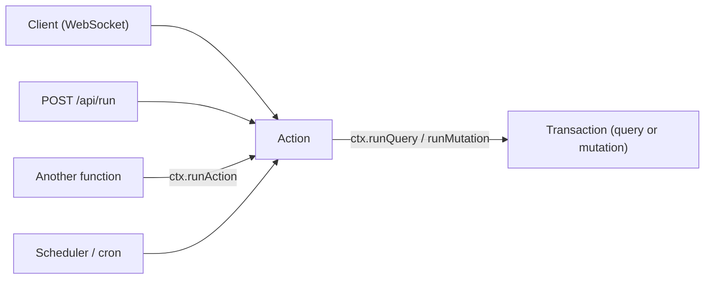

{/* diataxis: explanation */}

We intentionally made [queries](/docs/core-concepts/queries) and
[mutations](/docs/core-concepts/mutations) totally deterministic. That determinism is the magic
behind reliable reactivity and smooth OCC conflict replays. Basically, if you run a handler with the
same inputs, you'll get the exact same result, guaranteed, every single time.

However, real-world apps often need to do things like calling a third-party API, sending an email,
generating a truly random ID, or waiting on a timer. You just can't do those things
deterministically. And that is exactly where actions come in to save the day!

You can think of an action as your escape hatch from the strict rules of determinism. It gives up
the transaction, `ctx.db`, and reactivity. In exchange, it gives you full access to native `fetch`,
`Date`, `Math.random()`, and timers. Getting a handle on this trade off is a big part of
understanding the whole model.

## Actions run outside the transaction

When you run a query or a mutation, it happens inside `transactor.runInTransaction`. It gets a
consistent snapshot, which means the engine keeps track of every table and range it reads or writes.
If a conflict pops up, the engine can safely replay the handler because it behaves just like a pure
function of its inputs.

Actions are a different story since they run completely outside of that system. An action has no
snapshot, no read set, no write set, and no commit of its own. As a result, you cannot subscribe to
an action's result. Reactive subscriptions need a query's read set to work, and actions do not have
one.

You will notice this structural difference right away because `ActionCtx` lacks a `ctx.db` property.
It is not hidden or restricted, it just is not there.

```ts
export interface ActionCtx {
  runQuery<T = unknown>(ref: FunctionReference | string, args?: Record<string, unknown>): Promise<T>;
  runMutation<T = unknown>(ref: FunctionReference | string, args?: Record<string, unknown>): Promise<T>;
  runAction<T = unknown>(ref: FunctionReference | string, args?: Record<string, unknown>): Promise<T>;
}
```

Since you cannot read or write data directly, all of your data access needs to happen through the
three `runX` methods shown above.

Whenever you call an action, it kicks off a completely fresh and independent top level run. If you
call the action a second time from the client, the scheduler, or somewhere else, it will not resume
or join the first call. Every single invocation gets a brand new `ActionCtx`, its own try/catch
block, and its own isolated commits if it happens to call `runMutation`.

## Defining an action

```ts title="concile/tasks.ts"
import { v } from "@concile/values";
import { action } from "./_generated/server";

export const sendReminder = action({
  args: { taskId: v.id("tasks") },
  handler: async (ctx, { taskId }) => {
    const task = await ctx.runQuery("tasks:get", { id: taskId });
    const res = await fetch("https://api.email.example.com/send", {
      method: "POST",
      body: JSON.stringify({ subject: `Reminder: ${task.title}` }),
    });
    return res.ok;
  },
});
```

The `args` and `returns` validators function just like they do for queries and mutations, which you
can read about in [Queries](/docs/core-concepts/queries) and
[Mutations](/docs/core-concepts/mutations). By declaring `args`, you tell the engine to check the
arguments before the handler even starts. If something does not match, it throws an
`ArgumentValidationError`, which looks like a 400 error to anyone calling via HTTP. You can opt into
this validation on a per function basis, and it works exactly the same for actions. The one
exception to this is `httpAction`, which we will cover later. Because it takes a raw `Request`
instead of typed arguments, there is really nothing to validate against.

For a function reference, you can use a typed reference like `api.tasks.sendReminder` from the
generated `api` or `internal` objects. Alternatively, you can just use a bare string path like
`"module:export"`, as shown in the example above.

### Native non-determinism is allowed

Inside an action handler, you can freely use all the tools that queries and mutations usually block.
Since we do not need to worry about replaying identically during a conflict, you are welcome to use:

- `fetch` for making real network calls to any URL.
- `Date.now()` or `new Date()` for getting actual wall clock time, rather than relying on the
  transaction's fixed snapshot time.
- `Math.random()` or `crypto.randomUUID()` for true randomness, instead of the seeded deterministic
  random number generator used in queries and mutations.
- `setTimeout`, `setInterval`, and any other timer functions.

This freedom is exactly what you get for trading away `ctx.db`. An action can safely do anything a
standard async TypeScript function can do, simply because the engine never needs to rerun it to fix
a conflict. Since it never opened a transaction in the first place, there are no conflicts to
resolve.

## Reaching the database: runQuery, runMutation, runAction

Since actions lack direct access to the database, they handle everything using three specific
methods on `ctx`. Every time you use one of these methods, it kicks off a completely new and
independent top level run for the target function. This means you get a fresh transaction for a
query or mutation, or a separate action execution if you are nesting an action.

<TypeTable
  type={{
    runQuery: {
      description: 'Runs a query and returns its result.',
      type: '(ref, args?) => Promise<T>',
    },
    runMutation: {
      description: "Runs a mutation as its own transaction, commits it, and returns its result.",
      type: '(ref, args?) => Promise<T>',
    },
    runAction: {
      description: 'Runs another action.',
      type: '(ref, args?) => Promise<T>',
    },
  }} />

```ts title="concile/orders.ts"
export const checkout = action({
  args: { cartId: v.id("carts") },
  handler: async (ctx, { cartId }) => {
    const cart = await ctx.runQuery("carts:get", { id: cartId });
    const charge = await fetch("https://api.stripe.example.com/charges", {
      method: "POST",
      body: JSON.stringify({ amount: cart.total }),
    });
    if (!charge.ok) throw new Error("payment failed");
    // Commits as its OWN transaction: a separate write-set, a separate round of invalidation.
    await ctx.runMutation("orders:markPaid", { cartId });
  },
});
```

<Callout type="warn" title="Actions can't group writes atomically">

Since every `runMutation` call acts as its own separate commit, you will not be able to group
several writes into a single atomic transaction from inside an action. Think about the `checkout`
example above. If it called `runMutation` twice, say doing `orders:markPaid` and then
`inventory:decrement`, and the process happened to crash in the middle, the first write would save,
but the second one would fail. There is no way to roll back across both calls.

</Callout>

When you need a bunch of writes to all succeed or fail together, bundle them up into a single
mutation and just have the action call that one mutation. Actions are really designed to orchestrate
non deterministic work around your data. If you need to group writes, a mutation's transaction is
the perfect tool for the job.

You can also use the `runQuery`, `runMutation`, and `runAction` methods to reach internal functions
that have a `_` prefix. These are basically modules or export paths where any segment starts with an
underscore, like `"reminders:_send"`. Keep in mind that public entry points like client calls or
`POST /api/run` will flat out reject any path with an underscore prefix. The only way to access them
is from inside another function using those three methods, or by going through the scheduler. This
is a great way to write functions that are strictly for your own actions, workflows, or trigger
code, keeping them hidden from direct client access.

<Callout title="Only ActionCtx has these methods">

You will not find `runQuery`, `runMutation`, or `runAction` available in queries or mutations. This
escape hatch is strictly for `ActionCtx`. That makes sense because an action is already operating
outside of a transaction and needs a way to delegate work. A query or mutation is limited to reading
or writing through its own `ctx.db` and is not allowed to call other functions.

</Callout>

## Where an action can be called from

You cannot reach an action through a reactive subscription path. Since it does not have a read set,
there is simply nothing to subscribe to. However, you can call an action from pretty much anywhere
else that you would call a query or mutation:



<Tabs items={['Client', 'HTTP', 'Another function', 'Scheduler']}>

<Tab value="Client">

You can make a standard, non reactive call over the exact same WebSocket sync connection that
queries and mutations use:

```tsx title="web/ReminderButton.tsx"
import { useAction } from "@concile/client/react";
import { api } from "../concile/_generated/server";

function ReminderButton({ taskId }: { taskId: string }) {
  const sendReminder = useAction(api.tasks.sendReminder);
  return <button onClick={() => void sendReminder({ taskId })}>Send reminder</button>;
}
```

Just like `useMutation`, `useAction` is not reactive at all. Instead of a live subscription like
`useQuery`, it gives you a simple async callback that resolves when the action is completely
finished.

Under the hood, the client method being called is `client.action(ref, args)`, which gives you back a
`Promise<Value>`. Over the network, the client sends an `Action` message and sits tight until it
gets an `ActionResponse`. If an action fails, it comes back as `{ type: "ActionResponse", success:
false, error }`, and the client will reject the promise using `new Error(error)`.

One great thing about `ActionResponse` frames, much like `MutationResponse` frames, is that they
cannot be dropped. Even if things get backed up, the sync session will not throw them away. This
means that even a really slow client will eventually get the outcome of its action, rather than
having the connection drop the response quietly.

</Tab>

<Tab value="HTTP">

You can use `POST /api/run` along with the action's path to run it straight away without needing a
WebSocket. This is super handy when you are dealing with server to server calls or scripts:

```bash
curl -X POST http://localhost:3000/api/run \
  -H 'content-type: application/json' \
  -d '{"path": "tasks:sendReminder", "args": {"taskId": "..."}}'
```

If everything goes smoothly, you get `{ value, committed, commitTs }` back. If it fails, you will
see `{ error, code }` paired with the appropriate HTTP status. For instance, an
`ArgumentValidationError` will show up as a 400.

The `/api/run` endpoint is smart enough to figure out which function type is registered at the given
path. It uses the exact same endpoint for queries, mutations, and actions, so you do not even need
to specify the type in your request. If you need to pass along user identity, just include an
`Authorization: Bearer <token>` header, just like you would on the WebSocket side.

</Tab>

<Tab value="Another function">

You can have an action call another action using `ctx.runAction(ref, args)`, and that applies to
nested actions too. Just refer back to the previous section for details. Keep in mind that this is
the only way you can trigger an internal action starting with an underscore from outside the
scheduler.

</Tab>

<Tab value="Scheduler">

Using `ctx.scheduler.runAfter` or `runAt`, along with a `cronJobs()` schedule, lets you run a target
function later on. It behaves exactly as if a client had called it, but without anyone waiting
around for the result. You can target either a mutation or an action, and the scheduler will figure
out which one it is and handle the dispatch. Be sure to check out
[Scheduling](/docs/components/scheduling) to see everything you can do, like setting delays, writing
cron expressions, configuring retry policies, and handling cascading cancellations.

The way the system handles failures depends entirely on what went wrong, and this distinction is
especially important for actions:

| what happened | scheduled mutation | scheduled action |
|---|---|---|
| handler threw an error | retried (uses jittered exponential backoff, then dead lettered) | **not retried by default**: dead lettered right on the first failure, unless the job specifically asks for retries |
| process crashed mid run | safely retried: a transaction either committed or it did not | **not retried**: the job is immediately dead lettered for at most once execution |

The behavior in both of the action rows comes down to one key detail. Since an action's side
effects, like sending an email or processing a payment, are not transactional, re running an action
could accidentally duplicate those effects. This is why retries for an action are strictly opt in.
You can enable them using the scheduler's low level `retry: { maxFailures }` option, which works
just like a workflow step's `maxAttempts`. By opting in, you are basically promising the engine that
the action is safe to run multiple times. If you are looking for a guarantee that a multi step
process will eventually finish even if a node crashes, you should look into the
[Workflows](/docs/components/workflows) durable step journal rather than just using a simple
scheduled action.

</Tab>

</Tabs>

## Errors propagate to the caller

An action handler is just a standard `async` function. To signal a failure, you just throw an error
or return a rejected promise. Since there is no commit to roll back, any uncaught error simply
bubbles up:

- A promise from a client calling `useAction` or `client.action()` will reject and pass along the
  thrown error message.
- Calling `POST /api/run` will give you a response with the relevant HTTP status and an `{ error,
  code }` payload.
- If a function calls `ctx.runAction(...)` and awaits it, that await throws the exact same error.
  This means a parent action can wrap a nested action or mutation call in a `try`/`catch` block just
  like any other standard `await`.
- If a scheduled action fails, it gets routed through the scheduler's retry and dead letter process
  we talked about earlier, instead of popping up for a waiting caller, since no one is actually
  waiting for it.

An action's own execution is never partially applied. Unlike a mutation, you do not have to stress
about partial commits. However, if an action successfully calls `ctx.runMutation` but throws an
error right after, like if a network call fails after the mutation committed, that write is
permanent and stays saved. You should think carefully about the order of operations here. Always do
the risky and unpredictable work first, and only commit the mutation once you are sure the risky
part succeeded.

## Component action-mode facades

When you use a composed component's context object, such as `ctx.storage`, `ctx.scheduler`, or
`ctx.workflow`, it actually gets constructed differently based on whether you are calling it from a
mutation or an action. It is only in a mutation that you get a `ctx.db` for the in transaction
facade to write through.

When you are inside a mutation, the component's facade writes straight into the calling mutation's
transaction. For example, if you use `ctx.scheduler.runAfter(...)` to insert a job row, it will
commit or roll back perfectly in sync with the rest of that mutation.

Inside an action, you do not have a transaction to write into. Because of this, the identically
named facade acts as an action mode variant. It delegates all its reads and writes to the
component's internal mutations and queries, which use the underscore prefix, by calling `runQuery`
and `runMutation`. This all happens behind the scenes. This means you can take a block of code
calling `ctx.scheduler.runAfter(...)` and move it freely between a mutation and an action without
altering a single line.

Looking at `ctx.storage` gives you a great idea of why this split is necessary. The action mode
facade consists of just four methods: `store`, `get`, `getUrl`, and `getMetadata`. Both `getUrl` and
`getMetadata` deal solely with metadata, so they show up on both variants with the exact same
signatures. On the other hand, `delete` is a write operation, meaning it only appears on the
mutation mode facade. The `store` and `get` methods handle actual byte input and output against the
blob backend, which makes them action only. Moving bytes over a network is exactly the kind of
unpredictable work a mutation is not allowed to do, so those methods do not even exist on the
mutation mode facade. This is basically the same rule that keeps `fetch` out of transactions.
Instead of doing a check at runtime, the engine handles it by making the capability structurally
available in one context and entirely absent in the other.

```ts title="concile/images.ts"
export const resize = action({
  args: { id: v.id("_storage") },
  handler: async (ctx, { id }) => {
    const stream = await ctx.storage.get(id);          // byte I/O, action only
    const resized = await resizeImage(stream);
    const newId = await ctx.storage.store(resized, { contentType: "image/png" });
    return newId;
  },
});
```

You will see the same pattern with `ctx.scheduler` and `ctx.workflow`. Methods like
`ctx.scheduler.runAfter`, `runAt`, and `cancel`, along with `ctx.workflow.start`, `cancel`, and
`sendEvent`, all work flawlessly from an action. Under the hood, they each delegate to an internal
mutation. This means you can schedule tasks or kick off workflows from your action code exactly the
same way you would from a mutation. Check out [File storage](/docs/core-concepts/file-storage),
[Scheduling](/docs/components/scheduling), and [Workflows](/docs/components/workflows) to explore
everything these facades have to offer.

## httpAction: the Request/Response variant

An `httpAction` is essentially an action that uses raw Web `Request` and `Response` objects for its
input and output, rather than relying on typed JSON arguments and a standard return value:

```ts title="concile/http.ts"
import { httpAction, httpRouter } from "./_generated/server";

export const receiveWebhook = httpAction(async (ctx, request) => {
  const body = await request.json();
  await ctx.runMutation("messages:send", { author: body.author, body: body.body });
  return new Response(JSON.stringify({ ok: true }), { status: 200 });
});
```

Everything we just discussed about actions still applies here perfectly. You still do not get a
`ctx.db`, you use the same `runQuery`, `runMutation`, and `runAction` methods, and you still have
access to the native `fetch` and clock functions.

There are really only two main differences. First, the input and output shape uses `Request` and
`Response` objects instead of typical arguments and a return value. Second, you invoke it
differently. An `httpAction` is not called by its path over the sync connection or through
`/api/run`. Instead, it gets routed by its HTTP method and URL path using a standard `httpRouter()`
set up in `http.ts`. This is the exact method you would use to set up a public webhook endpoint for
a third party service that does not understand the custom sync protocol.

You also will not find an `args` validator in an `httpAction`. Because there is no typed arguments
slot to validate against, the handler has to take care of parsing its own `Request` body. For more
details on routing, reserved paths, and how to put together a complete webhook, take a look at the
[HTTP & webhooks](/docs/core-concepts/http-and-webhooks) guide.

## No non-determinism in a transaction: the rule this all exists to enforce

If you take a step back, you will realize that everything we have covered is basically just one
golden rule applied in various ways. A query or a mutation absolutely must be deterministic. Its
correctness relies entirely on the ability to safely rerun it, whether that is a mutation handling
an OCC conflict or a query updating after a subscription's read set gets invalidated.

Functions like `fetch`, `Date.now()`, `Math.random()`, and timers are strictly blocked inside query
or mutation handlers for a very good reason. None of them can guarantee the exact same result if the
handler needs to replay. An action is the special place where this constraint is lifted, but you
have to trade away the things determinism provides, specifically a transaction, a read and write
set, and reactivity.

As a best practice, you should stick to a query for reading data, a mutation for writing data, and
only use an action for the specific logic that truly requires network access, the clock, true
randomness, or a timer. Try to keep that non deterministic portion as small as possible, and let
real mutations handle the actual data changes via `runMutation` calls.
