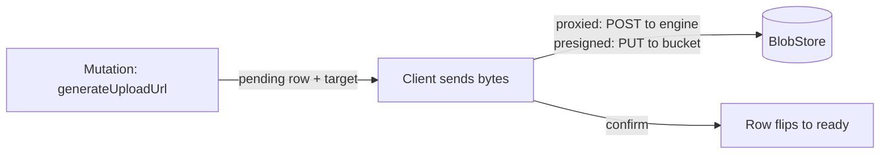

{/* diataxis: explanation */}

Think of a file just like any other row in Concile. It's something you can reference, query, and
react to seamlessly. The actual bytes just happen to be hanging out somewhere else.

The best part? File storage is ready to roll right out of the box. There's no need to flip any
switches in `concile.config.ts`. The moment you fire up `concile dev`, your project automatically
gets a reserved `_storage` system table, plus a handy `ctx.storage` facade that you can use across
all your queries, mutations, and actions.

As for the file bytes themselves, they live over in a separate `BlobStore` backend. By default, this
is just your local filesystem. But if you want to scale up, you can easily point the server at an
S3-compatible bucket like AWS S3, MinIO, or Cloudflare R2, or even use an R2 binding directly on the
Cloudflare Durable Object host. The real magic is that your function code stays exactly the same no
matter which option you choose!

## The `_storage` table and `Id<"_storage">`

The `_storage` table is a built-in system table that holds the metadata for every uploaded file.
This includes properties like `status`, `key`, `size`, `contentType`, `sha256`, `visibility`, and
`expiresAt`, and each entry is keyed by its own document id.

Unlike the internal tables for a component, `_storage` lives at the app root instead of being tucked
away in a namespaced corner of your schema. This makes `Id<"_storage">` fully usable as a
first-class field type in your own schema, just like `v.id("photos")`:

```ts title="concile/schema.ts"
import { v, defineSchema, defineTable } from "@concile/values";

export default defineSchema({
  photos: defineTable({
    caption: v.string(),
    image: v.id("_storage"),
  }),
});
```

This field participates in reactivity just like any other reference. When a query reads a `photos`
document that holds a stored file id, it will automatically re-run whenever that row changes. It
uses the exact same read-set and write-set intersection that every other table gets (check out [How
it works](/docs/get-started/how-it-works) for more details). We do not use any special logic for
storage ids when it comes to reactivity. At the end of the day, `_storage` is just another table. It
simply happens to be reserved and rooted at the app level instead of being defined by you.

## Why uploads happen in two phases

A mutation is not allowed to handle byte I/O. Writing an actual file is a non-deterministic action,
much like calling `fetch`. It interacts with the outside world, whereas a mutation is strictly
designed to be a deterministic and replayable transaction (you can read more about this in
[Mutations](/docs/core-concepts/mutations)).

However, creating the actual record of an upload is a perfectly ordinary transactional write. This
involves creating a pending `_storage` row and figuring out where to send the bytes. Because of
this, we split the upload process into two phases:

1. A **mutation** reserves the upload. It inserts a `pending` `_storage` row and returns a target
   that describes where the bytes need to go.
2. The **byte transfer** happens completely outside of any transaction. It finishes by confirming
   the transfer, which then flips the row status to `ready`. This transfer takes one of two shapes
   depending on your backend: **proxied** (where bytes flow through the engine's own HTTP endpoint)
   or **presigned** (where bytes go straight to your storage bucket). We cover both of these
   approaches in the [`generateUploadUrl`'s two return
   shapes](#generateuploadurls-two-return-shapes) section below.



The row only shifts to `ready` once the transfer is fully confirmed. If an upload gets reserved but
is never finished, perhaps because the client abandoned it, the tab was closed, or the network
dropped, it simply leaves behind a stale `pending` row with an expiration timer.

A background reaper, which we will cover later on, automatically cleans up that row and its bytes.
You do not have to worry about storage leaking forever, and you never have to write custom code to
handle abandoned uploads.

## `ctx.storage` in queries and mutations

When you are inside a query or mutation, `ctx.storage` acts as a small facade providing four
methods:

```ts title="concile/files.ts"
import { mutation, query } from "./_generated/server";
import { v } from "@concile/values";

export const createUpload = mutation({
  args: { contentType: v.optional(v.string()) },
  handler: (ctx, { contentType }) => ctx.storage.generateUploadUrl({ contentType }),
});

export const photoUrl = query({
  args: { id: v.id("_storage") },
  handler: (ctx, { id }) => ctx.storage.getUrl(id),
});

export const photoMeta = query({
  args: { id: v.id("_storage") },
  handler: (ctx, { id }) => ctx.storage.getMetadata(id),
});

export const removePhoto = mutation({
  args: { id: v.id("_storage") },
  handler: (ctx, { id }) => ctx.storage.delete(id),
});
```

<TypeTable
  type={{
    'generateUploadUrl(opts?)': {
      type: 'mutation-only',
      description: 'Inserts a pending _storage row and returns { storageId, target }. visibility defaults to private (see Access control below).',
    },
    'getUrl(id)': {
      type: 'query or mutation',
      description: 'Returns a URL the client can fetch or render, or null if the id does not exist or names an upload that was abandoned and has since expired.',
    },
    'getMetadata(id)': {
      type: 'query or mutation',
      description: 'Returns { size, contentType, sha256 } or null (a BlobMetadata), with the same null semantics as getUrl.',
    },
    'delete(id)': {
      type: 'mutation',
      description: 'Tombstones the row. It writes, so it only runs in a mutation.',
    },
  }} />

Methods like `getUrl`, `getMetadata`, and `delete` only handle metadata. They never interact with
the actual file bytes, which explains why you can use them in both queries and mutations. Each of
these methods reads or writes the `_storage` row through the calling function's transaction. This
means that `delete` is fully transactional and reactive just like any other write operation. The
tombstone lands and becomes visible in the exact same commit as everything else your mutation
accomplished.

### `generateUploadUrl`'s two return shapes

The exact shape of your `target` depends entirely on the backend you are running, not on the code
you wrote:

```ts
{
  storageId: string; // the new, still-`pending` Id<"_storage">
  target:
    | { kind: "proxied"; url: string; method: "POST"; headers?: Record<string, string> }
    | {
        kind: "presigned";
        url: string; // a direct PUT straight to the bucket
        method: "PUT";
        headers?: Record<string, string>;
        confirmUrl: string; // POST here after the PUT to finalize the row
      };
}
```

<Tabs items={['proxied', 'presigned']}>

<Tab value="proxied">

The filesystem backend and the Cloudflare R2 binding backend use this shape. Your client will `POST`
bytes directly to the engine's `/api/storage/upload` endpoint. The engine stores the bytes and flips
the row status to `ready` all within the same request.

</Tab>

<Tab value="presigned">

The S3-compatible backend relies on this shape. Your client will `PUT` bytes straight into the
bucket, completely bypassing the server. Once the upload finishes, the client sends a separate
`POST` request to the provided `confirmUrl` to flip the row status to `ready`.

</Tab>

</Tabs>

If you build a client that handles both of these shapes, it will work seamlessly against every
single backend without needing to know which one you actually deployed:

```ts title="client upload helper"
async function uploadFile(client, baseUrl: string, file: Blob, contentType: string) {
  const { storageId, target } = await client.mutation(api.files.createUpload, { contentType });

  if (target.kind === "proxied") {
    await fetch(new URL(target.url, baseUrl), {
      method: target.method,
      headers: { "content-type": contentType, ...target.headers },
      body: file,
    });
  } else {
    await fetch(target.url, {
      method: target.method,
      headers: { "content-type": contentType, ...target.headers },
      body: file,
    });
    await fetch(new URL(target.confirmUrl, baseUrl), { method: "POST" });
  }

  return storageId; // an Id<"_storage">, store this in your own document
}
```

Both branches finish the exact same way. You end up with a `ready` `_storage` row, and you can then
take its id and persist it into your own documents with something like `ctx.db.insert("photos", {
caption, image: storageId })`.

<Accordions type="single">

<Accordion title="Why generateUploadUrl is safe inside a mutation">

Creating an upload target inside a mutation might seem like a non-deterministic operation. URLs
typically embed a timestamp or a random token. However, every single input it relies on is
completely local to the transaction:

- The blob **key** is simply the new row's storage id. These ids are minted deterministically, just
  like any other insert. If there is a replay due to an OCC conflict, the system just commits
  whichever attempt wins, complete with its own internally consistent id, expiration, and token.
- **`expiresAt`** and the capability token's expiration both pull from `cctx.now`. This is the
  transaction's fixed timestamp, meaning it never relies on `Date.now()`.
- The capability token itself is an HMAC created over the scope, id, and expiration using the
  deployment's signing key. This acts as a pure function based on stable inputs, making it
  completely reproducible during a replay.

This explains why it is totally safe to call `getUrl` from a *query*. It has to mint a brand new
capability token for a private file on every call, and it always uses `cctx.now` instead of the
wall-clock time. Because of this, two calls to the same query during the same logical read will
always yield a consistent, replay-safe result.

</Accordion>

</Accordions>

## `ctx.storage` in actions

When you need to read or write actual file *contents*, you are dealing with real I/O. This brings
the same type of non-determinism as calling `fetch`. Therefore, this logic belongs inside an
[action](/docs/core-concepts/actions), and should never be in a query or mutation. The action mode
version of the `ctx.storage` facade introduces two byte-level methods while keeping the two
read-only ones:

```ts title="concile/files.ts"
import { action } from "./_generated/server";
import { v } from "@concile/values";

export const resizeAndStore = action({
  args: { id: v.id("_storage") },
  handler: async (ctx, { id }) => {
    const stream = await ctx.storage.get(id); // ReadableStream<Uint8Array> | null
    if (stream === null) return null;
    const processedBytes = await resize(stream); // your own processing
    return await ctx.storage.store(processedBytes, { contentType: "image/png" });
  },
});
```

<TypeTable
  type={{
    'store(bytes | ReadableStream, opts?)': {
      type: 'action-only',
      description: 'Takes a Uint8Array or ReadableStream<Uint8Array> and returns an already-ready Id<"_storage"> in one call. There is no separate confirm step, since the action already holds the whole blob.',
    },
    'get(id)': {
      type: 'action-only',
      description: 'Returns a ReadableStream<Uint8Array> or null, under the same reclaimable-row rules as getUrl and getMetadata.',
    },
    'getUrl(id) / getMetadata(id)': {
      type: 'query, mutation, or action',
      description: 'Same signatures and null semantics as the query/mutation facade, so a function body that only calls these two is portable between a mutation and an action.',
    },
  }} />

Under the hood, `store` still uses a two-phase process to ensure crash safety. It first registers a
reapable `pending` row before writing any bytes at all, and only flips it to `ready` once the write
successfully completes. If a crash happens midway through a write, it just leaves behind a row that
the reaper can easily find and clean up, rather than creating an orphaned blob sitting around taking
up space.

The action facade does not have its own `ctx.db` to write through. Instead, it delegates every
metadata read and write to the internal `_storage:*` functions, and handles the native byte I/O
directly against the `BlobStore`. In this context, its understanding of "now" is the wall-clock
`Date.now()`, rather than a fixed transaction timestamp. This works perfectly fine since actions are
already non-deterministic by their very nature.

## Access control: private by default

Every file has a `visibility` property. You set this during upload using either `generateUploadUrl({
visibility: "public" })` or `store(bytes, { visibility: "public" })`. If you do not specify it, the
visibility defaults to `"private"`.

<Tabs items={['public', 'private (default)']}>

<Tab value="public">

Public files are served at a stable URL. Anyone who has the URL can fetch the bytes without needing
a token. On the S3 backend, this usually resolves to a CDN or bucket public URL as long as
`CONCILE_STORAGE_PUBLIC_URL` is configured. If you are using the filesystem backend, or if you have
not configured a public base URL, it resolves to the engine's own serve endpoint. The bytes stream
freely with no token appended and no access checks. You should use `"public"` for content that is
meant to be world-readable, like marketing assets or public user avatars.

</Tab>

<Tab value="private (default)">

Private files are never served on a bare URL. Instead, `getUrl()` returns a URL that includes a
signed, expiring capability token. This token is an HMAC generated over the file id, an expiration
timestamp, and a specific *scope*, all signed using your deployment's own admin key. Anyone holding
that specific URL can fetch the bytes until the token expires. Keep in mind that we do not layer any
per-user or per-role checks on top of this right now (you can read more in the [What isn't
built](#what-isnt-built-per-user-authorization) section below).

</Tab>

</Tabs>

<Callout type="warn" title="Handle private links like secrets">

You should treat the `getUrl` for a private file just like a highly sensitive signed download link.
It is perfectly safe to hand directly to the intended user, but you should never log it publicly or
embed it where others can see it. These links can easily leak into logs, browser history, or even a
`Referer` header.

</Callout>

A GET capability token defaults to exactly **one hour of validity** starting from the moment
`getUrl` mints it. Keep in mind that a fresh token is minted on every single call rather than being
cached on the row. One hour gives your client plenty of time to read the URL from a query result and
fetch the bytes, while also keeping a tight limit on how long a leaked link stays active.

### Token scopes aren't interchangeable

The capability token embeds a **scope**, which is either `"upload"` or `"get"`, directly into what
it HMACs. This means you cannot take a token minted for one purpose and replay it for another, even
if the file id and expiration are exactly the same:

- An **upload-scoped** token is minted by `generateUploadUrl` and added to either the proxied upload
  URL or the presigned target's `confirmUrl`. This authorizes you to write or finalize that specific
  pending row. You cannot use it to read the bytes of a private file.
- A **get-scoped** token is minted by `getUrl` for a private file and authorizes reading that
  specific file's bytes. You cannot replay this token against the upload or confirm endpoints to
  overwrite the file. This separation is super important because `getUrl` links are the ones you
  hand out and embed in web pages, making them the most likely to leak.

Our upload endpoints also add a second layer of security on top of the token. Even if an upload
token is valid and unexpired, it will be refused unless the row is *currently* an active, pending
upload. This ensures a captured upload token cannot be used later to resurrect a deleted file or
overwrite an already finished one.

## The orphan reaper

There are two main situations where a `_storage` row might no longer point to a usable file:

- An upload was reserved using `generateUploadUrl` but was never actually confirmed. Maybe the
  client abandoned it, or a direct bucket PUT just never sent its follow up confirm call. The row
  simply stays stuck in a `pending` state past its `expiresAt` time.
- You ran `ctx.storage.delete(id)`. Deleting in concile acts as a transactional tombstone rather
  than an immediate byte-level delete. The mutation flips the row back to `pending` and sets it to
  an *already expired* `expiresAt` time. We do this because the actual blob deletion is real I/O and
  cannot safely happen inside the transaction. For a short time, the row still holds onto its `key`
  so the background reaper can track down the blob.

We have a background driver called `storageReaper` that sweeps for exactly these kinds of rows. It
looks for any `pending` row whose `expiresAt` time has passed, and then deletes the row and its
associated blob together. This sweep runs on a default wall-clock timer of 60 seconds, and it also
triggers immediately anytime a commit touches the `_storage` table. Because of this, abandoned
uploads or `delete()` tombstones usually get cleaned up within moments rather than waiting a full
minute.

This is exactly why `getUrl` and `getMetadata` will return `null` instead of stale data the instant
a delete commits. The metadata tombstone goes into effect immediately in a transactional way. Only
the physical bytes trail behind, and the reaper quietly cleans them up asynchronously during its
next sweep.

## Range requests

The serve endpoint located at `GET /api/storage/:id` fully supports `Range: bytes=start-end` as well
as open-ended `bytes=start-` requests. It will return a `206 Partial Content` response alongside the
proper `Content-Range` and `Accept-Ranges` headers. This feature is incredibly useful when you want
to stream video or audio playback, or build a resumable download UI that needs to seek into a large
file.

We do not currently support multi-range requests like `bytes=0-1,5-6`. Those will just fall back to
a full `200` response. If you request a range starting past the end of the file, you will get a `416
Range Not Satisfiable` response. However, if the end of your range goes past the actual file size,
we simply clamp it down to the last valid byte instead of rejecting it.

For backends that redirect to a signed bucket URL instead of streaming through the engine, the
actual range request gets handled by whichever HTTP server serves the bytes. In those cases, our
engine just issues the redirect and does not even need to parse the `Range` header, since it does
not touch the body stream.

## Backend configuration

Bytes are stored through a small, pluggable `BlobStore` seam. The engine never imports a byte
backend driver directly, which is the exact same strategy we use with `DocStore` for SQLite and
Postgres. We ship with three adapters out of the box:

<Tabs items={['@concile/blobstore-fs', '@concile/blobstore-s3', '@concile/blobstore-r2']}>

<Tab value="@concile/blobstore-fs">

This is the zero-config default. Your files land under `<data-dir>/storage`, right next to your
SQLite or Postgres data. You do not need to configure anything to use it, and uploads automatically
use the `proxied` shape. Both `signGetUrl` and `publicUrl` return `null` here, meaning private file
downloads always route through the engine's own token-gated serve endpoint. Public files stream
through that same endpoint, just without a token appended.

</Tab>

<Tab value="@concile/blobstore-s3">

This works with any S3-compatible bucket, including AWS S3, MinIO, or Cloudflare R2 when accessed
via its S3 API. Uploads use the `presigned` shape, which is a direct PUT to the bucket that entirely
bypasses the server. For reads, it will either redirect to a short-lived presigned GET for private
files, or to a configured public CDN base URL for public files when you have
`CONCILE_STORAGE_PUBLIC_URL` set.

</Tab>

<Tab value="@concile/blobstore-r2">

This is a Workers-safe adapter built specifically for the Cloudflare Durable Object host. It relies
on an injected R2 bucket binding called `env.R2` instead of the standard AWS SDK. As a result, it
carries no `node:fs`, `node:stream`, or `node:crypto` dependencies and runs smoothly inside a
Worker. Since an R2 *binding* does not offer a presigned PUT surface, uploads on this adapter always
rely on the `proxied` shape, streaming through the Durable Object's own `fetch` handler. Keep in
mind that this adapter is wired up by the Cloudflare runtime host itself, not through the
environment variables and flags used by `concile dev` or `serve`.

</Tab>

</Tabs>

When you run `concile dev` or `serve`, the system automatically picks the byte backend at boot based
on whether you have an S3 bucket configured. If you leave it unset, you get the filesystem. If you
set it, you get S3:

```bash
concile serve --storage-bucket my-app-uploads --storage-endpoint https://s3.us-east-1.amazonaws.com
# or, equivalently:
CONCILE_STORAGE_BUCKET=my-app-uploads concile serve
```

<Accordions type="single">

<Accordion title="Flags and environment variables reference">

| Flag | Env var | Notes |
|---|---|---|
| `--storage-bucket` | `CONCILE_STORAGE_BUCKET` | The single switch: set means the S3 backend, unset means the filesystem default. |
| `--storage-endpoint` | `CONCILE_STORAGE_ENDPOINT` | S3-compatible endpoint URL (MinIO, R2, a non-default AWS region endpoint). Omit for plain AWS S3 with a standard region. |
| (none) | `CONCILE_STORAGE_REGION` | Bucket region. No CLI flag, env-only. |
| (none) | `CONCILE_STORAGE_PUBLIC_URL` | Base URL for `"public"` files (e.g. a CDN domain in front of the bucket). Omit to let `getUrl` fall back to signed bucket URLs for private files, and the bucket's own presigned GET for public ones without a CDN. No CLI flag, env-only. |
| (none) | `AWS_ACCESS_KEY_ID` / `AWS_SECRET_ACCESS_KEY` | Standard AWS-style credentials, used for MinIO/R2 too. |

</Accordion>

</Accordions>

Flags always win over environment variables when both are set. This follows the exact same
convention as `--database-url` and `CONCILE_DATABASE_URL` (you can read more about this in
[Self-hosting](/docs/deploy/self-hosting)).

The bucket is the *only* switch you need to flip between the two backends. If you set
`CONCILE_STORAGE_ENDPOINT`, `_REGION`, or `_PUBLIC_URL` without also setting
`CONCILE_STORAGE_BUCKET`, the server will refuse to boot. Instead of silently falling back to the
filesystem, it will give you a clear, actionable error. Those settings only really make sense for
S3, so providing them without a bucket is a clear misconfiguration. Silently writing uploads to your
local disk when you intended to use durable object storage is a massive data durability trap, since
your uploads would just vanish on the next container restart. We also do not treat the standard AWS
credential environment variables as S3 intent on their own, because they often exist for completely
unrelated reasons even when you are using a filesystem backend.

<Callout type="info">

When you use the filesystem backend, `concile dev` and `concile serve` will also fail fast at boot
if the storage directory cannot be created or written to. Things like a read-only mount or incorrect
ownership will surface immediately as a clear boot error, rather than surprising you with a
mysterious failure during your first upload.

</Callout>

## What isn't built: per-user authorization

Currently, reading a private file uses a bearer token model. Anyone who has a valid `getUrl` link
can read the file bytes until that link expires. We do not have built-in concepts like "only the
uploader can read" or "only this user's team can access it."

The serve endpoint actually has an internal `checkRead(identity, id)` authorization seam reserved
for this exact purpose, but we left it intentionally unwired. There is no read permission primitive
in the engine today to plug into it, and we did not want to wire it up to a half-built solution just
to guess at a permission convention.

Until we fully wire that seam, if your app needs finer-grained rules than "anyone with the link can
view it until it expires," you should add your own check inside the function that hands out the
file's id or url. For example, you can verify that the caller actually owns the parent document
before you return `ctx.storage.getUrl(id)` from a query.

## Related

- [Mutations](/docs/core-concepts/mutations) and [Actions](/docs/core-concepts/actions): learn why
  the upload flow splits where it does, and why byte I/O is restricted to actions.
- [How it works](/docs/get-started/how-it-works): dive into the read-set and write-set intersection
  that makes a `photos` row holding an `Id<"_storage">` reactive just like any other field.
- [Self-hosting](/docs/deploy/self-hosting): read about pointing the storage backend at an
  S3-compatible bucket instead of the default local filesystem, which is similar to the
  `--database-url` setup for Postgres.
