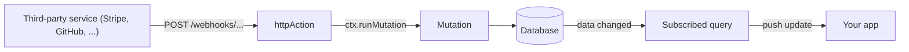

{/* diataxis: how-to */}

Let's be real, your webhooks don't care at all about the fancy sync protocol you're using. Services
like Stripe, GitHub, and your email provider all want exactly the same thing: to `POST` a bit of
JSON to a URL and get a quick response back.

That's exactly where `httpAction` and a standard `http.ts` router come into play. They give you a
clean, no-fuss HTTP endpoint that's fully wired into the exact same reactive engine powering the
rest of your app. Let's walk through how to build one.



<Steps>

<Step>

### Write the handler with httpAction

Think of `httpAction` as an [action](/docs/core-concepts/actions) that speaks raw HTTP rather than
relying on typed arguments. It takes a standard Web `Request` as input and returns a `Response`, but
under the hood, it behaves just like any regular action.

- You can call `ctx.runQuery(ref, args)`, `ctx.runMutation(ref, args)`, or `ctx.runAction(ref,
  args)`. Each of these fires off a fresh, independent top-level run, just like you would expect in
  a normal action.
- Native browser APIs like `fetch`, `Date.now()`, `Math.random()`, and your standard timers all work
  perfectly.

<Callout type="warn" title="No ctx.db">
  An `httpAction` does not run inside a transaction. If you need it to read or write data, you will
  have to call a query, mutation, or action using one of the three methods mentioned above.
</Callout>

```ts title="concile/http.ts"
import { httpAction, httpRouter } from "./_generated/server";

export const receiveWebhook = httpAction(async (ctx, request) => {
  const body = (await request.json()) as { author: string; body: string };
  await ctx.runMutation("messages:send", { author: body.author, body: body.body });
  return new Response(JSON.stringify({ ok: true }), {
    status: 200,
    headers: { "content-type": "application/json" },
  });
});
```

You can pass either a simple handler function or a `{ handler }` object to `httpAction`. You won't
find an `args` or `returns` validator option here like you do with `query`, `mutation`, or `action`.
That is because your input is a raw `Request` rather than a validated argument object. You will need
to parse and validate the body yourself, just like you would in any standard HTTP framework.

Since the handler doesn't have access to `ctx.db`, you will need to handle actual data writes
through `ctx.runMutation`. That mutation handles creating a write set and instantly fans out updates
to any subscriptions currently watching the `messages` table (you can learn more about this in
[Reactivity](/docs/core-concepts/reactivity)). This pattern is the foundation for every webhook you
build in concile. You take HTTP in, use a mutation to handle the write, and get reactive fan-out
updates for free.

</Step>

<Step>

### Register it in http.ts

A typical `concile/http.ts` file usually has a default export of an `httpRouter()` that is populated
with your `route()` calls. This is exactly how the engine finds and sets up your endpoints when your
app loads:

```ts title="concile/http.ts"
import { httpRouter } from "./_generated/server";
import { receiveWebhook } from "./webhooks";

const http = httpRouter();

http.route({ path: "/webhooks/messages", method: "POST", handler: receiveWebhook });

export default http;
```

Every time you call `route()`, you need to provide exactly one of either `path` or `pathPrefix`,
along with an HTTP `method`:

- **`{ path, method, handler }`**: This is for exact matches. The incoming request's path has to
  match your `path` exactly, character for character.
- **`{ pathPrefix, method, handler }`**: This handles prefix matches. As long as the request's path
  starts with your `pathPrefix`, it will match. For example, `pathPrefix: "/webhooks/"` will
  comfortably match both `/webhooks/messages` and `/webhooks/anything`.

If you try to pass both, or if you forget to pass either one, the system will throw an error when
registering the routes, telling you that ``http.route requires exactly one of `path` or `pathPrefix`
``.

Also, keep in mind that your `handler` needs to be a named export from one of your app modules,
specifically something created by `httpAction(...)`. If you try to register an inline arrow function
or a reference that cannot be resolved, your project will fail to load with a message like this:

```
http.route handler for "/webhooks/messages" must be an exported httpAction
(declare it as a named export of an app module)
```

</Step>

<Step>

### Understand match precedence

If an incoming request happens to match more than one of your registered routes, the system figures
out which one to use in a very predictable way:

1. The HTTP method always has to match. If you register a route for `POST`, it will never
   accidentally catch a `GET` request to that same path, whether it is an exact or prefix match.
2. An exact `path` match always beats any `pathPrefix` route, even if the prefix is highly specific.
   The system checks for exact matches first and returns the result right away.
3. When looking at multiple `pathPrefix` routes, the longest matching prefix takes the win. So,
   `pathPrefix: "/webhooks/stripe/"` will beat out `pathPrefix: "/webhooks/"` if the request is
   heading to `/webhooks/stripe/invoice`.

```ts title="concile/http.ts"
http.route({ path: "/webhooks/stripe/health", method: "GET", handler: healthCheck });
http.route({ pathPrefix: "/webhooks/stripe/", method: "POST", handler: stripeHook });
http.route({ pathPrefix: "/webhooks/", method: "POST", handler: genericHook });
```

With those three routes registered:

| request | winning route | why |
|---|---|---|
| `GET /webhooks/stripe/health` | `healthCheck` | exact `path` beats any prefix |
| `POST /webhooks/stripe/invoice` | `stripeHook` | longest matching prefix wins |
| `POST /webhooks/messages` | `genericHook` | only `/webhooks/` matches |

There's no support for named path parameters (`/webhooks/:id`). A route only ever knows the exact
path or a prefix it starts with, so a handler that needs the rest of the path reads it itself, from
`new URL(request.url).pathname`.

An unmatched `{method, path}` combination, whether there's no exact match, no prefix match, or one
of the reserved built-ins below already claimed it, falls through to a plain `404`.

</Step>

<Step>

### Know the reserved paths

`/api/*` and any path whose first segment starts with `_` (for example `/_dashboard`,
`/_admin/anything`) belong to the engine: the sync WebSocket, `/api/run`, `/api/health`, file
storage's `/api/storage/*`, the admin API, and the dashboard all live there.

`route()` rejects a conflicting registration at registration time, before your `http.ts` can ever
shadow a built-in:

```ts
http.route({ path: "/api/foo", method: "GET", handler: whatever });
// throws: http.route path "/api/foo" is reserved (/api/* and /_* belong to the engine)
```

A malformed `http.ts` fails loudly and immediately this way, rather than silently never firing or,
worse, intercepting traffic meant for the engine. The reservation is a single predicate: the path is
`/api`, starts with `/api/`, or matches `/^\/_/`. So `/apix` is fine (it doesn't start with
`/api/`), but `/api`, `/api/`, and anything under `/api/...` are all rejected.

</Step>

<Step>

### Call it

The endpoint is just HTTP. No client SDK required:

```bash
curl -X POST https://your-deployment/webhooks/messages \
  -H "content-type: application/json" \
  -d '{"author": "webhook", "body": "hello from the webhook"}'
```

Any client already subscribed to a query over the `messages` table, a `useQuery(api.messages.list)`
in a running app, for example, receives the update the moment this request's inner mutation commits.
No polling, no extra wiring on the client side. This is the same reactive fan-out any mutation gets,
whether it's called from the client SDK, another function, the scheduler, or, as here, a webhook.

</Step>

</Steps>

## Reading the caller's identity

<Callout type="warn" title="No built-in verification">
  If the request carries an `Authorization: Bearer <token>` header, that raw token is passed
  straight through to the handler's context as its identity. concile does not decode, validate, or
  look up the token for you. It's handed to your handler exactly as the caller sent it.
</Callout>

If you need to check a webhook's authenticity (an HMAC signature, a shared secret, a provider's own
signing scheme like Stripe's `Stripe-Signature` header or GitHub's `X-Hub-Signature-256`), verify it
yourself inside the handler, reading whatever header the provider actually signs with, before
calling `ctx.runMutation`. This is exactly what you'd do in any other HTTP framework. `httpAction`
doesn't add or remove anything here.

## Hot reload

`concile dev`'s watch loop re-resolves `http.ts` on every save, exactly like it reloads your
queries, mutations, and actions. The dev server exposes a `setRoutes(routes)` method that the reload
path calls with the freshly-resolved route table, and the very next request sees the new routes.
Nothing in the running WebSocket sync connections, active subscriptions, or in-flight mutations is
disturbed. Only the HTTP route table itself is swapped in place.

You can add, remove, or repoint a `http.route()` call and see it live within one reload cycle, with
no server restart. Same DX as editing a query or mutation.

## Going deeper

<Accordions type="single">

<Accordion title="Components can contribute reserved routes too">

You never write this yourself unless you're authoring a component, but it's worth knowing it exists.

An opt-in composed component (declared via `concile.config.ts`) can register its own reserved
routes, for example an OAuth provider's callback endpoint, or a notification provider's delivery
webhook, through a `httpRoutes` entry on its component definition:

```ts
interface ComponentHttpRoute {
  method: string;
  pathPrefix: string;
  /** A bare httpAction module name within this component's own modules. */
  handler: string;
}
```

These are mounted by the boot core, not by your app's `http.ts`. Your app cannot declare a route
under a reserved prefix, and a component cannot declare one outside a reserved prefix. The rules,
enforced both when the component is defined and again when it's composed into a project:

- The `pathPrefix` must live under `/api/` or `/_`, the same reserved namespace your own routes are
  barred from, inverted: a component route may only live there.
- The `pathPrefix` must have at least two path segments (for example `/api/mycomponent/`, never bare
  `/api/` or `/_`). This structural floor makes a component accidentally shadowing the entire
  reserved namespace impossible by construction, even if the engine's own reserved-prefix list is
  ever incomplete.
- It must not collide, in either direction, with a built-in engine prefix (`/api/run`,
  `/api/health`, `/api/sync`, `/api/storage/`, `/_admin/`, `/_fleet/`, `/_dashboard`). A component
  can't register something more specific or more general than any of these.
- Two composed components' route prefixes may not overlap either, one being a prefix of the other
  for the same method, so that's rejected when components are composed together. First-match-by-
  declaration-order is never ambiguous.

Component routes are matched by prefix, in declaration order, ahead of your app's own `http.ts`
routes. A component handler parses any sub-path itself (for example `<provider>/<phase>`), since
routes here carry no named parameters, matching how your own routes work.

For an ordinary app, this is invisible: composing a component that ships one just works, without
anything in your own `http.ts`. File storage's own `/api/storage/*` endpoints (upload, confirm,
serve) are the always-on, built-in-rather-than-composed example of the same mechanism. See [File
storage](/docs/core-concepts/file-storage).

</Accordion>

</Accordions>

## What's not here

<Callout type="info" title="Non-goals">

A few things a general-purpose HTTP framework offers are deliberately not part of `httpAction` and
`http.ts`, and aren't planned:

- **Streaming request or response bodies.** A handler reads the whole request body and returns a
  whole `Response` body. There's no chunked or streaming I/O in either direction.
- **Automatic CORS.** If a browser needs to call your endpoint cross-origin, set the
  `Access-Control-*` headers yourself in the `Response` you return (and handle `OPTIONS` yourself if
  you need a preflight).
- **Named path parameters** (`/webhooks/:id`). Routes match on an exact path or a prefix only. Read
  anything beyond the matched prefix from the request's own URL inside the handler.
- **Per-route middleware.** There's no chain of route-scoped `use()` handlers. Cross-cutting
  concerns like auth checks, logging, or rate limiting go inside the handler itself, or as a shared
  helper function each handler calls.

If you need any of these, build it inside the handler body. The primitives (`Request`, `Response`,
`ctx.runQuery`/`runMutation`/`runAction`) are the same ones a hand-rolled Node or Bun HTTP server
would give you.

</Callout>

## Related

- [Actions](/docs/core-concepts/actions): the non-deterministic execution model `httpAction` shares,
  including `ctx.runQuery`/`runMutation`/`runAction` semantics.
- [Mutations](/docs/core-concepts/mutations): the only way a webhook's data actually gets written.
- [Reactivity](/docs/core-concepts/reactivity): why a write from a webhook shows up in a live query
  with no extra code.
- [File storage](/docs/core-concepts/file-storage): `_storage`'s own reserved `/api/storage/*`
  routes are an example of the same reserved-route mechanism, built into the engine rather than a
  component.
