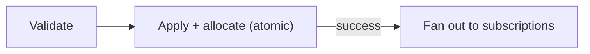

{/* diataxis: explanation */}

Mutations are your go-to functions for writing data. Actually, they're the *only* place in your entire Concile app where you're allowed to make changes. While queries just sit back and read data, and actions don't even get access to `ctx.db`, mutations are custom-built specifically for writing.

No matter where the call comes from, whether it's a client request, a scheduled job, a webhook, or a background trigger, every single data write in your app is going to happen inside a mutation.

## Defining a mutation

To define a mutation, you will pass it a context object (`ctx`) and any optional arguments you need. It then gives you back a value:

```ts title="concile/messages.ts"
import { v } from "@concile/values";
import { mutation } from "./_generated/server";

export const send = mutation({
  args: { author: v.string(), body: v.string() },
  returns: v.id("messages"),
  handler: (ctx, args) => ctx.db.insert("messages", { author: args.author, body: args.body }),
});
```

- **`args`** is a validator, which is just a record of `v.*` fields. You do not have to declare it, but you really should. If something doesn't match up, like a wrong type, a missing required field, or an unexpected extra field, the system will reject it with a typed `ArgumentValidationError` (code `ARGUMENT_VALIDATION`, HTTP 400). This happens **before the handler even has a chance to run**. If you leave `args` out completely, your mutation will accept anything you pass to it, just like a regular function without a validator.
- **`returns`** is another optional validator. It does not actually coerce or check anything while your code is running. Instead, it gives you **codegen** powers. The generated `api` will know the exact type of your mutation's returned value. This is super helpful because it lets typed [optimistic updates](/docs/client/optimistic-updates) know exactly what shape of data they are dealing with before the real commit finishes.
- **`handler`** is where the actual writing happens using `ctx.db`. This is the special power that queries do not get to use!

## Argument validation is one chokepoint

We enforce validation in one single spot, right at the top of `InlineUdfExecutor.run()`. This happens before any transactions open up and before your handler gets called. Every possible entry point goes through this check. Whether it is a WebSocket mutation call from a client, a `POST /api/run` request, an inner `ctx.runMutation` inside an action, or a scheduled job, they all play by the same rules. None of these will ever reach your handler with arguments that have not been validated.

```ts title="concile/messages.ts"
export const send = mutation({
  args: { conversationId: v.id("conversations"), body: v.string() },
  handler: (ctx, args) => ctx.db.insert("messages", { conversationId: args.conversationId, body: args.body }),
});
```

If you try to call `send` without a `body`, with an extra `foo` field, or with a `conversationId` that is not a valid id string, you will get the exact same type of error. The caller will be stopped in their tracks before they ever reach `ctx.db.insert`:

```
ArgumentValidationError: arguments to "messages:send" do not match validator: body: missing required field
```

You can use `v.optional(...)` if you have arguments that might not always be there. There is just one exception to this rule. Because `httpAction` takes a raw `Request` instead of JSON arguments, it does not have an `args` validator.

## Writing data

When you are working inside a mutation, `ctx.db` acts as a writer. It can do everything a query's reader can do, like `get`, `query(table, index).collect()`, and `.paginate()`. You can read all about those in [Queries](/docs/core-concepts/queries). On top of that, it gives you three methods specifically for writing:

```ts
ctx.db.insert(table, value): Promise<Id<table>>
ctx.db.replace(id, value): Promise<void>
ctx.db.delete(id): Promise<void>
```

<TypeTable
  type={{
    insert: {
      type: '(table, value) => Promise<Id<table>>',
      description: (
        <>
          Inserts a brand new document and hands back its <code>_id</code>. We handle assigning both <code>_id</code> and{' '}
          <code>_creationTime</code> for you automatically, so you can read about how that works below. You should never pass these in the{' '}
          <code>value</code> yourself unless you are intentionally providing a client-minted{' '}
          <code>_id</code>. We will go over that trick later on this page!
        </>
      ),
    },
    replace: {
      type: '(id, value) => Promise<void>',
      description: (
        <>
          Completely swaps out all the fields in a document using its <code>_id</code>. If we can't find the document, this will throw a{' '}
          <code>DocumentNotFoundError</code>.
        </>
      ),
    },
    delete: {
      type: '(id) => Promise<void>',
      description: (
        <>
          Deletes a document based on its <code>_id</code>. Do not worry if the document is already missing, this will just silently do nothing instead of throwing an error.
        </>
      ),
    },
  }}
/>

<Callout type="warn" title="There is no ctx.db.patch()">

You will only find `insert`, `replace`, and `delete` available. Remember that `replace` expects the *entire* document, not just a partial update. If you want to tweak just a single field, you need to read the document first and then write back all of its fields, whether you changed them or not.

</Callout>

```ts title="concile/items.ts"
export const toggle = mutation({
  args: { id: v.id("items"), done: v.boolean() },
  handler: async (ctx, { id, done }) => {
    const doc = await ctx.db.get(id);
    if (doc === null) return;
    await ctx.db.replace(id, { listId: doc.listId, label: doc.label, done });
  },
});
```

## Write validation

If your target table has a schema set up using `defineTable({...})` in your `schema.ts` file, we double check every `insert` and `replace` against it before setting up the write. If your value has the wrong type, is missing a required field, or includes extra fields not in the schema, it will get rejected with a `DocumentValidationError` (code `DOCUMENT_VALIDATION`). When this happens, your entire handler's transaction rolls back completely, just like it would for any other error. Keep in mind that this check is completely separate from argument validation. While `args` makes sure the *caller* sent the right stuff, write validation verifies what your *handler* is actually trying to save. These can definitely be different, especially if your handler calculates or adds default fields that the caller never provided.

If you have an older table or one without a validator, it will just skip this check altogether. Write validation only steps in if your table has a schema, which means it will never break your older tables that were made before this feature existed.

## One serializable transaction

The entire handler in a mutation runs as one **serializable transaction**. When it reads data, it looks at a perfectly consistent snapshot captured at the transaction's `snapshotTs`. Any write it makes gets staged in an in-memory buffer that no one else can see until the handler finishes successfully. Interestingly, if you use `ctx.db.get` inside the very same handler, you actually *will* see your own staged writes! Then, everything commits all at once. If the handler hits an error and throws, none of the writes go through. You never have to worry about partial writes. If your mutation inserts three rows and then crashes, absolutely nothing gets saved.

This all-or-nothing approach gives our engine the perfect moment to trigger reactivity, which is the commit itself. You never have to guess when a write took place, because a mutation either completely finishes during its commit or it basically never happened.

### The commit pipeline

Behind the scenes, the process of committing your mutation's staged writes happens under the shard's single-writer mutex in two neat steps. First it validates everything, and then the store atomically grabs a timestamp and applies your writes all at once.

1. **Validate**: The system asks if any newer commits have changed the data your transaction just read. The engine compares your transaction's *validated* read set, which includes everything you read using `ctx.db.get` or an index scan, with all the recent commits. If there is a clash, the commit gets aborted and throws an `OccConflictError` (code `OCC_CONFLICT`, HTTP 409). Don't worry though, because this is retryable! This approach is known as optimistic concurrency control (OCC). Instead of locking rows right from the start, our engine just looks for actual conflicts when it is time to commit.
2. **Apply and allocate, atomically**: The store safely grabs a commit timestamp and immediately appends all of your inserts, replacements, and deletions to the document log. It handles this in one seamless step. It even links each row's `prev_ts` to its latest *committed* revision. Thanks to the single-writer lock, this is totally free of race conditions. There is absolutely no in-between state where a timestamp is created but the writes have not landed yet.



Once both of those steps finish successfully, the engine will figure out the final write set and broadcast it out to any active subscriptions. If you want a really deep dive into this pipeline, be sure to check out [How it works](/docs/get-started/how-it-works). You can also look at [Reactivity](/docs/core-concepts/reactivity) to learn more about how the broadcast side of things operates.

### OCC conflicts replay your handler, deterministically

If the validation process spots a conflict, the engine won't just give up on your mutation. Instead, it will **replay your handler**. It runs your code again from the very beginning using a fresh snapshot of the data. By default, it will try this up to 8 times after the first attempt, meaning it could run up to 9 times in total. Most of the time, the caller will never even know this happened! They will just see a single mutation call that eventually succeeds. If it runs out of retries, it will finally let the `OccConflictError` bubble up.

This replay mechanism relies entirely on mutations being **deterministic**, which we will talk about next. If running the same handler with the same updated data could result in a totally different sequence of writes, our OCC retry system would not work properly at all. That is exactly why the purity rules we discuss below are not just style guidelines. They are incredibly important for keeping the commit pipeline running smoothly!

## Mutations are deterministic, like queries

Mutations have to follow the exact same purity rules as queries. That means you cannot use `fetch`, `Date.now()`, `Math.random()`, or `crypto.randomUUID()`. Our engine depends on your code to perform the exact same writes every single time it runs with the same arguments and data. This consistency is crucial for the OCC replay feature we just discussed, and it is a key piece of machinery that the rest of the system relies on.

If your mutation really does need the current time or a random value, we have you covered! You can use `ctx.now()` and `ctx.random()` instead of the usual `Date.now()` or `Math.random()`. These values stay exactly the same for the entire life of your transaction and across any replays, so they won't shift around between attempts. If you have a task that simply cannot be made deterministic, like making a network call, generating a true UUID, or needing a fresh clock read every time, you should put that inside an [action](/docs/core-concepts/actions) instead.

## The commit produces the write-set

Whenever a mutation successfully commits, the engine keeps a precise list of which rows were inserted, replaced, or deleted. We call this the **write-set**. The engine then checks this write-set against the recorded read-sets of all your subscribed queries. A query will only bother to refresh if the mutation actually changed data that the query cares about. This simple overlap check is the heart of our entire reactive engine! You can read all about this in [How it works](/docs/get-started/how-it-works) and [Reactivity](/docs/core-concepts/reactivity) if you want to know the whole story.

## `_id` and `_creationTime`

We automatically add two special system fields to every document, so you don't have to worry about them:

- **`_id`**: A unique identifier that gets created fresh whenever you insert a document. If you use `replace`, this stays exactly the same as the original document because an `_id` can never be changed once it is set.
- **`_creationTime`**: This captures the transaction's exact snapshot timestamp the moment the document is inserted. Just like the id, it gets carried forward unchanged if you ever `replace` the document.

You should never try to set these directly inside the `value` you pass into your `insert` or `replace` functions. If you try it on a `replace`, the system will just ignore your values and keep the document's real ones. If you try to pass a `_creationTime` during an `insert`, it will be outright rejected. However, if you pass an `_id` during an `insert`, the system will assume you are trying to use a client-supplied id and will validate it carefully, which we will cover in a bit.

<Callout type="warn" title="Same-transaction inserts share one _creationTime">

Your `_creationTime` comes from the transaction's single `snapshotTs`, rather than a fresh clock reading for each row. This means that if you insert multiple documents during *the exact same mutation call*, they will all end up with the exact same `_creationTime`. If you are inserting a bunch of rows in one handler and need to know what order they were created in later, `_creationTime` just won't cut it. The default `by_creation` index will try to break ties using the row's random `_id`, which doesn't really give you a useful order. If you want a reliable order for documents made in the same transaction, you should add your own explicit ordinal or sequence field like this:

</Callout>

```ts title="concile/steps.ts"
export const createSteps = mutation({
  args: { workflowId: v.id("workflows"), labels: v.array(v.string()) },
  handler: async (ctx, { workflowId, labels }) => {
    // All three rows below share one _creationTime. `order` is what actually orders them.
    for (let i = 0; i < labels.length; i++) {
      await ctx.db.insert("steps", { workflowId, label: labels[i], order: i });
    }
  },
});
```

## Sharding: `shardBy`

You can set up a **shard key** for a table in its schema by using `.shardKey("fieldName")`. This is super cool because it routes every document in that table to one of your deployment's shards based on the value of that specific field! This is actually the underlying magic that makes Tier-2 multi-node scaling work. If you have a table without a `.shardKey()`, it is considered **unsharded**. In that case, all of its documents live happily on the single **default ring**, which happens to be exactly where every mutation runs unless it specifically asks to use sharding.

If you are writing a mutation that touches a sharded table, you have to let us know which shard it should route to by using `shardBy`:

```ts title="concile/schema.ts"
export default defineSchema({
  conversations: defineTable({ title: v.string() }),
  messages: defineTable({
    conversationId: v.id("conversations"),
    author: v.string(),
    body: v.string(),
  })
    .index("by_conversation", ["conversationId"])
    .shardKey("conversationId"),
});
```

```ts title="concile/messages.ts"
export const send = mutation({
  args: { conversationId: v.id("conversations"), author: v.string(), body: v.string() },
  returns: v.id("messages"),
  shardBy: "conversationId",
  handler: (ctx, args) =>
    ctx.db.insert("messages", { conversationId: args.conversationId, author: args.author, body: args.body }),
});
```

Here is the quick breakdown! `shardBy` is just a field name taken from your `args`, or you can provide a function like `(args) => value`. We figure it out and hash it to a specific shard **before** your transaction even begins. During the build process, our codegen double-checks your string `shardBy` against the table's `.shardKey()`. Then, when your app is running, our engine enforces shard ownership rules across every tier, even if you are just on a single node. Keep in mind that if your table does not have a `.shardKey()`, none of this matters. Your mutations will run normally as if they were completely unsharded, just like they did before this feature was introduced.

If you are curious about the exact rules for ownership and the specific error messages we send when things go wrong, you can find all that info under **Shard ownership rules** in the Going deeper section below!

## Client-supplied ids

Normally, `ctx.db.insert` will cook up a random `_id` for you. However, your mutation can optionally take a **client-minted** id instead and pass it right through as the `_id` in your insert value. The engine is smart enough to validate it and use yours instead of generating a new one:

```ts title="concile/conversations.ts"
export const create = mutation({
  args: { _id: v.optional(v.string()), name: v.string() },
  handler: (ctx, args) => ctx.db.insert("conversations", args),
});
```

Your client can mint a real id locally using the typed `mintId` helper. It has the exact same format and 128-bit security as an id made by the engine! This helper comes from the `concile codegen` process, which also runs automatically when you push using `concile dev`, and it gets saved right into `_generated/ids.ts`:

```ts
import { mintId } from "../concile/_generated/ids";

const conversationId = mintId("conversations");                                   // a real Id<"conversations">, minted now
await client.mutation(api.conversations.create, { _id: conversationId, name });   // can enqueue offline
await client.mutation(api.messages.send, { conversationId, body });               // references it, also offline
```

This is the perfect pattern for an **offline create-then-reference chain**. You just mint the id before you send either mutation, give it to both of them, and they can queue up in the durable [offline outbox](/docs/client/offline-sync). When the queue finally drains, the creation runs first because it is first-in, first-out. That way, the reference mutation will cleanly hook up to a real row in your database. Just keep in mind that `mintId` only knows about your **app's own tables**. It purposefully ignores component and system tables, which means trying to run `mintId("_storage")` might compile fine, but it will definitely throw an error when you try to run it.

If you want to read about the exact steps the engine uses to validate things during an insert, the v1 restriction that limits this to unsharded tables on the default ring, or the purity rules for combining a client-supplied id with an optimistic update, you will find all the details in the **Going deeper** section below.

## Calling component facades from a mutation

Whenever you add a component to your project in `concile.config.ts`, its functionality gets attached to `ctx` using that component's name. For components that are allowed to make writes, you can use them right from inside your mutation's transaction. This is awesome because their writes will commit and roll back perfectly with the rest of your handler!

```ts title="concile/reminders.ts"
export const remind = mutation({
  args: { taskId: v.id("tasks"), delayMs: v.number() },
  handler: async (ctx, { taskId, delayMs }) => {
    await ctx.db.replace(taskId, { ...(await ctx.db.get(taskId))!, reminded: true });
    // Scheduling a job is a write into the scheduler's own tables. It's staged in THIS
    // transaction, so it rolls back with everything else above if the handler later throws.
    await ctx.scheduler.runAfter(delayMs, api.reminders.fire, { taskId });
  },
});
```

Your mutation can also interact with several other composable facades! You get access to `ctx.auth` for identity and session data, `ctx.authz` for permission checks, and `ctx.storage` for managing file metadata like `getUrl`, `getMetadata`, and `delete`. Just a heads up, the actual byte reading and writing methods are strictly for actions! You can also reach `ctx.workflow` and `ctx.notifications`. Each of these has its own dedicated space for its tables and starts out read-only unless the component is specifically set up to allow writes during mutations. You should check out each component's page for more details. The [File storage](/docs/core-concepts/file-storage) guide and the client documentation are great places to learn about the most powerful mutation-friendly tools available to you.

## Calling a mutation from a client

Over on the client side, `useMutation` gives you back a handy callback that is bound to a strongly typed function reference:

```tsx
import { useMutation } from "@concile/client/react";
import { api } from "../concile/_generated/server";

function Composer({ author }: { author: string }) {
  const send = useMutation(api.messages.send);

  return (
    <button onClick={() => void send({ author, body: "hello" })}>
      Send
    </button>
  );
}
```

When you call it, your app sends the mutation over the sync connection and then waits for the commit to finish before resolving. Any changes from the write will automatically show up in your app wherever a live query happens to look at that data. This even includes the exact same component if you have subscribed to it using `useQuery`! If you want to learn about the full client toolkit, including how to use `withOptimisticUpdate` to show changes instantly or how the durable offline outbox works, take a look at the [Client SDK](/docs/client/client-sdk), [Optimistic updates](/docs/client/optimistic-updates), and [Offline sync](/docs/client/offline-sync) guides.

## Going deeper

<Accordions type="single">

<Accordion title="Shard ownership rules">

Our engine is pretty strict about shard ownership at every level. If something is off, it will definitely let you know by rejecting the request:

- If you try to write to a sharded table from a mutation that doesn't use `shardBy`, it will get rejected. The system will tell you that the mutation is running on the 'default' shard and cannot write to sharded tables.
- If you try to write a document to a sharded table but its shard-key value does not hash to the shard your mutation claimed, it will get rejected. The engine knows the document belongs to a different shard!
- It is important to know that the shard-key field is **immutable after insert**. If you try to change it using a `replace` command, the system will reject it and remind you that you need to delete the document and make a new one if you really want to move it to a different shard.
- Unsharded tables always live on the default ring. You can technically use `insert` on them from any shard since a brand new insert will not conflict with concurrent writes. However, if you want to `replace` or `delete` an existing row, you have to do it from a mutation with no `shardBy` set, which means you must be on the default ring. If we allowed cross-ring edits, you could end up silently losing your updates!

</Accordion>

<Accordion title="Client-supplied id validation, in order">

The engine is smart enough not to just trust a supplied `_id` without verifying it first! When you use `ctx.db.insert`, it runs a series of checks in a specific order:

1. If it is not a properly formatted document id string, it throws an `InvalidClientIdError` (code `INVALID_CLIENT_ID`).
2. If the id belongs to a *completely different* table than the one you are trying to write to, it throws an `InvalidClientIdError` and tells you exactly which table the id really belongs to.
3. If the table is sharded or the mutation is not on the default ring, you will see another `InvalidClientIdError`. We talk more about this v1 restriction in the next section!
4. If a document already exists with that exact id, whether it was already committed or just inserted earlier in the *very same* transaction, it will throw an `IdAlreadyInUseError` (code `ID_ALREADY_IN_USE`).

Keep in mind that there is no upsert feature here. If there is a collision, it is always a hard rejection instead of a sneaky silent overwrite.

</Accordion>

<Accordion title="v1 restriction: unsharded tables, default ring only">

Right now, you can **only** use a client-supplied `_id` for an unsharded table, which means no `.shardKey()`. You also have to insert it from a mutation that is running on the **default** shard without a `shardBy` rule. The engine checks both of these things before it even bothers looking to see if the document exists!

This is not just some random limitation, it is actually about concurrency safety. The existence check works like a snapshot read that is completely isolated to *your transaction's own shard*. In a sharded setup, each shard operates in its own little bubble with its own snapshot and recent-commit history. If two people tried to insert the *exact same* client-supplied id on *different* shards at the exact same time, both shards would look around, see nothing there, and commit the write. You would end up with a silent duplicate identity! By forcing this process onto a single ring, the existence check is perfectly safe and reliable across the whole table.

So, here is the rule of thumb: **never try to shard-route a mutation if you are inserting with a client-supplied `_id`.** It won't break 100% of the time, but it will only work if your shard key magically hashes to the default ring. The rest of the time, it will just reject your request. Please treat this as entirely unsupported rather than just a flaky feature. Support for using client-supplied ids with sharded tables is something we plan to build in the future, but it is not available yet.

</Accordion>

<Accordion title="Purity rule for optimistic updates">

When you want to pair a client-supplied id with an [optimistic update](/docs/client/optimistic-updates), you need to mint it **outside** of the actual updater. Just do it once when you are putting your arguments together! Then, make sure your updater reads that id directly **from the args** instead of trying to mint a new one itself. Minting requires using random numbers, and your updater needs to stay perfectly pure so it can be safely run over and over again on every ingest. It behaves just like `store.placeholderId()` or `store.now()` in that regard:

```ts
const conversationId = mintId("conversations"); // minted OUTSIDE the updater, once

const create = useMutation(api.conversations.create).withOptimisticUpdate((store, args) => {
  // inside the updater: read the id FROM args; never call mintId() here
  const list = store.getQuery(api.conversations.list, {});
  if (list === undefined) return;
  store.setQuery(api.conversations.list, {}, [...list, { _id: args._id, name: args.name }]);
});

await create({ _id: conversationId, name });
```

</Accordion>

</Accordions>
