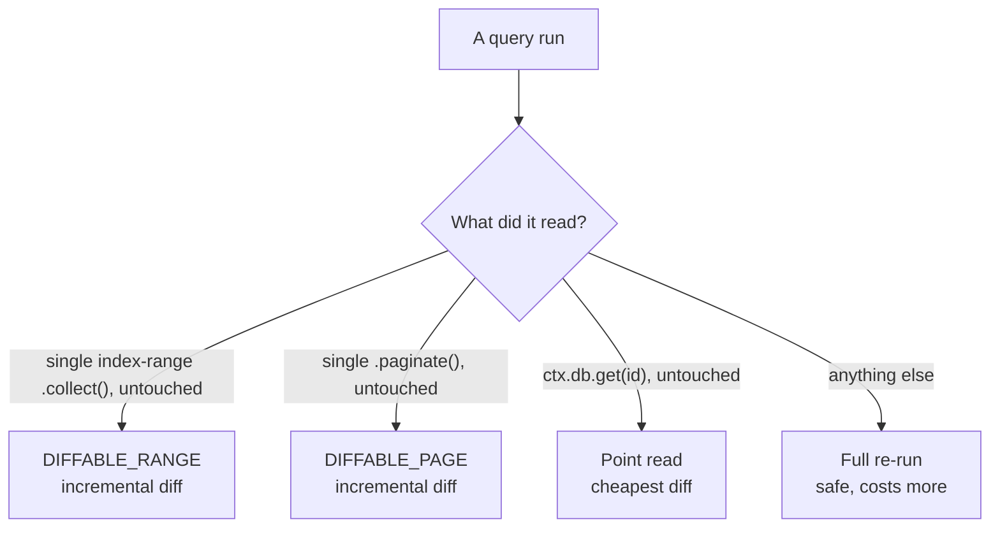

{/* diataxis: explanation */}

A query is basically just a function that reads your data. But more importantly, it's the exact
function type your application subscribes to. In short, if you want to understand how your Concile
app stays fully reactive and live, you need to understand queries!

Let's walk through everything you need to know. We'll cover the query builder, `ctx.db.get`,
pagination, cursors, `scanCapped`, and exactly which types of queries get to take the speedy
incremental reactivity path instead of doing a full re-run.

## Defining a query

The `query({ args, returns, handler })` function takes your validated arguments and a handler.
Inside the handler, you get a `QueryCtx`. The only thing this context can do is access `ctx.db`,
which gives you a **read-only** handle to your database:

```ts title="concile/messages.ts"
import { v } from "@concile/values";
import { query } from "./_generated/server";

export const list = query({
  args: { conversationId: v.id("conversations") },
  handler: (ctx, args) =>
    ctx.db
      .query("messages", "by_conversation")
      .eq("conversationId", args.conversationId)
      .order("desc")
      .collect(),
});
```

- **`args`** makes sure the query's arguments are valid before the handler even runs. This part is
  completely optional. If you skip it, your query will accept anything. However, if you declare it,
  you get a solid runtime check. If someone sends the wrong type, forgets a field, or adds an extra
  one, the request gets blocked before it reaches your code. Plus, it gives you perfectly typed
  arguments on your generated client `api`.
- **`handler`** is where you actually read data using `ctx.db`. You can write it as a sync or
  `async` function. Both work perfectly fine because a query never waits on anything unpredictable,
  which we will touch on in the [Determinism](#determinism-why-queries-cant-touch-the-outside-world)
  section below.
- **`returns`** is an optional way to describe what your result should look like. Right now, it does
  not actually check the return value at runtime. It just helps with types and generating code. This
  is exactly what allows the generated client `api` to know the precise type of a query's result. It
  is also how a typed [optimistic update](/docs/client/optimistic-updates)'s
  `OptimisticLocalStore.setQuery` figures out the shape of the data it is working with.

Just remember that queries cannot write data. You will not find `ctx.db.insert`, `replace`, or
`delete` on a `QueryCtx`. Those write methods only live inside a mutation, which you can read more
about in [Mutations](/docs/core-concepts/mutations). If you find yourself needing to fetch data
right before writing, just do the reading directly inside your mutation. Queries and mutations do
not call each other directly. Instead, you would use `ctx.runQuery` from an
[action](/docs/core-concepts/actions) to bridge them.

## The query builder

When you call `ctx.db.query(table, indexName)`, you open up a builder for a specific index on a
table. Every single table comes with a `by_creation` index right out of the box, which sorts things
by creation order. This is on top of any custom indexes you define in your `schema.ts`. If you want
to dive deeper, check out [Schema & tables](/docs/core-concepts/schema-and-tables):

```ts
ctx.db.query("messages", "by_creation").collect();          // whole table, oldest first
ctx.db.query("messages", "by_conversation").eq("conversationId", id).collect();
```

The builder's methods:

| Method | What it does |
|---|---|
| `.eq(field, value)` | Narrow to an exact key. Chaining `.eq` on successive index fields builds a compound-key prefix. |
| `.gt(field, value)` / `.gte(field, value)` | A lower bound on the next (non-equality) index field. `.gt` is exclusive, `.gte` is inclusive. |
| `.lt(field, value)` / `.lte(field, value)` | An upper bound on that same field. `.lt` is exclusive, `.lte` is inclusive. |
| `.order("asc" \| "desc")` | Scan direction. Default is `"asc"` (oldest/lowest first). |
| `.where(op, field, value)` | A **post-filter**: evaluated after the index narrows the scan, not part of the index range itself. `op` is one of `eq`, `neq`, `lt`, `lte`, `gt`, `gte`. Multiple `.where()` calls AND together. |
| `.take(n)` | Cap the number of documents `.collect()` returns. |
| `.collect()` | Run the scan; returns the matching documents as an array. |
| `.paginate({ cursor, pageSize, maxScan? })` | Run the scan as one page; see [Pagination](#pagination) below. |

You might notice there is no `.first()` method. If you just want one document, you can either use
`.take(1)` and grab the first item from the array, or use `ctx.db.get` if you already know the ID.
The `get` method is usually simpler and gives you a cheaper reactivity path under the hood. You can
read more about this in the [Reactivity classification](#reactivity-classification) section below.

<Callout type="info" title="Choosing an index">

The index name is actually the second argument you pass to `.query()`. From there, you can chain
range methods like `.eq`, `.gt`, `.gte`, `.lt`, and `.lte` right off the builder itself:

```ts
ctx.db.query("messages", "by_conversation").eq("conversationId", id)
```

</Callout>

### Index range scans

The fields in an index work together to create a compound key. When you use `.eq()` on each field in
the exact order they are defined, you build up a key **prefix**. Once you are done with equalities,
you can pick one last field to apply a bound to, like `.gt`, `.gte`, `.lt`, or `.lte`. This helps
you narrow down a specific range within your prefix. For instance, if you have an index on
`["conversationId", "priority"]`:

```ts
ctx.db.query("messages", "by_conversation_priority")
  .eq("conversationId", id)
  .gte("priority", 2)
  .lte("priority", 5)
  .collect();
```

Behind the scenes, this translates into one continuous chunk in the index. The database looks for
exactly where `` `conversationId == id` `` and `` `2 <= priority <= 5` ``. It scans this segment
directly, which is way faster than checking every single row. If you try to add a constraint on a
field that is out of order, or if you try to bind a second field, the range scan will not work. In
those cases, you should use a `.where(...)` clause. The query will still run perfectly, acting as a
post-filter on top of whatever range the index managed to grab.

It is also worth noting that every index key secretly ends with `_creationTime` followed by `_id`.
This little detail, covered more in [Schema & tables](/docs/core-concepts/schema-and-tables),
ensures every key is unique. It also keeps your pagination cursors perfectly stable, even if you
have duplicate field values.

### `ctx.db.get`

If you have an `_id`, you can use `ctx.db.get(id)` to look up a single document. It will hand back
the document if it finds it, or `null` if the document does not exist or has been deleted:

```ts
export const getMessage = query({
  args: { id: v.id("messages") },
  handler: (ctx, args) => ctx.db.get(args.id),
});
```

This is known as a point read, which is the tightest read set you can make. As we will see shortly,
it is absolutely the cheapest and most efficient way to read a document when you already know its
ID.

## Determinism: why queries can't touch the outside world

Queries absolutely have to be **deterministic**. This means that if you run a query twice on the
exact same data, you should always get the exact same result back. Because of this, you cannot use
things like `fetch`, `Date.now()`, `Math.random()`, `crypto.randomUUID()`, or `setTimeout` inside
your handler. We do not provide these capabilities in `ctx`, but since the code currently runs
in-process, you technically could reach out and grab these globals. There is no active block
catching this yet, though we are building a V8-isolate executor to prevent it completely. For now,
it will just quietly break your reactivity, so you really need to stick strictly to the rule. If
your query honestly needs the current time or a random number, you can use `ctx.now()` and
`ctx.random()`. These are deterministic alternatives that freeze their values for the duration of
the request, ensuring your query always behaves the same way when re-run.

We are not just adding restrictions to be annoying. This specific rule is exactly what makes the
reactive system so reliable. The engine handles subscriptions by re-running a query and trusting the
output. If a query could change its answer while the data stayed the same, like if it fetched
something from the web or checked the clock, the engine would get very confused. It would not know
if your database updated or if your code just felt like doing something different. If you genuinely
need to do something unpredictable like a network request or setting a timer, that logic should live
in an [action](/docs/core-concepts/actions). Actions run completely outside the database transaction
and your subscriptions.

## The read set: what a subscription is made of

When your query runs, the engine pays close attention to exactly which parts of the index you
access. Whether you look at an entire range or just check a single document with `ctx.db.get`, the
database writes down this exact scope. We call this the **read set**. It is not just tracking that
you touched a specific table. It gets incredibly precise, mapping out exactly which byte keys you
looked at in the index. This read set essentially becomes your subscription. When a mutation updates
data later, the engine checks to see if the changes overlap with any active read sets. If they do,
it re-runs those specific queries. You can read a lot more about how this matching happens in [How
it works](/docs/get-started/how-it-works) and [Reactivity](/docs/core-concepts/reactivity).

Because of how the query builder is designed, you should keep two big things in mind:

- **When you collect without a limit, you record the entire scanned area.** This includes the space
  after your very last matching row. If a new document is inserted anywhere in this broad range,
  your subscription will wake up, even if the new row would naturally sort to the end.
- **When you use `.take(n)`, you only record the exact portion you consumed.** Your range stops
  exactly at the last row you returned. Since the query literally stopped reading at that point, any
  new row that lands outside your slice will not trigger a wake-up. This is perfect for a top-N
  list, but it means you will not get live updates for new items appended to the end. If you want to
  see those late additions, you should either drop the `.take()` limit or set up a way to re-query.

Keep in mind that every scan records a range, even if it is unbounded. If you do an unfiltered
`by_creation` scan across a whole table, the engine registers the full length of the index. This
means any write to the table will wake up your query. It works perfectly, but it is extremely broad.
For queries that somehow manage to record zero ranges, there is a helpful fallback that matches
based on the whole table instead. To keep your subscriptions nimble and reduce unnecessary updates,
you should try to narrow your queries using `.eq`, `.gt`, `.gte`, `.lt`, or `.lte` whenever
possible. If you are curious about the technical details at commit time,
[Reactivity](/docs/core-concepts/reactivity#table-level-fallback) has you covered.

## Pagination

Using `.paginate({ cursor, pageSize, maxScan? })` lets you pull just one page of data rather than
grabbing the entire matching set at once:

```ts title="concile/messages.ts"
export const page = query({
  args: { conversationId: v.id("conversations"), cursor: v.union(v.string(), v.null()), pageSize: v.number() },
  handler: (ctx, args) =>
    ctx.db
      .query("messages", "by_conversation")
      .eq("conversationId", args.conversationId)
      .paginate({ cursor: args.cursor, pageSize: args.pageSize }),
});
```

The result is a `PaginationResult`:

<TypeTable
  type={{
    page: {
      type: 'DocumentValue[]',
      description: "This page's documents.",
    },
    nextCursor: {
      type: 'string | null',
      description: 'Opaque cursor; pass it back in to get the next page. null on the last page.',
    },
    hasMore: {
      type: 'boolean',
      description: 'false on (and only on) the last page.',
    },
    scanCapped: {
      type: 'boolean',
      description: 'true only when maxScan stopped the scan before pageSize was filled.',
    },
  }} />

<Callout type="info" title="Pagination fields">

You pass `cursor` and `pageSize` as top-level fields right into `.paginate()`, rather than wrapping
them in a nested options object. When you get your data back, it will give you a `hasMore` boolean
that flips to `false` when you hit the end, along with a `nextCursor` to help you fetch the next
batch.

</Callout>

### Cursors

Think of a cursor as a special string. It is just a base64-encoded index key. For your very first
page, you can pass `cursor: null` or just leave it out entirely. When you are ready for the next
page, just feed back the `nextCursor` you got from the previous result. Since index keys are
perfectly unique, ending with `_creationTime` and `_id`, your cursor locks in a precise spot in the
database. When you fetch the next page, it will pick up right after that spot, or right before it if
you are going backward. It completely ignores anything that might have been added, removed, or
changed in the meantime.

This clever trick makes your pages **contiguous under live edits**. Imagine you are reading page one
while someone else is aggressively writing to the database. When you finally ask for page two, you
still get a perfectly clean slice of data. There will not be any missing gaps, and you will not see
duplicate items across your pages. If a new record sneaks in between your page boundaries, it just
shows up wherever it naturally fits. You are not looking at a frozen snapshot of the past. Instead,
you are taking a smooth and stable walk through live data.

You will not find a dedicated pagination hook on the client, like `usePaginatedQuery`. That is
because pagination is honestly just a regular query. To make it work in your app, simply keep your
cursor in your component's state and pass it into `useQuery`. When it is time to load more data,
just update the state with your new cursor.

### `maxScan` and `scanCapped`

If you want to limit how much work the database does in one go, you can use `maxScan`. It restricts
how many index entries a `.paginate()` call actually looks at, completely separate from your
`pageSize`. This is especially handy if you have a `.where()` filter that excludes most items. If
you do not cap it, your query might keep scanning endlessly through a massive index just trying to
fill up your requested page. Leave it out, and the database will just keep looking until the page is
full or it runs out of data.

If the engine hits your `maxScan` limit before filling up the page, the result will have
`scanCapped` set to `true`. Your `nextCursor` will cleverly point to the exact spot where the scan
gave up, rather than the last match it found. This ensures that when you ask for the next page, you
pick right back up where you left off, rather than accidentally skipping over unscanned data.
Naturally, `hasMore` will also be `true` here, because there is a good chance more items are waiting
just beyond the limit.

Our dashboard's data browser actually uses this trick. We set a `maxScan` of 1000 for browsing
tables. If a page comes back with `scanCapped`, we display a helpful message letting the user know
they hit a limit and should tighten their filters. It is a much better user experience than quietly
returning half a page and pretending everything is fine. If you are building an interface that pages
through heavily filtered data, you should definitely consider using a similar pattern.

## Reactivity classification

Here is the simple version of how this works. Some query shapes are easy for the engine to handle
and get very cheap incremental updates. More complex queries will trigger a safe full re-run. They
are both entirely correct approaches. The only real difference is how much they cost to execute.

To get a bit more technical, the engine looks at your query to see how "clean" the data pass-through
actually is. Based on that check, it decides if future updates can be cleverly **diffed** into your
existing results, which is cheap and fast, or if it has to fall back to a **full re-run**. A full
re-run is perfectly safe, but it means paying the performance price of running your handler all over
again and sending back the complete data set.



- **A basic `.collect()` on a single index range, returned exactly as-is,** gets flagged as a
  `DIFFABLE_RANGE`. This means no `.take()`, no extra reading on the side, and no messing with the
  array before returning it. If a write happens in this range, the engine just sends over a quick
  diff showing what to add, edit, remove, or move.

  The engine checks this by looking at object identity, not the actual content. The array you get
  from `.collect()` has a secret invisible tag on it. If you use `.slice()`, `.filter()`, `.map()`,
  or a `[...spread]`, you strip that tag away and create a brand new array. Doing that forces a full
  re-run, even if the new array looks exactly like the old one. We cannot safely check the content
  itself, because a filter that seems harmless right now might silently drop a row later that a diff
  would have otherwise caught.

- **A plain `.paginate()` call, returned exactly as-is,** becomes a `DIFFABLE_PAGE`. This applies
  the same pass-through logic, but for the whole `PaginationResult` object. The key interval you
  grabbed on the first load gets locked in and diffed just like a normal range. Only the `.page`
  items get updated by future writes. Your `nextCursor`, `hasMore`, and `scanCapped` values stay
  frozen exactly as they were when you first loaded them. Do not panic if your page suddenly has
  more or fewer rows because of live edits. That is the correct and expected behavior.

- **A simple `ctx.db.get(id)`, returned exactly as-is,** takes its very own fast path. A point read
  like this just asks if a specific document changed or not. This is by far the cheapest reactivity
  classification available.

- **Anything else will trigger a full re-run.** If you use `.take()`, if your handler reads multiple
  things, if you transform your data before returning it, or if you apply a dynamic read policy, you
  get a full re-run. Even a `scanCapped` page skips the diff path. That is because a capped scan
  leaves a weird gap of unchecked data between where it found matches and where it gave up scanning.
  A diff just cannot safely guess what is in that gap, so it plays it safe and re-runs the whole
  thing.

Do not worry too much though. None of these rules change the actual data your query returns. They
just dictate how fast and cheap it is to send updates to your subscriptions. If you want to keep
things extremely efficient under heavy load, try to stick to these diffable shapes. Returning a
single index range `.collect()` or `.paginate()` directly will keep your app running smoothly, just
like narrowing your search space keeps things precise.

## Using a query from a client

When you switch over to the client side, you can subscribe to your queries using the `useQuery` hook
along with your generated, fully-typed `api`:

```tsx
import { useQuery } from "@concile/client/react";
import { api } from "../concile/_generated/server";

function Messages({ conversationId }: { conversationId: string }) {
  const messages = useQuery(api.messages.list, { conversationId });
  if (messages === undefined) return <p>Loading…</p>;
  return <ul>{messages.map((m) => <li key={m._id}>{m.author}: {m.body}</li>)}</ul>;
}
```

Your component will automatically re-render all on its own whenever the query results change. That
is the grand payoff of everything we just covered. If you want to explore the full client surface,
head over to the [Client SDK](/docs/client/client-sdk) guide.

<Callout type="info" title="Bundling for the browser?">

The actual runtime `api` value lives directly in `_generated/server`, whereas `_generated/api.d.ts`
is purely for types. When you are bundling for a browser, you probably want to avoid pulling in all
the server-side code that file brings with it. To fix this, you can just cast the client's `anyApi`
proxy by doing `const api = anyApi as Api`. The
[tutorial](/docs/get-started/tutorial#build-the-web-ui) walks you through this exact pattern and
explains exactly why it is so helpful.

</Callout>
