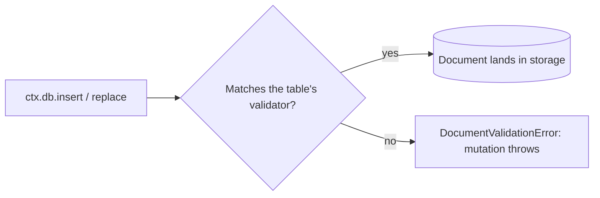

{/* diataxis: explanation */}

Think of your schema like a bouncer at the door of your database. It checks the shape of every
single document before letting it inside, and firmly turns away anything that just doesn't fit the
vibe.

A Concile schema is basically just one TypeScript file. It lists out every table in your database
along with the exact shape of the documents each one holds. Your editor gets it, the compiler
understands it, and Concile enforces it right at write time. If a document doesn't match its table's
shape, it gets rejected before it ever reaches storage!

You won't find any separate migration languages or DDL files here. The schema you write is exactly
what the engine checks against, and that is pretty much it.



## Defining a schema

Your `concile/schema.ts` file default-exports a `defineSchema` call. This function maps table names
to your `defineTable` definitions:

```ts title="concile/schema.ts"
import { defineSchema, defineTable, v } from "@concile/values";

export default defineSchema({
  conversations: defineTable({
    title: v.string(),
  }),
  messages: defineTable({
    conversationId: v.id("conversations"),
    author: v.string(),
    body: v.string(),
  }).index("by_conversation", ["conversationId"]),
});
```

The `defineTable(fields)` function takes an object that maps field names to a **validator**, and it
returns a `TableDefinition`. You can then chain `.index(...)` and `.shardKey(...)` calls right onto
it. We will cover both of those a bit later.

Next up, `defineSchema(tables, options?)` takes your map of tables. The second optional argument is
`{ schemaValidation?: boolean }`, which is set to `true` by default. If you change it to `false`,
you turn off write-time document validation for the entire schema. When you do this, every table
becomes unchecked, which is pretty much like giving every table a `v.any()` for its shape. Keep in
mind that there is no per-table override. It is only a schema-wide switch, and you would usually
only use it to relax validation temporarily rather than as a normal way to run your app.

## Documents and system fields

We call a row a **document**. Every single document on every table (even the ones you didn't define
yourself, which we discuss in the [System tables](#system-tables) section below) automatically comes
with two system fields that you never have to set yourself:

- **`_id`**: This is a globally unique, typed id. For a `messages` document, it looks like
  `Id<"messages">`, which is exactly what `v.id("messages")` checks for. At runtime, an id is really
  just a string. The `Id<TableName>` type acts as a compile-time brand, meaning that
  `Id<"messages">` and `Id<"users">` are treated as different types even though they are both
  strings under the hood. If you pass a user id where a message id is expected, you get a type error
  instead of a nasty runtime surprise.
- **`_creationTime`**: This is a number representing the time the document was inserted.
  Interestingly, it comes from the mutation's own transaction snapshot time, rather than a simple
  `Date.now()`. This approach keeps everything deterministic, just like everything else a mutation
  touches.

concile handles assigning both of these on insert. In addition, every table gets a built-in
`by_creation` index (which sorts by creation order) completely for free. This explains why
`ctx.db.query("messages", "by_creation").collect()` works perfectly even if you haven't declared any
indexes in your schema.

## The `v.*` validator catalog

Every field you define in `defineTable` is described by a validator that you build from the `v`
namespace, imported straight from `@concile/values`.

Validators actually do two main jobs. First, they check a value at runtime, making write enforcement
possible. Second, they carry the TypeScript type that flows right into `Doc<"table">`, function
`args` or `returns`, and the generated types for the client using `Infer<typeof validator>`.

Here are the validators you will likely reach for every day:

<TypeTable
  type={{
    "v.string()": {
      description: "A string.",
      type: "string",
    },
    "v.number()": {
      description: "64-bit float. Alias: v.float64().",
      type: "number",
    },
    "v.boolean()": {
      description: "A boolean.",
      type: "boolean",
    },
    "v.id(table)": {
      description:
        "A typed reference to another table's document, or the same table for self-references.",
      type: 'Id<"table">',
    },
    "v.optional(inner)": {
      description: "Marks a field as allowed to be absent. See optional fields below.",
      type: "Infer<inner> | undefined",
    },
    "v.object({ ...fields })": {
      description: "A nested object. See object semantics below.",
      type: "{ ...fields }",
    },
    "v.array(element)": {
      description: "A homogeneous array. Every element is checked against element.",
      type: "Array<Infer<element>>",
    },
  }} />

The rest of the catalog (`v.int64()` or `v.bigint()`, `v.null()`, `v.bytes()`, `v.literal(value)`,
`v.union(...members)`, `v.record(keys, values)`, and `v.any()`) lives over in the [configuration
reference](/docs/reference/configuration), which serves as your canonical quick-lookup guide. We
will also walk through some examples for `v.literal`, `v.union`, and `v.record` below.

It is worth noting that a table's document shape (the object you pass into `defineTable`) is
implicitly wrapped in `v.object(fields)` under the hood. The `defineTable` function builds that
validator for you automatically.

### Object semantics

`v.object({...})` (and by extension, every table) enforces an **exact shape**. It does not just look
for "at least these fields":

- If a property's validator is not wrapped in `v.optional(...)`, it is completely **required**. Any
  document missing it will be rejected with a `missing required field` error.
- Any extra property on the value that **is not** listed in the validator's field list will also be
  rejected with an `unexpected extra field` error. Objects are treated as closed rather than open.
  You cannot just smuggle extra data onto a row by slipping it in.

Both of these checks run recursively. A nested `v.object({...})` field enforces these exact same
rules one level down, and array elements are checked by their position like `tags[0]`, `tags[1]`,
and so on.

### Optional fields

Using `v.optional(inner)` is the only way to allow a field to be absent. It can wrap around any
other validator like this:

```ts
defineTable({
  title: v.string(),
  assigneeId: v.optional(v.id("users")), // may be omitted, or present as an Id<"users">
})
```

A field wrapped in `v.optional` is considered present only when the property exists on the object
**and** is not `undefined`. This means both `{ }` and `{ assigneeId: undefined }` count as "absent"
for validation purposes. But when it is present, the value gets checked against the inner validator
just like normal.

Keep in mind that `v.optional` is specifically a *field* modifier, not a general purpose "maybe
undefined" wrapper. It only really makes sense as a value in the object you pass to `defineTable` or
`v.object`. If you want to say "this value itself could be null," rather than "this key might be
absent," you should reach for something like `v.union(v.string(), v.null())` instead.

### Unions and literals together

You can combine `v.literal` and `v.union` to create the common "enum" pattern you might be used to:

```ts
defineTable({
  status: v.union(v.literal("open"), v.literal("closed"), v.literal("archived")),
})
```

The `v.union` validator tries each member's `check` in order, and it accepts the value if any one of
them passes. Overlapping members, such as `v.union(v.string(), v.any())`, are perfectly legal. They
are just a bit redundant.

### `v.record` vs `v.object`

You should reach for `v.object` when you already know the field names ahead of time. This is the
normal case for most tables you will build.

On the other hand, `v.record(keys, values)` is great when a field acts like a map with an
open-ended, data-driven set of keys. A perfect example would be per-locale strings keyed by a locale
code that you really do not want to hardcode and enumerate:

```ts
defineTable({
  translations: v.record(v.string(), v.string()), // { en: "Hello", fr: "Bonjour", ... }
})
```

Every key gets checked against your `keys` validator, and every value gets checked against the
`values` validator. Unlike `v.object`, there is no fixed field list that you have to worry about
violating.

## Document validation at write time

Validation is not just a handy type-level convenience. The engine actually runs each table's
validator against every value passed into `ctx.db.insert` or `ctx.db.replace`. It does this right
inside the mutation's transaction, well before the write ever lands. If a value fails, it gets
rejected with a `DocumentValidationError` and the mutation throws an error. This ensures nothing
partially commits.

The failure details are built from a list of `ValidationFailure`s, which are shaped like this:

```ts
interface ValidationFailure {
  path: string;    // a dotted path to the offending node, e.g. "messages.body" or "tags[0]"
  message: string; // e.g. "expected string", "missing required field", "unexpected extra field"
}
```

The engine is smart enough to surface up to the first three failures, joining them into a single
message. Because of this, a single bad write tells you everything wrong with it all at once, saving
you from having to fix and retry field by field:

```
document in "messages" does not match schema: body: expected string; author: missing required field
```

<Accordions type="single">

<Accordion title="Why validation works the same everywhere">

You don't have to write a table's document validator twice to handle both the runtime check and the
type. It is derived just once.

The fields in `defineTable` build a live `Validator` by using `v.object(fields)`. What actually gets
stored as the table's schema is the result of that validator's `.toJSON()` method, creating a
serializable `ValidatorJSON`. Later, `validatorFromJson` reconstructs a live, checkable `Validator`
from that JSON, relying on the exact same `v.*` builders.

This means the validator running inside a transaction on a real server is never just a
reimplementation of the one in your `schema.ts` file. It is the exact same concrete class, properly
rehydrated. This cool trick also lets `concile deploy` figure out schema compatibility purely from
JSON without having to re-execute your TypeScript code, which we explain more in the [Schema
evolution](#schema-evolution) section below.

</Accordion>

</Accordions>

## Indexes

An index is a great way to let a query find documents efficiently instead of scanning through the
entire table. You can declare one by chaining `.index(name, [fields])` directly off `defineTable`:

```ts title="concile/schema.ts"
messages: defineTable({
  conversationId: v.id("conversations"),
  author: v.string(),
  body: v.string(),
}).index("by_conversation", ["conversationId"]),
```

Once that is set up, a query can ask for exactly the messages in a specific conversation by using
that index name, which saves you from reading the whole table and re-running on every single write:

```ts
ctx.db.query("messages", "by_conversation").eq("conversationId", args.conversationId).collect()
```

It is nice to know that every table, even one without any `.index(...)` calls, also receives a
built-in `by_creation` index sorted by creation order. That is why calling `ctx.db.query("table",
"by_creation").collect()` always works out of the box. Fun fact: it is also the same index the
dashboard's data browser uses to list out your rows.

### Unique indexes

You can use `.index(name, fields, { unique: true })` to declare an index as unique. Right now, this
is only enforced as a real unique constraint (like a `CREATE UNIQUE INDEX` that rejects duplicate
inserts) on the Cloudflare D1 adapter, which backs [`.global()` tables](#global-tables-cloudflare).
If you are using the default SQLite or Postgres adapters, the flag gets recorded in your schema but
does not enforce a write-time constraint. So it is best not to rely on it there. Instead, you should
enforce uniqueness right in your mutation by reading first before you insert.

Indexes actually matter for a lot more than just query planning. They are the key to making
reactivity precise. A subscription's read set is expressed in terms of the index range it actually
touched. Because of this, a write will only refresh the subscriptions if it falls inside their
recorded range. This means a query narrowed down to one specific `conversationId` will never refresh
for writes happening in a completely different conversation.

If you are curious about the read-set and write-set model this relies on, take a look at [How it
works](/docs/get-started/how-it-works). You can also check out
[Queries](/docs/core-concepts/queries) to see how a query actually uses an index during a read.

## Sharding: `.shardKey(field)`

By calling `.shardKey(field)`, you mark one field on a table as its **shard key**. This acts as a
reserved seam that lets a table's writes spread out across multiple independent single-writer shards
instead of funneling through just one, which is super useful at Tier 2 scale:

```ts title="concile/schema.ts"
messages: defineTable({
  conversationId: v.id("conversations"),
  author: v.string(),
  body: v.string(),
})
  .index("by_conversation", ["conversationId"])
  .shardKey("conversationId"),
```

If you are at Tier 0 or 1 (the default single `concile dev` or `serve` process), `.shardKey` is just
metadata. There is exactly one shard named `"default"`, and your app behaves identically to an app
that never even declared a shard key.

This field becomes load-bearing once a mutation that writes to the table also declares `shardBy`
(which routes to a shard based on that field's value) and your deployment actually runs on multiple
shards. After that, every write for the same shard-key value is guaranteed to land on the exact same
single-writer shard for its entire life. This guarantee is exactly what makes cross-shard write
parallelism perfectly safe. Be sure to check out [Scaling](/docs/deploy/scaling) for the complete
story on write-sharding, including the fleet and Cloudflare multi-shard routers that take advantage
of this setup.

<Callout type="warn" title="Client-supplied ids and sharding">

If a table has a `.shardKey`, it will not support client-supplied `_id`s (you can read more about
this in the [Client-supplied ids](#client-supplied-ids) section below). A supplied id cannot bind
the shard-key value right up front, so it is best to let the server handle minting ids for any
sharded tables.

</Callout>

## Global tables (Cloudflare): `.global()`

Adding `.global()` like `defineTable(...).global()` marks a table as **global data** on the
Cloudflare deployment target. This means its rows live in a single D1 database shared across every
shard, rather than being owned by one specific shard. That setup makes cross-shard reads and
globally unique indexes totally possible there. Keep in mind that this is mutually exclusive with
`.shardKey()` since global data is, by its very nature, not sharded. Also, this feature is specific
to Cloudflare. If you are on a deployment without a D1 binding, trying to read or write to a
`.global()` table will fail fast with a clear error instead of silently landing in your local store.
Have a look at the [Cloudflare](/docs/deploy/cloudflare) guide for the full rundown on global
tables.

## System tables

You might notice that some tables are built right into concile itself instead of being declared in
your `schema.ts` file. The main one right now is `_storage`, which acts as the metadata table for
the file-storage feature. Every project gets this table automatically, even if you never actually
use file storage.

These system tables are treated as **first-class** citizens. This means `Id<"_storage">` and
`v.id("_storage")` will type-check in your schema just like a reference to any table you defined
yourself. Our code generation tools merge these system tables into your `DataModel` before your own
tables, making sure the types are always ready when you need them.

```ts title="concile/schema.ts"
export default defineSchema({
  photos: defineTable({
    caption: v.string(),
    image: v.id("_storage"), // a reference to a built-in system table, just like any other v.id()
  }),
});
```

You can refer to [File storage](/docs/core-concepts/file-storage) to see the row shape for
`_storage` and learn about the `ctx.storage` API that relies on this table.

## `Id<T>` as a typed reference

Using `v.id("otherTable")` is a great way to model a relationship, kind of like a foreign key in the
relational world. Its TypeScript type is simply `Id<"otherTable">`. Since the brand is specific to a
table, trying to use the wrong table's id where another is expected will give you a helpful compile
error:

```ts
defineTable({
  conversationId: v.id("conversations"), // must be an Id<"conversations">, not any other table's id
})
```

When running your code, the `check` function only verifies that the value is a string. Ids are just
opaque, encoded strings, and they are not validated against the referenced table's actual contents
at write time. This means a dangling reference pointing to a deleted document is definitely
possible. It becomes your app's responsibility to handle it, much like dealing with a foreign key
that lacks an `ON DELETE` action.

The awesome type safety and knowing exactly "which table" is involved are the main benefits that
`v.id` provides. If you want to enforce true referential integrity, you will need to handle that in
your application logic. Most of the time, this means checking if the referenced document exists, or
cascading your deletes within the same mutation.

## Client-supplied ids

In most situations, the server handles minting every `_id` right when you insert. However,
offline-first apps sometimes need to reference a row before the mutation creating it has even run.
For example, you might create a conversation offline and then immediately queue a message into it,
without having to wait for the create request to round-trip. To handle scenarios like this, the
client can mint a real id right up front and pass it in explicitly:

```ts title="concile/conversations.ts"
export const create = mutation({
  args: { _id: v.optional(v.id("conversations")), title: v.string() },
  handler: (ctx, { _id, title }) => ctx.db.insert("conversations", { _id, title }),
});
```

The engine is careful to validate a client-supplied `_id` before actually using it, keeping an eye
out for two dedicated error codes:

- **`INVALID_CLIENT_ID`**: This pops up if the value is not a string, if it fails to decode as a
  document id, or if it decodes to a completely different table than the one you are inserting into
  (like passing an `Id<"users">` into a `conversations` insert).
- **`ID_ALREADY_IN_USE`**: This happens if a document with that `_id` already exists. It checks
  whether the document was committed earlier or even if it was inserted earlier in the very same
  transaction. The insert path does this check on every read.

You should know that client-supplied ids are **restricted to unsharded tables and must be inserted
from a mutation running on the default shard**. The existence check that prevents duplicate ids is
only globally sound when every insert lands on a single ring. Since per-shard snapshots in a sharded
table cannot see across rings, two concurrent inserts of the identical id on different shards could
accidentally both succeed. The engine enforces both of these restrictions by throwing the
`INVALID_CLIENT_ID` code along with a helpful error message explaining how to fix it.

In real life, you probably will never need to hand-decode ids yourself. The `concile codegen` tool
conveniently emits a typed `mintId` function over in `_generated/ids.ts` to do exactly this:

```ts
import { mintId } from "../concile/_generated/ids";

const conversationId = mintId("conversations"); // a real Id<"conversations">, minted client-side now
```

Be sure to read up on [Offline sync](/docs/client/offline-sync) to understand the full
create-then-reference pattern that this feature enables.

## Schema evolution

As your app grows, your schema is naturally going to change. To keep things safe, concile's live
deploy feature (`concile deploy`) enforces a strict **additive-only** rule. This ensures a schema
change never leaves a running deployment holding data that its own schema suddenly rejects. When you
deploy, the system diffs your new schema against the currently running one, carefully checking table
by table and field by field.

<Tabs items={['Accepted', 'Rejected']}>

<Tab value="Accepted">

You can deploy additive changes live without worrying about any migration steps:

- Adding a brand-new table works perfectly.
- Adding a brand-new field to an existing table is also fine, just as long as it is optional by
  using `v.optional(...)`. If you make it required, it would instantly reject every row that
  predates it.

</Tab>

<Tab value="Rejected">

Destructive changes will cause the deploy to be refused, keeping the running server on its current
schema instead:

- Removing or renaming a table is not allowed. From the point of view of the diff, a rename is
  essentially just a remove-plus-add where the old name disappears entirely.
- Changing a table's internal table number is also forbidden. This typically only happens if you
  remove and re-add a table, since ordinary edits never touch it.
- You cannot remove a field that existing rows might still carry.
- Changing a field's type is rejected, even if it looks like a safe widening (like changing
  `v.string()` to a union that includes strings, or changing `v.any()` to `v.string()`). The diff
  cannot definitively prove that a "widening" won't invalidate an existing row it cannot fully
  inspect. As a result, it rejects any type change rather than risking a dangerous mistake. Keep in
  mind that over-rejecting only fails a deploy; it will never corrupt your data.
- Turning a previously-optional field into a required one will fail too. Any existing rows that
  happen to omit it would immediately become invalid.

</Tab>

</Tabs>

<Callout type="info" title="No migration step">

When we say "destructive," it means the deploy is outright rejected rather than being run through
some magic converter. If you find yourself really needing a genuinely destructive change like
renaming a field or tightening a type, you should handle it explicitly within your own data. A good
strategy is to add the new shape as an additive change, migrate your data using your own mutation,
and then safely remove the old field in a later deploy once absolutely nothing depends on it.

</Callout>

Check out [Deploy and build](/docs/deploy/deploy-and-build) to see exactly how a live deploy applies
this gate end to end, and to learn what a rejected deploy actually leaves running.

## Physically schemaless storage

Beneath the surface of `schema.ts`, concile's storage is actually completely **schemaless**. Whether
you are using the SQLite or Postgres adapters, your app's tables and fields are treated as raw
*data*, not as strict DDL.

There is a small, fixed set of internal storage tables shared across every app. These act as an
append-only log of `{id, value, ...}` entries. The tables you declare, like `conversations` or
`messages`, exist merely as rows inside them and are distinguished by a table number.

When you add a field to `schema.ts`, it does not trigger an `ALTER TABLE` command behind the scenes
because there simply is no per-app table to alter. The new field just starts appearing, and getting
validated, in any newly-written documents.

This clever mechanism is what makes the additive-only rule discussed earlier a matter of pure
*validation*, rather than forcing a migration against physical storage. Nothing ever has to catch up
with a schema change since the storage layer never possessed app-shaped columns to begin with.

## Where to go next

- [Queries](/docs/core-concepts/queries): Dive into reading through an index and learn why the read
  set it records acts as the unit of reactivity.
- [Mutations](/docs/core-concepts/mutations): Discover the only place where `ctx.db.insert`,
  `replace`, or `delete` can run, which is also where document validation is strictly enforced.
- [Deploy and build](/docs/deploy/deploy-and-build): See how the additive-schema gate applies when
  you do a live `concile deploy`.
- [Scaling](/docs/deploy/scaling): Find out what `.shardKey` actually buys you once you start
  running on more than one shard.
- [Configuration reference](/docs/reference/configuration): Explore the same `v.*` catalog in a
  quick lookup format, right alongside `concile.config.ts` and environment variables.
