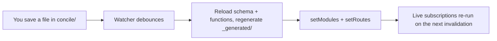

{/* diataxis: how-to */}

Think of `concile dev` as your app's personal dev server, but with a real backend under the hood
instead of just a mock. With a single command, you can load up your project, generate your types,
boot up the actual reactive engine, and serve everything on one port. Plus, it gives you hot reload
on every save!

This page gives you the full rundown on how to start the server, all the handy flags you can use,
and what the built-in dashboard can do for you.

## Start the dev server

From the root of your app (where the `concile/` folder lives):

```bash
npx concile dev
```

Under the hood, this single command takes care of five things in order:

1. **Loads your project.** It resolves `concile.config.ts` (for component composition), then reads
   `concile/schema.ts` and every function file inside the `concile/` directory.
2. **Generates `concile/_generated/`**: This creates the typed `api`, `Doc`, and `Id` helpers that
   your functions and client import.
3. **Boots the embedded engine** against a local SQLite database, or Postgres if you pass the
   [`--database-url`](#flag-reference) flag (more on that below).
4. **Serves everything on one port**: This includes the sync WebSocket (`/api/sync`), the `/api/*`
   HTTP surface, your `httpAction` routes, the `/_admin/*` admin API, and the dashboard at
   `/_dashboard`.
5. **Starts watching `concile/`** for changes, so it can hot-reload your functions every time you
   save (see [Hot reload](#hot-reload) below).

When it starts up, it prints the server URL, the dashboard URL, and the admin key:

```
concile dev → http://127.0.0.1:3000  (dashboard: http://127.0.0.1:3000/_dashboard)
admin key → 7f3a9c2e1b8d4f6a...
```

If you pass `--web <dir>`, it will also print out a web UI URL (`web UI → http://127.0.0.1:3000/`).
If the dashboard package hasn't been built yet, the server will still run, but it will print a quick
note instead of the dashboard URL:

```
(dashboard SPA not built: run `bun run --filter @concile/dashboard build`)
```

The process keeps running until you kill it with `Ctrl-C`. There is no separate step to stop it.

## Flag reference

Here is a look at every flag `concile dev` accepts:

| Flag | Default | What it does |
|---|---|---|
| `--port <n>` | `3000` | Sets the HTTP and WebSocket port. |
| `--ip <addr>` | `127.0.0.1` | Sets the bind address. `127.0.0.1`, `::1`, and `localhost` all count as loopback (see [Admin key](#admin-key) below). Anything else exposes the server on your network. |
| `--dir <path>` | `concile` | Tells the server where your schema and functions live. |
| `--data <path>` | `.concile/data.db` | Sets the SQLite database file path. This is ignored when `--database-url` is set. |
| `--web <dir>` | unset | Serves a static web UI (like a built frontend) alongside the API. `GET` requests that do not match `/api/*`, `/_admin/*`, or `/_dashboard` fall through to the files in this directory. |
| `--database-url <url>` | unset | Takes a `postgres://` or `postgresql://` connection string. When this is set, concile uses Postgres instead of SQLite; see [Postgres](/docs/deploy/postgres) for more. It can also be read from `CONCILE_DATABASE_URL`, though the flag takes priority. |
| `--storage-bucket <name>` | unset | Selects the S3-compatible file storage backend (using a bucket name). If left unset, it uses local filesystem storage under `<data dir>/storage`. It can also be read from `CONCILE_STORAGE_BUCKET`. |
| `--storage-endpoint <url>` | unset | Sets an S3-compatible endpoint (like MinIO, R2, etc.), which only matters if you also use `--storage-bucket`. It can also be read from `CONCILE_STORAGE_ENDPOINT`. |

A CLI flag will always override its environment variable equivalent if both are set.

<Callout type="warn" title="File storage is always on">

Every project automatically gets a `_storage` system table and `ctx.storage`. There is no opt-in
flag for it. The `--storage-bucket` and `--storage-endpoint` flags only choose which byte backend
will serve it.

Setting `CONCILE_STORAGE_ENDPOINT`, `REGION`, or `PUBLIC_URL` without a bucket is considered a
misconfiguration, and `concile dev` will refuse to boot from it. Otherwise, it would silently write
uploads to your local disk when you actually meant to configure S3. Make sure to set the bucket too,
or just drop the other settings.

Check out [File storage](/docs/core-concepts/file-storage) for the full story on byte storage.

</Callout>

By default, the dev server is not reachable from your local network. You can pass `--ip 0.0.0.0` to
expose it, which is super handy if you want to test from a phone on the same Wi-Fi network, for
instance.

### Runtime selection

The runtime is automatically detected. It uses Bun if you invoke the CLI under Bun, and Node
otherwise. There is no `--bun` or `--node` flag. Just run it with the runtime you prefer:

<Tabs items={['Bun', 'Node']}>

```bash tab="Bun"
bun concile dev
```

```bash tab="Node"
npx concile dev
```

</Tabs>

Bun is the main runtime here, but Node is fully supported too.

The Node path relies on the built-in `node:sqlite` module, which means it requires **Node.js 22.5 or
newer**. If you run into a `Cannot find module 'node:sqlite'` error, be sure to check your Node
version.

## Admin key

Every admin-gated area (like the `/_admin/*` API that the dashboard runs on, `/_admin/deploy`, and
`/_admin/wake`) is protected by a single bearer token known as the **admin key**.

- If `CONCILE_ADMIN_KEY` is set in your environment, `concile dev` uses it exactly as is.
- If it is left unset, `concile dev` generates a fresh ephemeral key on every run and prints it out.
  Nothing saves this key, so if you restart the server, you will get a new one.
- If `CONCILE_ADMIN_KEY` is set but is just blank or whitespace, `concile dev` treats it as unset. A
  blank key would authenticate everything, so it prints a warning before falling back to an
  ephemeral key.

<Callout type="warn" title="The key is only baked in on a loopback bind">

The ephemeral key is only ever embedded in the dashboard's HTML when the bind is loopback: `--ip
127.0.0.1` (the default), `::1`, or `localhost`.

On any other bind (like `--ip 0.0.0.0` or a real network interface), the dashboard is served without
the key baked in, even if the key itself is ephemeral. Instead, the app prompts you for it, and the
key you type is kept in `sessionStorage`.

This is done on purpose. An admin key baked into unauthenticated HTML is only safe when the only
thing that can reach that HTML is the same machine.

A persistent `CONCILE_ADMIN_KEY` is never embedded in the HTML, regardless of whether it is a
loopback or not.

</Callout>

## Hot reload

`concile dev` watches the `concile/` directory recursively using a filesystem watch. It ignores
anything under `concile/_generated/` so that the code generator's own writes do not accidentally
re-trigger themselves. Whenever you make a change, after a short debounce, this loop kicks in:



Here is a closer look at what it does:

1. It re-loads and re-pushes your project (including the schema, functions, and composed
   components), and catches any load errors. If there is a bad `schema.ts` or a syntax error, it
   prints `✗ reload failed: <message>` and keeps the previous, working set of functions running
   instead of crashing the server.
2. It re-writes `concile/_generated/` with the freshly generated types.
3. It calls `runtime.setModules(...)` with the new function map. This replaces the entire module map
   all at once. Because of this, `concile dev` re-applies the always-on `_storage:*` built-in
   functions on every reload. Since they are not part of your `concile/` source, they would
   otherwise disappear on the very first save.
4. It calls `server.setRoutes(...)` with the freshly resolved `http.ts` routes, which means
   `httpAction` changes take effect right away too.

If it succeeds, it prints `↻ pushed (<n> functions)`. Live subscriptions do not get dropped during a
reload. If a client is watching a query, it stays connected and just gets re-run against the new
function code the next time something invalidates it.

## Generate types without starting a server

```bash
concile codegen
concile codegen --dir concile   # if your functions aren't in ./concile
```

This command regenerates `concile/_generated/` and then exits without starting a server or a watch
loop. `concile dev` actually does this automatically on every change. You only need to run this
command explicitly before using [`concile serve`](/docs/deploy/self-hosting), which never runs
codegen itself. In fact, it fails right at boot if `_generated/` is missing.

## Call a function without the dashboard

There is no dedicated `concile run` command. You can either use the dashboard's [function
runner](#function-runner) or hit the HTTP API directly:

```bash
curl -X POST http://localhost:3000/api/run \
  -H 'content-type: application/json' \
  -d '{"path": "messages:list", "args": {"limit": 5}}'
```

The response looks like `{"value": …, "committed": …, "commitTs": "…"}`. The `value` is the
function's return value (encoded as JSON). The `committed` boolean tells you whether a mutation's
write actually landed. The `commitTs` is the commit timestamp formatted as a string, because
timestamps do not quite fit into a JSON number. If an `Authorization: Bearer <token>` header is
present, it gets passed through as the call's identity completely unchanged. Keep in mind that
`/api/run` does not do any token verification of its own.

There is also a simple health check you can run, which requires no authentication:

```bash
curl http://localhost:3000/api/health
# {"status":"ok","functions":12,"tables":4}
```

## The dashboard

Go ahead and open the URL that `concile dev` prints: `http://localhost:<port>/_dashboard`. In dev
mode on a loopback bind, the admin key is embedded right into the served HTML. This means it opens
straight into the app without prompting you for a login (check the [Admin key](#admin-key) section
above for when that is not the case).

The dashboard features three main views, which you can reach from the left sidebar: a **data
browser** for each table, a **function runner**, and a **logs viewer**.

### Data browser

Pick a table from the sidebar to open up a live view of its documents:

- **Live via a real subscription.** The data browser opens a WebSocket admin session and subscribes
  to `_admin:browseTable`. This is just an ordinary reactive query, using the exact same mechanism
  any other client uses. Whenever a mutation commits a write that affects what is on your screen,
  the table updates all on its own. There is no manual refresh button, and absolutely no polling
  happening.
- **Cursor pagination.** The Prev and Next buttons let you walk through the table page by page using
  the same opaque-cursor approach that every paginated query uses. If you are curious, see
  [Pagination](/docs/core-concepts/queries#pagination). Pages stay contiguous even while the table
  is being written to at the same time.
- **Structured filters.** You can add one or more `field / operator / value` conditions (like `eq`,
  `ne`, `lt`, `lte`, `gt`, `gte`) to narrow down the page. When you apply a filter, it re-issues the
  subscription with your new conditions instead of just filtering things on the client side.
- **A `scanCapped` banner.** The query running behind the scenes caps its scan at 1,000 examined
  index entries per page. If a heavily filtered query hits that cap before it can fill up the page,
  the browser will show "Scan limit reached: narrow the filter to see all results" instead of
  quietly returning a partial, potentially misleading page.
- **Row actions.** Click **Edit** to open up a document's non-system fields in a JSON editor and
  save your changes. This fires off a real `PATCH` request through the admin HTTP API
  (`/_admin/tables/<table>/docs/<id>`). This is an actual mutation against your database, not just a
  preview. The **+ New** button creates a document the exact same way with a `POST`, and **Del**
  removes one with a `DELETE`. None of these three call `invalidateQueries`. The live subscription
  is what reflects the write, just like any other client watching that data would see it happen.
- **The table list itself** (in the sidebar) loads once over plain HTTP using `GET /_admin/tables`.
  It only refreshes when you click its refresh icon. Since it is not a live subscription, a table
  you create or drop through a schema change will not show up until you refresh it manually.
  However, the document counts and the contents inside a selected table are completely live.

### Function runner

You can pick any query, mutation, or action from a dropdown (which populates from `GET
/_admin/functions`), tweak its arguments as JSON, and just click **Run**. The result, or any error
message that gets thrown, shows up right below as beautifully formatted JSON.

Under the hood, this calls the exact same `/_admin/run` admin endpoint as the `/api/run` HTTP call
we talked about [above](#call-a-function-without-the-dashboard). It just wraps it up in a nice UI.
You do not even need an `Authorization` header here, since the admin key is automatically attached
to every admin call.

### Logs

This view shows a table of your recent function executions, listing the path, kind (`query`,
`mutation`, or `action`), status, and duration in milliseconds. It refreshes every 2 seconds via
`GET /_admin/logs`. If an invocation fails, it displays the error message right inline next to the
`error` status badge. Keep in mind that this is a polling view, not a subscription. It is designed
for quick "did my last write actually run" sanity checks, not as a permanent log store.

<Callout type="warn" title="Security note">

The dashboard does not have any authentication of its own aside from the admin key. The admin key
grants total read and write access to your entire database, along with the ability to run absolutely
any function.

This is the right tradeoff for local development, which is why `concile dev` gives you the key with
zero friction on a loopback bind. Just remember to never expose an unprotected admin key over the
actual network.

When you use [`concile serve`](/docs/deploy/self-hosting), it serves the exact same dashboard build
in production. However, it does this without keys by default (meaning there is no key embedded in
the HTML, so it prompts you instead), and it requires you to set a real `CONCILE_ADMIN_KEY` before
it will even start up.

</Callout>

## Related

- [Quickstart](/docs/get-started/quickstart): Install concile and see the entire loop from end to
  end.
- [Self-hosting with Docker](/docs/deploy/self-hosting): `concile serve` is the production
  counterpart of `concile dev`. It features no code generation, requires an admin key, binds to
  `0.0.0.0`, and serves the dashboard without keys.
- [Deploying without a restart](/docs/deploy/deploy-and-build): `concile deploy` is great for
  pushing schema and function changes to an already running `serve` instance, completely bypassing
  the dev-only watch loop of hot-reload.
- [Vite plugin](/docs/deploy/vite-plugin): A Vite app can actually run `concile dev` for you as a
  built-in part of its own dev server.
- [Queries](/docs/core-concepts/queries): This covers the `.paginate()` and `scanCapped` contract
  that the data browser itself relies on.
