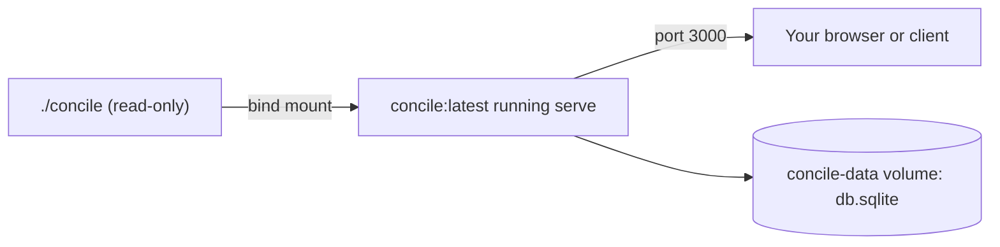

{/* diataxis: how-to */}

Think of `docker compose up` as the single magic command that brings your entire backend to life. It spins up the sync engine, the HTTP API, any `httpAction` webhooks, and the dashboard, all bundled into one container.

This is the standard way to self-host concile. We use a generic `concile:latest` image that runs `concile serve`. Your app's `concile/` folder gets mounted right in, and the SQLite database rests on a named volume to ensure your data sticks around between restarts.

On this page, we'll dive into `serve` itself, looking at how it differs from `dev` and reviewing all the flags and environment variables it uses. We'll also explore the included Docker setup, explain a couple of tricky fixes under the hood, check out the immutable-image option, and talk about what we intentionally leave for a reverse proxy to handle.

## `concile serve`: the production entrypoint

Think of `concile serve` as the grown-up, production-ready sibling to `concile dev`. It skips the file watcher and codegen-write features to give you some serious, solid production hardening instead.

Under the hood, they both run on the exact same boot core: `bootProject()` (found in `packages/cli/src/boot.ts`). This core handles loading the project, composing components, opening the store, and building out the `EmbeddedRuntime` and `AdminApi`. Whether you're in dev or serve mode, things like routes, drivers, boot steps, context providers, and table numbers are completely identical.

When it comes to how your functions run, like schedulers, workflows, actions, `httpAction`s, and triggers, there are no special features limited to just `dev` or `serve`. It's only the process-level behaviors wrapped around that shared core that actually change:

| | `concile dev` | `concile serve` |
|---|---|---|
| Codegen | Runs on every change, writes `_generated/` | **Never runs**, fails fast if `_generated/` is missing |
| Bind address | Loopback (`127.0.0.1`) | `0.0.0.0` by default |
| Admin key | Ephemeral, auto-generated, embedded in the dashboard HTML | **Required** (`CONCILE_ADMIN_KEY`), never embedded |
| File watching | Watches `concile/` and hot-reloads | None, restart (or `concile deploy`) to pick up changes |
| Shutdown | Ctrl-C exits immediately | `SIGTERM`/`SIGINT` trigger a graceful drain |

### Fail-fast checks, before anything binds

Before it even tries to open the store or bind a port, `serveCommand` checks a couple of quick things. If either check fails, it exits with an error code of `1` and gives you a clear, actionable message:

1. **You must provide a `CONCILE_ADMIN_KEY`, and it can't be blank.** There aren't any defaults or fallbacks here, and if you just pass in spaces, it treats it as completely empty.

   ```text
   ✗ CONCILE_ADMIN_KEY is required for `serve`: set it to a strong secret.
   ```

2. **The `<dir>/_generated/server.ts` file needs to exist already.** Unlike dev mode, `serve` won't run codegen for you. That step is best left to your build or CI pipeline instead of running every time you boot up in production. Make sure to generate and commit this file before you deploy:

   ```bash
   concile codegen --dir concile
   ```

   ```text
   ✗ concile/_generated not found: run `concile codegen --dir concile` and commit _generated/ before deploying.
   ```

### Binding and graceful shutdown

By default, `serve` binds to `0.0.0.0`, which is a bit different from `dev`'s loopback-only setup. We designed it this way so it can be reached from outside the container or host. To actually expose it to the public, you'll typically use a reverse proxy or Docker port mapping.

When it's time to stop, both `SIGTERM` and `SIGINT` kick off the exact same safe shutdown sequence. It's perfectly fine if it receives the signal twice. If a second signal comes in while it's already shutting down, it just ignores it quietly.

1. It stops the fleet node if you happen to be running one with `--fleet`.
2. It calls `server.close()`, which halts all registered drivers like the scheduler, triggers, reapers, and wake heartbeats, and securely closes any listening sockets.
3. It tries its best to release any object-storage lease if you're using `--object-store`. It gives this about 2 seconds, just to ensure an unreachable bucket doesn't cause a hang during the container's grace period.
4. It calls `store.close()` to properly shut down the database connection or file handle.
5. `process.exit(0)`.

This careful sequence is exactly why commands like `docker compose down` or `docker stop` result in a clean, graceful stop instead of an abruptly killed process. Those commands send a `SIGTERM` followed by a `SIGKILL` after a short grace period. Thanks to our shutdown steps, the store closes safely before exiting, ensuring your database is never left in a broken or torn state.

### What it serves

A single process handles everything on one origin. This includes the sync WebSocket, the `/api/run` and `/api/action` HTTP endpoints, your `httpAction` routes from `http.ts`, and the always-available `/api/storage/*` file-serving routes. It also takes care of any custom routes contributed by components, like OAuth callbacks from `@concile/auth`, and it even serves the dashboard SPA at `/_dashboard` unless you've turned it off.

### The dashboard is served key-less

In `dev` mode, the ephemeral admin key is embedded right into the dashboard's HTML. That's perfectly safe since it only ever lives on your local loopback. But `serve` does things differently by calling `loadDashboard(undefined)`. This means the admin key is **never** baked into the HTML that gets sent to the browser.

Instead, when the dashboard SPA loads up, it will ask you for the key. Just paste in whatever secret you assigned to `CONCILE_ADMIN_KEY`, and it will handle authenticating your `/_admin` calls from then on.

This is a really important security measure. Because `serve` is bound to `0.0.0.0`, anyone who can reach that port could potentially access it. If we embedded a persistent secret directly into the HTML, it would be exposed to every single visitor, not just you as the operator.

## Flags and environment variables

You can configure every `serve` option using either a CLI flag or an environment variable. If you happen to provide both, **the flag will always take priority**.

Keep in mind that `serve` only reads environment variables once during startup. We don't support live reconfigurations right now, so if you need to change any of these settings, you'll just need to give the process a quick restart.

| Flag | Env var | Default | What it does |
|---|---|---|---|
| `--dir <path>` | | `concile` | The app directory to load (schema, functions, `concile.config.ts`, `_generated/`). |
| `--data <path>` | `CONCILE_DATA_DIR` (sets `<dir>/db.sqlite`) | `./data/db.sqlite` | SQLite database file path. Ignored when `--database-url` selects Postgres. |
| `--ip <address>` | | `0.0.0.0` | Bind address. |
| `--port <n>` | `PORT` | `3000` | Bind port. |
| `--no-dashboard` | `CONCILE_DASHBOARD=off` | dashboard on | Disable the dashboard SPA entirely (not just hide it, the route isn't served). |
| `--allow-deploy` | `CONCILE_ALLOW_DEPLOY=1` | off | Enable `POST /_admin/deploy`, the target of `concile deploy`'s live hot-swap. See [Deploy and build](/docs/deploy/deploy-and-build). |
| `--database-url <url>` | `CONCILE_DATABASE_URL` | unset (SQLite) | Point at a Postgres database instead of the SQLite file. See [Postgres](/docs/deploy/postgres). |
| `--storage-bucket <name>` | `CONCILE_STORAGE_BUCKET` | unset (local FS) | Selects the S3-compatible file-storage backend; presence of a bucket is what switches `ctx.storage` from local disk to S3/MinIO/R2. |
| `--storage-endpoint <url>` | `CONCILE_STORAGE_ENDPOINT` | AWS default | Custom S3 endpoint (MinIO, R2, etc.), only meaningful alongside a bucket. |
| `--web <dir>` | `CONCILE_WEB_DIR` | unset | Serve a static frontend (`index.html` + assets) at the site root, same origin as the sync WebSocket. |

You'll notice that `CONCILE_ADMIN_KEY` is required but doesn't have a matching CLI flag. We did this on purpose! Secrets should live safely in your environment variables, not in a process argument list where anyone running `ps` could easily spot them.

## Docker: the baseline self-host path

<Callout title="Before you start">

Make sure you have a `concile/` directory with your **committed `_generated/`** folder. As we mentioned earlier, `serve` will quickly fail if it can't find it. Just generate it before you build your image:

```bash
concile codegen --dir concile
```

You'll also need to have Docker and Docker Compose installed and ready to go.

</Callout>

<Steps>

<Step>

### Set a strong admin key

First things first, drop your key into a `.env` file right next to your `docker-compose.yml`. Docker Compose is smart enough to load `.env` files automatically for you:

```bash title=".env"
CONCILE_ADMIN_KEY=$(openssl rand -hex 32)
```

The `docker-compose.yml` file we provide actually enforces this at the environment-variable level using `CONCILE_ADMIN_KEY: ${CONCILE_ADMIN_KEY:?set CONCILE_ADMIN_KEY in a .env file}`. Because of this, Compose will kindly refuse to even start the container if the variable is missing, stopping things before `serve` even gets a chance to run its own checks.

</Step>

<Step>

### Run `docker compose up`

```bash
docker compose up
```

Here's a look at the `docker-compose.yml` file we include:

```yaml title="docker-compose.yml"
services:
  concile:
    build:
      context: .
      target: runner
    image: concile:latest
    ports:
      - "3000:3000"
    environment:
      CONCILE_ADMIN_KEY: ${CONCILE_ADMIN_KEY:?set CONCILE_ADMIN_KEY in a .env file}
      CONCILE_DATA_DIR: /data
    volumes:
      - ./concile:/app/concile:ro
      - concile-data:/data
    command: ["serve", "--dir", "/app/concile", "--data", "/data/db.sqlite"]
    restart: unless-stopped

volumes:
  concile-data:
```

This configuration builds the `runner` stage from the repository's `Dockerfile`. It then binds the container to `0.0.0.0:3000`, bind-mounts your `./concile` folder **read-only** into `/app/concile`, and keeps your SQLite data safe on a named volume called `concile-data` at `/data/db.sqlite`. The exact command the container runs is simply `serve --dir /app/concile --data /data/db.sqlite`.



</Step>

<Step>

### Open the dashboard

Head over to `http://localhost:3000/_dashboard`. When it asks, paste in the admin key you saved in your `.env` file. If you're wondering why it prompts you instead of just logging you in automatically, check out the 'The dashboard is served key-less' section above! Your API is ready and waiting at `http://localhost:3000`, handling the sync WebSocket, `/api/*` HTTP traffic, and your `httpAction` routes seamlessly on the same origin.

</Step>

<Step>

### Confirm data survives a restart

Your SQLite database is safely tucked away on the `concile-data` Docker volume rather than sitting in the container's temporary writable layer. This means you can run `docker compose down && docker compose up` without losing a single byte of data. The only time your data is removed is if you explicitly tell Docker to delete the volumes by running `docker compose down -v`.

</Step>

<Step>

### Verify it end to end

```bash
# 1) Bring it up
docker compose up -d

# 2) Health check
curl -f localhost:3000/api/health
# {"status":"ok","functions":N,"tables":N}

# 3) Open the dashboard, paste the admin key from .env
open http://localhost:3000/_dashboard

# 4) Write some data via the dashboard or a mutation, then restart
docker compose down
docker compose up -d

# 5) Confirm the data written in step 4 is still there
```

</Step>

</Steps>

## Going deeper

<Accordions type="single">

<Accordion title="Why the image works: two non-obvious fixes">

At a glance, the `runner` stage in our `Dockerfile` looks like your typical Turborepo or Bun slim-runner build, complete with prune, install, build, and a non-root copy. However, we've included two specific fixes to handle quirks with how a **bind-mounted** app directory resolves modules and how ownership is assigned on a **fresh named volume**. We actually only caught these issues by testing with a real container, since typical host-based tests missed them entirely.

**1. Workspace packages are symlinked into the root `node_modules`**

When we use `turbo prune --docker` in the `prepare` stage alongside Bun's install process, the workspace links for `@concile/*` packages end up nested within each individual package. For example, you might see them at `/app/packages/cli/node_modules/@concile/executor`, but they never make it up to the root `/app/node_modules`.

This behavior is totally fine for code that lives inside a workspace package. However, your bind-mounted `/app/concile` isn't part of any package. When it tries a bare import like `import "@concile/values"` found in every `schema.ts`, or when the `_generated/server` module tries to re-export `@concile/executor`, it walks up the directory tree to `/app/node_modules` and sadly finds nothing.

This tiny detail broke the default bind-mount self-host path for every app. To fix it, we added an explicit workaround in the `runner` stage:

```dockerfile title="Dockerfile"
RUN <<'EOF'
bun -e '
  const fs = require("fs");
  fs.mkdirSync("node_modules/@concile", { recursive: true });
  for (const base of ["packages", "components"]) {
    if (!fs.existsSync(base)) continue;
    for (const d of fs.readdirSync(base)) {
      const pj = base + "/" + d + "/package.json";
      if (!fs.existsSync(pj)) continue;
      const name = JSON.parse(fs.readFileSync(pj, "utf8")).name;
      if (!name || !name.startsWith("@concile/")) continue;
      try { fs.symlinkSync("/app/" + base + "/" + d, "node_modules/" + name); } catch {}
    }
  }
'
EOF
```

This handy little script walks through the `package.json` of every package in `packages/*` and `components/*`. It then symlinks the `@concile/*` name directly into `/app/node_modules/`. This clever trick ensures that a mounted or baked-in `concile/` folder resolves its imports exactly as it would if you were working in a standard workspace checkout.

**2. `/data` is chowned to the non-root `bun` user before dropping privileges**

The `runner` stage operates as the image's built-in, non-root `bun` user, which has a uid of 1000, while `/data` is set up as a `VOLUME`. Here's the catch: a **fresh** named volume inherits the ownership of whatever directory it's mounted over during the image build process. Because the `COPY --chown=bun:bun` step earlier only updates the ownership for the copied application files and not for directories created later, the volume ends up owned by `root:root`.

Without a fix, the non-root `bun` user can't create the `/data/db.sqlite` file due to a permissions error (`EACCES`). This causes the container to enter a crash loop right away on the very first `docker compose up` if you're using `restart: unless-stopped`. To solve this, we run a quick fix while we still have root privileges, right before switching to `USER bun`:

```dockerfile title="Dockerfile"
RUN mkdir -p /data /app/.concile-deploy && chown bun:bun /data /app /app/.concile-deploy
USER bun
```

(You might notice that the same `RUN` command also creates and changes the ownership for `/app/.concile-deploy`. This is a handy scratch directory that the push target for `concile deploy` needs to write to. It prevents the exact same type of bug where the `/app` directory itself remains root-owned because the earlier `COPY` only affected its internal contents.)

To make sure these fixes don't get accidentally removed, we protect them with a text-assertion test located at `packages/cli/test/docker-config.test.ts`. This test specifically looks for the symlink script and the `chown` line. That being said, we wouldn't have discovered the underlying bugs in the first place without actually running `docker compose up` against a real test app, proving that host-based testing doesn't always catch everything.

**We've thoroughly smoke-tested both the bind-mount and immutable-image deploy paths end-to-end with a real container.** This includes testing the build process, ensuring it boots correctly as a non-root user, hitting the `/api/health` endpoint, committing a mutation through `POST /api/run`, reading the data back, verifying that data survives when the container is recreated on the volume, and finally, making sure the dashboard is properly served without a baked-in key.

</Accordion>

<Accordion title="Bake the app into an immutable image">

By default, our compose file bind-mounts the `concile/` folder at run time. While this is super convenient for local self-hosting, the image itself isn't a fully deployable artifact on its own, as it sits empty without that mount.

If you want an immutable image that you can confidently push to a registry and deploy anywhere without needing to drag along a separate `concile/` directory, the solution is easy. Just create a lightweight wrapper `Dockerfile` on top of `concile:latest` that copies your app directly into the image instead of mounting it:

```dockerfile title="Dockerfile"
FROM concile:latest
COPY ./concile /app/concile
# ENTRYPOINT/CMD are inherited from concile:latest:
#   serve --dir /app/concile --data /data/db.sqlite
```

```bash
docker build -t myapp:latest .
docker run -p 3000:3000 -e CONCILE_ADMIN_KEY=... -v concile-data:/data myapp:latest
```

Because we already baked the root `node_modules` symlink fix into the `runner` stage of the base `concile:latest` image, it's not relying on any runtime bind-mount magic. This means that a `COPY`ed `concile/` folder will resolve all of its `@concile/*` imports seamlessly, exactly like a mounted one would. You won't need to add any extra workarounds to your wrapper `Dockerfile` at all.

</Accordion>

<Accordion title="Multi-node and object-storage flags (advanced)">

You'll also notice that `serve` accepts a bunch of extra flags like `--fleet` or `CONCILE_FLEET`, `--advertise-url`, `--object-store`, `--replica`, and `--shards`. These special knobs help you configure the multi-node write-scaling capabilities, which require an `ee/` license, or set up the object-storage substrate. These features are a step above the basic single-node setup we're talking about here. If you're curious to learn more about them, feel free to dive into our [Scaling](/docs/deploy/scaling) and [Cloudflare](/docs/deploy/cloudflare) guides.

Just keep in mind that `--fleet` and `--object-store` don't play well together. They are mutually exclusive, and honestly, you don't need either of them to successfully self-host a single node using `docker compose up`.

</Accordion>

</Accordions>

## Using Postgres

SQLite comes ready to go as our zero-configuration default. If you prefer to use Postgres, simply point `serve` to it using the `--database-url` flag or the `CONCILE_DATABASE_URL` environment variable. You won't need to drastically change your compose file either. Just swap out the SQLite volume for your Postgres connection string, and you're good to go.

Switching to Postgres offers a fantastic **single-node durability** upgrade by moving from a basic SQLite file to a fully managed database. It uses a `pg_advisory_lock` to act as a single-writer guard, though it's important to note this isn't for multi-node scale-out. The best part is you won't ever need to deal with app-schema migrations as your `schema.ts` evolves. Take a look at our [Postgres](/docs/deploy/postgres) guide to see a full compose example, read up on the single-writer constraint, and check out a few known limitations.

## Other platforms (Railway, Fly.io)

Docker is a fantastic starting point, but it's not a strict requirement! Any platform capable of running a long-lived process with WebSocket support and a persistent disk can happily host `concile serve`. No matter where you deploy, the checklist remains identical. Always set your `CONCILE_ADMIN_KEY` securely as a platform secret rather than keeping it in a raw config file. Be sure to mount a persistent volume for your data directory, and point any health checks to `GET /api/health`.

<Tabs items={['Railway', 'Fly.io']}>

<Tab value="Railway">

```toml title="railway.toml"
[build]
builder = "nixpacks"

[deploy]
startCommand = "concile serve --dir ./concile --data /app/data/db.sqlite"
healthcheckPath = "/api/health"
healthcheckTimeout = 30

[[mounts]]
source = "data"
destination = "/app/data"
```

Just be sure to add your `CONCILE_ADMIN_KEY` in the service's Railway variables. Railway is great and handles TLS termination for you automatically.

</Tab>

<Tab value="Fly.io">

```toml title="fly.toml"
app = "my-concile-app"
primary_region = "iad"

[mounts]
source = "data"
destination = "/app/data"

[http_service]
internal_port = 3000
force_https = true

[[http_service.checks]]
interval = "10s"
timeout = "2s"
path = "/api/health"
```

You can securely set your admin key by running `fly secrets set CONCILE_ADMIN_KEY=...`. After that, just start your process with `concile serve --dir ./concile --data /app/data/db.sqlite`. Similar to Railway, Fly manages the TLS termination right at its edge.

</Tab>

</Tabs>

Running a managed Postgres on either of these platforms works perfectly using the exact same `CONCILE_DATABASE_URL` setup you would use anywhere else. As an added bonus, both platforms feature an automated push path. Using `concile deploy --target railway` or `--target fly` will automatically run your platform's native CLI commands like `railway up` or `fly deploy` immediately after refreshing your codegen. For a deeper dive, check out our guide on [Deploy and build](/docs/deploy/deploy-and-build#the-six-deploy-targets).

## Reverse proxy / TLS

<Callout type="warn" title="No built-in TLS">

Because concile serves plain HTTP out of the box, the `serve` command doesn't have built-in TLS termination. To securely handle your traffic, you'll want to place a reverse proxy like nginx, Caddy, or Traefik in front of the container. This proxy can gracefully terminate the TLS connection and then forward the traffic along to `concile:3000`.

Good news though! Both the sync WebSocket and your `httpAction` routes will proxy transparently over a standard HTTP upgrade. You won't need to mess around with any special configuration beyond setting up normal WebSocket passthrough in whatever proxy you choose.

</Callout>

## Related

- [Postgres](/docs/deploy/postgres): Learn how to swap out the SQLite volume for a managed Postgres database while keeping things delightfully single-node.
- [Deploy and build](/docs/deploy/deploy-and-build): Discover how `concile deploy` lets you do a live hot-swap onto a running `serve` process without any restarts using the `--allow-deploy` opt-in. We also cover `concile build` for creating a clean, self-contained binary instead of a traditional runtime-based image.
- [Scaling](/docs/deploy/scaling): When a single `serve` process just isn't cutting it anymore, read up on our multi-node fleet architecture powered by the `--fleet` flag on top of the same reliable Postgres backend.
- [Cloudflare](/docs/deploy/cloudflare): Check out this alternative hosting guide if you're particularly interested in taking advantage of Cloudflare's edge capabilities and scale-to-zero economics.
