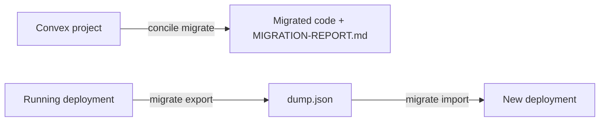

{/* diataxis: how-to */}

If you're coming from Convex, your app already looks a lot like a concile app! You've got the same query and mutation handlers, the familiar `defineSchema` and `defineTable` schema, and the exact same client hooks. Bringing your project over is really just about updating your imports, rather than rewriting your actual logic.

The `concile migrate` command takes care of the boring stuff for you, like updating import paths, your `package.json`, and the `_generated/` folder. For anything it needs your help with, it gives you a super handy list with exact files and line numbers.

In concile, our standard imports always start with `@concile/*` instead of `convex/*` (you can check out [What is concile?](/docs/get-started/what-is-concile) for more details). When you run `concile migrate`, it also conveniently renames your function directory from `convex/` to our default `concile/` folder. Just keep in mind that migrating means shifting fully to our native imports. We don't have a compatibility layer that runs `convex/*` imports as they are, so the codemod is essentially the entire migration process.

On this page, we'll talk about two totally different things that happen to share one command. First, `concile migrate` updates your Convex project's **code**. Second, `concile migrate export` and `import` help you move your app's **data** between different storage setups. Honestly, most projects will only ever need the first one.



## What stays the same

The best part is that you don't need to change anything inside your function bodies at all!

- Things like `query`, `mutation`, and `action` are still imported from `./_generated/server`. Your function code stays exactly where it is.
- Your `schema.ts` keeps its exact same structure. It just moves from `convex/` over to `concile/` with the rest of your files, which we talk about in [the rename step](#what-it-actually-does-in-order) below. Functions like `defineSchema`, `defineTable`, and your indexes work just like before. Only the import path changes.
- React hooks like `useQuery` and `useMutation` keep their exact same signatures, but you'll import them from `@concile/client/react` instead of `convex/react`.

## Migrating a project's code

### Before you run it

When you fire up the command, it looks for a Convex project by checking your root folder for one of two things:

- A `convex/schema.ts` file
- A `convex` dependency sitting in your `package.json`

If you have uncommitted changes in git, the tool plays it safe and refuses to run:

```bash
$ concile migrate
refusing to migrate: /path/to/app has uncommitted changes (commit/stash first, or pass --force)
```

You'll just want to commit or stash your work, or you can use the `--force` flag if you want to skip the safety check.

<Callout type="warn" title="No git repo at all?">

If you aren't using git in your project directory, the `migrate` tool will give you a quick warning and go ahead with the changes anyway. Just be careful here! Since there is no git history to check, if things go wrong, you won't have a simple `git checkout` to fall back on:

```
warning: /path/to/app is not a git repo, changes will be made in place with no easy revert
```

</Callout>

By the way, the git safety check looks at the **parent** folder of whatever you pass to `--dir`. That is basically your project root, which is usually one level above your Convex app directory where your `package.json` and `concile.config.ts` hang out.

### Running it

```bash title="terminal"
concile migrate --from convex --dir convex
```

| Flag | Default | Meaning |
|---|---|---|
| `--from <source>` | `convex` | Migration source. Only `convex` is available today. We explain this more in [The source adapter seam](#the-source-adapter-seam) section below. |
| `--dir <path>` | `convex` | The app directory you want to migrate. |
| `--dry-run` | off | Calculate the plan and write `MIGRATION-REPORT.md`, without changing anything else. |
| `--force` | off | Go ahead even if your git tree has uncommitted changes. |

Using `--dry-run` is the safest way to preview your migration. It still gives you the full report, but completely skips editing files, scaffolding, and regenerating the `_generated/` folder. Your `convex/` tree will stay exactly as it was, byte for byte.

```bash
$ concile migrate --dry-run --force
[dry-run] 3 files would change, 1 scaffolded. See MIGRATION-REPORT.md
```

A real run will tell you exactly what it did, plus how many things might still need a bit of manual tweaking from you:

```bash
$ concile migrate --force
migrated 3 files. 2 item(s) need manual attention, see MIGRATION-REPORT.md
```

### What it actually does, in order

<Steps>

<Step>

### Rename the functions directory

This happens right after the tool detects your project, on your untouched files, and before anything else kicks off. If your source directory (which is set by `--dir` and defaults to `convex`) is different from where concile normally expects it to be (which is `concile/` by default, or whatever `functionsDir` you've set in `concile.config.ts`), the whole folder gets renamed first. It will try a `git mv` if you're in a git repo, and if that doesn't work, it falls back to a standard filesystem rename. Just to be safe, if your target directory already exists, the migration will pause and refuse to overwrite it. All the following steps will operate on this newly renamed directory. If you run with `--dry-run`, it just tells you that a rename would happen, but leaves the folder totally untouched.

</Step>

<Step>

### Walk the functions directory

The tool will peek into every subdirectory, skipping `_generated` and `node_modules`. It collects every `.ts` and `.tsx` file it finds under the directory.

</Step>

<Step>

### Rewrite imports and scan for divergences

Next up, each file gets its import paths updated. You can check out [The import codemod](#the-import-codemod) section below for more details. It also scans for any differences it can't automatically fix, which we explain in [The divergence scan](#the-divergence-scan) below.

</Step>

<Step>

### Edit `package.json`

It will clean up your dependencies by dropping `convex` and any `@convex-dev/*` packages. Then it pulls in the `"latest"` versions of `@concile/values` or `@concile/client`, depending on what the rewrite actually added to your code. It will only auto add those two packages. We've got a [scheduler gotcha](#the-scheduler-scaffold-doesnt-wire-your-crons-for-you) down below that explains what isn't automatically added.

</Step>

<Step>

### Scaffold `concile.config.ts`, only if you use crons

This step is a bit special. It only runs if it spots a `crons.ts` file or a `cronJobs(...)` call somewhere in your code, and only if you don't already have a `concile.config.ts` file. It will never overwrite an existing config file.

</Step>

<Step>

### Write `MIGRATION-REPORT.md`

We put this report at the root of your project *before* doing anything else. That way, even if something fails during the regeneration step later, you still get your report!

</Step>

<Step>

### Regenerate `_generated/`

Finally, it completely deletes your app's old `_generated/` directory. A typical Convex app has files like `_generated/{server.js,server.d.ts,api.js,api.d.ts,dataModel.d.ts}`. If those old `.js` files stuck around, a JavaScript module resolver might accidentally use the stale `server.js` instead of your freshly generated `.ts` files, causing issues since it still tries to import the removed `"convex/server"`. After cleaning up, it loads your rewritten project and generates fresh typed `Doc`, `Id`, `api`, and server helpers. It uses the exact same pipeline that `concile codegen` uses.

If the codegen process fails, which usually happens because an action item like a `.withIndex` was left in place and broke the load, the command will exit with an error code of `1`. Don't worry though! Everything it did up to that point, including the import rewrite, `package.json` updates, the scaffold, and the report, has already been safely saved:

```
imports migrated, but codegen failed: <error>
See MIGRATION-REPORT.md; fix the flagged items, then run `concile codegen`.
```

</Step>

</Steps>

### The import codemod

The import rewrite process is actually pretty smart. It looks directly at the symbols being used instead of just blindly replacing text strings. It checks out the quoted module specifier, which means things like `import`, `export … from`, `require()`, and dynamic `import()` are all perfectly handled. Most importantly, it checks exactly which named symbols a `convex/server` import brings in before deciding if and how to rewrite it.

There are three specifiers that are super straightforward and get rewritten automatically anywhere they show up quoted in your files:

| From | To |
|---|---|
| `"convex/values"` | `"@concile/values"` |
| `"convex/react"` | `"@concile/client/react"` |
| `"convex/browser"` | `"@concile/client"` |

However, `"convex/server"` is a bit of a special case. Convex uses that single module for schema builders, HTTP routing, and crons, and those things map to three entirely different places in concile:

| `convex/server` import | Rewrite |
|---|---|
| Only `defineSchema`/`defineTable` | `"@concile/values"` |
| Only `httpRouter`/`httpAction` | `"./_generated/server"` |
| Anything else (including a mix, or `cronJobs`) | Left unchanged, but flagged as `action-needed` with a helpful fix message |

```ts title="convex/schema.ts (before)"
import { defineSchema, defineTable } from "convex/server";
import { v } from "convex/values";

export default defineSchema({ notes: defineTable({ body: v.string() }) });
```

```ts title="concile/schema.ts (after migrate)"
import { defineSchema, defineTable } from "@concile/values";
import { v } from "@concile/values";

export default defineSchema({ notes: defineTable({ body: v.string() }) });
```

One thing to note is that `./_generated/server` imports (like `query`, `mutation`, `action`, or `httpAction`) are completely untouched. That's because a Convex app already imports those from the exact same relative path that concile uses!

If you have a mixed `convex/server` import, something like `import { defineSchema, cronJobs } from "convex/server"`, the tool won't try to guess what you meant. It leaves it exactly as you wrote it and marks it as `action-needed`, giving you a quick note on where each symbol actually belongs. It also catches any bare `"convex/server"` occurrences that might have slipped past the codemod's first two passes (like a default import, an `export * from`, or a `require()`). This ensures nothing silently slides by as `unsupported` just because it was missed!

### The divergence scan

Apart from rewriting imports, the tool also scans every single file line by line to look for any Convex runtime patterns that concile's engine won't accept. When it finds something, it gives you the exact file and line number so you can jump straight to it.

**Action needed.** When there is a true concile equivalent, but you need to tweak the code yourself:

| Convex pattern | Fix |
|---|---|
| `.withIndex(...)` | We don't use `.withIndex`. Instead, you can use `ctx.db.query(table, "index").eq(f, v).gte(f, v).order("asc"\|"desc").collect()` |
| `ctx.db.patch(...)` | We don't have a `patch` function. You just read the document, use a spread merge, and call `ctx.db.replace(id, { ...doc, ...changes })` |
| `.paginate(...)` | `paginate({ cursor, pageSize, maxScan? })` gives you back `{ page, nextCursor, hasMore, scanCapped }` |
| `ctx.auth` / `getUserIdentity()` | Identity is just a string token through a context provider like `@concile/auth`'s `ctx.auth`, rather than a full JWT claims object |
| `crons.ts` file, or any `cronJobs(...)` call | You'll want to compose `defineScheduler()` inside `concile.config.ts` and use `cronJobs()` |

**Unsupported.** In cases where there isn't an automatic upgrade path, it's totally up to you how you want to handle it:

| Convex pattern | Why |
|---|---|
| `@convex-dev/auth`, or an import from `"convex/auth"` | This doesn't get automatically translated. We recommend using [`@concile/auth`](/docs/components/auth) or bringing in your own JWT/OIDC provider |
| `app.use(...)` (Convex Components), or a `convex.config.ts` file | Convex Components don't have a direct 1:1 mapping. You'll need to piece together the equivalent concile components using your `concile.config.ts` file |
| `.vectorIndex(...)` / `.searchIndex(...)` | We don't currently support full-text or vector search in concile |

Keep in mind that patterns like `.withIndex`, `ctx.db.patch`, `.paginate`, and `ctx.auth` will be flagged whenever they show up as a substring anywhere on a line. That means even a helpful comment mentioning `.paginate(` will trigger the scanner! The scanner simply looks at lines of text rather than fully parsing the code structure, which is intentional. We would rather catch a few extra things than accidentally miss a real function call.

### Reading the report

Your `MIGRATION-REPORT.md` file neatly groups all findings by their severity, complete with a quick one-line summary at the very top. If a section doesn't have any entries, we just leave it out entirely:

```md title="MIGRATION-REPORT.md"
# Concile migration report

5 auto-fixed, 3 action-needed, 1 unsupported.

## Auto-fixed (5)

- `convex/`: renamed to concile/. **Fix:** Your backend functions now live in concile/. Imports inside that folder are relative and did not change.
- `concile/schema.ts:1`: import "convex/server" (schema). **Fix:** rewritten to "@concile/values"
- `concile/schema.ts:2`: import "convex/values". **Fix:** rewritten to "@concile/values"
- `concile/messages.ts:1`: import "convex/react". **Fix:** rewritten to "@concile/client/react"
- `concile/http.ts:1`: import "convex/server" (http). **Fix:** rewritten to "./_generated/server"

## Action needed (3)

- `concile/messages.ts:14`: .withIndex(...) query. **Fix:** Concile has no .withIndex, use ctx.db.query(table, "index").eq(f, v).gte(f, v).order("asc"|"desc").collect()
- `concile/messages.ts:22`: ctx.db.patch(...). **Fix:** Concile has no patch, read the doc, spread-merge, ctx.db.replace(id, { ...doc, ...changes })
- `concile/crons.ts:1`: Convex crons (cronJobs). **Fix:** Compose defineScheduler() in concile.config.ts and use cronJobs() from "@concile/scheduler"

## Unsupported (1)

- `concile/search.ts:9`: vector/search index. **Fix:** search/vector is not yet supported in Concile (see roadmap)
```

We list every single finding, even the ones we fixed automatically, just so you have full visibility. Think of it as a complete log of everything the tool touched, all in one file, without you ever needing to run `git diff`.

### The scheduler scaffold doesn't wire your crons for you

<Callout type="warn" title="Scaffold only">

If the migration tool spots a `crons.ts` file or a bare `cronJobs(...)` call, it will generate a starting `concile.config.ts` for you, assuming you don't already have one. However, it won't wire your actual cron definitions into it. You will need to take care of that yourself in two quick steps.

</Callout>

```ts title="concile.config.ts (scaffolded)"
import { defineConfig } from "@concile/component";
import { defineScheduler } from "@concile/scheduler";

// Convex crons map to Concile's scheduler component. Move your cron definitions into
// a convex/crons.ts using cronJobs() from "@concile/scheduler".
export default defineConfig({ components: [defineScheduler()] });
```

Here are the two things you need to handle manually, based on our [Scheduling](/docs/components/scheduling) guide:

<Steps>

<Step>

### Add the packages yourself

Make sure to add `@concile/scheduler` and `@concile/component` to your `package.json`. Unlike `@concile/values` and `@concile/client`, the scaffold's own dependencies are not added automatically. The `package.json` updates only react to what the import rewrite actually found in your source files, and the generated config file isn't part of that.

</Step>

<Step>

### Wire your actual crons in

In concile, you import `cronJobs()` from `./_generated/server` rather than directly from `@concile/scheduler`. Also, the registry it builds won't do anything until you pass it into `defineScheduler({ crons })`. Here is how that looks:

```ts title="concile/crons.ts"
import { cronJobs } from "./_generated/server";

const crons = cronJobs();
crons.interval("cleanup", { minutes: 5 }, internal.maintenance.purge, {});

export default crons;
```

```ts title="concile.config.ts"
import { defineConfig } from "@concile/component";
import { defineScheduler } from "@concile/scheduler";
import crons from "./concile/crons";

export default defineConfig({ components: [defineScheduler({ crons })] });
```

</Step>

</Steps>

If you check the report, the `action-needed` entry for crons will point you straight to this step!

## Going deeper

<Accordions type="single">

<Accordion id="the-source-adapter-seam" title="The source-adapter seam">

Under the hood, `concile migrate --from <source>` isn't hardcoded to Convex! It actually dispatches through a neat little `MigrationSource` interface:

```ts
interface MigrationSource {
  id: string;
  detect(projectRoot: string): Promise<boolean>;
  analyze(projectRoot: string, appDir: string): Promise<MigrationPlan>;
}
interface MigrationPlan {
  edits: FileEdit[];       // existing files to overwrite
  scaffold: FileWrite[];   // new files to create (never overwrites an existing one)
  report: ReportEntry[];   // { severity: "auto-fixed" | "action-needed" | "unsupported", file, line?, what, fix }
}
```

The function `resolveSource(sources, id)` looks up your requested `--from` value in a registry. If it can't find it, it throws an error and lists what is available. For v1, we only register one source:

```ts
const SOURCES: Record<string, MigrationSource> = { convex: convexSource };
```

Because of that, `convex` is the only value `--from` accepts right now. Passing anything else will fail pretty quickly:

```bash
$ concile migrate --from supabase
unknown migration source "supabase" (available: convex)
```

Convex was a very natural first choice because concile's runtime already runs Convex shaped query, mutation, and action functions. This means the whole migration is just an import codemod plus a report, rather than a heavy data or logic transformation. Building a source for a completely different backend like Supabase with its relational SQL and RLS, or Firebase with its collection model, would mean translating the data model itself. That is a much larger effort! This seam is built exactly so we can add new sources later as separate `MigrationSource` implementations without having to touch the main `migrateCommand`.

</Accordion>

<Accordion id="a-caveat-on-project-detection" title="A caveat on project detection">

The `detect()` function looks specifically for `convex/schema.ts` using the hardcoded `convex` subdirectory name, regardless of what you pass to `--dir`. If your app directory is named something else and you don't have a `convex` dependency left in your `package.json`, detection will fail with `no convex project detected at <root>`. This really only affects you if you try to re migrate an already renamed directory. A first time migration from a stock Convex project will work perfectly since its folder is always `convex/` and it always depends on `convex`.

</Accordion>

</Accordions>

## Moving data between deployments

The `concile migrate export` and `concile migrate import` commands help you move your app's actual data rows between two running deployments. Usually, this means moving data between a portable SQLite, Postgres, or container deployment and a Cloudflare DO native one. Because [those two store data in physically different topologies](/docs/deploy/cloudflare#moving-data-between-hosts), your data won't just magically teleport between them!

Both commands act as HTTP clients, very similar to `concile deploy`. They call a **running** deployment's protected admin endpoints like `GET /_admin/export` or `POST /_admin/import`, using the same `CONCILE_ADMIN_KEY` that the dashboard and `concile deploy --allow-deploy` use. Since both the container `serve` path and the Cloudflare DO host expose the exact same `/_admin/*` handler, you can use one client to go in either direction. Just keep in mind that a stopped SQLite file doesn't have its own HTTP endpoint. To handle that, you can point a temporary `concile serve` or `concile dev` at its data directory, run your export, and then shut it down.

```bash
concile migrate export --url <source-url> --out dump.json
concile migrate import --url <target-url> --in dump.json
```

| Flag | Applies to | Default | Meaning |
|---|---|---|---|
| `--url <url>` | both | (required) | The deployment you want to export from or import into |
| `--out <file>` | `export` | (required) | Where you want to save the dump |
| `--in <file>` | `import` | (required) | The dump file you want to read |
| `--admin-key <key>` | both | `$CONCILE_ADMIN_KEY` | Overrides the environment variable |

You absolutely need `CONCILE_ADMIN_KEY` either as an env var or via `--admin-key` for both commands. If you miss it, the tool will fail immediately before even making a network call:

```bash
$ concile migrate export --url http://localhost:3210 --out dump.json
✗ CONCILE_ADMIN_KEY is required (or pass --admin-key)
```

If you use the wrong key against a real deployment, you'll get a very clean `401` error instead of a messy stack trace:

```bash
$ concile migrate export --url http://localhost:3210 --out dump.json --admin-key wrong
✗ unauthorized, check CONCILE_ADMIN_KEY / --admin-key
```

### Export

```bash
$ CONCILE_ADMIN_KEY=… concile migrate export --url https://source.example.com --out dump.json
✓ exported 5 documents, 2 index rows → dump.json
```

The dump is a self-describing JSON file:

```json title="dump.json (shape)"
{
  "format": "concile-migration-dump",
  "documents": [ /* every document across every table, with its real _id and _creationTime */ ],
  "indexUpdates": [ /* … */ ],
  "tableNumbers": { "messages": 3, "users": 4 }
}
```

### Import

```bash
$ CONCILE_ADMIN_KEY=… concile migrate import --url https://target.example.com --in dump.json
✓ imported 5 documents, 2 index rows
```

<Callout type="warn" title="Import is not a merge">

Remember that import targets a **fresh** deployment. It is not meant for merging into existing data, and it only works for a single shard. You should deploy the matching schema on your target first, meaning the same tables and the same declared shape. The import process has a built in table number collision guard, so it will reject the entire operation and leave everything completely untouched if the dump's table numbers don't perfectly match the target:

```bash
$ concile migrate import --url https://target.example.com --in dump.json --admin-key …
✗ import failed: wrong table number for "messages" (dump has 12348, target has 3)
```

</Callout>

A rejected import will never apply partially. The target remains exactly as it was before you ran the command. Once a dump does import cleanly, the target is immediately ready to go. New mutations will commit smoothly on top of your imported rows without any timestamp collisions, and every single row (including `_id` and `_creationTime`) will read exactly as it did from the source.

## After migrating

<Steps>

<Step>

### Work through `MIGRATION-REPORT.md`

Start at the top and work your way down. Every `action-needed` and `unsupported` entry points you to the exact file, the exact line, and what you need to fix.

</Step>

<Step>

### Run `concile dev` and exercise the app

If an `action-needed` item wasn't fixed properly (like a leftover `.withIndex`), it will immediately pop up as a load error instead of causing a silent, frustrating bug at runtime.

</Step>

<Step>

### Port your tests, if you have them

The `concile migrate` tool only updates your app's own function directory source (which gets renamed from `convex/` to `concile/`). It won't touch any `convex-test` call sites. You will need to switch those over to [`@concile/test`](/docs/reference/testing) manually. The fixture setup using `createTestConcile` is just a bit too different to be automatically rewritten.

</Step>

<Step>

### Finish the scheduler config, if one was scaffolded

Make sure you finish wiring your crons up, as explained in [the crons section above](#the-scheduler-scaffold-doesnt-wire-your-crons-for-you), and remember to add the necessary packages to your `package.json`.

</Step>

</Steps>

## Compatibility at a glance

We've put together a handy table to answer "will my app port?". Every row marked "not available" corresponds exactly to what the [divergence scan](#the-divergence-scan) catches at the call site, so you won't run into any nasty surprises later at runtime.

| Feature | Convex | concile |
|---|---|---|
| Queries / mutations / actions / internal functions | Yes | Available, using the exact same `./_generated/server` authoring shape |
| Argument and return validators (`v.*`) | Yes | Available |
| `ctx.db.get` / `insert` / `replace` / `delete` | Yes | Available |
| `ctx.db.patch` | Yes | Not available. You just read, spread merge, and `replace` |
| `.withIndex` / `.filter(q => ...)` / `.first()` / `.unique()` | Yes | Not available. Chain `.eq`, `.gt`, `.gte`, `.lt`, `.lte`, `.order`, `.where`, or `.take(n)` onto `ctx.db.query(table, index)` |
| Pagination | `{ page, isDone, continueCursor }` | Available, returning `{ page, hasMore, nextCursor, scanCapped }` |
| Reactive subscriptions | Yes | Available, featuring range precise invalidation |
| Optimistic updates | Yes | Available, using the verbatim `withOptimisticUpdate`. Please note the promise resolves at commit, as detailed below |
| Durable offline mutations | No first party equivalent | Available, featuring a durable outbox, client supplied ids, and cross tab rendering |
| HTTP actions (`httpRouter`/`httpAction`) | Yes | Available, though intentionally lacking automatic CORS, path params, or middleware |
| `ctx.scheduler.runAfter`/`runAt` and crons | Yes | Available via the `@concile/scheduler` component, but you must compose it explicitly |
| Durable workflows | `@convex-dev/workflow` | Available via `@concile/workflow`, which includes saga and compensation |
| File storage (`ctx.storage`) | Yes | Available using two phase uploads. Functions like `store` and `get` are restricted to actions only |
| Auth | Convex Auth, or third party JWT | We offer `@concile/auth` for sessions, OAuth, JWT, OIDC, MFA, and passkeys. Convex Auth itself does not port directly |
| Convex Components (`app.use`) | Yes | We use a different model. You will need to compose `@concile/*` components inside your `concile.config.ts` |
| Full text search / vector search | Yes | Not built yet. The migrator will flag any usage as `unsupported` |

## Honest compatibility notes

**Near free, by design, not a coincidence.** Our runtime at concile already runs Convex shaped functions natively. That means your migration is mostly just rewriting import paths and regenerating the `_generated/` folder, not totally overhauling your handlers, schema, or client code.

When there are divergences, they are real and structural, not just cosmetic differences. We built the scanner specifically to catch all of these right at the call site, rather than letting them cause mysterious bugs later:

- **No `ctx.db.patch`.** The writer in concile only supports `insert`, `replace`, and `delete`. A Convex `patch` call needs to become a read, followed by a spread merge, and then a `replace`. Feel free to check out [Mutations](/docs/core-concepts/mutations) for more on this.
- **No `.withIndex(...)`.** We handle query building through `ctx.db.query(table, index)` and then you chain methods like `.eq`, `.gt`, `.gte`, `.lt`, `.lte`, `.order`, and `.where`. We cover this in [Queries](/docs/core-concepts/queries).
- **A mutation's promise resolves at commit, not at gate-time.** If your frontend code relied on Convex's specific gate time resolution for optimistic updates, you'll definitely want to review the promise timing note in our [Optimistic updates](/docs/client/optimistic-updates) docs.
- **No full-text or vector search.** Functions like `.searchIndex(...)` and `.vectorIndex(...)` just don't have a direct equivalent in concile right now. We scan and flag every occurrence as `unsupported` so nothing is silently ignored.
- **Crons need an explicit component.** The `cronJobs()` registry won't do anything until you compose it into `concile.config.ts` using `defineScheduler({ crons })`. Convex's automatic background registration doesn't carry over here.
- **`ctx.auth` is a string token, not a JWT-claims object.** It resolves through a context provider like [`@concile/auth`](/docs/components/auth) rather than being baked straight into the runtime.
- **Convex Components and Convex Auth don't map 1:1.** You will need to reconstruct equivalent concile components like [`@concile/auth`](/docs/components/auth), [`@concile/scheduler`](/docs/components/scheduling), [`@concile/workflow`](/docs/components/workflows), [`@concile/triggers`](/docs/components/triggers), or [`@concile/notifications`](/docs/components/notifications) within `concile.config.ts`.

And remember, `@concile/*` is our canonical surface permanently. This isn't just a temporary stepping stone. Our default function directory is `concile/`, not `convex/`. The `convex/` folder is merely your starting point, and `concile migrate` renames it for you automatically. There are no aliased paths back to `convex/*` imports to worry about keeping up to date. Once you migrate, you are simply authoring a native concile app!

## Related

- [What is concile?](/docs/get-started/what-is-concile): Explains why our canonical surface is `@concile/*` rather than `convex/*`.
- [CLI reference](/docs/core-concepts/cli#migrate): A quick flag reference for every `concile` subcommand, including `migrate`, `migrate export`, and `migrate import`.
- [Testing](/docs/reference/testing): Highlights the differences between `@concile/test` and `convex-test`.
- [Scheduling](/docs/components/scheduling): Covers the complete `cronJobs()` and `defineScheduler()` API that your newly migrated `crons.ts` will need.
- [Cloudflare](/docs/deploy/cloudflare#moving-data-between-hosts): Details why `migrate export` and `import` exist, helping you move data between portable storage and DO native topologies.
- [Queries](/docs/core-concepts/queries) and [Mutations](/docs/core-concepts/mutations): Breaks down the real `ctx.db` surface your migrated `.withIndex` and `ctx.db.patch` call sites need to target.
