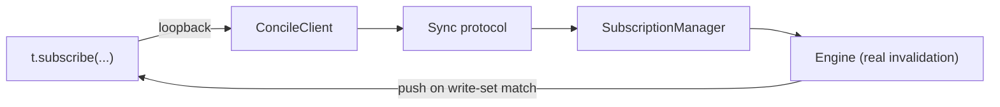

{/* diataxis: how-to */}

A lot of testing tools just fake the database and cross their fingers that the fake acts like the
real deal. But `@concile/test` doesn't do that. Instead, it runs all your queries, mutations, and
actions against an actual `EmbeddedRuntime`. That means you're using the exact same MVCC SQLite
storage, single-writer OCC transactor, and query engine that run in production. If you throw a
component into the mix, you get its real drivers as well.

You won't find a fake `ctx.db` or simulated reactivity here. When you use `t.subscribe`, it triggers
the real deal, including the client, sync protocol, `SubscriptionManager`, and engine, all connected
up via an in-process loopback. So, when a test passes, it actually proves how the real engine
behaves, rather than just checking a substitute.

Think of this page as your ultimate guide to the test harness. We will walk through every option you
can pass into `createTestConcile`, all the methods you get back, and how to test things like
reactivity and scheduled tasks. We will also cover how to compose components and highlight a few
quirky harness behaviors you should probably know about before you start writing your assertions.

<Steps>

<Step>

### Install the package

```bash
npm install -D @concile/test
```

</Step>

<Step>

### Write and run a test

```ts title="concile/messages.test.ts"
import { afterEach, expect, test } from "vitest";
import { createTestConcile, type TestConcile } from "@concile/test";
import * as messages from "./messages";
import schema from "./schema";

let t: TestConcile;

afterEach(async () => {
  await t.close();
});

test("send then list", async () => {
  t = await createTestConcile({
    modules: { "messages.ts": messages, "schema.ts": { default: schema } },
  });

  const id = await t.mutation("messages:send", { body: "hi" });
  const rows = await t.query<Array<{ _id: string; body: string }>>("messages:list", {});

  expect(rows.map((r) => r._id)).toContain(id);
});
```

`createTestConcile` is asynchronous. You will always want to `await` it because it is booting up a
fully functional runtime, which includes setting up your schema, putting components together, and
kicking off the drivers.

Everything runs seamlessly with plain vitest. You don't need to jump through any extra hoops for
your CI setup, it works just like the rest of the tests in your monorepo.

<Callout type="warn" title="Always close it">
  Make sure you call `t.close()`, either in a `try`/`finally` block or inside an `afterEach` hook.
  Doing this is important because it cleans up the in-memory database, shuts down the component
  drivers, and gets rid of the temporary directory used for file storage.
</Callout>

</Step>

</Steps>

## `createTestConcile(opts)`

```ts
interface CreateTestOptions {
  modules: Record<string, unknown>;
  components?: ComponentDefinition[];
  schema?: SchemaDefinition | "auto" | false;
  now?: () => number;
  store?: DocStore;
}

function createTestConcile(opts: CreateTestOptions): Promise<TestConcile>;
```

<TypeTable
  type={{
    modules: {
      description: "A flat map from module path to that module's exports. Required.",
      type: "Record<string, unknown>",
    },
    components: {
      description: "Components to compose, the same ones your app opts into via concile.config.ts.",
      type: "ComponentDefinition[]",
      default: "[]",
    },
    schema: {
      description: "Where to resolve the schema from: auto-detect, an explicit definition, or none.",
      type: '"auto" | SchemaDefinition | false',
      default: '"auto"',
    },
    now: {
      description: "Your own clock function, instead of the harness's virtual clock.",
      type: "() => number",
    },
    store: {
      description: "The document store to run the real engine against.",
      type: "DocStore",
      default: "in-memory SqliteDocStore",
    },
  }} />

### `modules` (required)

A flat map from a module path (`"messages.ts"`) to that module's exports. Two shapes work:

```ts
// Explicit imports
import * as messages from "./messages";
import * as users from "./users";
import schema from "./schema";

const t = await createTestConcile({
  modules: {
    "messages.ts": messages,
    "users.ts": users,
    "schema.ts": { default: schema },
  },
});
```

```ts
// Or let your bundler enumerate the directory: the non-eager form (a map of lazy
// loaders) works as-is; each entry is awaited before use.
const t = await createTestConcile({
  modules: import.meta.glob("./concile/**/*.ts"),
});
```

When you use `import.meta.glob`, the keys usually have extra path stuff at the front, like
`./concile/messages.ts`. The harness cleans this up for you by taking out the `./` or `../`
prefixes, stripping away any leading `concile/` folder name, and dropping the file extension. This
leaves you with the exact same `module:export` path that your generated API or simple string
references already rely on. So, a module you pull in via a glob gets registered just like it would
if you typed out `{ "messages.ts": messages }` by hand.

Keep in mind that only **named exports that are actually registered functions** (like `query`,
`mutation`, `action`, or `httpAction`) will make it into the map of dispatchable functions. Modules
named `schema.ts` and `http.ts` get their own special treatment, which we will get into later,
especially when talking about [`t.fetch`](#tfetch). Anything else lying around in your module just
gets ignored.

### `schema`

- **`"auto"` (default):** resolves the schema from whatever `schema.ts` entry is in `modules` (its
  default export, expected to be a `defineSchema(...)` result). If there's no `schema.ts` in
  `modules`, this resolves to an empty schema.
- **An explicit `SchemaDefinition`:** overrides whatever `schema.ts` would have resolved to.
- **`false`:** no schema at all, an empty schema where only `_storage` (see below) exists.

```ts
import { defineSchema, defineTable, v } from "@concile/values";

const testSchema = defineSchema({
  docs: defineTable({ owner: v.string(), n: v.number() }).index("by_owner", ["owner", "n"]),
});

const t = await createTestConcile({
  modules: { "mod.ts": mod },
  schema: testSchema, // explicit, no schema.ts needed in `modules` at all
});
```

The special `_storage` system table, which powers [file storage](/docs/core-concepts/file-storage),
gets added into your composed schema no matter what. Think of file storage as a core feature that is
always turned on in the harness, just like it is in the real production environment. You don't ever
have to manually opt into it.

### `components`

If your app opts into a component in `concile.config.ts` (the scheduler, workflow, triggers,
notifications, auth, and so on), list it the same way here. The harness composes it through the same
`composeComponents` the CLI's boot path uses:

```ts
import { defineScheduler } from "@concile/scheduler";

const t = await createTestConcile({
  modules: { /* ... */ },
  components: [defineScheduler()],
});
```

If you haven't composed a scheduler, calling `t.finishScheduledFunctions()` or `t.advanceTimers()`
won't cause any errors, they just won't do anything at all. Since there are no drivers to run, the
harness basically figures that if nothing is composed, then nothing is scheduled either.

### `now`

Supplies your own clock function instead of the harness's own virtual clock:

```ts
let fakeNow = 1_700_000_000_000;
const t = await createTestConcile({
  modules: { /* ... */ },
  now: () => fakeNow,
});
```

Whenever your app code calls `ctx.now()`, or the scheduler checks for due jobs, they all look at
this custom function. By providing your own `now` function, you are taking full control of time
instead of letting the harness handle it. Because of this, if you try to use `t.advanceTimers` or
`t.finishScheduledFunctions` while `opts.now` is set, they will throw an error right away. Modifying
the internal clock of the harness wouldn't make any difference to the time you are supplying anyway.
If you want to use those two time control methods, just leave out `opts.now` and stick with the
default virtual clock.

### `store`

The document store to run the real engine against. Defaults to an in-memory `SqliteDocStore` over
`NodeSqliteAdapter` (`:memory:`). Pass an alternative, for example a `PostgresDocStore`, to exercise
the exact same conformance assertions against a different backend:

```ts
import { PostgresDocStore } from "@concile/docstore-postgres";

const t = await createTestConcile({
  modules: { /* ... */ },
  store: new PostgresDocStore(/* ... */),
});
```

Just make sure the store starts completely empty. The harness takes over from there, running
`setupSchema()` and managing the entire lifecycle until it shuts everything down with `t.close()`.
This exact setup is how Concile's own test suite verifies that reading your own writes works
perfectly on Postgres (you can check out `packages/docstore-postgres/test/ryow-runtime.test.ts` for
proof). This isn't just theory, the harness really doesn't mind which `DocStore` you decide to plug
in.

## `TestConcile`, the returned object

```ts
interface TestConcile {
  query<T = unknown>(ref: FunctionReference | string, args?: Args): Promise<T>;
  mutation<T = unknown>(ref: FunctionReference | string, args?: Args): Promise<T>;
  action<T = unknown>(ref: FunctionReference | string, args?: Args): Promise<T>;
  run<T>(fn: (ctx: any) => Promise<T>): Promise<T>;
  fetch(request: Request): Promise<Response>;
  subscribe<T = any>(ref: FunctionReference | string, args?: Args): TestSubscription<T>;
  withIdentity(identity: string): TestConcile;
  finishScheduledFunctions(): Promise<void>;
  advanceTimers(ms: number): Promise<void>;
  close(): Promise<void>;
}
```

### Function references

Whenever you need to provide a `ref`, you have options. You can use a simple `"module:fn"` string,
or a fully typed `FunctionReference` like the ones from your generated `api` or `internal` code. If
you don't happen to have generated types handy for your test, an `anyApi` cast works beautifully
too. Under the hood, they all point to the exact same place:

```ts
import { anyApi } from "@concile/client";

await t.query("messages:list", {});
await t.query((anyApi as any).messages.list, {});
```

### `t.query` / `t.mutation` / `t.action`

You can invoke a function just like a real client would, passing right through the public front
door. If you have set up an identity using `t.withIdentity`, that identity gets applied
automatically to the call. If you haven't, it just runs without one. You will find yourself reaching
for these three methods for the vast majority of your tests, typically, you will run a mutation and
then follow up with a query to check what changed.

### `t.run(fn)`

This lets you execute `fn` with complete, unrestricted access to the database using a real
`MutationCtx`. Everything happens inside a single, genuine transaction, completely skipping the
normal public API routes. Behind the scenes, this relies on a special `_test:_run` system mutation
that executes whatever callback you pass in. This trick gives you a proper writing context without
forcing you to create dummy app-level mutations just to set up your tests:

```ts
const id = await t.run(async (ctx) => ctx.db.insert("messages", { body: "seeded" }));

// A privileged raw scan is the same shape: useful for asserting against a
// component's own internal (non-app) tables:
const rows = await t.run(async (ctx) => ctx.db.query("docs", "by_creation").collect());
```

Keep in mind that `t.run` always runs with full privileges and no specific identity, no matter which
`withIdentity` view you call it on. It is meant to be a handy escape hatch for setting up tests or
checking assertions, not a tool for testing how identity scoping works.

### `t.fetch(request)`

This routes a `Request` straight through your app's `http.ts` router, mirroring exactly how the real
`concile dev` or `serve` HTTP handler sends requests to an `httpAction`, and it hands back a
`Response`. If it can't find a matching method and path, it simply returns a standard 404 instead of
throwing an error:

```ts
const res = await t.fetch(new Request("http://test/webhook", { method: "POST", body: "{}" }));
expect(res.status).toBe(200);
```

When it comes to identities, the identity you set for the calling view using `withIdentity` gets
passed along as the `ctx` identity for the httpAction. If both a view identity and an
`Authorization` header are present in the request, the view identity takes the wheel. If you haven't
set a view identity, it will fall back to using the raw `Authorization` header from the request,
stripping away the "Bearer " part. So, `Bearer abc123` just becomes `abc123`, and anything else
turns into `null`. This matches the exact Bearer passthrough behavior the real engine uses at the
raw HTTP layer, since there are no sessions to rely on:

```ts
const asAda = t.withIdentity("ada-token");
const res = await asAda.fetch(new Request("http://test/whoami")); // httpAction sees identity "ada-token"

// Or rely purely on the header, with no withIdentity view involved:
const res2 = await t.fetch(
  new Request("http://test/whoami", { headers: { authorization: "Bearer raw-token" } }),
); // httpAction sees identity "raw-token"
```

The default export from `http.ts`, which is an `HttpRouter`, is figured out just once when you call
`createTestConcile`. If you have a route handler that isn't an exported function from your `modules`
list, it will throw an error right away while the harness is building, instead of failing silently
with a 404 down the line.

### `t.withIdentity(identity)`

This method gives you a view of the exact **same** backend, but any `query`, `mutation`, `action`,
or `fetch` calls made through it will automatically include the `identity` (which is just a plain
string) as the active session token:

```ts
const asAda = t.withIdentity("some-token");
await asAda.mutation("messages:send", { body: "hi" });
```

The identity only makes its way into your function code through a context provider. For instance,
you might use `ctx.auth` from `@concile/auth`, or any other component that picks up `cctx.identity`
from the composed context. You will never see a raw `ctx.identity` on a standard UDF context. What
that token actually means, whether it points to a user document, a session record, or absolutely
nothing, depends entirely on the context provider you have wired into your components. Keep in mind
that `run` and `close` are shared across the whole backend, not just your specific view. There is
only one database and one set of drivers, regardless of how many `withIdentity` views you create,
and different identities on the same backend will never accidentally peek into each other's state:

```ts
const asA = t.withIdentity("A");
const asB = t.withIdentity("B");

await asA.mutation("profile:setName", { name: "Ada" });
await asB.mutation("profile:setName", { name: "Bea" });
// asA's own state is untouched by asB's call, and the base `t` (no identity) has none of either.
```

### `t.subscribe`, testing reactivity

```ts
interface TestSubscription<T> {
  value(): T | undefined;
  onChange(cb: (v: T) => void): () => void;
  unsubscribe(): void;
}
```

Using `t.subscribe(ref, args)` kicks off a live subscription using the actual system path. This
includes the client, sync protocol, `SubscriptionManager`, and engine invalidation, all
communicating over an in-process loopback connection made with `runtime.connect()` and a loopback
transport. This is the exact same setup that the test suite in `examples/chat` uses, so you are
working with real plumbing, not a simulated re-render:



```ts
const sub = t.subscribe("messages:list", {});
sub.onChange((rows) => {
  // fires on the first compute and every subsequent reactive re-run
});

await t.mutation("messages:send", { body: "hi" });
// sub.value() is now re-computed and re-pushed, because the write's write set
// intersected the query's recorded read set, not because anything was polled.

sub.unsubscribe();
```

The `value()` method hands you the most recently pushed data. It will be `undefined` until that
first calculation finishes. Since subscribing and the initial data push happen asynchronously, it is
a good idea to wait for a change before making assertions in a quick test. You can use `onChange` to
set up a listener that triggers on every reactive update, starting right from the first one, and it
gives you a function back to remove that listener later. When you are done, `unsubscribe()` cleans
up the query subscription behind the scenes.

One of the coolest things about this harness compared to a basic mock is that invalidation is
extremely precise, targeting specific ranges rather than whole tables. This means you can write
tests to prove that a specific write **does** trigger an update for a subscription, while another
write on that very same table **does not**:

```ts
const sub = t.subscribe("mod:byRoom", { room: "general" });
let fires = 0;
sub.onChange(() => { fires++; });
await waitForFirstValue(sub);

await t.mutation("mod:insert", { room: "other", body: "unrelated" });
await sleep(70); // grace period, no push is expected
expect(fires).toBe(0); // the write's key was outside this subscription's read set, no re-fire

await t.mutation("mod:insert", { room: "general", body: "hello" });
await waitFor(() => sub.value()?.length === 1);
expect(fires).toBe(1);
```

Just to note, a single `ConcileClient` is shared for every `t.subscribe(...)` call on a backend,
including all of its `withIdentity` views. This is a bit of a v1 quirk, `subscribe` will always use
the base client without an identity, no matter which view you call it from, because we don't support
per-identity subscriptions just yet. The client is created lazily the first time you need it and
gets shut down cleanly during `t.close()`, well before the runtime's drivers stop. This ensures that
a loopback session never hangs around longer than the runtime it belongs to.

Subscriptions also update perfectly when a write is triggered by a scheduled mutation, not just
direct calls. So, when a write from a `ctx.scheduler.runAfter(...)` job finally commits, it will
invalidate a live subscription exactly like a direct `t.mutation(...)` call would.

### Time control: `t.finishScheduledFunctions()` / `t.advanceTimers(ms)`

You get deterministic time control for your `@concile/scheduler` jobs and crons without having to
mess around with real timers or sleep functions. They run off the harness's own virtual clock, which
starts at a specific millisecond and can only be changed using these two methods. If you didn't
include a `@concile/scheduler` component in your `opts.components`, both methods just quietly do
nothing, since there's no scheduler to run anyway.

```ts
import { defineScheduler } from "@concile/scheduler";

const t = await createTestConcile({
  modules: { /* ... */ },
  components: [defineScheduler()],
});

await t.mutation("reminders:schedule", {}); // ctx.scheduler.runAfter(60_000, "reminders:fire", {})

await t.advanceTimers(60_000);       // moves the virtual clock by exactly 60s, drives one pass
await t.finishScheduledFunctions();  // drains EVERYTHING due (incl. cascades) to completion
```

- **`advanceTimers(ms)`** pushes the virtual clock forward by exactly `ms` milliseconds and triggers
  a single pass of the scheduler driver. Think of it as a quick, one-off version of
  `finishScheduledFunctions`. Similar to how fake timers like `advanceTimersByTime` work, it will **not**
  process jobs that are scheduled beyond that `ms` window. It will always move the clock forward (or
  throw an error if you provided a custom `now` function), even if you haven't composed a scheduler,
  because controlling time is a fundamental feature of the harness, not just a scheduler trick.
- **`finishScheduledFunctions()`** repeatedly bumps the virtual clock forward in large chunks and
  runs the driver. It only stops when it checks the scheduler's internal `jobs` table and sees that
  absolutely nothing is pending or in progress. This method processes every job that is currently
  due or will become due, **including cascades** where one job schedules another. To keep things
  from spinning out of control, it has a hard limit on iterations. So, if you have a recurring cron
  or a chain of jobs that reschedules itself endlessly, it will throw a clear error instead of
  locking up your test:

  > `finishScheduledFunctions: scheduled jobs did not settle after 100 iterations (advancing the virtual clock by 3600000ms each time). Check for a cron or a runAfter chain that keeps rescheduling itself forever.`

- **Both of these methods will throw an error if you provided `opts.now`** when calling
  `createTestConcile`. If you bring your own custom clock, you are in charge of time, and the
  harness does not have an internal clock left to adjust. If you want to use the built-in time
  controls, just stick with the default and leave out `opts.now`.

```ts
// Throws immediately: the harness doesn't own the clock here:
const t = await createTestConcile({ modules: { /* ... */ }, now: () => Date.now() });
await t.advanceTimers(1000); // Error: advanceClock/advanceTimers/finishScheduledFunctions require...
```

### `t.close()`

You should always call this, whether inside a `try`/`finally` block or an `afterEach` hook. It
safely closes the shared loopback subscription client before shutting down any drivers, ensuring no
active connections crash into a stopping driver. It also stops all the component drivers, closes out
the underlying document store, and cleans up the temporary directory that handles file storage. If
you forget to call it, it won't break your *other* test instances, as we will discuss in the
Isolation section, but it will definitely leak memory and resources if you are running a large test
suite.

## Isolation

Whenever you call `createTestConcile()`, you are spinning up a completely independent backend. It
gets its own fresh SQLite `:memory:` database (or whatever custom `store` you provided), its own
temporary directory for file storage, and its very own set of component drivers. This means if you
have two instances running in the same test file, they will never accidentally see each other's
data:

```ts
const a = await createTestConcile({ modules /* ... */ });
const b = await createTestConcile({ modules /* ... */ });

await a.mutation("messages:send", { body: "only in a" });
expect(await a.query("messages:list", {})).toHaveLength(1);
expect(await b.query("messages:list", {})).toHaveLength(0); // b never saw a's write
```

This isolation is rock solid even if you are repeatedly creating and closing instances. You can spin
up and tear down dozens of instances in a loop without leaving any orphaned handles, temporary
directories, or runaway drivers behind, just as long as you remember to `close()` every single one
of them.

## Composing components in a test

Any component that your app uses in `concile.config.ts`, whether it is the scheduler, workflow,
triggers, notifications, auth, or even a custom component you built, gets pulled into a test in the
exact same manner:

```ts
import { defineScheduler } from "@concile/scheduler";
import { defineWorkflow } from "@concile/workflow";

const t = await createTestConcile({
  modules: { /* ... */ },
  components: [defineScheduler(), defineWorkflow()], // workflow requires scheduler, same as production
});
```

This setup process uses the exact same `composeComponents` function that the CLI relies on when
booting up. As a result, all of a component's tables, context providers, drivers, and initialization
steps wire together exactly as they would when running `concile dev` or `serve`. File storage, which
includes `ctx.storage`, the `_storage` table, and the orphan reaper driver, gets included
automatically without you needing to list it. It is always active, just like it is in a real
production environment.

## Conformance suite

The Concile repository includes a comprehensive conformance suite. This is a massive collection of
tests built on `@concile/test`, and its sole mission is to lock down and protect the real engine's
behavior against regressions. It covers ten key areas, including database CRUD operations, index
reads, pagination, validators, identity handling, the scheduler, IDs, error responses, reactivity,
and the HTTP router. Every single assertion in this suite runs through the exact same test harness
we are talking about on this page. We don't use any separate, simplified testing paths.

This suite started out with 47 assertions and has since grown to **117, and we do not skip a single
one**. Every single one of those 117 tests runs against the actual, production ready engine and
passes with flying colors. You won't find any placeholders or disabled tests hiding known bugs here.
Just to give you an idea, here are two major behaviors it successfully verifies through regression
testing:

- **Extremely precise reactivity updates.** When a write happens outside of the specific index range
  a subscription is watching, it truly does not trigger a re-run. This proves that our "range, not
  table" invalidation promise is backed by actual tests, not just an empty claim in a design
  document.
- **Pagination and strictness checks.** It thoroughly tests `maxScan` and `scanCapped` pagination
  behaviors, working with descending cursors, and ensuring strict validation for types like `int64`,
  `float64`, `bytes`, arrays, and records. It also verifies that scheduler retries, `onComplete`
  hooks, idempotency, crons, and failure isolation all work exactly as intended.

The golden rule for this test suite is simple, always assert the real, observable behavior of the
engine. If there is a behavior that might catch you off guard, we make sure to document it clearly
(which we will cover in the next section) instead of quietly writing a flawed test just to keep the
build passing.

## Harness behaviors worth knowing

There are a few quirks and behaviors in the test harness that pop up frequently enough that they
deserve a special mention. We have locked down every single one of these using the conformance suite
against the real production engine.

<Accordions type="single">

<Accordion title="1. Identity is a raw string token, not a JWT-claims object">

```ts
const asAda = t.withIdentity("some-token");
```

This token only becomes available to your function code through a context provider. For instance,
you might access it via `ctx.auth` if you are using `@concile/auth`, or through a component that
reads `cctx.identity`. You will never find a standard `ctx.identity` magically populated with JWT
claims on a plain UDF context. What that token actually represents is completely controlled by
whatever auth component you have put together.

</Accordion>

<Accordion title="2. Index reads use a chained query builder">

```ts
ctx.db
  .query("docs", "by_owner")
  .eq("owner", "a")
  .gte("n", 1)
  .lt("n", 3)
  .order("asc")
  .collect();
```

Range predicates like `.eq`, `.gte`, `.gt`, `.lte`, and `.lt` chain right off of
`ctx.db.query(table, index)`. You don't have to worry about a separate index selector callback here.

</Accordion>

<Accordion title="3. Pagination result shape">

```ts
// .paginate({ cursor, pageSize, maxScan? }) returns:
{ page: Doc[], nextCursor: string | null, hasMore: boolean, scanCapped: boolean }
```

The `hasMore` flag is `false` only when you reach the very last page. On the other hand,
`scanCapped` shows up as `true` if the underlying scan hits the `maxScan` limit before it can fill
up the requested `pageSize`. When you see this, it is a signal that there might be more matching
rows out there, beyond what was found in the current page.

</Accordion>

<Accordion title="4. There is no ctx.db.patch">

To do a partial update, you simply read the existing data, spread-merge your changes into it, and
then run a full `ctx.db.replace(id, merged)`:

```ts
const cur = await ctx.db.get(id);
await ctx.db.replace(id, { ...cur, body: "updated" });
```

</Accordion>

<Accordion title="5. Schema document validation is runtime-enforced">

If you try to insert or `replace` a document that has the wrong type, contains an extra field, or is
missing a required one, the system won't just silently accept it. Instead, it gets rejected right at
write time with a `DocumentValidationError` (which looks something like "document in &lt;table&gt;
does not match schema: ..."):

```ts
await expect(t.mutation("mod:insert", { n: "not-a-number" })).rejects.toThrow(/does not match schema/);
```

You can turn this off for your whole schema by using `defineSchema(tables, { schemaValidation: false
})`, or if you just want to relax the rules for a single field, you can use `v.any()`.

</Accordion>

</Accordions>

Running `concile migrate` will automatically rewrite your Convex import specifiers, but keep in mind
that it does **not** translate your `convex-test` calls into `@concile/test` ones. For a full
breakdown of what the migration tool can and cannot handle, take a look at our [Migrate from
Convex](/docs/reference/migrate-from-convex) guide.

## Other error shapes worth knowing

Besides the schema validation rules we just talked about, there are a few other specific error
behaviors that come up in testing quite a bit, so they are worth pointing out directly:

- **If a query tries to perform a write,** it will throw a `ForbiddenOperationError` (with the code
  `"FORBIDDEN"`). This isn't just a simple runtime guard, it is a structural guarantee. A query's
  `ctx.db` completely lacks the `insert`, `replace`, or `delete` methods. Because `typeof
  ctx.db.insert === "undefined"`, your normal app code cannot physically reach the write path, no
  matter what the kernel level checks do.
- **Calling `ctx.db.get` with a properly formatted but non-existent ID** will simply return `null`.
  It won't throw an error.
- **Trying to `ctx.db.replace` or `delete` an ID that is well-formed but never existed (or has
  already been deleted)** will throw a `DocumentNotFoundError` (with the code
  `"DOCUMENT_NOT_FOUND"`). This is a different behavior than `get` returning `null`.
- **Calling a function path that doesn't exist** throws a `FunctionNotFoundError` (with the code
  `"FUNCTION_NOT_FOUND"`).
- **Passing an incorrectly typed argument to an opt-in `args` validator** throws an
  `ArgumentValidationError` (with the code `"ARGUMENT_VALIDATION"`). Keep in mind this is completely
  different from a `DocumentValidationError`, which deals with the data being written rather than
  the arguments passed to a function.
- **If a mutation makes a write and then throws an error, it rolls back the entire transaction,**
  which includes any writes that happened before the error. Because of this, you won't have any
  messy partial commits to clean up in a `finally` block. You can simply use `t.run` or a follow-up
  query in your tests to verify that absolutely nothing was saved.

## E2E testing against a running server

The in-process harness provided by `@concile/test`, which we have covered in detail above, is the
perfect tool for testing your function and reactivity logic. It is extremely fast because it runs
in-memory without any process boundaries, and it exercises the actual engine.

However, there are some transport or process level behaviors that this harness structurally cannot
test. Things like hot reloading, the raw wire protocol, Docker boot up, live hot-swapping during
`concile deploy`, or cross-runtime differences between Bun and Node. For these scenarios, you should
start a real `concile dev` or `serve` instance as a child process. You can then interact with it
using `@concile/client` over an actual WebSocket, or by making HTTP requests to `POST /api/run`.
This is the exact pattern we use for Concile's own end-to-end tests. If you want to see how this
works in practice, take a look at `packages/cli/test/*-e2e.test.ts` in the repository. You will find
comprehensive examples covering the scheduler, actions, workflows, `httpAction`s, deployment,
storage, and more, all verified against the real CLI entrypoint instead of just isolated unit tests.

Keep in mind that there is no `concile run` command, nor is there a separate `createConcile` testing
API. You should stick with `@concile/test` for your in-process tests. When you need to interact with
a real running server, use `POST /api/run`, the dashboard's function runner, or the client SDK.

## See also

- [Client SDK](/docs/client/client-sdk): Learn more about the `useQuery` and `useMutation` hooks
  that `t.subscribe` replaces in tests.
- [Actions](/docs/core-concepts/actions) and [Scheduled Functions](/docs/components/scheduling): Get
  the details on what exactly you are testing when using `t.action`, `t.finishScheduledFunctions`,
  or `t.advanceTimers`.
- [File Storage](/docs/core-concepts/file-storage): See how `ctx.storage` works. Spoiler alert, it
  behaves the exact same way in tests by using a temporary blob store that gets cleaned up when you
  call `t.close()`.
- [Configuration](/docs/reference/configuration): Check out the complete list of `v.*` validators we
  mentioned earlier.
- [Schema & tables](/docs/core-concepts/schema-and-tables): Dive into `defineSchema`, indexing, and
  `schemaValidation`.
- [Migrate from Convex](/docs/reference/migrate-from-convex): Find out exactly what `concile
  migrate` handles for you and what manual steps remain, like translating those `convex-test` calls
  by hand.
